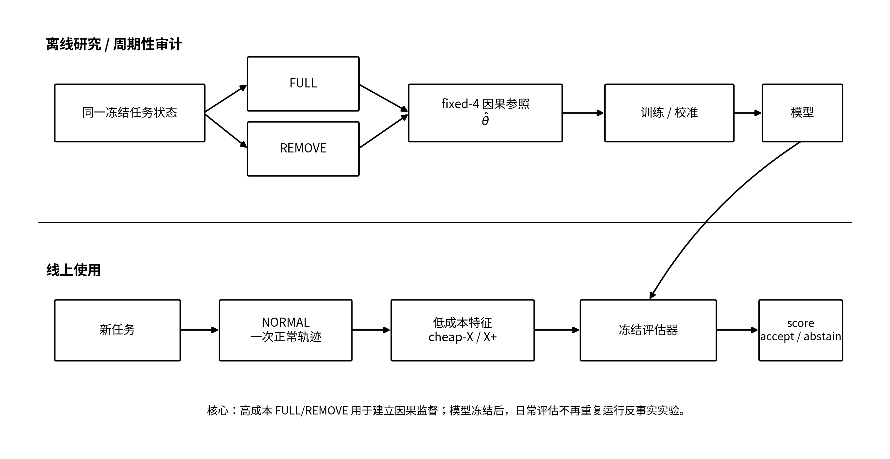
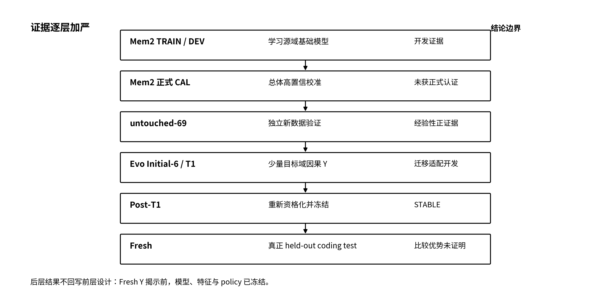
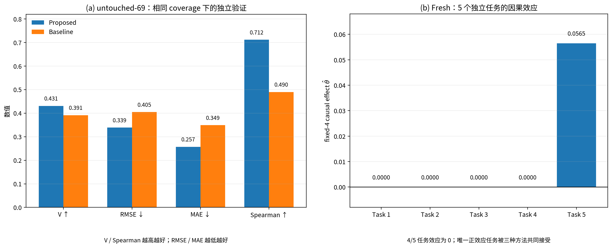

# 方向A 方案介绍与测试结论报告

## ——从 FULL/REMOVE 因果参照到低成本在线记忆效果评估

**项目**：TencentDB-Agent-Memory / MemoryCore 
**方向**：腾讯犀牛鸟开源人才计划 Topic 3 · 方向A 
**作者**：李姝瑾 
**报告日期**：2026-09-14 
**报告性质**：方案介绍 + 测试结论报告

---

## 摘要

在智能体系统中，任务最终成功并不能直接说明记忆真正发挥了作用。一次任务结果同时受到基础模型能力、prompt、当前上下文、工具调用、执行环境、解码随机性以及记忆检索与注入等多种因素影响；即使比较记忆开启与关闭的结果，单次运行也可能受到随机轨迹干扰。方向A 因此关注一个更具体的问题：**能否构造一套比单看端到端任务成败更直接的记忆效果参照，并进一步把这种昂贵的因果评测压缩成低成本、可在线使用的判断器。**

本项目最终形成两层评测框架。第一层在研究期对同一个冻结任务状态分别执行 `FULL` 和 `REMOVE`：FULL 保留目标记忆，REMOVE 只移除该记忆，其余条件尽量保持一致；以前四个技术上有效的配对差值均值作为连续因果参照。第二层面向未来线上使用：只运行一次独立的 `NORMAL` 轨迹，提取因果标签揭示前可以获得的低成本特征，再由冻结评估器输出记忆有效性得分，并通过冻结策略决定接受或弃权。这样，重复 FULL/REMOVE 被限制在离线教师信号、校准与周期性审计环节，而不是每个线上任务的默认成本。

项目首先在 Mem2 环境中建立源域评估器。开发阶段的嵌套折外预测结果显示，所提方法相比容量匹配基线在 RMSE、MAE、Spearman 和策略价值上均有改善。严格的正式 CAL（calibration，校准阶段）在 36 个独立共享会话连通分量上没有获得单侧 95% 总体置信认证，因此正式结论保持 `NO_CERTIFIED_OPERATING_POINT`。这里需要区分“没有达到高置信统计门槛”和“效果方向为负”：Formal CAL 的 `V`、`G` 点估计本身为正，但独立样本数、效应异质性和两层不确定性使置信下界仍低于 0。随后，在完全没有参与源域模型训练的 untouched-69 新数据上，所提方法与基线在相同的 69.57% 覆盖率下分别得到 `V=0.43081` 与 `V=0.39135`，`ΔV=+0.03947`，相对提升约 **10.08%**；RMSE 下降 **16.34%**、MAE 下降 **26.41%**、Spearman 提高约 **0.222**。`ΔV` 的配对聚类自助法单侧 95% 下界为 `-0.00216`，已经非常接近 0。这说明当前“尚未正式认证”很可能与独立样本量和统计精度不足有关，但仍不能解释成“只要继续扩样就一定显著”。

随后，项目将同一评测协议迁移到更接近真实编程智能体的 EvoCode-Bench 环境。Evo 的因果 Y 获取成本明显更高，且 Initial-6 表明目标域信号稀疏、异质，因此最终没有把大量 Mem2 数据和少量 Evo 数据直接混合训练，而是采用 **冻结 Mem2 源域基础模型 + 强正则目标域残差** 的低自由度适配结构。Post-T1 使用 8 个独立任务聚类、10 个因果组；在该开发数据上，最终 `A_FROZEN_SOURCE_RESIDUAL_RIDGE` 在冻结选择规则下得到 `policy value=0.04513`，而另外两个候选均为 `0.00826`；胜出模型在逐任务留一稳定性检查中获得 7/8 支持，特征组与正则强度均为 8/8 稳定，因而在 Fresh Y 揭示前冻结。

最终 Fresh 留出测试包含 5 个真正独立的编程任务聚类单元、20 个 fixed-4 配对、40 个因果实验臂。处理一致性审计结论为 `PASS_WITH_LIMITATION`。五个任务的 fixed-4 因果效应分别为 `0, 0, 0, 0, 0.05650`。所提方法捕获了唯一正效应任务，但容量匹配基线与仅目标域对照方法也同时捕获，因此三种方法最终得到相同的 `V=0.01130` 与 `G=0.00226`，比较的 `ΔV` 和 `ΔG` 均为 0。故 Fresh **没有证明所提方法在跨环境留出编程任务上优于更简单的对照方法**。这一结果也不能反向解释为源域→目标域适配已被证伪：当前 Fresh 只有 5 个独立任务，其中 4 个因果效应为 0，方法之间可用于区分的因果异质性很有限。
同时，Evo/Fresh 的独立目标域任务数受到因果数据获取成本、当时预算规划与项目截止时间的共同约束，这进一步限制了最终比较识别小幅模型差异和获得高置信统计结论的能力。换言之，当前若干“高置信门槛未达标”的结果，与独立样本不足存在明确且合理的关联；但本报告不把这一限制解释为“扩样后必然获胜”。

成本方面，本报告严格区分**研究/训练/因果审计成本**和**模型冻结后的线上评估成本**。Evo FULL/REMOVE 与 Fresh 留出因果结果揭示的研究成本确实较高；但方向A 所要求的“低成本”最终对应的是部署阶段不再持续重复反事实实验。在 untouched-69 中，所提方法线上形态打分的观测平均成本约为 `CNY 0.01043/group`，而相应因果审计平均约为 `CNY 0.08896/group`，后者约为前者的 **8.5 倍**。因此，本项目的主要工程价值不是把因果实验本身变得免费，而是**用有限、可审计的强因果实验建立和校验评估器，再把日常记忆效果判断压缩成一次正常智能体轨迹、少量低成本特征与冻结模型推断**。

综合而言，本项目的方法与工程闭环已经得到支持；Mem2 源域模型价值得到明确但尚未正式认证的经验性正证据；Mem2→Evo 的低自由度适配在开发数据上表现出可解释的稳定性；最终 Fresh 没有展示跨环境优势。项目保留这一负结果及其边界，不在看到 Fresh Y 后重训、调阈值或补充事后规则。

---

# 1. 项目背景与问题定义

## 1.1 方向A 要解决什么

腾讯犀牛鸟 Topic 3 面向多轮交互式长编程任务中的记忆自优化。题目对方向A 的核心描述是：现有端到端评测虽然能够回答智能体是否完成任务，却很难回答**这次成功或失败究竟是不是由记忆引起**。模型能力、工具、解码随机性、prompt 和记忆混在同一个最终结果里；重复运行和严格控制变量可以提供间接归因，但成本高、方差仍然存在。

因此，本项目没有把目标设成“再做一个 pass@1 基准”，而是围绕下面三个问题展开：

1. **如何获得比单次端到端结果更直接的记忆效果参照？**
2. **如何利用这个参照训练低成本评估器，使真实线上不必持续运行 FULL/REMOVE？**
3. **如何证明这种低成本判断的可信度、成本与适用边界，而不是把原始得分直接解释成因果结论？**

题目同时要求方案在公开数据上可复现、基线先于对比存在、数据与指标不能写死单一结构，并且允许负结果，但必须说明为什么没有直接判断成功或为什么置信度不足。本报告因此把“正结果”“未通过的正式检验”和“工程上已经完成的能力”分开叙述。

## 1.2 为什么任务成功不能直接归因给记忆

最简单的反例是：

- `FULL 成功 / REMOVE 成功`：记忆可能被使用，但没有它智能体也能完成任务；
- `FULL 失败 / REMOVE 失败`：两条轨迹都没有最终通过，但其局部任务进展仍可能不同；
- 同一条件重复执行：LLM 也可能因为采样与工具轨迹不同得到不同结果。

因此，“记忆被召回”“记忆被模型引用”“动作发生变化”都不能单独等价为“记忆改善了最终结果”。导师在方案讨论中也特别指出，LLM 本身具有随机性，动作变化需要更强的证据才能归因给记忆；同时 FULL/REMOVE 应承担强因果参照的角色，低成本特征的任务是学习预测这个参照，而不是反过来“验证”FULL/REMOVE。

本项目最终保留任务原生结果，但增加一个更直接的受控记忆干预：从同一冻结处理前环境出发，只改变目标记忆的可用性，观察结果差异。

## 1.3 报告中的“高置信”和“低成本”分别指什么

这两个词如果不拆开，很容易产生过度主张。

**高置信**不意味着一次 NORMAL 运行输出的得分天然就是“95% 因果概率”。本项目的可信度来自一条完整证据链：

```text
受控 FULL/REMOVE
→ 连续因果参照
→ TRAIN/DEV 学习
→ 独立 CAL / untouched-69 验证
→ 因果结果揭示前冻结
→ Fresh 留出验证
```

95% 正式置信度主要放在总体策略层验证，而不是给每一个单独任务强行生成 95% 因果置信认证。

**低成本**也不意味着整个研究过程没有代价。研究期需要获取 FULL/REMOVE 因果 Y，Evo 和 Fresh 尤其昂贵。题目真正关心的是：相比“每个线上任务都做大规模端到端重复实验”，模型冻结以后是否可以只用一次正常智能体轨迹和廉价证据完成判断。本项目的回答是：可以把 FULL/REMOVE 限制在离线教师信号 / 审计，把线上形态评估保持为 NORMAL + 低成本特征 + 冻结评估器。

## 1.4 本报告围绕五个研究问题组织

为了让方案介绍和测试结论一一对应，后文不按实验发生时间写流水账，而围绕五个问题组织证据：

- **RQ1：更直接的记忆因果参照是否真的比二值任务成功提供更多信息？** 
 主要由 Evo Initial-6 的严格 / 分级对照回答。

- **RQ2：利用因果参照训练出的低成本评估器，在源域环境的新数据上是否具有实际模型价值？** 
 主要由 Mem2 开发阶段、正式 CAL 与 untouched-69 回答。

- **RQ3：当目标域因果 Y 很昂贵时，Mem2 源域基础模型能否通过少量 Evo 数据做稳定、可解释的目标域适配？** 
 主要由 Initial-6、T1 与 Post-T1 重新资格化回答。

- **RQ4：冻结后的所提方法能否在真正留出编程任务上优于更简单的基线 / 对照方法？** 
 由 Fresh 留出测试回答。

- **RQ5：与重复 FULL/REMOVE 相比，方案把成本从哪里移到了哪里；模型冻结后的线上评估实际省掉了什么？** 
 由 Mem2 与 Evo 的运行账本共同回答。

这五个问题也对应题目验收中最关键的三条要求：判断是否更直接、置信度如何获得和检验、以及相对端到端重复实验的成本主张是什么。

---

# 2. 相关工作与方法选择

本节只介绍直接影响最终设计的几类工作，不做独立综述。

## 2.1 长期记忆评测：从“记得住”到“用得上”

LongMemEval 关注长期交互中的信息提取、多会话推理、时间推理、知识更新和弃权等能力，为长期记忆系统提供了系统化基准测试。[1] 这类工作说明了长期记忆的评测不能只看上下文长度，但其主要问题仍是“能否从长期历史中正确恢复和使用信息”。

Mem2ActBench 进一步把重点放到任务型智能体：模型不仅要召回事实，还要把长期记忆主动用于工具选择和参数对齐。[2] 这与方向A更接近，因为它把记忆的价值落到了智能体动作上。本项目在此基础上继续向前一步：**记忆被正确利用仍然不等价于记忆对最终结果产生了边际贡献**，因此需要 FULL/REMOVE 作为研究期因果参照。

## 2.2 编程场景为什么需要 EvoCode-Bench

EvoCode-Bench 不是一次性代码生成集，而是包含 26 个有状态编程任务、227 个已评测轮次的多轮编程基准测试；同一任务在 5–15 个轮中保持持久化工作区，并通过累计可执行测试检查新需求和仍然有效的旧需求。[3] 这种环境能够提供编辑、编译/测试、修订、恢复、回归等过程证据，更贴近多轮编程智能体。

它也意味着因果审计更昂贵：每个 FULL/REMOVE 实验臂都可能是一条完整编程轨迹。因此 Evo 在本项目中既是迁移目标，也是对“如何用少量昂贵目标域 Y”这一工程问题的压力测试。

## 2.3 选择性预测：允许弃权，而不是强迫每个任务都判断

选择性预测研究允许模型在不确定样本上拒绝输出，通过覆盖率与风险之间的权衡提高可靠性。[4][5] 本项目借鉴的是这种**允许弃权、评价已覆盖区域价值**的思想，而不是照搬某个深度网络架构。

这也是为什么最终评估器不被要求对每个任务都强行宣称“记忆有帮助”或“记忆没用”。在证据不足时弃权是合法输出，但接近全弃权也不能被包装成成功，因此需要同时报告覆盖率与因果效用。

## 2.4 源域→目标域适配：共享结构，但不直接混合不同量纲

导师曾建议考虑“大量较低成本 Mem2 + 少量 Evo”的组合。相关领域适配工作给出的重要启示是：少量珍贵目标域标签直接与大量源域标签直接拼接，可能使目标域信号被源域数据稀释；两阶段或领域特定校正往往更合理。[6] Daumé 的经典领域适配工作也体现了“共享部分 + 领域特定部分”的思路。[7]

本项目没有直接复刻上述算法，而是采用同样的工程原则：

- 共享评测协议与真正兼容的特征；
- Mem2 与 Evo 的原始因果效用保持各自量纲；
- 冻结源域基础模型；
- 用少量 Evo 因果 Y 只学习强正则残差；
- 将仅 Evo 目标域或小样本下不稳定的高自由度结构留作候选，而不是默认塞入最终模型。

这比直接混合更符合本项目的数据规模和成本约束。

---

# 3. 核心方案

## 3.1 两层评测框架

整个方案可以压缩成两层：

> **研究层回答“什么是真实记忆效果”，线上层回答“怎样不重复支付真实因果实验的成本”。**

{ width=94% }

FULL/REMOVE 不承担未来线上回退。线上默认路径不需要为同一任务跑两条反事实轨迹。

## 3.2 NORMAL、FULL 与 REMOVE

三种运行的语义严格分开。

- **NORMAL**：独立正常运行，用于采集未来线上可获得的低成本特征；它不计入 FULL 重复运行，也不产生因果 Y。
- **FULL**：从冻结处理前状态出发，保留目标记忆处理。
- **REMOVE**：从相同起点出发，只移除目标记忆；不允许重新检索、重新排序或用其他内容回填目标记忆的位置。

这样做的目的不是让两条轨迹完全相同——LLM 本身会随机分叉——而是让**研究者控制的处理差异只有目标记忆**。

## 3.3 连续fixed-4 因果参照

对组 \(g\) 的第 \(j\) 个合法配对，先用冻结的任务原生验证器计算两条实验臂的效用：

\[
U_{g,j}^{a}=\frac{\text{successCount}_{g,j}^{a}}
{\text{冻结TotalCases}_{g}},
\qquad a\in\{FULL,REMOVE\}
\]

定义配对层效应：

\[
D_{g,j}=U_{g,j}^{FULL}-U_{g,j}^{REMOVE}
\]

最终主参照使用前 4 个技术上有效、完整的配对：

\[
\hat{\theta}_g=\frac{1}{4}\sum_{j=1}^{4}D_{g,j}
\]

这一设计有三个作用。

第一，保留 **效应幅度**。最终整任务通过/失败相同，并不意味着两条轨迹在原生测试上没有差异；连续效用能保留部分完成、回归和局部进展信息。

第二，避免结果-条件化采样。固定使用“前四个合法配对”，不能因为前几次结果不漂亮就继续加配对，直到得到想要的方向。

第三，把技术故障与科学失败分开。模型正常完成但做错、没有合法工具动作、拒绝、格式错误输出等，只要模型行为已经被真实观察，就属于科学结果，按冻结规则进入效用；API 服务商、工作区或完整性事故导致结果根本无法观察时，才属于技术无效。技术无效不能被静默当作负例，也不能成为删掉不利科学结果的借口。

Mem2 最多预声明 5 个配对槽位，第 5 个仅用于补足真正技术无效造成的fixed-4 缺口；`technicalRetryLimit=0`。这一反删失规则直接在 `mem2-continuous-reference.ts` 中实现。

## 3.4 低成本特征与评估器

NORMAL 只暴露因果结果揭示前可以获得的信息。最终源域评估器使用结构、语义与 NORMAL 结果类特征；最终 Evo 胜出模型则进一步收缩到五个共享特征：

- 目标轮次的对数；
- 指令字节数的对数；
- NORMAL 效用；
- NORMAL 严格通过；
- 完成词元数的对数。

开发阶段曾研究编辑、测试、修订、恢复等更丰富的过程证据，但在小目标域样本下，最终胜出模型选择了更低自由度的仅共享特征组。这个结果本身也是一个工程发现：**过程特征更丰富并不意味着在少量因果 Y 下全部加入就更稳。**

冻结评估器为每个组输出得分，再由预先冻结的策略决定是否接受。令 \(A\in\{0,1\}\) 表示接受，\(C=E[A]\) 为覆盖率，本项目主要报告：

\[
V=E[A\theta]
\]

它表示在全体任务尺度上，策略实际捕获了多少记忆因果效用。

同时报告：

\[
G=E[(A-C)\theta]
\]

\(G\) 衡量接受集合相对于不区分地接受样本是否获得额外选择性，防止接受-全部通过表面上的正平均值制造“成功”。

## 3.5 “高置信”的正确位置

V7.1 最终取消了“每个组都必须先 95% 判定成分类式高置信标签”的主路径。这里的主要原因并不是为了直接降低未来线上预测成本，而是为了**提高研究阶段因果监督的利用效率，并避免把大量 FULL/REMOVE 预算消耗在逐组分类式认证上**。逐组做 95% 分类认证需要为同一个组持续追加反事实配对，同时还会把原本连续的效应幅度压缩成离散标签；在本项目的小样本和高成本设置下，这既降低可获得的独立任务广度，也不利于后续学习连续的 Memory 效果。

因此，最终设计采用“**组内固定前缀连续测量 + 组间独立总体验证**”：

- 组内使用固定4对获得连续因果参照，保留效应大小；
- CAL / 留出测试在独立统计单元上对策略层 \(V\)、\(G\) 或比较效应做总体推断；
- 95% 置信要求放在最终总体结论层，而不是要求每个训练组都先得到一个 95% 分类式标签；
- 单个线上得分仍然只是评估器输出，不能解释成“95% 的 Memory 因果概率”。

需要特别区分的是：**这一调整主要优化的是研究阶段因果监督的成本—信息效率；方向A 所要求的“低成本线上评测”来自另一层设计，即模型冻结后只运行 NORMAL + 低成本特征 + 冻结评估器，而不再为每个新任务执行 repeated FULL/REMOVE。** 两类“成本”在本报告第 7 节分别讨论。

---

# 4. 工程实现

## 4.1 公共核心 + 数据集适配器

方向A 的实现没有把 Mem2 或 Evo 结构写死进一套脚本，而是分为两层：

**公共评测核心** 负责：

- 因果组 / 记录 / 统计聚类单元身份；
- NORMAL / FULL / REMOVE 处理协议；
- 配对顺序表与 fixed-4；
- 技术/科学结果分类体系；
- 授权、冻结、日志、账本；
- 结果结构与确定性分析。

**数据集特定适配器 / 验证器** 负责：

- Mem2 动作效用；
- Evo 任务原生累积测试；
- 工作区/状态准备；
- 数据集特定特征提取。

因此迁移新基准测试时，理论上需要更换的是状态 / 验证器 / 适配器，而不是重写因果协议。这直接对应题目“数据读取、任务切分、指标与报告不得写死某一种公开集结构”的要求。

## 4.2 Mem2 执行实现

Mem2 正式执行器使用独立 NORMAL 与 FULL/REMOVE 因果数据采集。连续参照执行器明确：

- 前 4 个有效配对；
- 最多 5 个预声明配对槽位；
- 技术重试上限 = 0；
- 确定性解析器；
- 科学动作失败与技术无效分流。

源域模型、基线、策略、untouched 集合和推断规范都通过版本化 JSON 产物冻结，避免后续因果 Y 回流模型选择。

## 4.3 Evo / Harbor 执行实现

Evo 使用 Harbor 持久化编程环境和原生累积测试。每个 FULL/REMOVE 配对都从同一处理前任务状态独立准备工作区，再按冻结的配对顺序表执行两条臂。

关键实现包括：

- `evo-harbor-executor.ts`：真实编程实验臂执行；
- `evo-case-summary.ts`：从任务原生测试提取效用；
- `evo-engineering-first.ts`：A/B/C 模型比较与冻结选择；
- `fresh-prey-runtime.ts`：Fresh 因果结果揭示前运行环境；
- `fresh-feature-scoring.ts`：冻结特征提取与得分；
- `fresh-binding-verification.ts`：必需绑定与 SHA-256 验证。

## 4.4 防止因果信息泄漏

Fresh 被明确拆成三个阶段：

1. **阶段 1**：先完成所有 NORMAL，获得线上形态证据；
2. **阶段 2**：零 API 调用的因果结果揭示前打分 / 策略冻结；
3. **阶段 3**：冻结模型和策略后才允许打开 FULL/REMOVE 因果 Y。

因此某个 Fresh 任务的因果结果不可能合法进入后续得分、阈值或任务选择。

此外，特征构建器会显式审计禁止出现的因果字段；源域模型也不读取 untouched-69 Y 或 Evo Y。Post-T1 模型在 Fresh Y 揭示前冻结，并以内容哈希和绑定清单绑定。

## 4.5 配对顺序、工作区与重试完整性

工程实现不仅检查“是否跑完”，还检查是否跑的是**同一个预注册实验**。

- 每个配对在结果前冻结 FULL_FIRST / REMOVE_FIRST；
- 实际实验臂启动顺序必须与预定顺序一致；
- FULL/REMOVE 从同一冻结状态独立恢复；
- 配对证明记录记录恢复后的状态、工作区哈希、预定/实际顺序；
- 重复启动、不确定调度或未关闭的预留都会触发失败即关闭；
- 科学失败不允许通过重试被洗成成功。

历史 T1 曾暴露配对顺序执行问题，项目没有把原结果继续用于模型，而是只重跑精确不匹配的配对，再重建合规的 fixed-4 数据集。这次恢复本身后来成为 Fresh 完整性设计的重要输入。

## 4.6 崩溃与基础设施恢复不得改变科学问题

正式执行中出现过 DNS、Docker/buildx 等基础设施故障。本项目允许恢复，但恢复权限被限制在原有科学槽位：

- 不重新抽任务；
- 不扩展配对数；
- 不改变 FULL/REMOVE 处理；
- 不复用不确定调度；
- 不删除旧失败来源记录；
- 恢复身份单独记录。

因此“恢复”只是把原来已授权但未获得科学观测的槽位补完，不是一次新的实验设计机会。

## 4.7 与生产路径的隔离

方向A 评测插桩主要位于 `src/evaluation/direction-a/**` 与 `scripts/direction-a/**`，以仅用于评测的旁路组件 / 正式执行器为主。关闭方向A 评测能力时，MemoryCore 原生产路径不应被静默改写；项目中还保留生产等价性与回退类验证。

这一点对题目要求尤其重要：评测协议可以复杂，但不能为了做实验把网关主逻辑改成只适用于当前基准测试的专用实现。

## 4.8 结构化结果、权限边界与可测试性

题目要求不仅给出一个最终分数，还要让工程侧能够区分“任务失败”“评测执行失败”和“证据不足”。因此方向A 的输出不是只有一个布尔值，而是把科学结果、技术有效性、策略决策、来源记录与成本分开记录。

在正式执行链中，付费执行还被权限与阶段门控约束。TRAIN/DEV、CAL、留出/Fresh 等阶段不能因为某个脚本可调用 API 服务商就自动互相越界；尤其在因果 Y 尚未授权揭示时，执行器必须保持失败即关闭。这样做的目的不是增加流程形式，而是避免一次误执行直接破坏留出数据。

测试也围绕这些科研风险组织。除普通类型检查和模块单元测试外，重点回归包括：

- 关闭方向A评测上下文时原 MemoryCore 行为是否保持等价；
- NORMAL 是否会被错误计作 FULL 重复运行；
- 技术无效是否会错误吞掉科学失败；
- 配对顺序表与实际启动顺序是否一致；
- 恢复执行后是否出现重复科学观测；
- 请求 / 授权 / 运行环境绑定是否因文件漂移而失效；
- Fresh 阶段 2 是否在任何因果 Y 之前完成；
- 最终分析能否只从冻结原始证据确定性重建。

因此，“代码通过测试”在这里不是单纯的软件质量指标，而是证明实验语义没有被实现细节悄悄改变的一部分。

---

# 5. 实验设计与证据阶梯

## 5.1 为什么不把所有数据放进一次训练/测试

整个项目不是一个单一随机划分，而是一条逐层加严的证据链。

{ width=94% }

每层回答的问题不同，后层结果不能回写前层设计。

## 5.2 各阶段角色

| 阶段 | 主要作用 | 独立统计单元 | 参与训练/选择 |
|---|---|---|---|
| Mem2 TRAIN/DEV | 源域基础模型 | 共享会话连通分量 | 是 |
| Mem2 正式 CAL | 总体策略认证 | 共享会话连通分量 | 否 |
| untouched-69 | 独立源域验证 | 受保护的新数据单元 | 否 |
| Evo Initial-6 / T1 | 目标域适配/结构选择 | 独立任务聚类单元 | 是 |
| Fresh | 最终编程留出验证 | 独立任务聚类单元 | 否 |

特别需要注意：**配对是重复测量，不是独立 N**。Fresh 有 20 个 fixed-4 配对，但真正独立的任务聚类单元只有 5 个，不能把 N 写成 20 来夸大统计信息量。

## 5.3 数据版本、抽样、评测粒度与标签对齐

题目明确要求报告数据版本、子集规模、抽样方式/随机种子、评测粒度，以及记忆条目或注入片段如何与标签对齐。本项目在最终协议中将这些信息作为可复现性的一部分，而不是只写在实验日志里。

### 代码与公开数据基线

MemoryCore 的工程比较基线固定为：

```text
TencentCloud/TencentDB-Agent-Memory
version = v2.0.0-beta.1
commit = 41444344ce11467a5b5ad6aa032f5e261da1f4d2
```

Mem2 负责较低成本的源域因果监督；EvoCode-Bench 负责过程信息丰富编程目标域。公开基准测试用于方法和工程链路验证，本报告不把它们包装成腾讯内部生产业务结论。

### Mem2

Mem2 的独立统计单元是 **共享会话连通分量**，而不是单个记录。正式 CAL 最终冻结 `n=36` 的无放回简单随机抽样（SRSWOR）因果审计样本，样本哈希为：

```text
45206e817ceb52666651cb9108cbeaa4bc0964ecd3f57624cd9154094dd276c7
```

CAL 后用于模型价值验证的受保护总体共 105 个单元；原 36 个 CAL 样本与 untouched-69 不重叠，untouched-69 的总体 / 子集身份都由不可变产物哈希固定。最终源域模型的调参随机种子为：

```text
direction-a-postcal-model-value-v2-inner5-20260911::full60-final-tuning
```

untouched-69 的配对自助法使用 20,000 次重采样，随机种子为：

```text
direction-a-postcal-model-value-v2-1-final69-paired-bootstrap-20260911
```

正式 CAL 的 SRSWOR 抽样由不可变清单一次冻结，协议禁止重抽。精确随机种子与复查字段如下：

```text
seed = 0ea929150d9697165613327ba19baa4ebed31bedb38f7905b7c627c1f45901c7
seedHash = e09dc638eec8cca99587ebe152add19890fe047c7ce959b6de7e19daa5e5e88e
seedGovernance = OS_CSPRNG_32_BYTES_GENERATED_AFTER_PRE_DRAW_FREEZE
sampler = SHA256_REJECTION_FISHER_YATES.v1
sampleContentHash = 45206e817ceb52666651cb9108cbeaa4bc0964ecd3f57624cd9154094dd276c7
manifestSHA256 = 4D6DC94C9AB83D9C4103621639046FFC6D62C681E385A24751A9E98F9AE61D48
```

该清单同时固定总体 `N=105`、抽样规模 `n=36`、36 个 component ID 与 `noRedraw=true`，因此数据版本、抽样方式、随机种子和实际样本身份可以相互校验。

### Evo / Fresh

Evo 的统计单元是 **完整有状态任务 / 需求链**；同一任务内的多个组、配对、实验臂不能冒充独立 N。Fresh 最终启用样本由因果结果揭示前清单固定为 5 个任务聚类单元，每个任务 4 个固定配对。该阶段以清单和哈希固定精确任务身份与顺序，而不是在看到 Y 后重新随机抽取。

### 记忆与标签如何对齐

对每个因果组，目标记忆身份、已准备的任务状态、目标指令、FULL/REMOVE 处理、原生验证器和配对顺序表都在运行前冻结。FULL 与 REMOVE 从同一处理前状态独立恢复：

```text
FULL   = 保留目标记忆
REMOVE = 仅移除同一个目标记忆
```

两臂使用相同任务原生验证器计算效用，最终配对标签就是同一个目标记忆对同一个冻结任务状态造成的效用差值。这样，标签对应的是**目标记忆组的处理效应**，而不是“这一轮智能体最后有没有成功”的松散相关性。

## 5.4 Post-T1 的 A/B/C 模型结构比较

这里的 **T1** 指 Initial-6 之后新增的目标域训练/适配阶段，用于补充少量独立 Evo 因果监督。执行审计后来发现其中部分 pair 的实际 arm 顺序与冻结顺序不一致，因此受影响的 pair 没有直接沿用，而是在相同 scientific slot 上依法恢复。**Post-T1** 指完成这次配对顺序修复后，对合规目标域数据重新进行模型资格化与冻结；它仍然属于 Fresh 之前的开发阶段证据。


Post-T1 开发阶段比较三种结构：

### A：A_FROZEN_SOURCE_RESIDUAL_RIDGE

- 冻结 Mem2 源域基础模型；
- Evo 共享特征上拟合目标域残差；
- 源域 offset coefficient = 1；
- 最终特征组 = `EVO_SHARED_ONLY`；
- \(\lambda=10\)。

### B：SEPARATE_SCALE_PARTIAL_POOLING

保留源域 / 目标域尺度分离，同时允许更多部分池化结构。

### C：EVO_ONLY_RIDGE

不使用源域基础模型，只依赖 Evo 目标域数据。

A/B/C 用于回答源域基础模型是否值得保留、目标域校正应有多大自由度，以及仅目标域是否已经足够。它们属于 **开发阶段结构选择**，不能直接当作 Fresh 的最终基线列表。

## 5.5 Fresh 最终冻结比较对象

Fresh Y 揭示前最终冻结的比较对象是：

1. **所提方法**：Post-T1 胜出模型 `A_FROZEN_SOURCE_RESIDUAL_RIDGE`；
2. **容量匹配基线**：`MATCHED_CAPACITY_LEGACY_X0_BASELINE`，用于控制模型容量与传统低成本特征路线；
3. **仅目标域对照方法**：`TARGET_ONLY_SHARED_ONLY_RIDGE`，只依赖少量 Evo 目标域监督，不使用 Mem2 源域基础模型。

因此，Post-T1 的 B 部分池化是结构选择阶段的候选，而 Fresh 的主要基线是容量匹配历史 X0 基线。报告后文会严格保持这两个比较层级的区别。

---

# 6. 测试结果

## 6.1 Mem2：源域评估器的开发期趋势

最终源域开发数据共 60 个组。嵌套折外预测只作为开发诊断，不作为最终确认性证据。

| 指标 | 所提方法 | 容量匹配基线 | 差异 |
|---|---:|---:|---:|
| MAE | 0.2540 | 0.3735 | -0.1196 |
| RMSE | 0.3311 | 0.4189 | -0.0878 |
| Spearman | 0.6064 | 0.2744 | +0.3319 |
| sign accuracy | 0.6833 | 0.6667 | +0.0167 |
| 70% 策略V | 0.4328 | 0.3992 | +0.0336 |
| 70% 策略G | 0.1234 | 0.0898 | +0.0336 |

6 个外层折中有 4 个 `ΔV>0`，其余为 0；折级 `ΔV` 的最差 / 中位 / 最佳 分别为 `0 / 0.0292 / 0.1000`。这说明所提方法的改善并非只来自一次全量拟合，但这些数字仍属于 TRAIN/DEV 范围，只能作为“值得进入独立验证”的证据。

最终源域所提方法选择 `NORMAL_OUTCOME_ENHANCED_RIDGE`，\(\lambda=20\)；基线为容量匹配 X0 岭回归，同样 \(\lambda=20\)。两者容量匹配，但所提方法能利用 NORMAL 结果证据。

## 6.2 Mem2 正式 CAL：严格置信认证没有通过

正式 CAL 使用 36 个独立共享会话连通分量，36/36 都获得连续参照。在冻结 70% 候选下：

- `V = 0.44236`
- 单侧 95% 下置信界（LCB）`LCB(V) = -0.09447`
- `G = 0.11701`
- 单侧 95% `LCB(G) = -0.23496`

因此固定序列停止，正式结论为：

> **NO_CERTIFIED_OPERATING_POINT**

这一结果不能弱化，也不能由后续数据改写。

但它检验的是一个很严格的问题：在当前独立样本量与两层不确定性下，是否能对总体 \(V>0\) 且 \(G>0\) 给出单侧 95% 置信认证。这里的关键并不是点估计方向为负——`V` 和 `G` 的点估计均为正——而是**置信区间仍然太宽，无法把下界稳定推到 0 以上**。

这与当前数据规模有直接关系。Formal CAL 只有 36 个独立统计单元，且每个单元内部还包含因果参照的估计误差；在既定预算和项目周期内，没有继续扩大独立 CAL 样本。更多独立样本通常有助于降低估计方差、缩窄置信区间，因此独立样本量有限很可能是没有通过 95% 认证的重要原因之一；但当前 `LCB(V)` 和 `LCB(G)` 仍明显低于 0，不能把失败完全归因于样本量，也不能声称扩样后必然通过。

因此，Formal CAL 更准确的结论是：**当前数据支持正向点估计，但证据精度不足以达到预先设定的高置信门槛。** 这和“模型有没有任何新数据预测价值”不是同一个命题。

## 6.3 Untouched-69：最重要的独立正结果

CAL 后，项目没有用新的 Y 继续调源域模型，而是冻结所提方法和基线，并使用原 105 个受保护总体中从未参与源域模型训练的 69 个单元做独立验证。完整性审计得到：

- 原 36 个 CAL 样本与 untouched-69 的交集 = 0；
- 开发阶段与 untouched-69 的交集 = 0；
- untouched-69 在冻结前因果 Y 使用量 = 0；
- 69/69 最终都有因果参照。

所提方法与基线均接受 48/69，实际覆盖率都为 **69.57%**，因此不是靠所提方法接受更多样本获得优势。

**表 1：untouched-69 所提方法对比基线**

| 指标 | 所提方法 | 基线 | 改善 |
|---|---:|---:|---:|
| 覆盖率 | 69.57% | 69.57% | 匹配 |
| 接受集合均值 \(\theta\) | 0.61930 | 0.56256 | +0.05673 |
| V | 0.43081 | 0.39135 | **+0.03947** |
| V 相对提升 | — | — | **+10.08%** |
| G | 0.11453 | 0.07506 | +0.03947 |
| RMSE | 0.33877 | 0.40491 | **-16.34%** |
| MAE | 0.25704 | 0.34928 | **-26.41%** |
| Spearman | 0.71168 | 0.48980 | **+0.22189** |

同一 69 个单元中，两个策略同时接受 36 个、同时弃权 9 个，另外各自独有 12 个接受。也就是说，差异确实来自策略排序选择，而不是覆盖率不一致。

预先冻结的配对聚类自助法使用 20,000 次重采样，`ΔV` 单侧 95% LCB 为 `-0.00216`，两侧 95% 区间约为 `[-0.00975, 0.09528]`；约 6.1% 的自助法重采样中 `ΔV≤0`。因此最准确的结论是：

> **Mem2 源域模型价值 = 经验性正向，但尚未获得正式认证。**

对应机器可读状态为：

```text
EMPIRICAL_POSITIVE_BUT_INCONCLUSIVE
PRIMARY_COMPARATIVE_PASS=false
```

这与自然语言结论一致：点估计和多项预测指标都支持正向模型价值，但比较的 95% 置信门槛尚未越过。

这组结果很重要，因为它把“正式 CAL 没通过”细化成了更准确的边界：模型在独立新数据上表现出多指标一致的正向模型价值，但当前样本与不确定性仍不足以把比较主张升级成正式统计优势。

尤其值得注意的是，untouched-69 的 `ΔV` 单侧 95% 下界只有 `-0.00216`，距离 0 很近，而且只有约 6.1% 的自助法重采样出现 `ΔV≤0`。与 Formal CAL 相比，这一结果更明显地表现出“**效果方向已经较稳定，但统计精度仍差一点**”的特征。因此，如果未来增加更多相互独立、同分布且不回流训练的验证单元，确实有可能显著提高比较检验的统计功效；但这仍然是对精度的合理预期，而不是对未来显著结果的保证。

{ width=99% }

## 6.4 Evo Initial-6：为什么要采用低自由度目标域适配

Evo 的第一阶段不是为了立刻证明优势，而是判断目标域因果信号的形态和获取成本。最终 Initial-6 因果数据包含：

- 6 个独立任务；
- 8 个因果组；
- 32 个 fixed-4 配对；
- 8/8 因果参照可用；
- 3/8 组的 \(\theta\) 非零；
- 5/8 组为 0；
- 均值 \(\theta \approx 0.00994\)。

此外，Initial-6 原始资格化阶段还提供了一组很直观的严格 / 分级诊断。46 个合法配对中，整任务严格结果的组合为：

- `FULL=0, REMOVE=0`：37/46；
- `FULL=1, REMOVE=0`：4/46；
- `FULL=0, REMOVE=1`：3/46；
- `FULL=1, REMOVE=1`：2/46。

如果只看二值任务完成，绝大多数配对都会落在“双方都失败”的 `00`。但在这 37 个 `00` 配对中，**仍有 12 个配对的任务原生分级因果差值非零**。该诊断数据的独立任务聚类单元仍只有 6 个，46 个配对绝不能当成 46 个独立样本；它的作用是说明测量信息量，而不是扩大统计 N。

这组事实直接支持了一个重要设计调整：**整任务通过/失败可以保留作严格辅助指标，但不适合作为唯一主因果参照。** 因而最终使用任务原生分级用例通过率构造连续 fixed-4，严格结果退到保护规则 / 敏感性分析。

这些结果共同说明：Evo 目标域数据具有三个特点——**昂贵、独立 N 小、因果信号稀疏且异质**。如果在这种规模上直接训练高自由度模型，很容易过拟合；如果把大量 Mem2 与少量 Evo 原始 Y 直接拼接，又会面临量纲不一致和源域数据占主导。因此最终采用源域基础模型 + 低自由度残差。

## 6.5 Post-T1：迁移结构在开发阶段出现可解释正信号

经过 T1 配对顺序恢复后，Post-T1 重新资格化使用 8 个独立任务聚类单元、10 个因果组，对 A/B/C 三种结构按预先冻结的工程优先规则重新比较。

**表 2：Post-T1 A/B/C 开发阶段比较**

| 候选 | 70% 接受集合策略价值 | 相对总体均值提升 | 任务层 Spearman | 最差逐任务留一策略价值 |
|---|---:|---:|---:|---:|
| A 冻结源域残差 | **0.04513** | **+0.00933** | **0.10147** | **0.00678** |
| B 部分池化 | 0.00826 | -0.02755 | -0.25367 | 0.00391 |
| C 仅 Evo 目标域 | 0.00826 | -0.02755 | -0.27904 | 0.00391 |

三种候选都通过冻结的 RMSE/MAE 资格保护规则。A 的常规 RMSE/MAE 并不是三者最低，因此胜出模型不是根据“哪一个拟合误差最好”事后挑选，而是依照预注册的工程目标：在误差不过界的前提下优先最大化任务加权接受因果效用、排序能力和逐任务留一稳定性，再用复杂度与线上成本用于打破平局。

最终胜出模型为：

```text
A_FROZEN_SOURCE_RESIDUAL_RIDGE
feature block = EVO_SHARED_ONLY
lambda = 10
source offset coefficient = 1
```

随后稳定性检查得到：

- 独立任务聚类单元 = 8；
- 胜出模型留一法支持 = 7/8；
- 众数特征组支持 = 8/8；
- 众数正则强度 λ 支持 = 8/8；
- 检查点 = `STABLE`。

这些数字支持一个有限但重要的结论：

> **Mem2→Evo 的低自由度适配不是只有概念上的合理性；在 Fresh 之前的开发数据上，源域残差结构实际表现出更好的面向策略价值的开发阶段信号，并且模型结构能够稳定冻结。**

它不支持“已经证明跨环境优势”，因为这批数据参与了模型/结构选择。真正的比较主张必须留给 Fresh。

## 6.6 Fresh 处理一致性：最终比较是否真的测了同一个处理

Fresh 最终有 5 个独立留出任务、20 个 fixed-4 配对、40 个规范实验臂。最终审计对原始原生测试证据、已准备任务字节、配对顺序、工作区、日志、绑定和恢复来源记录进行重建，结论为：

> **PASS_WITH_LIMITATION**

已经确认的部分包括：

- FULL 与 REMOVE 使用相同目标域 instruction、冻结工作区、原生测试、provider / 模型、脚手架、解码配置与运行步数上限；
- 处理差异来自是否注入目标记忆；
- 结果从原生 `CASE_SUMMARY` 与冻结分母重新提取；
- 20/20 配对证明记录可重建预定 / 实际顺序；
- 40/40 规范实验臂、20/20 配对闭合；
- 0 不确定、0 重复科学尝试、0 未关闭的预留；
- 81 项必需绑定均通过哈希校验。

限制主要来自来源记录，而不是观测到的处理反转：

1. 两份因果宿主机恢复封装脚本 / 驱动脚本是恢复阶段产生的文件，没有被最初请求/运行环境绑定完整锁定；
2. 当前Phase 3 监督脚本是实验后工程版本，不是当时执行时使用的封装脚本的逐字节副本；
3. 更宽的 Harbor/运行环境工具链二值没有全部内容寻址。

因此报告不能声称“整个外部工具链每一字节都已封存”，但现有证据也没有显示这三点改变了 20 个配对的处理或结果。

## 6.7 Fresh 留出测试：优势没有被证明

五个独立任务的 fixed-4 因果效应为：

| Fresh 任务 | 冻结总用例数 | \(\hat{\theta}\) |
|---|---:|---:|
| 任务1 | 62 | 0 |
| 任务2 | 160 | 0 |
| 任务3 | 111 | 0 |
| 任务4 | 32 | 0 |
| 任务5 | 323 | **0.05650** |

其中唯一正效应任务的四个配对效应约为：

`0.12693, 0.59133, 0.09907, -0.59133`

这说明正向任务本身也具有明显轨迹方差，因此不能把它包装成“每次 FULL 都稳定优于 REMOVE”。

冻结 70% 名义策略在 \(N=5\) 上按预定义 round-half-up 接受 4/5，实际覆盖率为 80%。三种模型的接受集合有差别，但差别只发生在因果效应为 0 的任务上：

- 所提方法接受任务1 / 2 / 3 / 5；
- 基线与仅目标域接受任务1 / 2 / 4 / 5。

因此三者最终完全相同：

- 接受集合均值 \(\theta = 0.01413\)
- `V = 0.01130`
- `G = 0.00226`
- 所提方法对比基线：`ΔV = 0`, `ΔG = 0`
- 所提方法对比仅目标域方法：`ΔV = 0`, `ΔG = 0`

在 40%、60%、70%、80% 覆盖率的敏感性分析中，方法之间的比较差值也始终为 0。

严格结论只能是：

> **Fresh 跨环境优势 = 未证明（NOT DEMONSTRATED）。**

Fresh 五个独立任务的因果效应及其零值集中现象见图 3 右侧。

## 6.8 Fresh 负结果应如何解释

这里需要把“没有证明”和“证明无效”分开。

Fresh 的确没有支持所提方法优于两个对照方法，这一事实不能被开发阶段好结果覆盖。但当前留出因果效应分布的辨识力也非常有限：

- 真正独立的任务聚类单元只有 5 个；
- 其中 4/5 的点估计效应为 0；
- 唯一正效应任务被三种方法共同接受；
- 方法间唯一的接受集合差异发生在 \(\theta=0\) 的任务上。

除此之外，**目标域独立样本规模本身也是当前结果没有拉开差距的重要限制因素之一**。Evo 上一个因果组需要多条完整 coding trajectory 才能得到 fixed4 reference，单个目标域 Y 的成本远高于 Mem2。Fresh 原先规划了 9 个候选任务，但在因果结果揭示前，结合当时的预算规划与项目周期，最终预先冻结前 5 个任务作为正式留出样本。项目又需要在 9 月 14 日当周完成最终测试与报告，因此没有条件在保持预注册和 hidden-Y 边界的同时继续购买更多新的独立 coding tasks。更重要的是，一旦这 5 个任务的 causal Y 开始揭示，就不能因为结果不显著再追加第 6 个任务或改换样本。

因此，当前 Fresh 的限制可以更准确地拆成两层：

1. **观测到的数据结构本身不利于区分模型**：5 个任务中 4 个效应为 0，唯一正效应任务又被三种方法共同接受；
2. **可用于最终比较的独立目标域任务数较少**：高昂的因果数据获取成本、既定预算规划和项目截止时间共同限制了 Fresh 的独立样本广度，使方法间真实存在的小幅差异更难被稳定识别。

这两点都能解释“为什么最终比较没有拉开”，也解释了为什么这批 Fresh 数据很难形成高置信的比较结论。但还需要补充一个独立的协议边界：最终 Fresh 的正式推断方案没有在 causal Y 揭示前完成合法冻结，因此最终报告只能保留冻结方法的点估计与比较结果，不能在事后挑选最有利的 95% 检验。也就是说，Fresh 因此不能给出高置信的比较优势主张，既受到 `N=5` 与因果效应高度集中于零的限制，也受到正式推断规则未能在 Y 揭示前完整冻结的限制。

这些因素不能被写成“只要多跑数据，所提方法就一定会胜出”。现有证据只能支持：

> **当前 Fresh 没有足够证据证明所提方法的跨环境增量优势；独立目标域样本不足、因果效应高度集中于零，以及最终正式推断规则没有在 Y 揭示前完整冻结，都是限制结论强度的重要因素。**

如果未来继续扩展，最有信息量的投入应该是增加**新的、相互独立且具有更多因果异质性的编程任务聚类单元**，而不是在同 5 个任务内继续增加大量配对，把重复测量冒充新的独立 N。

## 6.9 五个研究问题的最终回答

把前面的结果重新对应到 §1.4 的五个问题，可以更清楚地区分“哪里已经成功”和“哪里仍然缺证据”。

**RQ1：更直接的因果参照是否比二值任务成功更有信息？——得到支持。** 
Initial-6 中，大量配对在严格整任务指标上同为失败，但其中一部分在任务原生分级效用上仍有非零 FULL/REMOVE 差值。这说明只看最终通过/失败确实会损失记忆贡献信息。连续 fixed-4因而不是单纯为了增加统计复杂度，而是由真实编程轨迹的测量缺口推动出来的。

**RQ2：源域评估器在新数据上是否有模型价值？——经验性支持较强，但正式置信认证未完成。** 
正式 CAL 的严格 V/G 下界没有过零，必须保留这个负结果；另一方面，untouched-69 在相同覆盖率下显示更高 V、更低预测误差和更好的排序相关。两组证据合在一起，比单独写“CAL 未通过”或“untouched +10%”都更准确。

**RQ3：少量目标域 Y 能否完成可解释适配？——开发阶段证据支持可行性。** 
最终源域残差结构只学习目标域校正，并在 Post-T1 的冻结规则下获得更高策略价值和较稳定的逐任务留一选择结果。这里能说的是“可稳定冻结并值得进入留出测试”，不能提前把开发集优势写成最终泛化成功。

**RQ4：Fresh 上所提方法是否优于更简单的对照方法？——没有证明。** 
三种方法都抓到唯一正效应任务，最终 V/G 完全相同。这个结果是本项目必须保留的最强反例边界。

**RQ5：低成本主张是否成立？——在线上形态成本的定义下得到实际支持。** 
研究期因果审计成本高，但模型冻结后的判断不需要重复 FULL/REMOVE。untouched-69 的观测账本显示因果审计逐组成本约为线上形态打分的 8.5 倍，直接说明了教师信号/线上分层的成本意义。

这五个回答共同说明，方向A 最终不是一个“全赢”或“全输”的单一结论：**测量 design 与低成本使用形态已经跑通，源域侧模型价值有积极证据，目标域适配有开发期稳定性，而最终跨环境优势仍需要更多独立目标域证据。**

---

# 7. 成本：训练/审计成本与线上评估成本必须分开

## 7.1 研究成本确实不低

为了得到因果参照、做校准和最终留出测试，项目真实支付了较多 API 调用，尤其是 Evo 编程轨迹。

| 阶段 | 调用数 / 单元 | 可核验成本 | 角色 |
|---|---:|---:|---|
| Mem2 CAL 低成本特征 | 105 NORMAL 调用 | CNY 1.246041 | 线上形态证据 |
| Mem2 正式因果审计 | — | CNY 3.456842 | 研究审计 |
| Evo Post-Initial 恢复 / Post-T1 数据集 | 324 调用 | CNY 15.85953 | 目标域适配 |
| Fresh 留出全阶段 | 576 调用 | CNY 87.461325 | 最终研究验证 |
| 其中 Fresh 阶段 1 | 96 调用 | CNY 15.808752 | NORMAL / 因果结果揭示前证据 |
| 其中 Fresh 阶段 3 | 480 调用 | CNY 71.652573 | FULL/REMOVE 因果揭示 |

Fresh 中还包括 24 个因果恢复调用（CNY 3.901347）；全部恢复为 36 调用（CNY 6.312528），另有 4 次零 API 调用的因果中止。

这些数字说明：**强因果审计在真实编程智能体上确实昂贵。** 这不是需要掩盖的缺点，反而解释了方向A 为什么有必要把它从日常线上路径中移走。

这里必须避免一个容易造成误解的成本比较：如果把“为了研发评估器支付的全部因果数据构建成本”直接与“一次线上预测”比较，会把两个生命周期阶段混在一起。前者类似模型训练、校准和验收成本，可以周期性发生；后者才是系统上线以后面对每个新任务都要支付的边际判断成本。

因此，本项目的成本主张不是：

> “训练这个评估器比什么都便宜。”

而是：

> “完成训练和审计以后，新的任务不再需要为了判断记忆是否有效重复购买 4 组 FULL/REMOVE 反事实轨迹。”

这也是为什么本报告同时保留高昂的 Fresh 研究验证成本和较低的 untouched-69 线上形态成本：二者并不矛盾，它们分别衡量“建立可信度”和“使用已经建立好的评估器”。

## 7.2 真正的低成本主张发生在模型冻结之后

本项目有两类性质完全不同的成本，必须分开看。

### 7.2.1 研究、训练与可信度建立成本

这一部分发生在评估器被正式冻结之前，包括：

- 构建 FULL/REMOVE 因果数据；
- 每组 fixed4 的重复反事实测量；
- Mem2 源域模型的训练和开发；
- Evo 少量目标域 Y 的适配；
- CAL、untouched-69 与 Fresh 的独立验证；
- 为保证处理一致性进行的恢复、完整性审计和结果重建。

这类成本的目的，是**训练模型并证明它值得被信任**。它可以较高，也可能周期性发生，例如模型、数据分布或 Memory 策略发生明显变化后重新校准。它不应该被解释成“未来每判断一个 Memory 是否有帮助，都要重新支付一次”。

### 7.2.2 模型冻结后的线上边际评估成本

模型一旦冻结，面对一个新的真实任务，方向A 的默认线上形态是：

```text
一次 NORMAL 智能体轨迹
+ 从该轨迹和运行前信息提取低成本特征 / 必要的 X+
+ 冻结评估器推断
```

而**不再需要**：

```text
FULL × 4
+ REMOVE × 4
```

也就是说，研究阶段购买的因果 Y 被用来建立一个可以复用的评估器；线上阶段真正被反复支付的，是正常任务执行和少量特征计算，而不是 8 条额外反事实轨迹。

这里还有一个更保守的理解。对真实 Agent 产品来说，NORMAL 轨迹往往本来就是完成用户任务所必须运行的一次主轨迹。如果把“正常完成任务”看成业务本身已经要支付的成本，那么方向A 为**评估 Memory 是否有帮助而额外增加的边际开销**，主要只剩低成本特征提取和冻结模型推断。为了避免人为美化成本，本报告没有把 NORMAL 的正常执行成本扣掉，而是仍用“包含一次 NORMAL 轨迹”的线上形态成本进行比较，因此下面的数字是相对保守的。

最干净的实际成本对比来自 untouched-69：

| 路径 | 平均成本 |
|---|---:|
| 所提方法线上形态打分（包含一次 NORMAL） | **CNY 0.01043 / 组** |
| 对应 FULL/REMOVE 因果审计 | **CNY 0.08896 / 组** |

在该实验环境下，因果审计的观测平均成本约为线上形态路径的 **8.5 倍**。换句话说，即使把一次 NORMAL 的完整成本也算进“评估成本”，冻结评估器后的判断仍明显便宜于 repeated FULL/REMOVE。

这个 8.5× 只代表当前 Mem2 untouched-69 的实际观测比值，不应外推成所有未来工作负载的固定常数；Evo 这类长 coding trajectory 的绝对价格和比值都会不同。但它清楚展示了方向A 的核心成本逻辑：

> **高成本因果实验用于一次性或周期性地建立可信度，低成本评估器用于高频、重复的线上判断。**

因此，本项目“低成本”的核心并不是“训练阶段很便宜”，而是**把 repeated causal audit 从每个任务都要付的在线成本，转化为可以被摊销的离线建模与审计成本**。这也是本方案相对于直接端到端重复实验最重要的工程价值之一。

## 7.3 与题目“置信度 + 成本”要求的对应

| 题目要求 | 本项目的回答 |
|---|---|
| 比端到端结果更直接 | 从同一冻结环境构造 FULL/REMOVE 记忆特定的因果参照 |
| 如何处理 LLM 随机性 | fixed-4 配对，而不是单次开/关 |
| 高置信从哪里来 | 独立 CAL / 留出总体验证，不把原始得分当置信度 |
| 如何降低评测成本 | 重复因果审计退到研究 / 周期性审计，线上用 NORMAL + 低成本特征 |
| 如何检验成本主张 | 分开记录 NORMAL 与因果审计 API 服务商支出 |
| 负结果如何处理 | 保留 CAL 未通过与 Fresh 差值为零，不事后改模型 |

因此，本项目并没有声称“因果研究本身很便宜”，而是给出了更符合方向A 的主张：

> **为了建立可信评估器，研究阶段可以支付较高因果监督成本；一旦评估器冻结，单个新任务不再需要重复 FULL/REMOVE，在线边际评估成本显著下降。**

---

# 8. 工程价值、可移植性与复现

## 8.1 交付的是评测系统，不只是一个模型权重

最终成果包含四类能力：

1. **评测协议**：NORMAL/FULL/REMOVE、fixed-4、效用、聚类单元；
2. **低成本评估器**：源域模型、目标域残差、策略；
3. **完整性层**：因果结果揭示前冻结、绑定、配对顺序、反删失、日志/账本、恢复；
4. **可复现层**：原始证据 → 确定性最终分析。

如果只提交一个岭回归权重文件，方向A 最重要的可信度问题仍然没有解决。因此项目把“怎样测”“怎样防止实验被执行问题改写”和“怎样重建结果”都作为实现的一部分。

## 8.2 源域→目标域的数据效率思想

Mem2 与 Evo 的分工不是“一个训练集、一个测试集”这么简单：

- Mem2：较便宜，提供更多源域因果监督；
- Evo：更贴近编程智能体，但目标域 Y 昂贵；
- Fresh：真正留出最终测试。

最终策略是：

```text
较便宜的源域因果数据
    ↓
学习共享基础模型
    ↓
少量昂贵的目标域因果 Y
    ↓
强正则目标域校正
    ↓
目标域留出测试
```

这种设计并没有保证迁移一定成功，但它为“如何用有限目标域 Y 检验和适配源域知识”提供了可复用工程路径。

## 8.3 数据集适配与内部迁移

题目要求未来能换成内部多轮编程数据而不重写主逻辑。当前实现中，真正需要数据集特定替换的是：

- 任务/状态加载器；
- 目标记忆组的构造；
- 任务原生验证器；
- 特征适配器；
- 环境特定执行器。

可复用的是：

- 因果处理协议；
- 配对 / fixed-4；
- 尝试完整性；
- 策略/得分接口；
- 日志 / 账本；
- 因果结果揭示前冻结；
- 分析结构。

因此，当前结果不等价于“已经在腾讯内部真实业务流量上验证”，但代码结构满足后续替换适配器、重新做校准/留出验证的迁移方式。

## 8.4 可关闭与失败回退

方向A 评测插桩被限制在评测旁路。关闭相关能力时，应回到或保持与 MemoryCore 基座等价的业务路径；评测旁路组件、产物或分析失败不应改变业务调用的真实结果。

在正式实验侧，完整性无法证明时采取失败即关闭，是因为科研结果不能在处理身份不清楚时继续生成；这和生产路径的回退语义是两层不同的要求。

## 8.5 确定性复现

最终 Fresh 分析不要求重新花费 API 预算才能核对核心表格。提交中保留：

- `FINAL_TREATMENT_FIDELITY_AUDIT.md`
- `FINAL_HELDOUT_TASK_PAIR_TABLE.csv`
- `FINAL_METHOD_METRICS.csv`
- `FINAL_HELDOUT_ANALYSIS.json`
- `FINAL_ANALYSIS_PROVENANCE.json`
- `rebuild_direction_a_final_analysis_PORTABLE.mjs`


分析脚本可以从冻结原始证据零 API 调用地重建最终 Fresh 任务/配对表和方法指标。

最终 Fresh 执行闭环还记录：

- 44-file 传递依赖源码并集；
- 81 必需绑定，81/81 哈希一致；
- 20/20 配对证明记录；
- 40/40 因果实验终态；
- 0 个不确定状态；
- 0 重复尝试；
- 0 个未关闭预留。

这符合工程研究中“产物必须与报告主张直接对应、可以被实际执行或重建”的可复现原则。

## 8.6 与题目工程验收项的对应

从工程验收角度看，当前实现对应关系如下。

第一，**基线先于最终比较存在**。Mem2 源域基线、Evo 开发阶段候选和 Fresh 的容量匹配 / 仅目标域对照方法都在对应留出 Y 之前定义，Fresh 后没有重新发明更容易被所提方法战胜的基线。

第二，**协议变更有版本化来源记录**。项目从早期分类式教师信号演进到连续 fixed-4时，没有覆盖旧产物，而是以新的权威记录 / 决策补充层明确替代范围；历史失败仍保留用于说明为什么改变设计。

第三，**数据集结构与科学协议解耦**。Mem2 与 Evo 可以拥有不同验证器和状态适配器，但处理、配对、尝试、冻结、策略、结果结构共用核心协议。这使未来内部数据接入时改动面可以被明确限定。

第四，**能力可以关闭并回到基座行为**。方向A 评测上下文不应成为 MemoryCore 正常工作的强依赖；生产等价性测试专门检查评测插桩-off 与 evaluation-旁路组件失败下的业务可见行为。

第五，**最终结果可结构化重建**。报告中的主要数字不是手工从终端日志抄写，而是由最终 JSON/CSV 和分析脚本生成；这使报告、机器结果和代码之间存在可追踪对应关系。

## 8.7 为什么这些工程机制值得写进“方案介绍”

如果只从模型角度看，本项目最终胜出模型只是一个低自由度岭回归残差，看起来并不复杂。但方向A 的难点恰恰不在“换一个更大的模型”，而在于怎样确保训练这个评估器的 Y 真的是可信的记忆贡献参照。

例如，如果技术故障可以随意重跑，就可能形成反复重试直到成功；如果 NORMAL 被当成 FULL 重复运行，就会污染低成本特征与因果 Y 的边界；如果 Fresh 任务逐个执行 NORMAL→因果，再继续下一个任务，就可能让早先揭示的 Y 影响后续策略；如果配对顺序没有实际执行冻结顺序表，provider 与时间漂移 可能混入处理效应。上述问题任何一个存在，后面的 RMSE、V 或 DeltaV 都可能失去解释基础。

因此，这套工程机制并非为了“把项目做重”，而是为了把题目所要求的**高置信反馈**落实为可验证的软件约束：模型结果可以失败，但实验含义不能因为执行器、重试或恢复流程而变化。

---

# 9. 局限与结论边界

## 9.1 Mem2 的正式置信认证没有通过

untouched-69 的正结果不能覆盖正式 CAL 的 `NO_CERTIFIED_OPERATING_POINT`。二者回答不同问题，必须同时保留。

## 9.2 Untouched-69 仍未获得正式比较优势

虽然 `ΔV=+0.03947` 且多项指标同方向改善，但配对聚类自助法单侧 95% LCB 仍略低于 0。因此报告只能说“经验性正向”，不能说“统计显著优于基线”。

## 9.3 Evo 目标域监督与最终独立样本仍然偏少

Post-T1 最终只有 8 个独立任务聚类单元 / 10 个因果组；Fresh 最终用于确认性比较的独立任务只有 5 个。这个规模受到目标域因果 Y 获取成本和项目周期的现实约束：每增加一个新的 Evo/Fresh task，都需要额外 NORMAL、多个 FULL/REMOVE coding trajectories、原生测试与完整性审计。

在 Fresh 规划阶段，原先有 9 个候选任务，最终结合当时的预算规划与项目周期，在 causal Y 揭示前冻结前 5 个任务作为正式留出样本。为了保持留出测试的合法性，后续不能在看到 Fresh 结果后再追加第 6 个任务。因而，当前实验对“方法是否存在较大优势”有一定检验能力，但对“小到中等的真实增量优势”统计分辨力明显有限。

这应被视为最终结果不理想的重要限制因素之一，但不能当作事后免责：样本少并不能证明继续扩样后所提方法一定更好。它只说明当前 `NOT DEMONSTRATED` 的证据强度受到独立 N 的明显限制。

## 9.4 Fresh 独立 N=5，且因果效应高度集中于零

20 个配对不是 20 个独立任务。4/5 任务效应为 0，使三种方法的排序差异难以转化成策略价值差异。这限制了最终比较统计功效。

## 9.5 处理一致性审计为 PASS_WITH_LIMITATION

恢复封装脚本、实验后监督脚本与未完全内容寻址的外部工具链构成来源记录限制。现有证据没有显示处理反转，但不能把这些限制删掉或表述成全链逐字节封存。

## 9.6 当前主要支持冻结的 E-A 处理版本

本报告主要测量的是冻结 E-A `CONDITIONAL_INJECTION_EFFECT`：给定已经确定的目标记忆组，在相同处理前环境上比较其保留与移除。

它不能自动升级为：

- 不同检索/访问策略下的 E-B availability 效应；
- MemoryCore ON/OFF 的 E-C total-system 效应；
- 任意生产流量；
- 任意新模型、脚手架或基准测试上的自动泛化。

## 9.7 “高置信”不是单次得分置信认证

严格置信位于总体留出验证。单个评估器得分仍然是模型输出，不是一个经无分布假设证明的 95% 因果概率。

## 9.8 为什么当前多个高置信统计门槛没有达到

从最终结果看，当前多个严格统计口径没有达标，不能简单概括成“方法效果差”。不同阶段的原因并不相同：

- **Formal CAL**：`V`、`G` 点估计为正，但只有 36 个独立统计单元，同时存在因果参照估计误差与组间异质性，导致 95% 下界较宽；
- **untouched-69**：`ΔV=+0.03947`，单侧 95% 下界仅为 `-0.00216`，已经非常接近 0，更符合“正向趋势存在，但比较精度还不够”的形态；
- **Fresh**：真正独立 `N=5`，4/5 effect 为 0，且最终 正式推断方案没有在 Y 揭示前完整冻结，因此既缺少统计分辨力，也不能事后挑选显著性检验。

这些限制都与项目的现实资源约束有关。FULL/REMOVE 尤其在 Evo coding environment 中成本高，单个独立 task 需要多条完整 trajectory；同时最终实验和报告需要在既定项目周期内完成，因此研究设计优先保证**实验合法性、独立 held-out、完整性审计和可复现性**，而没有为了追求显著结果在结果揭示后继续扩样。

因此，更准确的说法是：

> **当前若干高置信统计门槛未达标，很可能与独立样本量不足、效应异质性和有限统计功效有关；其中 untouched-69 的结果尤其接近正式比较门槛。但现有数据不能证明样本量是唯一原因，也不能保证增加样本后一定达到显著或 superiority。**

这也是为什么本项目最终选择保留 `PARTIALLY_SUPPORTED`、`NOT DEMONSTRATED` 等边界，而不是用事后扩样或重新选择统计检验来“追显著”。

---

# 10. 最终结论

本项目围绕方向A 的核心问题完成了一条从**因果参照、低成本预测、跨环境适配到留出验证**的完整链路。

第一，项目建立了比单看端到端任务成功更直接的记忆效果测量。FULL/REMOVE 从同一冻结处理前环境出发，只改变目标记忆处理；连续 fixed-4保留任务原生效用的幅度，并通过反删失、配对顺序、技术/科学失败分流降低重复实验被人为选择的风险。

第二，项目把昂贵因果测量和未来线上判断分开。FULL/REMOVE 只承担研究教师信号 / 审计；模型冻结后，线上形态评估只需要 NORMAL、低成本特征与评估器推断。在 untouched-69 的真实成本记录中，因果审计的平均成本约为线上形态打分的 8.5 倍，说明这种职责分离具有实际成本意义。

第三，Mem2 上已经得到较清楚的正向模型价值证据。正式 CAL 没有获得总体 95% 置信认证，但 untouched-69 在完全未参与源域模型训练的新数据上，同时表现出更高的 \(V\)、更低的 RMSE/MAE 和更高的 Spearman，其中 \(V\) 相对基线提高约 10.08%。由于比较置信区间仍跨 0，结论保持为**经验性正向、尚未正式认证**。

第四，Evo 给出了迁移设计值得继续验证的开发阶段证据。目标域因果信号稀疏、昂贵，使“大量源域 + 少量目标域”的问题真实出现；最终冻结源域残差在 Post-T1 的面向策略价值的开发阶段比较中明显高于另外两个结构，并通过 7/8 逐任务留一胜出模型支持、8/8 特征组和 \(\lambda\) 稳定性冻结。这证明的是**适配可行性和稳定性**，不是最终优势。

第五，真正留出的 Fresh 没有证明所提方法优于容量匹配基线与仅目标域对照方法。五个独立任务中四个 \(\theta=0\)，唯一正效应任务被三种方法共同捕获，最终 `ΔV=ΔG=0`。本项目保留这一负结果，不在看到 Fresh Y 后修改模型。结合 Evo/Fresh 高昂的因果数据获取成本和既定项目周期，当前独立目标域样本明显偏小，这很可能降低了识别小到中等增量优势、以及达到高置信统计门槛的能力；但这只能作为限制解释，不能替代结果本身。最合理的结论仍然是：**当前 Fresh 没有提供足够的因果区分信息来证明源域辅助所提方法的增量优势**。

因此，本报告把最终结果归纳为三层。机器可读最终分析的整体科学状态为：

> **PARTIALLY_SUPPORTED（部分支持）**

这个状态表示不同主张层级的证据并不相同，不代表工程实现“只完成了一部分”。

| 层面 | 最终结论 |
|---|---|
| 评测/工程系统 | **支持（SUPPORTED）** |
| Mem2 源域模型价值 | **经验性正向，但尚未获得正式认证** |
| Mem2→Evo 适配可行性 | **开发/冻结阶段证据支持** |
| Fresh 跨环境比较优势 | **未证明（NOT DEMONSTRATED）** |
| 任意生产环境自动泛化 | **未主张（NOT CLAIMED）** |

方向A 最终交付的价值，不是证明“记忆在所有任务上永远有用”，而是建立并实际跑通一套更可审计的评测机制：**用有限的强因果实验回答记忆是否真的改变了结果，再把这种昂贵的判断压缩成低成本的正常轨迹评估，并且清楚说明它在哪些数据上已经得到支持、在哪些场景下还需要更多独立证据。**

---

# 11. 复现与提交说明

## 11.1 主要复现路径

建议最终提交把复现分为两层：

### R1：零 API 调用的结果重建

使用冻结原始证据与最终分析脚本：

1. 校验最终分析来源记录；
2. 重建 20 个 Fresh 配对；
3. 聚合到 5 个独立任务聚类单元；
4. 重算所提方法 / 基线 / 仅目标域的覆盖率、接受集合均值、V、G、ΔV、ΔG；
5. 重建处理一致性摘要；
6. 对比生成文件的哈希 / 机器可读最终分析。

这是导师和审阅者最容易实际执行的路径。

### R2：完整付费重跑

完整重跑需要：

- 对应 API 服务商配置；
- Harbor / Docker 环境；
- 冻结任务 / 源域 / 模型 / 策略绑定；
- 较高 API 服务商成本。

因此 R2 作为完整执行说明保留，不应成为审阅者核验最终数字的默认要求。

## 11.2 最终证据入口

最终报告建议重点保留以下证据：

```text
analysis/FINAL_TREATMENT_FIDELITY_AUDIT.md
analysis/FINAL_HELDOUT_TASK_PAIR_TABLE.csv
analysis/FINAL_METHOD_METRICS.csv
analysis/FINAL_HELDOUT_ANALYSIS.json
analysis/FINAL_ANALYSIS_PROVENANCE.json
analysis/scripts/rebuild_direction_a_final_analysis_PORTABLE.mjs
```

Mem2 源域模型价值、Post-T1 模型冻结与 Fresh 执行闭环则分别保留其版本化产物，形成从源域基础模型到留出结论的完整证据链。

---

# 参考文献

[1] Di Wu, Hongwei Wang, Wenhao Yu, Yuwei Zhang, Kai-Wei Chang, Dong Yu. **LongMemEval: Benchmarking Chat Assistants on Long-Term Interactive Memory.** ICLR 2025 / arXiv:2410.10813.

[2] Yiting Shen, Kun Li, Wei Zhou, Songlin Hu. **Mem2ActBench: A Benchmark for Evaluating Long-Term Memory Utilization in Task-Oriented Autonomous Agents.** ACL 2026, pp. 8173–8190. DOI: 10.18653/v1/2026.acl-long.370.

[3] Haiyang Shen, Xuanzhong Chen, Wendong Xu, Yun Ma, Liang Chen, Kuan Li. **EvoCode-Bench: Evaluating Coding Agents in Multi-Turn Iterative Interactions.** arXiv:2605.24110, 2026.

[4] Yonatan Geifman, Ran El-Yaniv. **Selective Classification for Deep Neural Networks.** NeurIPS 2017.

[5] Yonatan Geifman, Ran El-Yaniv. **SelectiveNet: A Deep Neural Network with an Integrated Reject Option.** ICML 2019, PMLR 97:2151–2159.

[6] Mengqun Jin, Kai Li, Shuyan Li, Chunming He, Xiu Li. **Towards Realizing the Value of Labeled Target Samples: a Two-Stage Approach for Semi-Supervised Domain Adaptation.** arXiv:2304.10762, 2023.

[7] Hal Daumé III. **Frustratingly Easy Domain Adaptation.** ACL 2007, pp. 256–263.

---

# 附录 A：关键结果总表

| 证据阶段 | 关键事实 | 可支持的结论 | 不可升级的结论 |
|---|---|---|---|
| Mem2 nested OOF | 所提方法 RMSE、MAE、Spearman、V 均优于基线 | 值得进入独立验证 | 不是最终确认性证据 |
| Mem2 正式 CAL | V/G 点估计为正，但 95% LCB 均未过 0 | 置信认证未通过 | 不能称正式可用工作点 |
| untouched-69 | ΔV +0.03947，约 +10.08%；误差和排序同向改善 | 强经验性模型价值 | 正式比较优势 |
| Evo Initial-6 | 信号稀疏、高度集中于零，目标域 Y 昂贵 | 需要低自由度适配 | 不支持高容量目标域模型 |
| Post-T1 | A 策略价值 0.04513；7/8 胜出模型支持；8/8 特征组/λ 稳定性 | 适配可行性 / 稳定冻结 | 不能当作 Fresh 留出比较优势 |
| Fresh | 5 任务中 4 个 θ=0；三方法 V/G 相同 | 优势未展示 | 不能说所提方法胜出，也不能说迁移已被证伪 |
| Treatment fidelity | 40/40 实验臂、20/20 配对；处理一致性审计通过但有局限 | 当前因果比较可解释 | 不声称所有外部运行环境逐字节一致冻结 |

---

# 附录 B：关键实现模块与作用

除特殊注明外，下表模块均位于 `src/evaluation/direction-a/`；付费执行脚本位于 `scripts/direction-a/`，最终分析脚本位于 `analysis/scripts/`。

| 模块 | 主要职责 |
|---|---|
| `mem2-continuous-reference.ts` | fixed-4、max5 technical completion、反删失 |
| `evo-continuous-adaptation.ts` | 源域→目标域连续适配候选 |
| `evo-engineering-first.ts` | A/B/C 开发阶段选择 |
| `fresh-feature-scoring.ts` | 因果结果揭示前特征提取与冻结打分 |
| `fresh-binding-verification.ts` | 请求/源域/哈希绑定 |
| `fresh-prey-runtime.ts` | Fresh 因果结果揭示前运行环境 / 分阶段执行 |
| `evo-harbor-executor.ts` | Evo 编程实验臂执行 |
| `evo-case-summary.ts` | 原生测试效用重建 |
| `evo-fresh-paid-run.ts` | 最终 Fresh 已授权的付费执行 |
| `rebuild_direction_a_final_analysis_PORTABLE.mjs` | 零 API 调用最终重建 |

---

# 附录 C：题目验收要求对应

| 题目 / 验收要求 | 本报告对应内容 |
|---|---|
| 更直接判断记忆效果 | §3 FULL/REMOVE + 连续 fixed-4 |
| 相对端到端 / 重复实验说明置信度 | §3.5、§6、§9 |
| 相对重复实验说明成本 | §7 |
| 公开任务可复现 | §5、§8、§11 |
| 数据 / 指标不绑死单一结构 | §4.1、§8.3 |
| 有基线，指标定义一致 | §5.3、§6 |
| 能关闭、失败可回退 | §4.7、§8.4 |
| 结构化结果与关键决策日志 | §4、§8、§11 |
| 允许负结果但说明边界 | §6.2、§6.7–6.8、§9 |
| 内部多轮编程迁移改动面清晰 | §8.3 |

