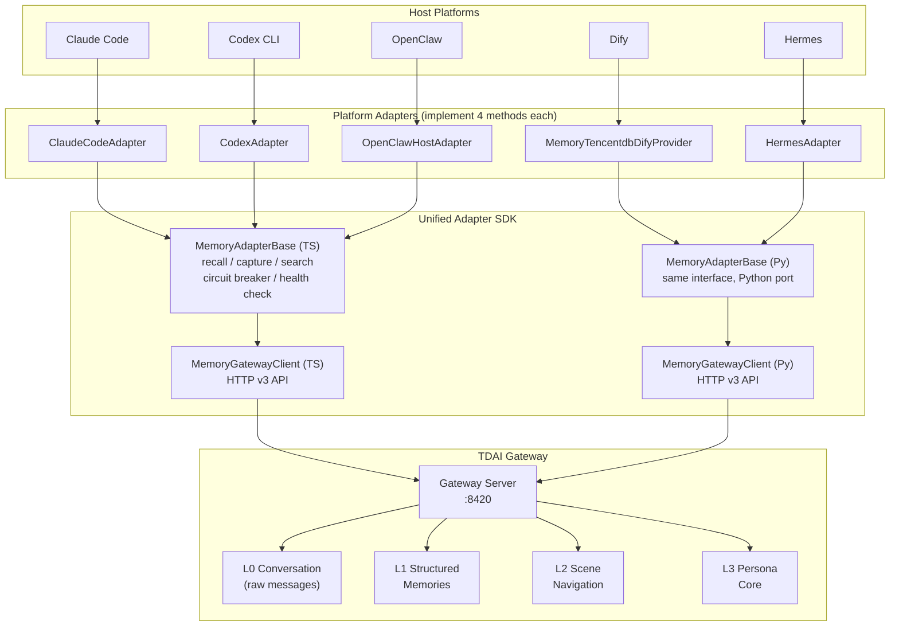
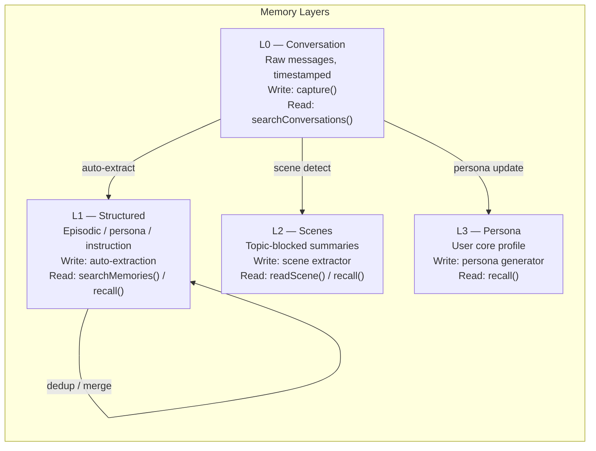
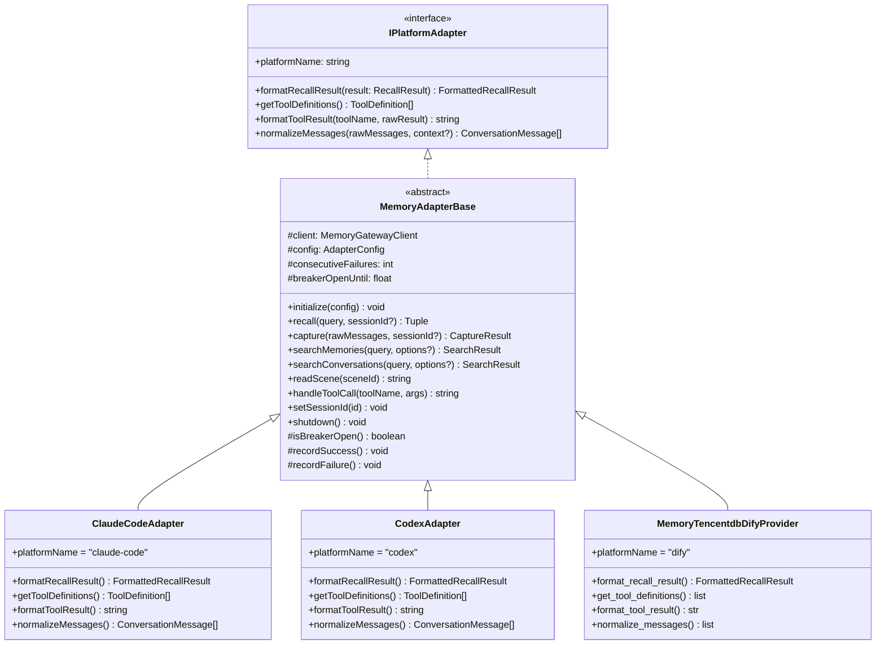
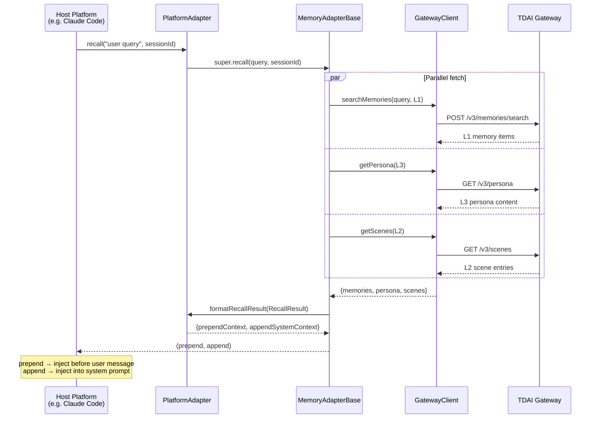
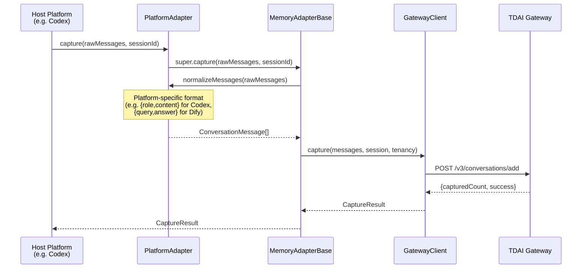
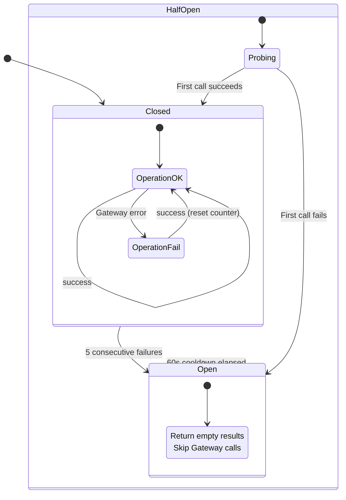
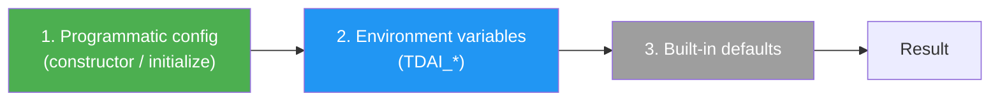

# Cross-Platform Adapter Architecture

> Issue #235 — Unified SDK for multi-platform memory integration.

## 1. Design Goals

| Goal | How achieved |
|------|-------------|
| **Platform-agnostic** | The SDK has zero dependencies on OpenClaw, Hermes, MCP, or any specific agent framework. |
| **Minimal surface area** | Each platform implements only 4 abstract methods; all Gateway I/O, circuit breaking, and error handling are inherited. |
| **Graceful degradation** | Every public method returns empty results on failure rather than throwing — the host agent never crashes. |
| **Consistent memory operations** | All platforms produce the same L0/L1/L2/L3 memory effects regardless of their prompt format. |
| **Bilingual SDK** | TypeScript SDK for Claude Code / Codex / OpenClaw; Python SDK for Dify / Hermes. Both share identical interface contracts. |

## 2. High-Level Architecture



## 3. Four-Layer Memory Model

All adapters interact with the same four-layer memory model through the Gateway:



## 4. SDK Class Hierarchy



## 5. Recall Data Flow

The recall operation fetches L1 + L3 + L2 in parallel, then formats them per-platform:



## 6. Capture Data Flow

The capture operation normalizes platform messages and records them as L0:



## 7. Circuit Breaker Pattern

All adapters inherit a circuit breaker for resilience:



### Breaker Parameters

| Parameter | Value | Description |
|-----------|-------|-------------|
| `BREAKER_THRESHOLD` | 5 | Consecutive failures before opening |
| `BREAKER_COOLDOWN_MS` | 60,000 | Cool-down before half-open probe |

## 8. File Layout

```
MemoryCore/src/adapters/
├── sdk/                          # Unified Adapter SDK (TypeScript)
│   ├── types.ts                  # Core interfaces & data types
│   ├── gateway-client.ts         # HTTP client for v3 API
│   ├── base-adapter.ts           # MemoryAdapterBase (abstract)
│   └── index.ts                  # Barrel exports
├── claude-code/                  # Claude Code MCP adapter
│   ├── adapter.ts                # ClaudeCodeAdapter + main()
│   ├── mcp-server.ts             # JSON-RPC 2.0 over stdio
│   ├── index.ts                  # Barrel exports
│   └── README.md
├── codex/                        # Codex CLI adapter
│   ├── codex-adapter.ts          # CodexAdapter + factory
│   ├── hooks.ts                  # CodexHooks (lifecycle integration)
│   ├── index.ts                  # Barrel exports
│   └── README.md
├── openclaw/                     # OpenClaw adapter (existing)
│   ├── host-adapter.ts
│   ├── llm-runner.ts
│   └── index.ts
├── standalone/                   # Standalone / Gateway-side adapter (existing)
│   ├── host-adapter.ts
│   ├── llm-runner.ts
│   └── index.ts
├── docs/                         # This documentation
│   ├── architecture.md
│   ├── adaptation-guide.md
│   └── platform-comparison.md
└── index.ts                      # Top-level barrel

MemoryCore/dify-plugin/           # Dify plugin (Python)
└── memory_tencentdb_dify/
    ├── types.py                  # Python type definitions
    ├── gateway_client.py         # Python HTTP client
    ├── base_adapter.py           # Python MemoryAdapterBase
    ├── provider.py               # Dify provider + tools
    └── __init__.py
```

## 9. Gateway v3 API Endpoints

All adapters communicate with the same Gateway endpoints:

| Endpoint | Method | Purpose | Layer |
|----------|--------|---------|-------|
| `/v3/memories/search` | POST | Search L1 structured memories | L1 |
| `/v3/conversations/add` | POST | Record L0 conversation messages | L0 |
| `/v3/conversations/search` | POST | Search L0 raw conversations | L0 |
| `/v3/persona` | GET | Read L3 persona content | L3 |
| `/v3/scenes` | GET | List L2 scene navigation | L2 |
| `/v3/scenes/{id}` | GET | Read a single L2 scene block | L2 |
| `/health` | GET | Gateway health check | — |

### Tenancy Headers

All v3 requests include tenancy headers for isolation:

```
X-TDAI-Team-ID:  my-team
X-TDAI-Agent-ID: my-agent
X-TDAI-User-ID:  alice
```

## 10. Configuration Strategy

All adapters follow the same configuration precedence:



### Common Environment Variables

| Variable | Default | Description |
|----------|---------|-------------|
| `TDAI_GATEWAY_ENDPOINT` | `http://127.0.0.1:8420` | Gateway base URL |
| `TDAI_GATEWAY_API_KEY` | *(none)* | Bearer token |
| `TDAI_GATEWAY_SERVICE_ID` | `default` | Multi-tenant service ID |
| `TDAI_GATEWAY_TIMEOUT_MS` | `10000` | Request timeout |
| `TDAI_TEAM_ID` | `default` | Team (tenant) identifier |
| `TDAI_AGENT_ID` | `default` | Agent identifier |
| `TDAI_USER_ID` | `default` | User identifier |
| `TDAI_CAPTURE_ENABLED` | `true` | Enable L0 capture |
| `TDAI_RECALL_MAX_RESULTS` | `5` | Max L1 memories per recall |
| `TDAI_RECALL_INCLUDE_PERSONA` | `true` | Include L3 in recall |
| `TDAI_RECALL_INCLUDE_SCENE_NAV` | `true` | Include L2 in recall |
