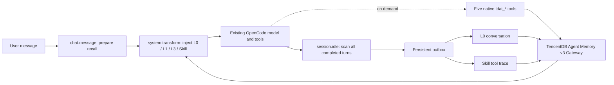

# TencentDB Agent Memory for OpenCode

English | [简体中文](README_CN.md)

Want to start immediately? Follow the [30-second simple user guide](USER_GUIDE.md).

A native TypeScript plugin for OpenCode that recalls long-term memory automatically, captures completed turns durably, and exposes precise Memory Gateway searches as native agent tools.

This is not a model proxy and does not require MCP. It uses OpenCode's plugin lifecycle directly, so it does not change the selected model, provider, streaming path, or existing tool execution flow.

## Design



- **Native plugin, not a proxy**: no interception of OpenAI-compatible traffic and no coupling to a model provider.
- **Automatic recall plus native tools**: inject common memory before each turn; let the agent run precise searches when needed.
- **Automatic writes need no tool**: a completed turn is captured into L0 at `session.idle`; users and models do not need a manual memory-write tool.
- **Separate L0 and Skill pipelines**: concise user/assistant content goes to L0; ordered `tool_call` / `tool_result` traces go to Skill.
- **Durable, deduplicated recovery**: derive a stable key from the completed assistant message ID, acknowledge both pipelines independently, use filesystem claims across OpenCode processes, and retry only unacknowledged work after restart.
- **Whole-transcript catch-up**: scan every completed turn on idle instead of only the latest turn, preventing silent gaps after offline or queued activity.
- **Fail open**: Memory outages never block the OpenCode conversation; failed writes remain in the local outbox for recovery.

## Capabilities

| Capability | Behavior |
|---|---|
| Automatic recall | Reads L0 Conversation, Atomic Memory, Core Memory, and Skill listing concurrently; retains partial results when one pipeline fails |
| Provenance | States that recalled context came from persistent TencentDB Agent Memory outside the current session, preventing false “current chat only” disclaimers |
| Automatic capture | Captures only successfully completed user/assistant turns after `session.idle` |
| Tool traces | Preserves ordered text, tool name, arguments, result, and `tool_call_id` pairs |
| Native tools | `tdai_memory_search`, `tdai_conversation_search`, `tdai_skill_search`, `tdai_skill_read`, `tdai_memory_status` |
| Safety boundary | Marks recall as untrusted data and removes injected-memory blocks, common secrets, bearer tokens, private keys, and local absolute paths |
| Isolation | Sends `service_id`, `team_id`, `agent_id`, and `user_id` on every request, plus the OpenCode `session_id` for conversation writes |

## Prerequisites

- Node.js 22.12+ for the adapter runtime; Node.js 22.16+ when starting this repository's Memory Gateway from source
- OpenCode with `@opencode-ai/plugin` 1.18.16 or a newer 1.x release
- A reachable TencentDB Agent Memory v3 Gateway
- Existing `service_id`, `team_id`, `agent_id`, `user_id`, and API key values for remote or multi-tenant deployments

See the repository-level [INSTALL.md](../../INSTALL.md) for local Gateway deployment and metadata initialization.

### Model API key boundary

Local zero-config mode needs no model API key for L0 conversation capture, history search, or cross-session recall. Enhanced memories are generated by the Gateway; model secrets must never be stored in the OpenCode plugin or project files.

| Feature | Model API key required? |
|---|---|
| L0 conversation capture and recall | No |
| Active conversation-history search | No |
| Automatic L1 atomic-memory extraction | Yes |
| L2/L3 scenes and user profiles | Yes |
| Skill learning and retrieval | Yes |
| OpenCode plugin installation | No |

L1/L2/L3 and Skill learning require the Gateway LLM key. Embedding is disabled by default with BM25 available; an Embedding key is needed only for vector or hybrid semantic retrieval. See the [user guide](USER_GUIDE.md) for configuration.

## Installation

During PR review, installation works directly from source without an unpublished npm package or `.tgz`. The user fills in the Gateway `.env` from the [user guide](USER_GUIDE.md), then sends the prepared instruction to OpenCode. OpenCode follows the [source auto-install runbook](SELF_INSTALL.md) to check and build the adapter, start the Gateway, create the local plugin loader, and verify the result.

The local loader imports `adapters/opencode/dist/index.js` directly from this checkout. Rerun the installation task after moving or deleting the repository.

## Configuration

The source-install task writes `tencentdb-agent-memory.json`, without model keys, under the user's OpenCode configuration directory. The local loader sets `TDAI_OPENCODE_CONFIG_FILE`; environment variables still take precedence.

The default local Gateway at `http://127.0.0.1:8420` works with zero configuration, using the local isolation tuple `local/default/default/opencode/default`. For remote or multi-user deployments, set these variables explicitly in the environment that starts OpenCode:

```bash
export TDAI_MEMORY_ENDPOINT=http://127.0.0.1:8420
export TDAI_MEMORY_API_KEY=your-api-key
export TDAI_MEMORY_SERVICE_ID=your-service-id
export TDAI_MEMORY_TEAM_ID=your-team-id
export TDAI_MEMORY_AGENT_ID=opencode
export TDAI_MEMORY_USER_ID=your-user-id
```

PowerShell:

```powershell
$env:TDAI_MEMORY_ENDPOINT = "http://127.0.0.1:8420"
$env:TDAI_MEMORY_API_KEY = "your-api-key"
$env:TDAI_MEMORY_SERVICE_ID = "your-service-id"
$env:TDAI_MEMORY_TEAM_ID = "your-team-id"
$env:TDAI_MEMORY_AGENT_ID = "opencode"
$env:TDAI_MEMORY_USER_ID = "your-user-id"
opencode
```

Never commit a real API key to `opencode.json`, plugin source, or Git.

### Optional variables

| Variable | Default | Purpose |
|---|---:|---|
| `TDAI_OPENCODE_CONFIG_FILE` | user OpenCode config directory | Private JSON config path; environment variables override file fields |
| `TDAI_MEMORY_TASK_ID` | empty | Optional task isolation ID |
| `TDAI_OPENCODE_STATE_DIR` | platform state directory | Persistent delivery outbox directory |
| `TDAI_OPENCODE_TIMEOUT_MS` | `5000` | Gateway request timeout, 100–60000 ms |
| `TDAI_OPENCODE_RECALL_LIMIT` | `5` | Automatic recall count, 1–20 |
| `TDAI_OPENCODE_MAX_CONTEXT_CHARS` | `8000` | Maximum injected context characters |
| `TDAI_OPENCODE_MAX_MESSAGE_CHARS` | `8192` | Maximum captured characters per text item; cannot exceed the Gateway limit |
| `TDAI_OPENCODE_MAX_SKILL_BYTES` | `480000` | Maximum Skill trace bytes per turn |
| `TDAI_OPENCODE_RECALL_ENABLED` | `true` | Enable automatic recall |
| `TDAI_OPENCODE_CAPTURE_ENABLED` | `true` | Enable automatic capture |
| `TDAI_OPENCODE_SKILL_ENABLED` | `false` | Enable Skill recall and capture; opt in only when the Gateway Skill module is enabled |
| `TDAI_OPENCODE_ALLOW_INSECURE_HTTP` | `false` | Allow bearer tokens over non-loopback HTTP; not recommended in production |

With invalid or incomplete remote configuration, the plugin emits one redacted error and remains disabled without failing OpenCode startup. Remote plaintext HTTP and credentials embedded in endpoint URLs are rejected by default; local placeholder values are never silently applied to a remote endpoint.

## Acceptance test

1. Start the Gateway and OpenCode, then tell the agent a unique preference.
2. After the response completes, send `Call the tdai_memory_status tool. Do not explain its name or use shell; return only the tool result.` Confirm connectivity; do not type only the tool name.
3. Start a new session and ask about the preference; L0 automatic recall should work without an explicit search tool call or an LLM extraction service.
4. If the Gateway Skill module is enabled, set `TDAI_OPENCODE_SKILL_ENABLED=true`, complete a real tool-use workflow, then query `tdai_skill_search` to verify the Skill pipeline.
5. Stop the Gateway during a completed turn. Restart the Gateway and OpenCode; the outbox should replay the pending write without resending an already acknowledged pipeline.

Local checks:

```bash
npm run check
npm run pack:check
```

With a local Gateway running, execute the opt-in contract test. It writes a unique L0 turn, verifies repeated-idle deduplication and cross-session recall, and removes the test messages before exiting:

```bash
TDAI_MEMORY_ENDPOINT=http://127.0.0.1:18420 npm run e2e:local
```

## Troubleshooting

- **`tdai_memory_status` is unreachable**: check `TDAI_MEMORY_ENDPOINT` and the Gateway `/health` endpoint, then verify the API key and service ID.
- **L0 succeeds but Skill fails**: Skill extraction depends on the corresponding Gateway service. The plugin keeps that pipeline pending while normal conversations continue.
- **No automatic recall**: ensure `TDAI_OPENCODE_RECALL_ENABLED` is not disabled and inspect structured `tencentdb-agent-memory` logs in OpenCode.
- **Plugin runs twice**: do not load the same implementation through both npm configuration and `.opencode/plugins/`; OpenCode runs plugin hooks sequentially.
- **Inspecting pending data**: stop OpenCode and back up `TDAI_OPENCODE_STATE_DIR/delivery-v1` first. Unacknowledged records contain sanitized and bounded conversation content.

## Delivery semantics and known boundary

The plugin provides **local durable deduplication** for repeated idle events, concurrent OpenCode processes sharing the same state directory, process restarts, and single-pipeline failures. The current Gateway conversation-add endpoint does not accept a client idempotency key, leaving one narrow window that a client cannot remove: the Gateway commits a write but its response is lost before the client receives it. A retry can then create a server-side duplicate. This adapter does not claim end-to-end exactly-once delivery. If the Gateway adds idempotency-key support, the stable turn key generated here can provide that guarantee.

## Development

```bash
npm install --legacy-peer-deps
npm run check
```

Tests cover configuration safety, content redaction, tool-call pairing, multi-turn catch-up, concurrent idle deduplication, per-pipeline restart recovery, and the real HTTP envelope/isolation contract.
