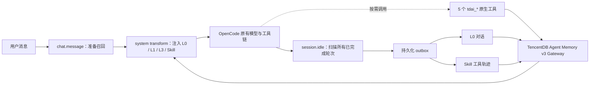

# TencentDB Agent Memory × OpenCode

[English](README.md) | 简体中文

只想马上用起来？请看 [30 秒极简使用说明](USER_GUIDE_CN.md)。

面向 OpenCode 的原生 TypeScript 插件：自动召回长期记忆，可靠采集已完成会话，并把 Memory Gateway 的精确搜索能力作为原生工具交给 Agent。

它不是模型 Proxy，也不要求 MCP。插件直接使用 OpenCode 官方插件生命周期，因此不会改变模型提供商、模型名、流式响应或工具调用链路。

## 为什么这样设计



- **原生 Plugin，而不是 Proxy**：无需接管 OpenAI-compatible 流量，不会影响用户选择的模型或 provider。
- **自动召回 + 原生工具**：常用记忆在每轮开始前注入；需要精查时，Agent 可主动调用搜索/Skill 工具。
- **自动写入无需工具**：用户要求“记住”时，完成轮次会在 `session.idle` 自动进入 L0；不需要、也不暴露手动写入工具。
- **L0 与 Skill 双通道**：简洁的用户/助手答案进入 L0；包含 `tool_call` / `tool_result` 的有序轨迹进入 Skill。
- **持久化、防重复、可恢复**：每个已完成 assistant message ID 生成稳定键。两个写入通道分别确认，通过文件 claim 协调多个 OpenCode 进程，重启后只重试尚未确认的通道。
- **补扫整个 transcript**：一次 idle 会检查所有已完成轮次，而不是只取最后一轮；离线恢复或连续排队消息不会静默漏记。
- **失败开放**：Memory 暂时不可用时不阻断 OpenCode 对话；失败写入保留在本地 outbox，等待下一次启动或连接事件恢复。

## 能力

| 能力 | 行为 |
|---|---|
| 自动召回 | 并行读取 L0 Conversation、Atomic Memory、Core Memory 和 Skill listing，部分通道故障时保留其余结果 |
| 来源说明 | 明确告诉模型召回内容来自当前会话之外的持久化 TencentDB Agent Memory，避免误称为“仅存在本次对话” |
| 自动采集 | 仅在 `session.idle` 后采集已成功完成的用户/助手轮次 |
| 工具轨迹 | 保留文本、工具名、参数、结果和 `tool_call_id` 的顺序与配对关系 |
| 原生工具 | `tdai_memory_search`、`tdai_conversation_search`、`tdai_skill_search`、`tdai_skill_read`、`tdai_memory_status` |
| 安全边界 | 召回内容标记为不可信数据；去除已注入记忆块、常见密钥、Bearer token、私钥和本地绝对路径 |
| 隔离 | 每个请求都携带 `service_id`、`team_id`、`agent_id`、`user_id`，会话写入再携带 OpenCode `session_id` |

## 前置条件

- 适配器运行需要 Node.js 22.12+；若同时源码启动当前仓库的 Memory Gateway，则需要 Node.js 22.16+
- OpenCode 与 `@opencode-ai/plugin` 1.18.16 或更高的 1.x 版本
- 可访问的 TencentDB Agent Memory v3 Gateway
- 远程/多租户部署需要已创建的 `service_id`、`team_id`、`agent_id`、`user_id` 和 API key

本地 Gateway 的部署和元数据初始化见仓库根目录的 [INSTALL_CN.md](../../INSTALL_CN.md)。

### 模型 Key 边界

本地零配置无需模型 API Key，即可使用 L0 对话保存、历史搜索和跨会话召回。增强记忆由 Gateway 服务端生成；模型密钥绝不能写入 OpenCode 插件或项目文件。

| 功能 | 是否需要模型 Key |
|---|---|
| L0 对话保存与召回 | 不需要 |
| 主动搜索历史对话 | 不需要 |
| L1 原子记忆自动提炼 | 需要 |
| L2/L3 场景与画像 | 需要 |
| Skill 学习与检索 | 需要 |
| OpenCode 插件安装 | 不需要 |

L1/L2/L3 与 Skill 学习需要 Gateway LLM Key；Embedding 默认关闭并使用 BM25，只有开启向量/混合语义检索时才需要 Embedding Key。具体配置见[用户使用说明](USER_GUIDE_CN.md)。

## 安装

当前 PR 阶段采用源码安装，不依赖尚未发布的 npm 包，也不生成 `.tgz`。

- **Windows**：按[用户使用说明](USER_GUIDE_CN.md)填写 Gateway `.env`，再把预置指令发给 OpenCode；OpenCode 按[源码自动安装任务书](SELF_INSTALL_CN.md)完成检查、构建、Gateway 启动、本地插件加载器和验收。
- **macOS/Linux**：先启动 Gateway，再构建适配器，把本地源码依赖安装到 OpenCode 的 XDG 配置目录，最后执行诊断命令。完整命令和验收步骤见[macOS/Linux 源码安装](USER_GUIDE_CN.md#macoslinux-源码安装)。

Windows 本地加载器直接引用仓库中的 `adapters/opencode/dist/index.js`；macOS/Linux 通过指向同一工作区的 `file:` 依赖安装。因此移动或删除仓库后需要重新执行安装。

## 配置

源码安装任务会在用户 OpenCode 配置目录写入不含模型 Key 的 `tencentdb-agent-memory.json`，并由本地加载器设置 `TDAI_OPENCODE_CONFIG_FILE`。环境变量仍具有更高优先级。

默认本地 Gateway（`http://127.0.0.1:8420`）可零配置启动，使用 `local/default/default/opencode/default` 这组本地隔离值。远程或多用户部署时，在启动 OpenCode 的环境中显式设置：

```bash
export TDAI_MEMORY_ENDPOINT=http://127.0.0.1:8420
export TDAI_MEMORY_API_KEY=your-api-key
export TDAI_MEMORY_SERVICE_ID=your-service-id
export TDAI_MEMORY_TEAM_ID=your-team-id
export TDAI_MEMORY_AGENT_ID=opencode
export TDAI_MEMORY_USER_ID=your-user-id
```

PowerShell：

```powershell
$env:TDAI_MEMORY_ENDPOINT = "http://127.0.0.1:8420"
$env:TDAI_MEMORY_API_KEY = "your-api-key"
$env:TDAI_MEMORY_SERVICE_ID = "your-service-id"
$env:TDAI_MEMORY_TEAM_ID = "your-team-id"
$env:TDAI_MEMORY_AGENT_ID = "opencode"
$env:TDAI_MEMORY_USER_ID = "your-user-id"
opencode
```

不要把真实 API key 提交到 `opencode.json`、插件源码或 Git。

### 可选变量

| 变量 | 默认值 | 说明 |
|---|---:|---|
| `TDAI_OPENCODE_CONFIG_FILE` | 用户 OpenCode 配置目录 | 私密 JSON 配置路径；环境变量覆盖文件字段 |
| `TDAI_MEMORY_TASK_ID` | 空 | 可选任务隔离 ID |
| `TDAI_OPENCODE_STATE_DIR` | 平台 state 目录 | 持久化 delivery outbox 的目录 |
| `TDAI_OPENCODE_TIMEOUT_MS` | `5000` | 单次 Gateway 请求超时，100–60000 ms |
| `TDAI_OPENCODE_RECALL_LIMIT` | `5` | 自动召回条数，1–20 |
| `TDAI_OPENCODE_MAX_CONTEXT_CHARS` | `8000` | 注入上下文字符上限 |
| `TDAI_OPENCODE_MAX_MESSAGE_CHARS` | `8192` | 单条采集文本字符上限，不可超过 Gateway 限制 |
| `TDAI_OPENCODE_MAX_SKILL_BYTES` | `480000` | 单轮 Skill 轨迹字节上限 |
| `TDAI_OPENCODE_RECALL_ENABLED` | `true` | 是否自动召回 |
| `TDAI_OPENCODE_CAPTURE_ENABLED` | `true` | 是否自动采集 |
| `TDAI_OPENCODE_SKILL_ENABLED` | `false` | 是否召回和采集 Skill；仅在 Gateway 已启用 Skill 模块时显式开启 |
| `TDAI_OPENCODE_ALLOW_INSECURE_HTTP` | `false` | 允许向非回环 HTTP 地址发送 Bearer token；生产环境不建议开启 |

远程配置不完整时，插件会写一条脱敏错误日志并保持禁用，不会让 OpenCode 启动失败。远程明文 HTTP 和 URL 内嵌凭证默认被拒绝；本地默认值绝不会静默用于远程地址。

## 验收

1. 启动 Gateway 和 OpenCode，向 Agent 说明一个独特偏好。
2. 等待回复完成，发送“请调用 `tdai_memory_status` 工具，不要解释名称，不要使用 Shell 或搜索文件，只返回工具执行结果”，确认 Gateway 可达；不要只输入工具名。
3. 新建会话并询问该偏好；L0 自动召回应在不手动调用工具、也不依赖 LLM 提取的情况下生效。
4. 如果 Gateway 已启用 Skill 模块，先设置 `TDAI_OPENCODE_SKILL_ENABLED=true`，再执行一次真实工具调用流程，并用 `tdai_skill_search` 检查 Skill 管道。
5. 写入时关闭 Gateway，再结束一轮对话；重启 Gateway/OpenCode 后，outbox 应自动补写且不重复已确认通道。

本地开发检查：

```bash
npm run check
npm run pack:check
```

本地 Gateway 启动后，可运行显式契约测试。测试会写入一轮带唯一标记的 L0 对话，验证重复 idle 去重和跨会话召回，并在退出前删除测试消息：

```bash
TDAI_MEMORY_ENDPOINT=http://127.0.0.1:18420 npm run e2e:local
```

## 故障排查

- **`tdai_memory_status` 不可达**：先检查 `TDAI_MEMORY_ENDPOINT` 和 Gateway `/health`，再核对 API key 与 service ID。
- **能写 L0、不能写 Skill**：Skill 提取依赖 Gateway 侧对应服务；插件会保留 pending 状态并继续正常对话。
- **没有自动召回**：确认 `TDAI_OPENCODE_RECALL_ENABLED` 未关闭，并查看 OpenCode 中 `tencentdb-agent-memory` 的结构化日志。
- **重复的本地插件**：不要同时通过 npm 配置和 `.opencode/plugins/` 加载同一实现；OpenCode 会顺序运行两个实例。
- **清理 pending 数据**：先停止 OpenCode，备份后再处理 `TDAI_OPENCODE_STATE_DIR/delivery-v1`。未确认记录包含经过脱敏和截断的会话内容。

## 交付语义与已知边界

插件对 OpenCode 重复 idle、共享同一状态目录的并发 OpenCode 进程、进程重启和单通道失败提供**本地持久化去重**。当 Gateway 支持按租户隔离的 `idempotency_key` 契约时，L0 重试会复用本插件生成的稳定 turn key，不会重复创建会话记录或触发 pipeline 通知；不支持该契约的 Gateway 仍是 at-least-once 语义。

## 开发

运行测试：

```bash
npm install --legacy-peer-deps
npm run check
```

测试覆盖配置安全、内容脱敏、工具调用配对、连续多轮补扫、并发 idle 去重、跨重启分通道恢复，以及真实 HTTP envelope/隔离字段契约。
