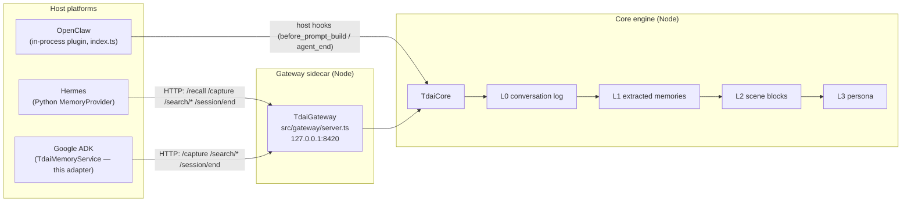

# memory-tencentdb × Google ADK (Agent Development Kit)

A cross-platform memory adapter that plugs the TencentDB Agent Memory
engine into [Google ADK](https://google.github.io/adk-docs/) Python agents
as a drop-in
[`BaseMemoryService`](https://google.github.io/adk-docs/sessions/memory/).
ADK agents get fully local four-layer long-term memory (L0 conversation →
L1 extraction → L2 scene blocks → L3 persona) with zero external API
dependencies.

This adapter follows the same integration pattern as the Hermes provider
(`hermes-plugin/`): it does **not** re-implement any engine logic — it
translates the host platform's memory lifecycle into calls against the
[HTTP Gateway](../src/gateway/server.ts) that fronts `TdaiCore`.

## Architecture



Data flow for an ADK agent turn:

| ADK lifecycle | Adapter call | Gateway endpoint | Engine effect |
| --- | --- | --- | --- |
| `load_memory` / `preload_memory` tool | `search_memory(query=...)` | `POST /search/memories` + `POST /search/conversations` | L1–L3 semantic search + raw L0 search |
| App ingests a finished session | `add_session_to_memory(session)` | `POST /capture` per completed turn | L0 write + pipeline scheduling |
| App ingests only the latest turn | `add_events_to_memory(events=...)` | `POST /capture` | Incremental L0 write |
| Conversation ends | `end_session(...)` (optional helper) | `POST /session/end` | Flush pending L1→L3 work |

## Installation

1. Start the Gateway (owns the memory data directory and the local LLM
   pipeline). From the repository root:

   ```bash
   pnpm install
   pnpm exec tsx src/gateway/server.ts
   # → [tdai-gateway] Gateway listening on http://127.0.0.1:8420
   ```

   Any of the existing deployment recipes (Hermes Docker image, `memory-tencentdb-ctl`)
   also work — the adapter only needs the HTTP port.

2. Install the adapter next to your ADK app. It is dependency-free beyond
   `google-adk` itself:

   ```bash
   pip install google-adk
   # from this repository checkout:
   export PYTHONPATH="/path/to/TencentDB-Agent-Memory/adk-plugin:$PYTHONPATH"
   ```

## Usage

```python
from google.adk.agents import LlmAgent
from google.adk.runners import Runner
from google.adk.sessions import InMemorySessionService
from google.adk.tools import load_memory

from memory_tencentdb_adk import TdaiMemoryService

memory_service = TdaiMemoryService()  # Gateway on 127.0.0.1:8420

agent = LlmAgent(
    model="gemini-2.5-flash",
    name="assistant",
    instruction="Answer using memory when helpful.",
    tools=[load_memory],
)

runner = Runner(
    agent=agent,
    app_name="my-app",
    session_service=InMemorySessionService(),
    memory_service=memory_service,
)

# ... run turns ...

# After a conversation finishes:
session = await runner.session_service.get_session(
    app_name="my-app", user_id="alice", session_id=session_id
)
await memory_service.add_session_to_memory(session)
await memory_service.end_session(app_name="my-app", user_id="alice", session_id=session_id)
```

A runnable smoke script that exercises the full loop against a live
Gateway (no LLM key required) is provided in
[`examples/quickstart.py`](examples/quickstart.py).

### Configuration

| Parameter | Env fallback | Default | Meaning |
| --- | --- | --- | --- |
| `base_url` | `TDAI_GATEWAY_URL`, or `MEMORY_TENCENTDB_GATEWAY_HOST`/`_PORT` | `http://127.0.0.1:8420` | Gateway address |
| `api_key` | `MEMORY_TENCENTDB_GATEWAY_API_KEY`, `TDAI_GATEWAY_API_KEY` | unset | Bearer token; required only when the Gateway enforces auth |
| `strict` | — | `False` | `False`: fail-open (log + empty results) when the Gateway is down. `True`: raise `TdaiGatewayError` |
| `search_limit` | — | `5` | Max hits per search backend |
| `include_conversations` | — | `True` | Also search raw L0 history on `search_memory` |

### Session identity

Gateway `session_key` is derived as `adk:{app_name}:{user_id}:{session_id}`,
so distinct ADK apps/users/sessions stay distinct in the L0 store while
remaining greppable. `user_id` is forwarded separately on capture and
session-end calls.

### Idempotent ingestion

ADK explicitly allows `add_session_to_memory` to be called repeatedly on a
growing session. The service tracks captured event IDs per session (in
process memory) and only forwards new completed turns; failed captures are
un-marked so a Gateway blip is retried on the next ingestion. Across
process restarts the guard resets — deduplication of re-ingested turns is
then handled by the engine's own L0 layer, same as for the other hosts.

## Writing an adapter for another platform

The three adapters in this repository demonstrate the two supported
integration styles:

| Style | Example | When to use |
| --- | --- | --- |
| **In-process host adapter** (implement `HostAdapter`, embed `TdaiCore`) | `src/adapters/openclaw/` | Node platforms with a plugin SDK and process lifetime control |
| **Gateway client** (HTTP against the sidecar) | `hermes-plugin/` (Python), `adk-plugin/` (Python) | Everything else — any language, any process model |

Recommended steps for a new Gateway-client adapter:

1. **Find the platform's memory seams.** You need at minimum: a hook or
   call-site that observes completed turns (→ `/capture`) and a retrieval
   entry point the agent can use (→ `/search/*` or `/recall`). A
   session-end signal (→ `/session/end`) is a strong nice-to-have.
2. **Map identity.** Decide how the platform's app/user/session IDs fold
   into a stable `session_key`; prefix it with the platform name.
3. **Keep the client thin and typed.** Wrap the six Gateway endpoints,
   attach `Authorization: Bearer` only when a key is configured, and raise
   one typed error for both transport and HTTP failures.
4. **Fail open by default.** The memory sidecar must never break the
   agent loop; return empty results and log on failure, with a `strict`
   escape hatch for tests.
5. **Test against a fake Gateway, not the real engine.** A ~100-line HTTP
   double (see `memory_tencentdb_adk/tests/fake_gateway.py`) keeps adapter
   tests fast and toolchain-free; reserve the real Node Gateway for an
   opt-in end-to-end smoke test.

## Limitations

- The Gateway search endpoints return pre-formatted text blocks, so
  `search_memory` yields one `MemoryEntry` per backend (structured
  memories, conversations) rather than one per record. Per-record shapes
  would need a Gateway API extension.
- The local store is single-tenant: `app_name`/`user_id` scope the session
  key, but all memories live in one data directory (same as the Hermes
  deployment model). Run one Gateway (with its own `TDAI_DATA_DIR`) per
  tenant if you need hard isolation.
- ADK's `search_memory` has no ranking contract; results are returned in
  Gateway order.

## Tests

```bash
# Adapter unit tests (no google-adk required — service tests auto-skip):
python -m unittest discover -s adk-plugin -t adk-plugin -v

# Full suite including the ADK service tests:
pip install google-adk
python -m unittest discover -s adk-plugin -t adk-plugin -v
```
