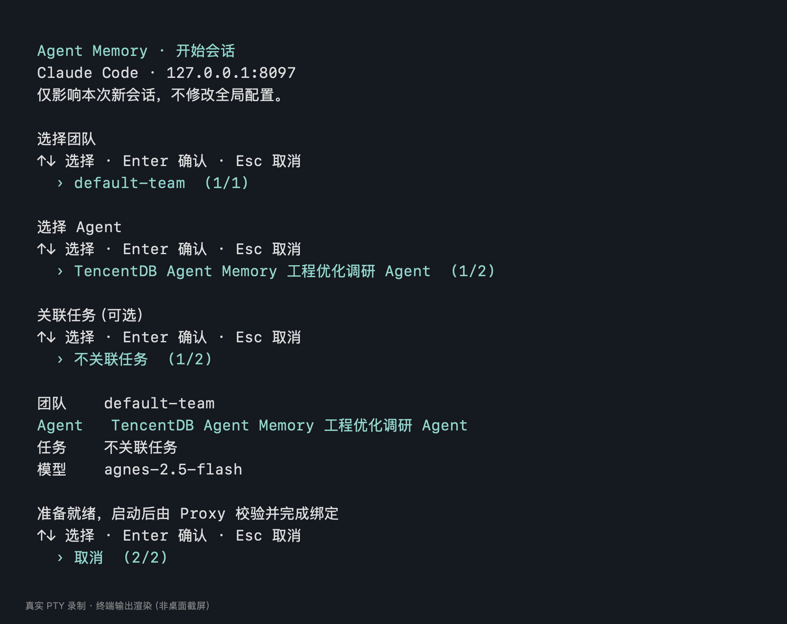

# Session init CLI 实测记录

验证日期：2026-09-09。客户端：Claude Code 2.1.236，macOS。
服务端：基于上游 `feat/server_team` 的 `c387ea4`；两个隔离的测试 Proxy 容器使用现有镜像运行环境，并只读挂载该版本的 `MemoryProxy/src`。复用已部署的 Core、Panel 和既有团队资产；未替换日常使用的 Proxy 配置。

## 交互界面



这是通过 `script` 记录真实 PTY 操作后渲染的图片，**不是桌面截屏**。终端应用的截屏访问不可用。对应[文本记录](terminal.txt)去除了 ANSI 控制序列，展示方向键选择团队、Agent、不关联任务，最后选择取消。以下模型实测则使用同一 CLI 的 `--plain` 编号模式并确认启动。

## 真实 Claude Code 会话

使用已有 User Key 配置的私有副本，将 `ANTHROPIC_BASE_URL` 分别指向隔离 Proxy。凭据和原始资产正文不收录到仓库。

```bash
node agents/session-init.mjs --plain --settings <私有配置文件> \
  --model <模型名> \
  --prompt '这是接入验证，不修改文件，不读取本机文件。请根据已注入的团队记忆以及其中的检索说明，说明此前工程调研的一个结论及来源。'
```

| 检查项 | DeepSeek 官方 | Agnes |
| --- | --- | --- |
| 主模型 | `deepseek-v4-flash` | `agnes-2.5-flash` |
| 上游 | `https://api.deepseek.com/anthropic` | 已配置的 Agnes 服务 |
| 任务选择 | 关联已有任务 | 不关联任务 |
| 会话 ID | `5391c792-4a8f-438f-8fc9-3107cd622377` | `df5183a0-9ddd-4428-b487-c5abd672bdb7` |
| Proxy 预选 | `preset hit` → `register directly` → `initialized` | 同左，`task=-` |
| 客户端再次询问团队/Agent/Task | 无 `AskUserQuestion` 调用 | 无 `AskUserQuestion` 调用 |
| 实际资产读取 | atomic/search、scenario/read、conversation/search 各一次，均 `code=0` | atomic/search 两次、scenario/read 一次，均 `code=0` |
| 不存在的工具调用 | 0 | 2：`tdai_read_scene`、`tdai_memory_search` |
| 会话 JSONL 中 API Error 条数 | 0 | 5：`Content block not found` |
| 最终结果 | 正常回答，引用检索到的资产来源 | 发生错误后通过 Bash + HTTP 读取资产，最终回答 |

计数来自 Claude Code 本地会话 JSONL：统计 `tool_use` / `tool_result` 和 `isApiErrorMessage`，不是统计终端重绘次数。绑定结果另行核对 Proxy 日志。只对本次验证所需的记忆检索 HTTP 命令逐次确认执行，未开放全部工具权限。

**结论范围：**两种绑定方式都完成了初始化并实际读取资产；Agnes 后续交互并非无错误，本 PR 没有修复模型工具选择或 SSE 兼容性。模型复述的历史排查结论只证明读到了旧资产，不作为当前版本仍存在同一缺陷的证据。

另外，私有配置沿用了旧模型别名，Proxy 日志还出现过辅助请求的 HTTP 400（DeepSeek）/503（Agnes）；`--model` 仅覆盖主模型。上表的“API Error”特指主会话 JSONL，不代表整个服务没有 HTTP 错误。切换供应商时仍需在既有配置入口同步辅助模型别名。

## 其他检查与边界

- `node --test agents/session-init.test.mjs`：3 项通过，覆盖旧身份 header 清除、分页及认证失败、临时配置权限及退出/启动失败清理。
- 真实方向键界面可选择取消，未启动客户端；主模型实测完成后正常退出。
- 最初使用旧的本地 Proxy 镜像时，不关联任务会再次进入原生选择流程。切换为上游源码后验证通过，因此文档明确要求服务端支持仅 Team + Agent 的 header 预选。
- 最初的 Ark DeepSeek 请求被供应商 `429 SetLimitExceeded` 阻止，没有绕过配额限制；最终 DeepSeek 结果来自用户另外提供的官方接入。
- 未覆盖：所有模型 × 两种任务选择的完整组合、Windows、订阅 OAuth 接入、全部终端尺寸。没有将这些标记为通过。
