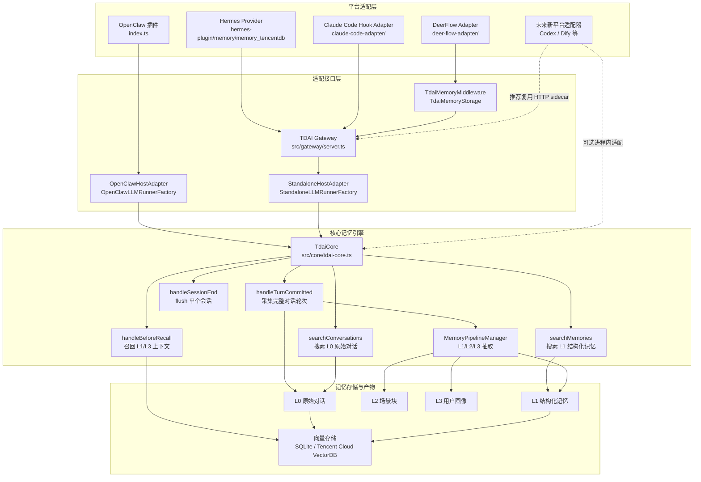
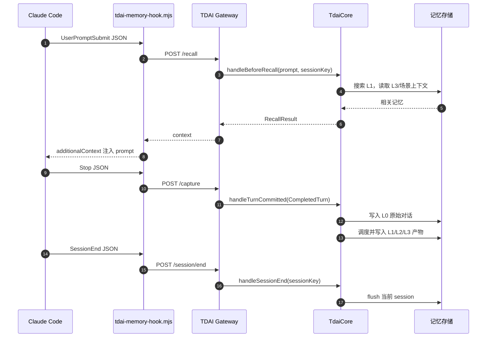
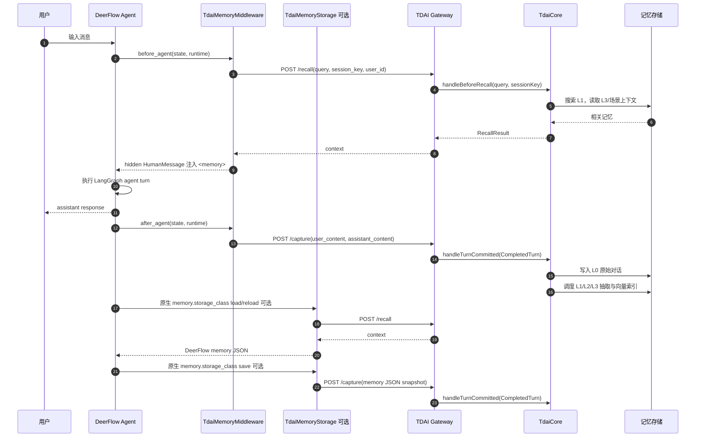
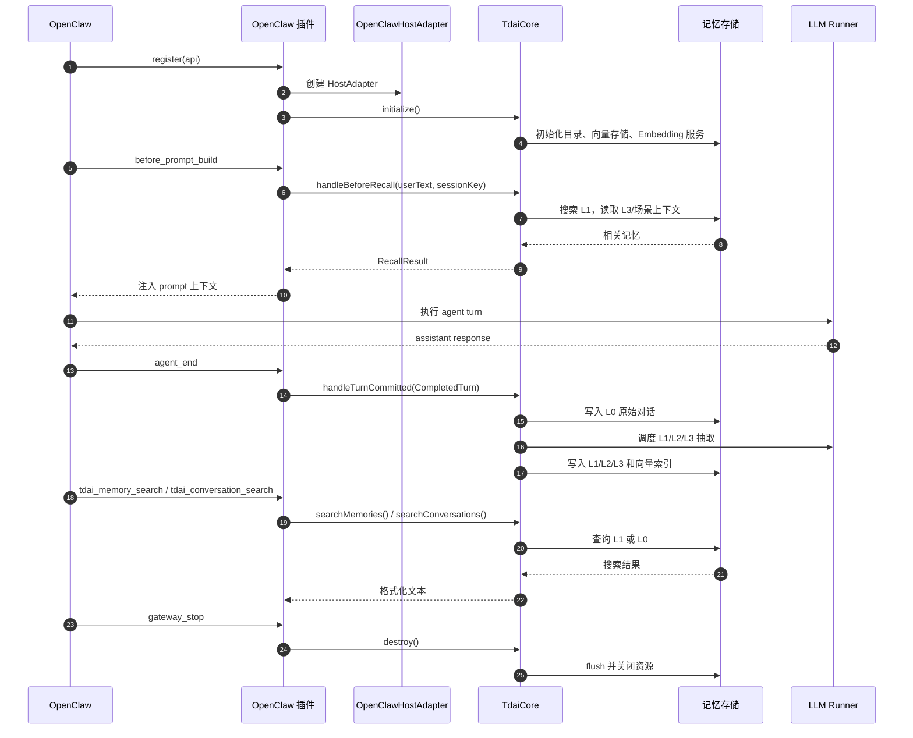
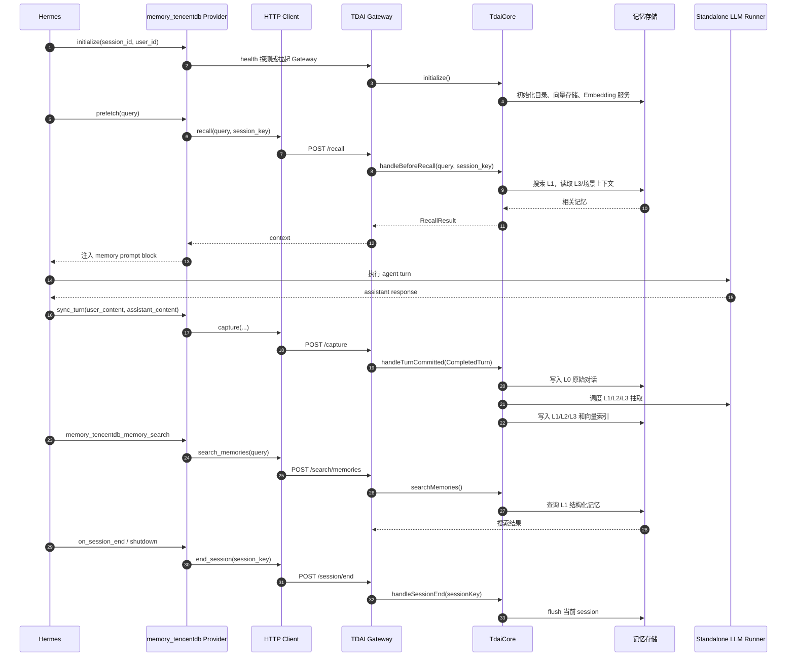

# Issue #235 核心引擎与平台适配层数据流

## 总体架构

```mermaid
flowchart TB
  subgraph Platform["平台适配层"]
    OpenClaw["OpenClaw 插件\nindex.ts"]
    Hermes["Hermes Provider\nhermes-plugin/memory/memory_tencentdb"]
    ClaudeCode["Claude Code Hook Adapter\nclaude-code-adapter/"]
    DeerFlow["DeerFlow Adapter\ndeer-flow-adapter/"]
    Future["未来新平台适配器\nCodex / Dify 等"]
  end

  subgraph Adapter["适配接口层"]
    OpenClawAdapter["OpenClawHostAdapter\nOpenClawLLMRunnerFactory"]
    Gateway["TDAI Gateway\nsrc/gateway/server.ts"]
    StandaloneAdapter["StandaloneHostAdapter\nStandaloneLLMRunnerFactory"]
    DeerFlowMiddleware["TdaiMemoryMiddleware\nTdaiMemoryStorage"]
  end

  subgraph Core["核心记忆引擎"]
    TdaiCore["TdaiCore\nsrc/core/tdai-core.ts"]
    Recall["handleBeforeRecall\n召回 L1/L3 上下文"]
    Capture["handleTurnCommitted\n采集完整对话轮次"]
    MemorySearch["searchMemories\n搜索 L1 结构化记忆"]
    ConversationSearch["searchConversations\n搜索 L0 原始对话"]
    SessionEnd["handleSessionEnd\nflush 单个会话"]
    Pipeline["MemoryPipelineManager\nL1/L2/L3 抽取"]
  end

  subgraph Store["记忆存储与产物"]
    L0["L0 原始对话"]
    L1["L1 结构化记忆"]
    L2["L2 场景块"]
    L3["L3 用户画像"]
    VectorStore["向量存储\nSQLite / Tencent Cloud VectorDB"]
  end

  OpenClaw --> OpenClawAdapter --> TdaiCore
  Hermes --> Gateway --> StandaloneAdapter --> TdaiCore
  ClaudeCode --> Gateway
  DeerFlow --> DeerFlowMiddleware --> Gateway
  Future -. 推荐复用 HTTP sidecar .-> Gateway
  Future -. 可选进程内适配 .-> TdaiCore

  TdaiCore --> Recall --> VectorStore
  TdaiCore --> Capture --> L0
  Capture --> Pipeline
  TdaiCore --> MemorySearch --> L1
  TdaiCore --> ConversationSearch --> L0
  TdaiCore --> SessionEnd

  L0 --> VectorStore
  L1 --> VectorStore
  Pipeline --> L1
  Pipeline --> L2
  Pipeline --> L3
```

## Claude Code / Gateway 数据流

```mermaid
sequenceDiagram
  autonumber
  participant Claude as Claude Code
  participant Hook as tdai-memory-hook.mjs
  participant Gateway as TDAI Gateway
  participant Core as TdaiCore
  participant Store as 记忆存储

  Claude->>Hook: UserPromptSubmit JSON
  Hook->>Gateway: POST /recall
  Gateway->>Core: handleBeforeRecall(prompt, sessionKey)
  Core->>Store: 搜索 L1，读取 L3/场景上下文
  Store-->>Core: 相关记忆
  Core-->>Gateway: RecallResult
  Gateway-->>Hook: context
  Hook-->>Claude: additionalContext 注入 prompt

  Claude->>Hook: Stop JSON
  Hook->>Gateway: POST /capture
  Gateway->>Core: handleTurnCommitted(CompletedTurn)
  Core->>Store: 写入 L0 原始对话
  Core->>Store: 调度并写入 L1/L2/L3 产物

  Claude->>Hook: SessionEnd JSON
  Hook->>Gateway: POST /session/end
  Gateway->>Core: handleSessionEnd(sessionKey)
  Core->>Store: flush 当前 session
```

## DeerFlow 数据流

```mermaid
sequenceDiagram
  autonumber
  participant User as 用户
  participant DeerFlow as DeerFlow Agent
  participant Middleware as TdaiMemoryMiddleware
  participant Storage as TdaiMemoryStorage 可选
  participant Gateway as TDAI Gateway
  participant Core as TdaiCore
  participant Store as 记忆存储

  User->>DeerFlow: 输入消息
  DeerFlow->>Middleware: before_agent(state, runtime)
  Middleware->>Gateway: POST /recall(query, session_key, user_id)
  Gateway->>Core: handleBeforeRecall(query, sessionKey)
  Core->>Store: 搜索 L1，读取 L3/场景上下文
  Store-->>Core: 相关记忆
  Core-->>Gateway: RecallResult
  Gateway-->>Middleware: context
  Middleware-->>DeerFlow: hidden HumanMessage 注入 <memory>

  DeerFlow->>DeerFlow: 执行 LangGraph agent turn
  DeerFlow-->>User: assistant response
  DeerFlow->>Middleware: after_agent(state, runtime)
  Middleware->>Gateway: POST /capture(user_content, assistant_content)
  Gateway->>Core: handleTurnCommitted(CompletedTurn)
  Core->>Store: 写入 L0 原始对话
  Core->>Store: 调度 L1/L2/L3 抽取与向量索引

  DeerFlow->>Storage: 原生 memory.storage_class load/reload 可选
  Storage->>Gateway: POST /recall
  Gateway-->>Storage: context
  Storage-->>DeerFlow: DeerFlow memory JSON

  DeerFlow->>Storage: 原生 memory.storage_class save 可选
  Storage->>Gateway: POST /capture(memory JSON snapshot)
  Gateway->>Core: handleTurnCommitted(CompletedTurn)
```

## OpenClaw 数据流

```mermaid
sequenceDiagram
  autonumber
  participant OpenClaw
  participant Plugin as OpenClaw 插件
  participant Adapter as OpenClawHostAdapter
  participant Core as TdaiCore
  participant Store as 记忆存储
  participant LLM as LLM Runner

  OpenClaw->>Plugin: register(api)
  Plugin->>Adapter: 创建 HostAdapter
  Plugin->>Core: initialize()
  Core->>Store: 初始化目录、向量存储、Embedding 服务

  OpenClaw->>Plugin: before_prompt_build
  Plugin->>Core: handleBeforeRecall(userText, sessionKey)
  Core->>Store: 搜索 L1，读取 L3/场景上下文
  Store-->>Core: 相关记忆
  Core-->>Plugin: RecallResult
  Plugin-->>OpenClaw: 注入 prompt 上下文

  OpenClaw->>LLM: 执行 agent turn
  LLM-->>OpenClaw: assistant response
  OpenClaw->>Plugin: agent_end
  Plugin->>Core: handleTurnCommitted(CompletedTurn)
  Core->>Store: 写入 L0 原始对话
  Core->>LLM: 调度 L1/L2/L3 抽取
  Core->>Store: 写入 L1/L2/L3 和向量索引

  OpenClaw->>Plugin: tdai_memory_search / tdai_conversation_search
  Plugin->>Core: searchMemories() / searchConversations()
  Core->>Store: 查询 L1 或 L0
  Store-->>Core: 搜索结果
  Core-->>Plugin: 格式化文本

  OpenClaw->>Plugin: gateway_stop
  Plugin->>Core: destroy()
  Core->>Store: flush 并关闭资源
```

## Hermes / Gateway 数据流

```mermaid
sequenceDiagram
  autonumber
  participant Hermes
  participant Provider as memory_tencentdb Provider
  participant Client as HTTP Client
  participant Gateway as TDAI Gateway
  participant Core as TdaiCore
  participant Store as 记忆存储
  participant LLM as Standalone LLM Runner

  Hermes->>Provider: initialize(session_id, user_id)
  Provider->>Gateway: health 探测或拉起 Gateway
  Gateway->>Core: initialize()
  Core->>Store: 初始化目录、向量存储、Embedding 服务

  Hermes->>Provider: prefetch(query)
  Provider->>Client: recall(query, session_key)
  Client->>Gateway: POST /recall
  Gateway->>Core: handleBeforeRecall(query, session_key)
  Core->>Store: 搜索 L1，读取 L3/场景上下文
  Store-->>Core: 相关记忆
  Core-->>Gateway: RecallResult
  Gateway-->>Provider: context
  Provider-->>Hermes: 注入 memory prompt block

  Hermes->>LLM: 执行 agent turn
  LLM-->>Hermes: assistant response
  Hermes->>Provider: sync_turn(user_content, assistant_content)
  Provider->>Client: capture(...)
  Client->>Gateway: POST /capture
  Gateway->>Core: handleTurnCommitted(CompletedTurn)
  Core->>Store: 写入 L0 原始对话
  Core->>LLM: 调度 L1/L2/L3 抽取
  Core->>Store: 写入 L1/L2/L3 和向量索引

  Hermes->>Provider: memory_tencentdb_memory_search
  Provider->>Client: search_memories(query)
  Client->>Gateway: POST /search/memories
  Gateway->>Core: searchMemories()
  Core->>Store: 查询 L1 结构化记忆
  Store-->>Gateway: 搜索结果

  Hermes->>Provider: on_session_end / shutdown
  Provider->>Client: end_session(session_key)
  Client->>Gateway: POST /session/end
  Gateway->>Core: handleSessionEnd(sessionKey)
  Core->>Store: flush 当前 session
```
