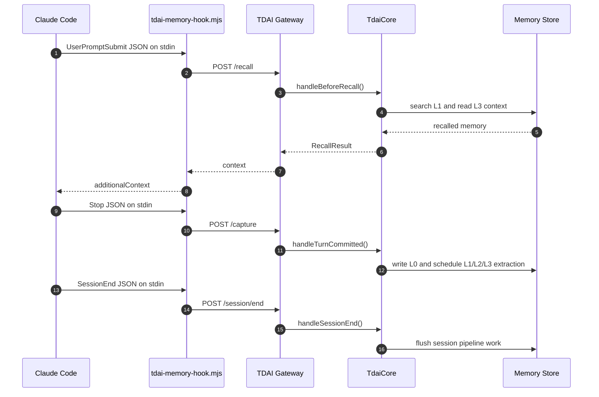

# Claude Code Adapter

This adapter connects Claude Code hooks to the existing TencentDB Agent Memory
Gateway. It implements a basic memory read/write loop without changing
`TdaiCore`:

- `UserPromptSubmit` calls `POST /recall` and returns recalled memory through
  Claude Code hook `additionalContext`.
- `Stop` calls `POST /capture` with the last user prompt and assistant message.
- `SessionEnd` calls `POST /session/end` to flush the current session.

## Prerequisites

- Node.js 22 or newer.
- A running TDAI Gateway, for example:

```bash
pnpm exec tsx src/gateway/server.ts
```

Configure the Gateway with the same environment variables used by the Hermes
sidecar, such as `TDAI_DATA_DIR`, `TDAI_LLM_BASE_URL`, `TDAI_LLM_API_KEY`,
`TDAI_LLM_MODEL`, and optionally `TDAI_GATEWAY_API_KEY`.

## Claude Code Hook Configuration

Copy the hooks from `settings.example.json` into your Claude Code
`settings.json`, then replace the command path with the absolute path to this
repository.

```json
{
  "hooks": {
    "UserPromptSubmit": [
      {
        "hooks": [
          {
            "type": "command",
            "command": "node /absolute/path/to/TencentDB-Agent-Memory/claude-code-adapter/tdai-memory-hook.mjs",
            "timeout": 10
          }
        ]
      }
    ],
    "Stop": [
      {
        "hooks": [
          {
            "type": "command",
            "command": "node /absolute/path/to/TencentDB-Agent-Memory/claude-code-adapter/tdai-memory-hook.mjs",
            "timeout": 10
          }
        ]
      }
    ],
    "SessionEnd": [
      {
        "hooks": [
          {
            "type": "command",
            "command": "node /absolute/path/to/TencentDB-Agent-Memory/claude-code-adapter/tdai-memory-hook.mjs",
            "timeout": 5
          }
        ]
      }
    ]
  }
}
```

## Environment Variables

| Variable | Default | Description |
| --- | --- | --- |
| `TDAI_GATEWAY_URL` | `http://127.0.0.1:8420` | TDAI Gateway base URL. |
| `TDAI_GATEWAY_API_KEY` | unset | Optional Bearer token for Gateway auth. |
| `TDAI_CLAUDE_CODE_USER_ID` | OS user | User ID sent to the Gateway. |
| `TDAI_CLAUDE_CODE_STATE_DIR` | `~/.memory-tencentdb/claude-code` | Local state directory used to pair prompts with assistant replies. |
| `TDAI_CLAUDE_CODE_TIMEOUT_MS` | `10000` | Gateway request timeout. |
| `TDAI_CLAUDE_CODE_DEBUG` | unset | Set to `1` for debug logs on stderr. |

`MEMORY_TENCENTDB_GATEWAY_URL` and `MEMORY_TENCENTDB_GATEWAY_API_KEY` are also
accepted as fallback names.

## Data Flow



Gateway failures are non-fatal. The hook logs warnings to stderr, exits with
code 0, and lets Claude Code continue without memory context.
