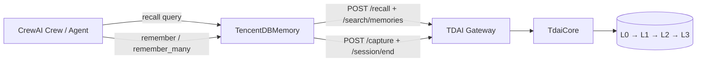

# TencentDB Agent Memory for CrewAI

This adapter connects CrewAI's native unified `Memory` lifecycle to the
TencentDB Agent Memory Gateway. CrewAI can recall long-term context before an
agent runs and persist extracted durable insights after a run without starting
CrewAI's default LanceDB or embedding stack.

## Architecture



The adapter subclasses CrewAI 1.15's public `Memory` model, so it participates
in the normal agent and crew lifecycle. It stays at the existing Gateway
boundary: storage, extraction, ranking, and persona generation remain inside
`TdaiCore`.

## Install and use

Start the Gateway, then install the shared client and adapter:

```bash
pip install -e ./python-gateway-sdk -e ./crewai-plugin
```

```python
from crewai import Agent, Crew, Task
from memory_tencentdb_crewai import TencentDBMemory

memory = TencentDBMemory(
    session_key="crewai:research-team:alice",
    user_id="alice",
    gateway_url="http://127.0.0.1:8420",
)

researcher = Agent(
    role="Researcher",
    goal="Produce a concise technical answer",
    backstory="An evidence-driven software researcher",
)
task = Task(
    description="Compare two memory architectures",
    expected_output="A concise comparison",
    agent=researcher,
)
crew = Crew(agents=[researcher], tasks=[task], memory=memory)

try:
    result = crew.kickoff()
finally:
    memory.close()
```

`strict=False` is the default: a down memory sidecar degrades to empty recall
and does not stop the crew. Set `strict=True` in tests or controlled jobs when a
memory failure should fail the run.

## Lifecycle mapping

| CrewAI operation | Gateway route | Behavior |
| --- | --- | --- |
| `Memory.recall()` | `/recall` + `/search/memories` | Returns native CrewAI `MemoryMatch` objects |
| `Memory.remember()` | `/capture` | Synchronously persists one extracted insight |
| `Memory.remember_many()` | `/capture` | Batches extracted insights on a background writer |
| `Memory.close()` | `/session/end` | Drains writes, then flushes the session pipeline |

## Identity and safety

- Use a stable, namespaced `session_key` such as
  `crewai:<crew-name>:<user-id>`. The Gateway currently scopes retrieval by
  `session_key`; `user_id` is provenance, not a tenant authorization boundary.
- The API key is sent only in the `Authorization` header. Credentials embedded
  in the Gateway URL are rejected.
- `reset()` deliberately does not delete remote data. Run an explicit Gateway
  data-management workflow when destructive cleanup is intended.
- Gateway recall and search responses are formatted text on the current public
  API, so each response block becomes one CrewAI `MemoryMatch`. Record-level
  scores cannot be reconstructed until structured search items are exposed.

## Test

```bash
python -m unittest discover -s crewai-plugin/tests -t crewai-plugin -v
```

The tests use an in-process fake Gateway and cover native `Crew(memory=...)`
validation, lifecycle mapping, Bearer auth, background capture, fail-open mode,
strict mode, and typed HTTP failures.
