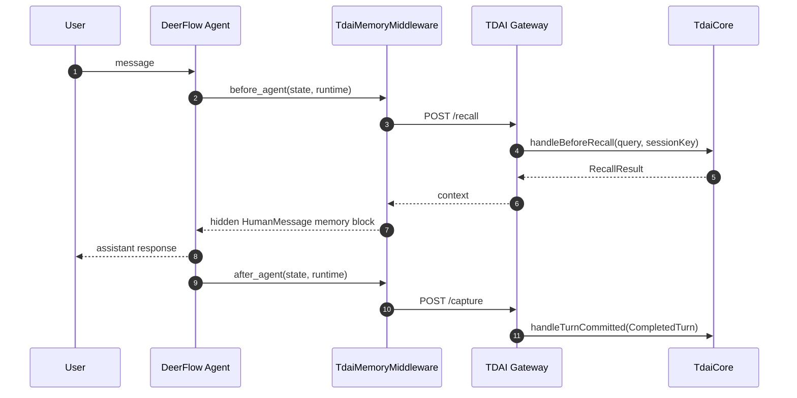

# DeerFlow Adapter

This adapter connects DeerFlow to the existing TencentDB Agent Memory Gateway.
It keeps DeerFlow changes out of the DeerFlow repository and provides two
integration styles:

- `TdaiMemoryMiddleware`: preferred turn-level integration for
  `DeerFlowClient(middlewares=[...])`. It calls `/recall` before an agent turn
  and `/capture` after the final assistant response.
- `TdaiMemoryStorage`: optional DeerFlow `memory.storage_class` implementation
  for deployments that want to plug into DeerFlow's native memory storage
  configuration.

## Prerequisites

- Python 3.12+ with DeerFlow installed or a local DeerFlow checkout.
- A running TencentDB Agent Memory Gateway, for example:

```bash
pnpm exec tsx src/gateway/server.ts
```

## Environment Variables

| Variable | Default | Description |
| --- | --- | --- |
| `TDAI_GATEWAY_URL` | `http://127.0.0.1:8420` | Gateway base URL. |
| `TDAI_GATEWAY_API_KEY` | unset | Optional Bearer token for Gateway auth. |
| `TDAI_DEER_FLOW_TIMEOUT_SECONDS` | `10` | Gateway request timeout. |
| `TDAI_DEER_FLOW_SESSION_PREFIX` | `deer-flow` | Prefix for turn-level session keys. |
| `TDAI_DEER_FLOW_USER_ID` | OS user | Fallback user ID when DeerFlow context has none. |

`MEMORY_TENCENTDB_GATEWAY_URL` and `MEMORY_TENCENTDB_GATEWAY_API_KEY` are also
accepted as fallback names.

## Middleware Integration

Add this repository's adapter directory and DeerFlow's harness package to
`PYTHONPATH`, then pass the middleware into `DeerFlowClient`:

```python
from deerflow.client import DeerFlowClient
from tdai_deerflow_adapter import TdaiMemoryMiddleware

client = DeerFlowClient(
    middlewares=[TdaiMemoryMiddleware()],
)

response = client.chat("What did we decide last time?", thread_id="demo-thread")
print(response)
```

Data flow:



Gateway failures are non-fatal. The middleware logs a warning and lets DeerFlow
continue without memory context.

## Storage Integration

For DeerFlow native memory configuration, set:

```yaml
memory:
  storage_class: tdai_deerflow_adapter.storage.TdaiMemoryStorage
```

Use this mode when you want DeerFlow's `DynamicContextMiddleware` and memory
management APIs to read/write through TencentDB Agent Memory. For exact
conversation-turn capture, the middleware integration is more precise because
it receives the original user and assistant messages.
