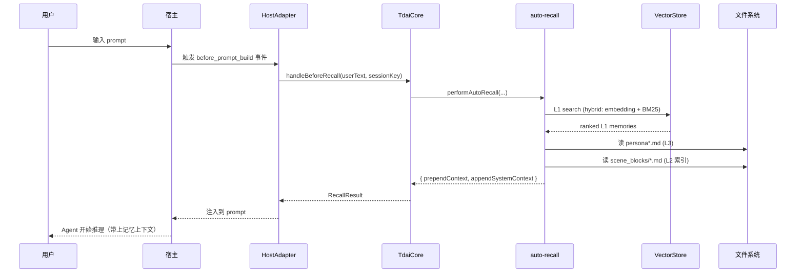
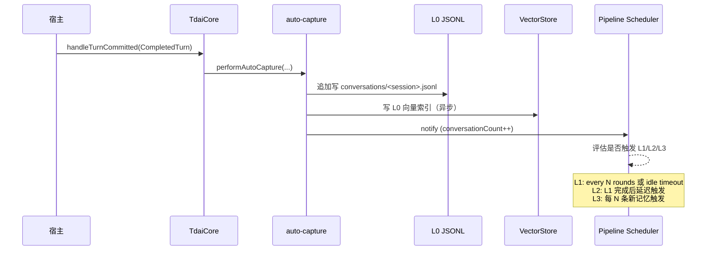
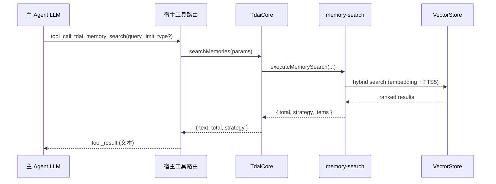
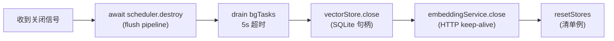

# TencentDB-Agent-Memory 架构与数据流

> 这份文档面向**新接入者**——不管是想接一个新 Agent 平台、做二次开发，还是排查跨平台数据问题。看完应该能回答：
>
> - TdaiCore 暴露了哪些能力？数据从哪进、从哪出？
> - 现有适配器（OpenClaw / Hermes / standalone Gateway）各自落在哪一层？
> - 我想接新平台时，应该往哪一层塞代码？

---

## 1. 系统总览

```mermaid
flowchart TB
    subgraph Hosts["宿主层（已有的 + 待接的）"]
        OC["OpenClaw 宿主<br/>(in-process TS)"]
        HP["Hermes Agent<br/>(Python)"]
        GW["standalone Gateway<br/>(HTTP sidecar)"]
        MCP["MCP 客户端<br/>(Claude Code / Codex / Cursor)"]
    end

    subgraph Adapters["适配层 src/adapters/"]
        OCA["OpenClawHostAdapter"]
        STA["StandaloneHostAdapter"]
    end

    subgraph Core["核心引擎 src/core/"]
        TC["TdaiCore<br/>host-neutral facade"]
        AR["auto-recall hook"]
        AC["auto-capture hook"]
        MS["memory-search tool"]
        CS["conversation-search tool"]
        SCH["Pipeline scheduler<br/>L1/L2/L3"]
    end

    subgraph Store["存储层 src/core/store/"]
        VSS["VectorStore<br/>sqlite-vec | tcvdb"]
        EMB["EmbeddingService<br/>(可选)"]
        BM25["BM25 FTS5 (local)"]
    end

    subgraph FS["文件系统（共享 dataDir）"]
        L0[("conversations/*.jsonl<br/>L0 原始对话")]
        L1[("records/*.jsonl<br/>L1 原子记忆")]
        L2[("scene_blocks/*.md<br/>L2 场景块")]
        L3[("persona*.md<br/>L3 用户画像")]
        VDB[("vectors.db<br/>sqlite-vec 索引")]
    end

    OC -->|registerTool / api.on| OCA
    HP -->|HTTP /recall /capture| GW
    GW --> STA
    MCP -.->|待接：MCP server<br/>(进阶档)| STA

    OCA --> TC
    STA --> TC

    TC --> AR
    TC --> AC
    TC --> MS
    TC --> CS
    TC --> SCH

    AR --> VSS
    AR --> EMB
    AR --> BM25
    AC --> VSS
    AC --> EMB
    MS --> VSS
    MS --> BM25
    CS --> VSS

    SCH --> L1
    SCH --> L2
    SCH --> L3

    VSS --> VDB
    AC --> L0
    SCH --> L0
    AR --> L3
    AR --> L2
```

**三个关键分层：**

1. **宿主层** — 真正跑在用户机器上的 Agent 平台（OpenClaw / Hermes / Claude Code 等）。每个平台有自己的事件系统、工具注册机制、生命周期概念。
2. **适配层** ([src/adapters/](../src/adapters/)) — 把宿主特定的 API 翻译成 `HostAdapter` 接口。**这是新平台接入要写的全部代码。**
3. **核心引擎** ([src/core/](../src/core/)) — 完全宿主无关的记忆算法。recall / capture / search / L1/L2/L3 pipeline 全在这里。

---

## 2. 数据流：召回（Recall）

触发时机：用户提交 prompt、Agent 还没开始推理之前。



### OpenClaw 路径（in-process）

| 步骤 | 文件:行号 | 说明 |
|------|-----------|------|
| 触发 | [index.ts:529](../index.ts#L529) | `api.on("before_prompt_build", ...)` |
| 缓存原始 prompt | [index.ts:545](../index.ts#L545) | `pendingOriginalPrompts.set(sessionKey, ...)` 给 agent_end 用 |
| 调 Core | [index.ts:567](../index.ts#L567) | `core.handleBeforeRecall(userText, sessionKey)` |
| 执行召回 | [src/core/tdai-core.ts:244](../src/core/tdai-core.ts#L244) | `performAutoRecall(...)` |
| 搜索策略 | [src/core/hooks/auto-recall.ts:1-11](../src/core/hooks/auto-recall.ts#L1-L11) | keyword / embedding / hybrid（默认 hybrid） |
| 超时保护 | cfg.recall.timeoutMs（默认 5000ms） | 超时跳过召回，不阻塞 Agent |

### Hermes 路径（HTTP sidecar）

| 步骤 | 文件:行号 | 说明 |
|------|-----------|------|
| 触发 | [hermes-plugin/.../__init__.py](../hermes-plugin/memory/memory_tencentdb/__init__.py) 的 `prefetch()` | Hermes Agent 主循环在 prompt 提交前调用 |
| HTTP 调用 | `client.recall(query, session_key)` | POST /recall |
| Gateway 入口 | [src/gateway/server.ts:6](../src/gateway/server.ts#L6) | HTTP handler 路由 |
| 进入 Core | 同 OpenClaw 路径 | 同一个 `handleBeforeRecall` |

**进程边界：** OpenClaw 单进程；Hermes 是 Python ↔ HTTP ↔ Node Gateway 三跳。序列化点：HTTP body JSON。

**降级：** Gateway 不可达时，Hermes Provider 通过熔断器 ([hermes-plugin/.../__init__.py:427](../hermes-plugin/memory/memory_tencentdb/__init__.py#L427)) 短路返回空串；OpenClaw 在 try/catch 里静默跳过 ([index.ts:598](../index.ts#L598))。

---

## 3. 数据流：捕获（Capture）

触发时机：Agent 一轮对话结束（生成完回复）。



### OpenClaw 路径

| 步骤 | 文件:行号 | 说明 |
|------|-----------|------|
| 触发 | [index.ts:656](../index.ts#L656) | `api.on("agent_end", ...)` |
| 取缓存 prompt | [index.ts:692](../index.ts#L692) | `pendingOriginalPrompts.get(sessionKey)` |
| 调 Core | [index.ts:703](../index.ts#L703) | `core.handleTurnCommitted({...})` |
| L0 写入 | [src/core/hooks/auto-capture.ts:17](../src/core/hooks/auto-capture.ts#L17) | `recordConversation()` 追加 JSONL |
| L0 向量索引 | 同文件 | `vectorStore.insertL0()`（异步，注册到 `bgTasks`） |
| 通知 pipeline | 同文件 | `scheduler.notifyConversation(sessionKey)` |

### Hermes 路径

| 步骤 | 文件:行号 | 说明 |
|------|-----------|------|
| 触发 | Hermes Provider 的 `sync_turn(user_content, assistant_content)` | Agent 一轮结束后调用 |
| 异步线程 | [hermes-plugin/.../__init__.py:865](../hermes-plugin/memory/memory_tencentdb/__init__.py#L865) | `_sync()` 后台线程发 HTTP |
| HTTP 调用 | `client.capture(...)` | POST /capture |
| Gateway 入口 | [src/gateway/server.ts:7](../src/gateway/server.ts#L7) | 路由到 `core.handleTurnCommitted` |

**异步任务边界：**

- OpenClaw：`bgTasks` Set，`destroy()` 时 await + 5s 超时（[src/core/tdai-core.ts:188](../src/core/tdai-core.ts#L188)）
- Hermes：后台 daemon 线程池，最多 `_MAX_INFLIGHT_SYNCS=4` 并发，`shutdown()` 顺序 join（[hermes-plugin/.../__init__.py:937](../hermes-plugin/memory/memory_tencentdb/__init__.py#L937)）

---

## 4. 数据流：搜索（Search 工具）

跟召回不同——搜索是 **Agent 主动调**的工具，返回值直接给 LLM 推理用。



| 工具 | 入口 | 实际调用 |
|------|------|----------|
| `tdai_memory_search` | [index.ts:352](../index.ts#L352)（OpenClaw 注册） | `core.searchMemories()` → L1 records |
| `tdai_conversation_search` | [index.ts:439](../index.ts#L439)（OpenClaw 注册） | `core.searchConversations()` → L0 raw messages |
| Hermes 同名工具 | Provider `handle_tool_call` | POST /search/memories, /search/conversations |

**L0 vs L1 差异：**

| 层 | 内容 | 何时生成 | 搜索方式 |
|----|------|----------|----------|
| L0 conversations | 原始消息文本（user/assistant/tool） | capture 即写 | 向量 + 关键词 |
| L1 records | 抽取后的原子记忆（偏好/事件/规则） | pipeline 触发 L1 后写 | 向量 + FTS5 |
| L2 scene_blocks | 多条 L1 聚合的场景块 | L1 之后延迟触发 | 文件读取（按 scene 名） |
| L3 persona | 用户画像 Markdown | 每 N 条新记忆触发 | 整文件读取注入 system prompt |

**调用次数限制：** `tdai_memory_search` + `tdai_conversation_search` 共享 3 次/轮上限（[index.ts:358](../index.ts#L358) 工具描述里告知 LLM；TODO: 硬限制尚未实现）。

---

## 5. 数据流：关闭（Shutdown）

TdaiCore 销毁顺序很重要——错序会导致 SQLite 句柄提前关、后台写任务崩。



| 步骤 | 文件:行号 | 说明 |
|------|-----------|------|
| 触发（OpenClaw） | [index.ts:760](../index.ts#L760) | `api.on("gateway_stop", ...)` |
| 触发（Hermes） | Provider `shutdown()` | Hermes 主进程退出时 |
| 触发（Gateway） | server.ts SIGINT/SIGTERM | 进程信号 |
| 总入口 | [src/core/tdai-core.ts:169](../src/core/tdai-core.ts#L169) | `core.destroy()` |
| scheduler flush | 同上 | `await scheduler.destroy()` |
| bgTasks drain | [src/core/tdai-core.ts:188-215](../src/core/tdai-core.ts#L188-L215) | 5s 超时保护 |
| VectorStore close | [src/core/tdai-core.ts:217](../src/core/tdai-core.ts#L217) | SQLite 句柄关 |
| EmbeddingService close | [src/core/tdai-core.ts:223](../src/core/tdai-core.ts#L223) | keep-alive HTTP 关 |

**关键不变量：** `bgTasks` drain **必须早于** VectorStore close，否则后台 `updateL0Embedding` 会踩到已关的 SQLite 句柄。

---

## 6. 存储层映射

所有适配器共享同一个 `dataDir`，目录结构由 [src/utils/pipeline-factory.ts:101](../src/utils/pipeline-factory.ts#L101) 的 `initDataDirectories()` 创建：

```text
<dataDir>/                              # 默认 ~/.memory-tencentdb/memory-tdai
├── conversations/                      # L0
│   └── <sessionKey>.jsonl              # 每会话一个 JSONL，按消息顺序追加
├── records/                            # L1
│   └── <sessionKey>.jsonl              # 抽取后的原子记忆
├── scene_blocks/                       # L2
│   └── <sceneName>.md                  # 场景块 Markdown
├── persona.md                          # L3 当前画像
├── persona.backup-<n>.md               # L3 历史 backup
├── vectors.db                          # sqlite-vec 索引（storeBackend=sqlite）
├── .metadata/
│   ├── checkpoint.json                 # pipeline 调度状态
│   └── instance-id.txt                 # 实例 ID（metric 上报用）
└── .backup/                            # L2/L3 backup
```

**跨进程共享：**

- OpenClaw、standalone Gateway、未来的 MCP server 可以**指向同一个 `dataDir`**
- SQLite 后端用 WAL 模式，支持并发读 + 单写
- 切换平台不影响数据——schema 一致
- 但**同一时刻只能有一个进程写入**（SQLite 文件锁）；多平台同时跑需用 tcvdb 后端或不同的 dataDir

`★ Insight ─────────────────────────────────────`

数据共享是测试新适配器的捷径：先用 OpenClaw 跑对话灌数据，再用新适配器指向同一 `dataDir` 验证读取。不需要写复杂的初始化逻辑。

`─────────────────────────────────────────────────`

---

## 7. 生命周期事件映射表

这张表是**新接入者的核心参考**——它告诉你在宿主的哪个事件里、调 TdaiCore 的哪个方法。

| TdaiCore 方法 | OpenClaw 钩子 | Hermes Provider 方法 | HTTP 端点（Gateway） | 触发时机 |
|---|---|---|---|---|
| `handleBeforeRecall` | `before_prompt_build` | `prefetch()` | POST /recall | 用户提交 prompt 后、Agent 推理前 |
| `handleTurnCommitted` | `agent_end` | `sync_turn()` | POST /capture | Agent 一轮对话结束 |
| `searchMemories` | 工具注册（`api.registerTool`） | `handle_tool_call` | POST /search/memories | LLM 主动调工具 |
| `searchConversations` | 工具注册 | `handle_tool_call` | POST /search/conversations | LLM 主动调工具 |
| `handleSessionEnd` | （未接） | `on_session_end` | POST /session/end | 会话结束（flush 单 session 缓冲） |
| `destroy` | `gateway_stop` | `shutdown()` | （进程退出） | 进程关闭 |

---

## 8. 每个适配器的"五种责任"清单

`HostAdapter` 契约（[src/core/types.ts:154](../src/core/types.ts#L154)）要求每个适配器提供：

| 责任 | OpenClaw 实现 | Standalone 实现 | 数据来源 |
|---|---|---|---|
| **RuntimeContext**（who/where） | `OpenClawHostAdapter.getRuntimeContext()` | `StandaloneHostAdapter.getRuntimeContext()` | userId / sessionKey / dataDir / platform |
| **Logger** | `api.logger`（OpenClaw 自带） | `createConsoleLogger()`（Gateway 自建） | 宿主提供或自建 |
| **LLMRunnerFactory** | `OpenClawLLMRunnerFactory`（包 `CleanContextRunner`，走 OpenClaw 内嵌 agent） | `StandaloneLLMRunnerFactory`（走 OpenAI 兼容 HTTP） | 宿主原生 LLM 调用机制 |
| **hostType 字段** | `"openclaw"` | `"standalone"` | 影响 Core 内部 LLM runner 选择（[tdai-core.ts:425](../src/core/tdai-core.ts#L425)） |
| **工具注册** | `api.registerTool(...)` 在 [index.ts:352](../index.ts#L352) | Gateway HTTP `/search/*` 端点 | 宿主的工具暴露机制 |
| **生命周期事件** | `api.on("before_prompt_build" / "agent_end" / "gateway_stop")` | Gateway HTTP `/recall` `/capture` 端点 | 宿主的事件系统 |

**新增适配器要回答的 5 个问题：**

1. 我从哪里拿 userId / sessionKey / dataDir？（→ RuntimeContext）
2. 我用什么打日志？（→ Logger）
3. 我怎么调 LLM？（→ LLMRunnerFactory）
4. 宿主的什么事件对应 before_prompt / after_turn / shutdown？（→ 生命周期接线）
5. 宿主怎么暴露工具？（→ 工具注册）

回答完这 5 个问题，适配器就写完了。

---

## 9. 我应该在哪一层写代码？

```mermaid
flowchart TD
    Q1{新平台是 TS/JS 宿主<br/>且有原生插件 API?}
    Q1 -- 是 --> QA[模式 A：写 HostAdapter 子类<br/>参考 src/adapters/openclaw/]
    Q1 -- 否 --> Q2{新平台讲 MCP 协议?<br/>(Claude Code, Codex, Cursor)}
    Q2 -- 是 --> QB[模式 C：写 MCP server<br/>参考 src/adapters/mcp/<br/>(进阶档交付)]
    Q2 -- 否 --> QC[模式 B：HTTP sidecar<br/>Python / Go / Rust 客户端<br/>参考 hermes-plugin/]

    QA --> Done[共用同一个 TdaiCore]
    QB --> Done
    QC --> Done
```

不管选哪条路，**核心引擎代码一行都不用改**——这是分层架构的全部价值。
