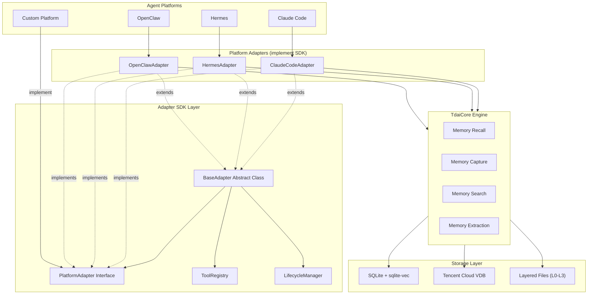
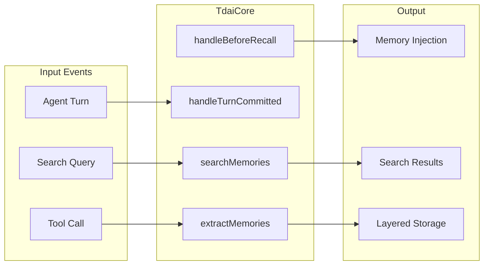
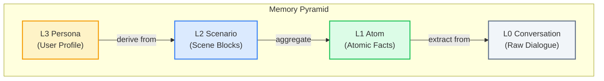
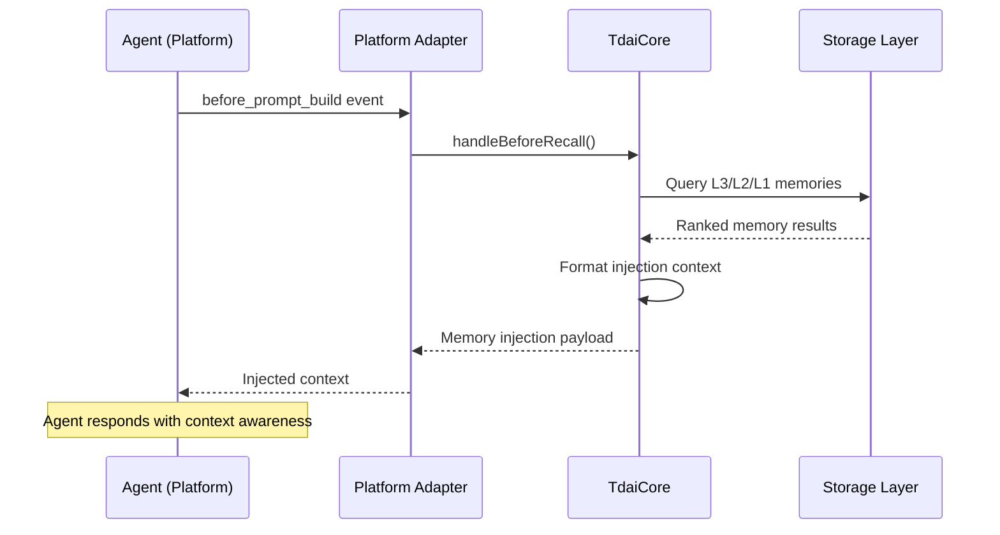
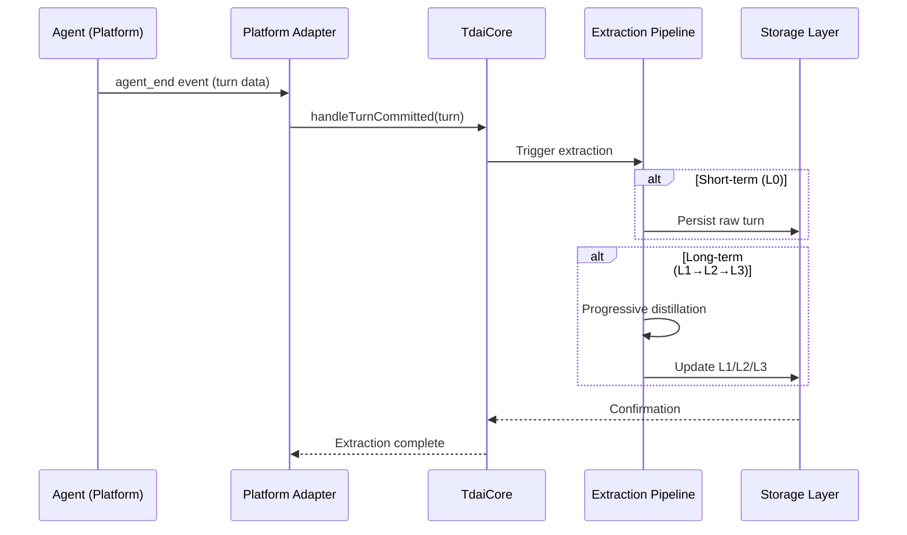
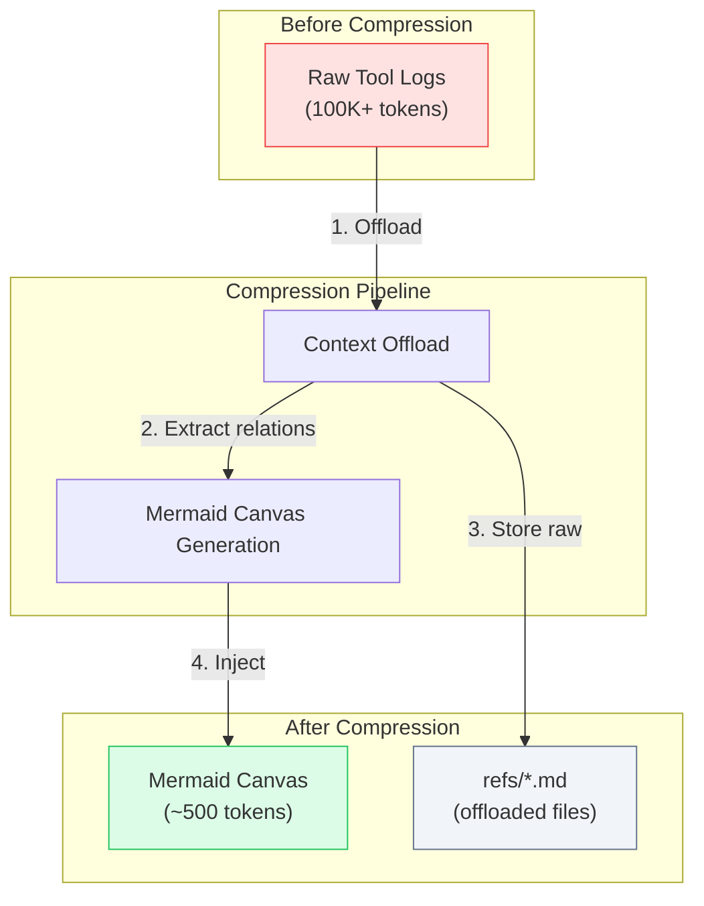

# TencentDB Agent Memory Architecture

> Cross-Platform Adapter SDK Architecture and Design

---

## Table of Contents

- [Overview](#overview)
- [System Architecture](#system-architecture)
- [Core Components](#core-components)
- [Platform Adapter SDK](#platform-adapter-sdk)
- [Data Flow](#data-flow)
- [Platform Implementations](#platform-implementations)

---

## Overview

TencentDB Agent Memory provides a **layered memory system** for AI agents, supporting multiple platform integrations through a unified **Adapter SDK**. This architecture enables seamless onboarding of new platforms with minimal code changes.

**Key Design Goals:**
1. **Platform Agnostic** — Any agent platform can integrate by implementing the `PlatformAdapter` interface
2. **Layered Memory** — L0→L1→L2→L3 semantic pyramid for progressive memory abstraction
3. **Symbolic Short-term** — Mermaid canvas for context compression with full traceability

---

## System Architecture



### Architecture Layers

| Layer | Description | Components |
|-------|-------------|------------|
| **Platform** | Agent hosting environments | OpenClaw, Hermes, Claude Code, Custom |
| **Adapter SDK** | Unified integration interface | `PlatformAdapter`, `BaseAdapter`, `ToolRegistry`, `LifecycleManager` |
| **TdaiCore** | Core memory engine | Recall, Capture, Search, Extraction |
| **Storage** | Persistence backends | SQLite, Tencent Cloud VDB, Layered Files |

---

## Core Components

### 1. TdaiCore Engine

The central memory processing engine that handles:



**Core Methods:**
| Method | Description | Trigger |
|--------|-------------|---------|
| `handleBeforeRecall()` | Inject relevant memories before agent responds | `before_model` / `before_prompt_build` |
| `handleTurnCommitted()` | Capture and process agent turn | `agent_end` / `after_model` |
| `searchMemories()` | Full-text and semantic search | On-demand tool call |
| `extractMemories()` | Progressive extraction L0→L1→L2→L3 | Periodic / threshold-based |

### 2. Memory Layering



| Layer | Content | Format | Purpose |
|-------|---------|--------|---------|
| **L0** | Raw dialogue | Markdown | Evidence preservation |
| **L1** | Atomic facts | JSON | Semantic retrieval |
| **L2** | Scene blocks | Markdown | Contextual coherence |
| **L3** | User persona | Markdown | Personalization |

---

## Platform Adapter SDK

### SDK Design Philosophy

The SDK follows the **Adapter Pattern** to provide a unified interface while allowing platform-specific implementations:

```
┌─────────────────────────────────────────────────────────────────┐
│                    PlatformAdapter Interface                      │
│  (Contract: implement this to add a new platform)                │
├─────────────────────────────────────────────────────────────────┤
│  + platform: PlatformInfo           // Platform metadata        │
│  + getRuntimeContext(): Context     // Runtime environment      │
│  + createLLMRunnerFactory(): Factory // LLM integration          │
│  + registerHooks(core): void        // Event lifecycle hooks     │
│  + registerTools(core, reg): void   // Agent tool registration   │
│  + initialize(): Promise<void>      // Async setup               │
│  + shutdown(): Promise<void>         // Cleanup                   │
└─────────────────────────────────────────────────────────────────┘
                              ▲
                              │ implements
         ┌────────────────────┼────────────────────┐
         │                    │                    │
   ┌─────┴─────┐      ┌──────┴─────┐      ┌──────┴─────┐
   │OpenClaw   │      │  Hermes    │      │Claude Code │
   │Adapter    │      │  Adapter   │      │  Adapter   │
   └───────────┘      └────────────┘      └────────────┘
```

### Directory Structure

```
src/adapters/
├── sdk/                    # The unified Adapter SDK
│   ├── index.ts           # SDK exports
│   ├── interface.ts       # PlatformAdapter interface
│   ├── types.ts           # Type definitions
│   ├── base-adapter.ts    # BaseAdapter abstract class
│   ├── tool-registry.ts   # Tool registration utility
│   └── lifecycle-manager.ts # Lifecycle utilities
│
├── openclaw/              # OpenClaw adapter implementation
│   └── index.ts
│
├── hermes/                # Hermes adapter implementation
│   └── index.ts
│
└── claude-code/           # Claude Code adapter (planned)
    └── index.ts
```

### Interface Definition

```typescript
/**
 * Unified Platform Adapter Interface
 * 
 * Implement this interface to add support for a new agent platform.
 * The SDK provides BaseAdapter for common functionality.
 */
export interface PlatformAdapter {
  /** Platform metadata */
  readonly platform: PlatformInfo;

  /** Get runtime environment context */
  getRuntimeContext(): RuntimeContext;

  /** Create LLM runner factory for this platform */
  createLLMRunnerFactory(): LLMRunnerFactory;

  /** Register event lifecycle hooks */
  registerHooks(core: TdaiCore): void;

  /** Register agent tools via registry */
  registerTools(core: TdaiCore, registry: ToolRegistry): void;

  /** Initialize adapter resources */
  initialize(): MaybePromise<void>;

  /** Cleanup adapter resources */
  shutdown(): MaybePromise<void>;
}

/**
 * Platform capability descriptor
 */
export interface PlatformInfo {
  readonly name: string;           // Platform identifier
  readonly version: string;         // Adapter version
  readonly description: string;     // Human-readable description
  readonly capabilities: Capability[];
}

/**
 * Supported memory capabilities
 */
export type Capability =
  | 'memory-recall'        // Pre-turn memory injection
  | 'memory-capture'       // Turn capture and processing
  | 'memory-search'        // On-demand semantic search
  | 'conversation-search'  // Historical conversation search
  | 'session-management';  // Session lifecycle
```

### BaseAdapter Abstract Class

```typescript
/**
 * Base adapter providing common functionality
 * 
 * Extend this class to implement a new platform adapter.
 * Override only the methods that differ from the platform.
 */
export abstract class BaseAdapter implements PlatformAdapter {
  abstract readonly platform: PlatformInfo;

  constructor(protected config: MemoryTdaiConfig) {}

  /** Default hook registration - captures turns and triggers recall */
  registerHooks(core: TdaiCore): void {
    core.on('beforePromptBuild', async () => {
      await core.handleBeforeRecall();
    });
    core.on('agentEnd', async (turn) => {
      await core.handleTurnCommitted(turn);
    });
  }

  /** Default tool registration - memory search tools */
  registerTools(core: TdaiCore, registry: ToolRegistry): void {
    registry.register('tdai_memory_search', async (params) => {
      return core.searchMemories(params);
    });
    registry.register('tdai_conversation_search', async (params) => {
      return core.searchConversations(params);
    });
  }

  // Abstract methods to implement:
  abstract getRuntimeContext(): RuntimeContext;
  abstract createLLMRunnerFactory(): LLMRunnerFactory;
  abstract initialize(): MaybePromise<void>;
  abstract shutdown(): MaybePromise<void>;
}
```

---

## Data Flow

### Memory Recall Flow



### Memory Capture Flow



### Symbolic Short-term Compression Flow



---

## Platform Implementations

### OpenClaw Adapter

| Aspect | Implementation |
|--------|---------------|
| **Event System** | OpenClaw plugin hooks (`before_prompt_build`, `agent_end`) |
| **LLM Integration** | OpenClaw built-in model |
| **Data Directory** | `~/.openclaw/memory-tdai/` |
| **Tool Registration** | OpenClaw tool API |

### Hermes Adapter

| Aspect | Implementation |
|--------|---------------|
| **Event System** | Hermes Gateway HTTP callbacks |
| **LLM Integration** | Standalone LLM (via env config) |
| **Data Directory** | `~/.hermes/memory-tdai/` |
| **Tool Registration** | Hermes Python tool decorator |

### Claude Code Adapter (Planned)

| Aspect | Implementation |
|--------|---------------|
| **Event System** | Claude Code CLI hooks |
| **LLM Integration** | Claude API |
| **Data Directory** | `~/.claude/memory-tdai/` |
| **Tool Registration** | Claude Code tool format |

---

## Extension Guide

### Adding a New Platform

1. **Create adapter directory**: `src/adapters/<platform>/`
2. **Extend BaseAdapter**: Inherit common functionality
3. **Implement PlatformAdapter**: Fulfill the interface contract
4. **Register hooks**: Map platform events to TdaiCore methods
5. **Test integration**: Verify memory capture and recall

See [ADAPTER_GUIDE.md](./ADAPTER_GUIDE.md) for detailed implementation steps.

---

## Related Documentation

- [Adapter Integration Guide](./ADAPTER_GUIDE.md)
- [Main README](../README.md)
- [Contributing Guide](../CONTRIBUTING.md)
