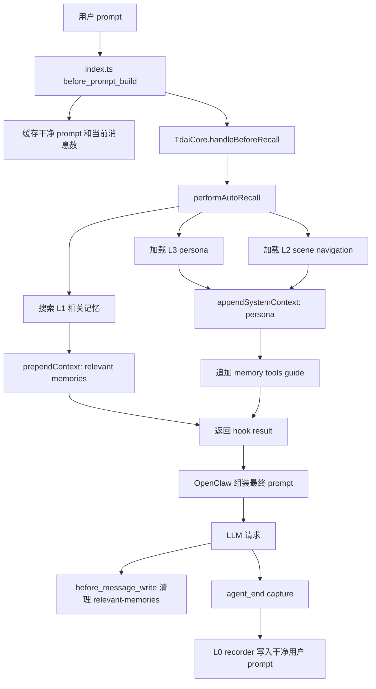

# Issue 120：memory 注入后的上下文结构

## 说明

本页记录当前实现中 memory 注入后的 prompt 结构，以及各段内容对 prompt cache 的影响。范围只到结构梳理，优化方案和实现后验证放在其他文档里。

相关代码入口：

- `index.ts:528`：注册 `before_prompt_build` hook。
- `index.ts:542`：注入前缓存原始用户 prompt。
- `index.ts:567`：调用 `core.handleBeforeRecall(...)`。
- `index.ts:587`：把 `appendSystemContext` / `prependContext` 返回给 OpenClaw。
- `index.ts:615`：注册 `before_message_write`，持久化前清理 `<relevant-memories>`。
- `src/core/tdai-core.ts:244`：把 host 侧 recall 请求转到 `performAutoRecall(...)`。
- `src/core/hooks/auto-recall.ts:186`：把召回结果拆成稳定区和动态区。
- `src/core/conversation/l0-recorder.ts:190`：L0 写入时用干净 prompt 覆盖被注入污染的用户消息。

Issue 里提到的 `composeSystemPromptWithHookContext`、`CACHE_BOUNDARY`、`prependSystemPromptAdditionAfterCacheBoundary` 不在本仓库，属于 OpenClaw host 侧逻辑。下面的结构图停在插件返回 hook result 这一层。

## 注入链路



## 当前轮 prompt 结构

插件返回后，当前轮模型看到的结构大致如下：

```text
[OpenClaw / agent config 原始 system prompt]
  - 基础系统指令
  - 工具策略和 host 侧系统内容
  - host 侧 cache boundary 处理（如果存在）

[memory-tencentdb appendSystemContext]
  <user-persona>
    L3 persona
  </user-persona>

  <scene-navigation>
    L2 scene navigation
  </scene-navigation>

  <memory-tools-guide>
    tdai_memory_search / tdai_conversation_search / read_file 使用说明
  </memory-tools-guide>

[历史消息]
  之前的 user / assistant / tool messages

[当前用户消息]
  <relevant-memories>
    针对当前用户 prompt 召回的 L1 记忆
  </relevant-memories>

  原始用户 prompt
```

## 对 prompt cache 的影响

| 段落 | 来源 | 稳定性 | 对 cache 的影响 |
| --- | --- | --- | --- |
| 基础 system prompt | OpenClaw / agent config | 同一 session 内通常稳定 | 适合作为缓存前缀。只要 host 侧位置不变，最容易复用。 |
| 工具 schema / host 策略 | OpenClaw host | 工具集不变时稳定 | 工具启停会改变前缀。 |
| L3 persona | `persona.md` | 低频变化 | 适合进入稳定区；persona 更新后会刷新后续缓存。 |
| L2 scene navigation | scene index | 低频变化 | scene index 不变时可复用；更新后会影响前缀。 |
| memory tools guide | 常量 | 稳定 | cache 友好。 |
| 历史消息 | OpenClaw session state | 每轮增长 | 如果历史只追加、不重写，provider 可以复用共同前缀。截断或重写会降低命中。 |
| 当前轮 L1 recall | `prependContext` | 每轮变化 | 不适合放进稳定前缀。写入历史会让后续上下文持续膨胀。 |
| 当前用户 prompt | `event.prompt` | 每轮变化 | 预期中的动态尾部。 |

## 持久化清理

当前实现依赖两处清理：

1. `before_message_write` 在 OpenClaw 写 session JSONL 前移除 `<relevant-memories>...</relevant-memories>`。
2. `agent_end` 把注入前缓存的干净 prompt 和原始消息数传给 L0 recorder，L0 写入时再用干净 prompt 替换被注入污染的用户消息。

结果是，当前轮模型可以读到 L1 recall，但这段 recall 默认不会进入后续历史。

## 结构结论

```text
cache 友好的稳定前缀
+-------------------------------------------------------------+
| host system prompt / tools / policies                       |
| stable memory additions: persona, scene navigation, guide   |
+-------------------------------------------------------------+
| 历史消息：只追加、不重写时可以复用共同前缀                  |
+-------------------------------------------------------------+
| 当前轮 <relevant-memories>                                  |
| 当前用户 prompt                                             |
+-------------------------------------------------------------+
动态尾部
```

后续改动建议守住这个边界：稳定内容尽量靠前，当前轮 recall 靠近用户 prompt，并且不要把 recall 原文写回未来历史。
