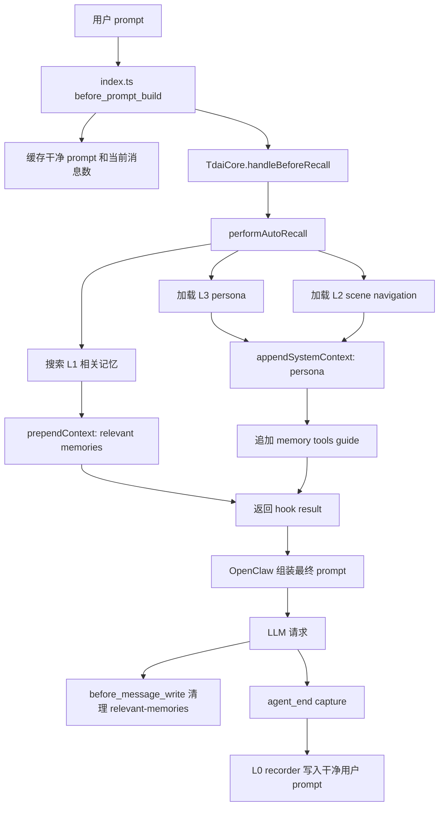

# Issue 120：memory 注入后的上下文结构

## 说明

本页记录当前实现中 memory 注入后的 prompt 结构，以及各段内容对 prompt cache 的影响。范围只到结构梳理，优化方案和实现后验证放在其他文档里。

相关代码入口：

- `index.ts:212`：解析稳定上下文落点（`resolveStableContextPlacement`）。
- `index.ts:562`：注册 `before_prompt_build` hook。
- `index.ts:600`：调用 `core.handleBeforeRecall(...)`。
- `index.ts:624`：`shapeOpenClawSystemContext` 决定稳定块走哪个 host 字段，再返回 hook result。
- `index.ts:670`：注册 `before_message_write`，持久化前清理注入块。
- `src/core/tdai-core.ts:247`：把 host 侧 recall 请求转到 `performAutoRecall(...)`。
- `src/core/hooks/auto-recall.ts:197`：调用 `buildStableSystemContext(...)` 组装稳定区，动态区单独构造。
- `src/core/hooks/stable-system-context.ts`：稳定区组装（纯函数，无 I/O）。
- `src/adapters/openclaw/system-context-placement.ts`：稳定区落点与宿主能力门控。

`composeSystemPromptWithHookContext`、`CACHE_BOUNDARY`、`prependSystemPromptAdditionAfterCacheBoundary` 的实现不在本仓库，属于 OpenClaw host 侧。插件能控制的是**把稳定内容交给哪个 hook 字段**：`appendSystemContext` 落在 boundary 之后，`prependSystemContext` 落在 boundary 之前。下面按这条边界区分修复前后。

## 注入链路


```mermaid
flowchart TD
  A[用户 prompt] --> B[index.ts before_prompt_build]
  B --> C[缓存干净 prompt 和当前消息数]
  B --> D[TdaiCore.handleBeforeRecall]
  D --> E[performAutoRecall]
  E --> F[搜索 L1 相关记忆]
  E --> G[加载 L3 persona]
  E --> H[加载 L2 scene navigation]
  F --> I[prependContext: relevant memories]
  G --> J[appendSystemContext: persona]
  H --> J
  J --> K[追加 memory tools guide]
  I --> L[返回 hook result]
  K --> L
  L --> M[OpenClaw 组装最终 prompt]
  M --> N[LLM 请求]
  N --> O[before_message_write 清理 relevant-memories]
  N --> P[agent_end capture]
  P --> Q[L0 recorder 写入干净用户 prompt]
```

## 当前轮 prompt 结构

### 修复前：稳定块落在 cache boundary 之后

```text
[OpenClaw / agent config system prompt]
  - 基础系统指令
  - 工具 schema 和 host 侧策略
─────────────── CACHE_BOUNDARY ───────────────   ← 可复用前缀到此为止
[memory-tencentdb appendSystemContext]           ← 稳定内容，却在边界之外
  <user-persona>        L3 persona
  <scene-navigation>    L2 scene navigation
  <memory-tools-guide>  记忆工具使用说明
                                                    约 4k 字符，逐字不变，
                                                    但每轮都按新 token 计费

[历史消息]
[当前用户消息]
  <relevant-memories>   本轮召回的 L1 记忆        ← 每轮变化，本就该在动态尾部
  原始用户 prompt
```

### 修复后：稳定块进入可复用前缀

```text
[memory-tencentdb prependSystemContext]          ← 稳定内容前置
  <user-persona>        L3 persona
  <scene-navigation>    L2 scene navigation
  <memory-tools-guide>  记忆工具使用说明

[OpenClaw / agent config system prompt]
  - 基础系统指令
  - 工具 schema 和 host 侧策略
─────────────── CACHE_BOUNDARY ───────────────   ← 可复用前缀扩大到包含稳定块

[历史消息]
[当前用户消息]
  <relevant-memories>   本轮召回的 L1 记忆
  <memory-reminders>    本 session 已注入过的记忆（压缩为短提醒）
  原始用户 prompt
```

宿主无法确认支持 `prependSystemContext` 时，稳定块仍通过 `appendSystemContext`
注入，即退回上面第一张图的位置。**两条路径都会注入稳定内容**：版本门控只影响
缓存复用，不会让 persona / 场景导航丢失。相关断言见
`src/adapters/openclaw/system-context-placement.test.ts` 中的
「carries the stable block exactly once」矩阵用例。

## 对 prompt cache 的影响

| 段落 | 来源 | 稳定性 | 对 cache 的影响 |
| --- | --- | --- | --- |
| 基础 system prompt | OpenClaw / agent config | 同一 session 内通常稳定 | 适合作为缓存前缀。只要 host 侧位置不变，最容易复用。 |
| 工具 schema / host 策略 | OpenClaw host | 工具集不变时稳定 | 工具启停会改变前缀。 |
| L3 persona | `persona.md` | 低频变化 | 修复前在 boundary 之后，每轮重新计费；修复后进入可复用前缀。persona 更新后会刷新后续缓存。 |
| L2 scene navigation | scene index | 低频变化 | 同上。scene index 不变时可复用；更新后会影响前缀。 |
| memory tools guide | 常量 | 完全稳定 | 修复前同样被排除在前缀外，是纯浪费；修复后可复用。 |
| 历史消息 | OpenClaw session state | 每轮增长 | 如果历史只追加、不重写，provider 可以复用共同前缀。截断或重写会降低命中。 |
| 当前轮 L1 recall | `prependContext` | 每轮变化 | 不适合放进稳定前缀。写入历史会让后续上下文持续膨胀。 |
| 当前用户 prompt | `event.prompt` | 每轮变化 | 预期中的动态尾部。 |

## 持久化清理

当前实现依赖两处清理：

1. `before_message_write` 在 OpenClaw 写 session JSONL 前移除 `<relevant-memories>...</relevant-memories>`。
2. `agent_end` 把注入前缓存的干净 prompt 和原始消息数传给 L0 recorder，L0 写入时再用干净 prompt 替换被注入污染的用户消息。

结果是，当前轮模型可以读到 L1 recall，但这段 recall 默认不会进入后续历史。

## 结构结论

```text
cache 友好的稳定前缀
+-------------------------------------------------------------+
| host system prompt / tools / policies                       |
| stable memory additions: persona, scene navigation, guide   |
+-------------------------------------------------------------+
| 历史消息：只追加、不重写时可以复用共同前缀                  |
+-------------------------------------------------------------+
| 当前轮 <relevant-memories>                                  |
| 当前用户 prompt                                             |
+-------------------------------------------------------------+
动态尾部
```

后续改动建议守住这个边界：稳定内容尽量靠前，当前轮 recall 靠近用户 prompt，并且不要把 recall 原文写回未来历史。

三条边界现在都有对应实现和测试：

| 边界要求 | 实现 | 测试 |
| --- | --- | --- |
| 稳定内容进入可复用前缀 | `recall.stableContextPlacement`（默认 `auto`） | `system-context-placement.test.ts` |
| 稳定内容逐轮字节不变 | `buildStableSystemContext` 纯函数 + 空白规范化 | `stable-system-context.test.ts` |
| recall 原文不进入未来历史 | `recall.showInjected`（默认 `false`）+ `before_message_write` 清理 | `recall-injection.test.ts` |
