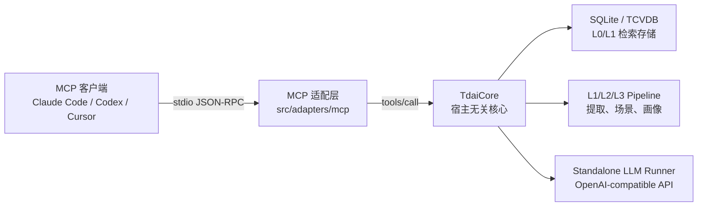

# MCP 适配层方案

本文档对应 issue #235「Cross-Platform Adapters for the Memory Plugin」中的跨平台适配要求，说明如何通过 MCP（Model Context Protocol）把 TencentDB Agent Memory 接入 Claude Code、Codex、Cursor 等支持 MCP 的 Agent 客户端。

MCP 官方规范将工具定义为可被模型发现和调用的能力，工具需要包含唯一名称、描述和 JSON Schema 输入结构；stdio 传输使用一行一个 JSON-RPC 消息的方式在客户端和服务端之间通信。基于这两个约束，本适配层把 `TdaiCore` 的核心记忆能力封装为 MCP tools。

参考资料：

- issue #235：`https://github.com/TencentCloud/TencentDB-Agent-Memory/issues/235`
- MCP Tools 规范：`https://modelcontextprotocol.io/specification/2026-07-28/server/tools`
- MCP stdio 传输规范：`https://modelcontextprotocol.io/specification/2026-07-28/basic/transports/stdio`

## 一、交付目标

本方案选择「MCP 兼容 Agent 客户端」作为新增适配平台，目标是让任意 MCP 客户端具备以下记忆读写能力：

- 对话前召回相关长期记忆。
- 对话后捕获本轮用户与助手内容。
- 搜索 L1 结构化记忆。
- 搜索 L0 原始对话。
- 在单个 session 结束时 flush 管线任务。

这满足 issue 的进阶验收标准：选择一个新平台编写适配代码，实现至少基本的记忆读写功能。

## 二、总体架构



设计边界：

- MCP 适配层只负责协议翻译，不重新实现记忆算法。
- `TdaiCore` 继续作为唯一核心入口，保证 OpenClaw、Hermes、MCP 三条接入路径行为一致。
- MCP 服务端使用 stderr 输出日志，stdout 只输出 JSON-RPC 消息，符合 stdio 传输要求。
- 配置复用 Gateway 配置加载逻辑，支持 `tdai-gateway.yaml/json` 和 `TDAI_*` 环境变量。

## 三、与已有适配层的对比

| 适配层 | 入口 | 运行方式 | 触发方式 | 主要能力 | 适用场景 |
|---|---|---|---|---|---|
| OpenClaw 插件 | `index.ts` | OpenClaw Gateway 进程内插件 | OpenClaw hooks + tools | 自动召回、自动捕获、工具搜索、offload | OpenClaw 原生使用 |
| Hermes Provider | `hermes-plugin/memory/memory_tencentdb` | Python provider + TDAI HTTP Gateway | Hermes memory provider 生命周期 | recall、capture、session flush | Hermes Agent |
| MCP 适配层 | `src/adapters/mcp/server.ts` | MCP stdio 子进程 | MCP `tools/list` + `tools/call` | recall、capture、search、session flush | Claude Code、Codex、Cursor 等 MCP 客户端 |

差异总结：

- OpenClaw 可以依赖宿主 hook，因此自动化程度最高。
- Hermes 通过 HTTP Gateway 解耦语言边界，适合 Python Agent。
- MCP 通过标准工具协议接入，适合没有专用插件接口、但支持 MCP 的 Agent。

## 四、MCP 工具清单

### 1. `tdai_recall`

用途：对话前召回相关长期记忆。

参数：

```json
{
  "query": "当前用户请求或召回问题",
  "session_key": "稳定会话键"
}
```

返回：

- `content[0].text`：可直接注入 Agent 上下文的记忆文本。
- `structuredContent.context`：召回上下文。
- `structuredContent.strategy`：召回策略。
- `structuredContent.memory_count`：召回到的 L1 记忆数量。

### 2. `tdai_capture`

用途：对话成功结束后写入本轮对话。

参数：

```json
{
  "user_content": "用户消息",
  "assistant_content": "助手回复",
  "session_key": "稳定会话键",
  "session_id": "可选宿主 session id"
}
```

返回：

- `l0_recorded`：写入的 L0 消息数量。
- `scheduler_notified`：是否通知后台 L1/L2/L3 管线。
- `l0_vectors_written`：写入的 L0 向量数量。

### 3. `tdai_memory_search`

用途：搜索 L1 结构化长期记忆。

参数：

```json
{
  "query": "要搜索的记忆内容",
  "limit": 5,
  "type": "instruction",
  "scene": "可选场景名"
}
```

### 4. `tdai_conversation_search`

用途：搜索 L0 原始对话记录，适合查找历史原话。

参数：

```json
{
  "query": "要搜索的历史对话",
  "limit": 5,
  "session_key": "可选会话过滤"
}
```

### 5. `tdai_session_end`

用途：结束单个 session 时 flush 待处理管线任务，不关闭 MCP 服务进程。

参数：

```json
{
  "session_key": "稳定会话键"
}
```

## 五、安装与运行

### 1. 构建

```bash
cd TencentDB-Agent-Memory
npm run build
```

构建后会生成：

```text
dist/mcp-server.mjs
```

### 2. 使用 standalone 数据目录

适合独立 Gateway、Hermes、MCP 共用一套数据：

```bash
TDAI_DATA_DIR="$HOME/.memory-tencentdb/memory-tdai" \
TDAI_LLM_BASE_URL="https://api.deepseek.com" \
TDAI_LLM_API_KEY="<redacted>" \
TDAI_LLM_MODEL="deepseek-v4-flash" \
node /path/to/TencentDB-Agent-Memory/dist/mcp-server.mjs
```

### 3. 使用 OpenClaw 数据目录

适合让 MCP 客户端读取 OpenClaw 插件已经沉淀的记忆：

```bash
TDAI_DATA_DIR="$HOME/.openclaw/memory-tdai" \
TDAI_LLM_BASE_URL="https://api.deepseek.com" \
TDAI_LLM_API_KEY="<redacted>" \
TDAI_LLM_MODEL="deepseek-v4-flash" \
node /path/to/TencentDB-Agent-Memory/dist/mcp-server.mjs
```

注意：不要把真实 API Key 写进仓库、截图、issue 或聊天记录。客户端配置中建议使用环境变量或本地密钥管理。

## 六、MCP 客户端配置示例

不同 MCP 客户端的配置文件位置不同，但核心配置是一致的：

```json
{
  "mcpServers": {
    "memory-tencentdb": {
      "command": "node",
      "args": [
        "/path/to/TencentDB-Agent-Memory/dist/mcp-server.mjs"
      ],
      "env": {
        "TDAI_DATA_DIR": "${HOME}/.openclaw/memory-tdai",
        "TDAI_LLM_BASE_URL": "https://api.deepseek.com",
        "TDAI_LLM_API_KEY": "${DEEPSEEK_API_KEY}",
        "TDAI_LLM_MODEL": "deepseek-v4-flash"
      }
    }
  }
}
```

如果通过 npm 包安装，也可以使用 bin：

```json
{
  "mcpServers": {
    "memory-tencentdb": {
      "command": "memory-tencentdb-mcp",
      "env": {
        "TDAI_DATA_DIR": "${HOME}/.openclaw/memory-tdai",
        "TDAI_LLM_BASE_URL": "https://api.deepseek.com",
        "TDAI_LLM_API_KEY": "${DEEPSEEK_API_KEY}",
        "TDAI_LLM_MODEL": "deepseek-v4-flash"
      }
    }
  }
}
```

## 七、手动协议验证

初始化：

```bash
printf '%s\n' \
  '{"jsonrpc":"2.0","id":1,"method":"initialize","params":{"protocolVersion":"2025-11-25"}}' \
  '{"jsonrpc":"2.0","id":2,"method":"tools/list"}' \
  | TDAI_DATA_DIR=/tmp/tencentdb-mcp-smoke \
    TDAI_LLM_API_KEY=dummy \
    TDAI_LLM_BASE_URL=https://example.invalid \
    TDAI_LLM_MODEL=dummy \
    node dist/mcp-server.mjs
```

预期结果：

- `initialize` 返回 `serverInfo.name = "memory-tencentdb"`。
- `tools/list` 返回 5 个工具：`tdai_recall`、`tdai_capture`、`tdai_memory_search`、`tdai_conversation_search`、`tdai_session_end`。

## 八、测试结果

当前验证命令：

```bash
npm run build
npm test
```

当前结果：

- 构建通过，生成 `dist/index.mjs` 与 `dist/mcp-server.mjs`。
- Vitest 通过：`6` 个测试文件，`75` 个测试。
- MCP stdio 冒烟验证通过：`initialize` 和 `tools/list` 均返回合法 JSON-RPC 响应。

## 九、后续扩展建议

- 为 Claude Code、Codex、Cursor 分别补充客户端配置路径示例。
- 在 MCP 适配层加入 resources，暴露只读的 persona、scene block、manifest。
- 增加 Streamable HTTP MCP 入口，支持远程 MCP 客户端。
- 将 `session_key` 生成策略封装为小工具，减少不同客户端自行约定 session key 的成本。
- 如果需要强制自动捕获，可在特定 MCP 客户端侧包装“对话结束后调用 `tdai_capture`”的流程。
