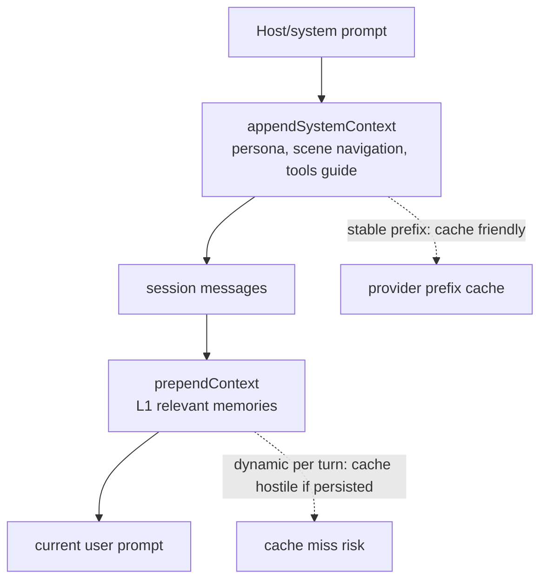

# Prompt Cache Friendly Memory Injection

Issue: https://github.com/TencentCloud/TencentDB-Agent-Memory/issues/120

## Context Layout



`appendSystemContext` is the cache-friendly region. It carries persona, scene
navigation, and the memory-tools guide. These values change slowly, so repeated
turns can share a byte-identical prefix.

`prependContext` is intentionally dynamic. It carries current-turn
`<relevant-memories>` snippets and should help the active request only. If this
block is persisted into session history through `showInjected` or an older
gateway path, the next prompt starts with a different historical prefix and
provider prompt caches are less likely to hit.

## Implemented Strategy

This change uses two provider-neutral safeguards:

1. Compact persisted memory injection.

   Before a user message is written, each `<relevant-memories>...</relevant-memories>`
   block is replaced with:

   ```xml
   <memory-omitted reason="prevent_context_bloat" />
   ```

   The marker keeps an audit trail while removing the turn-specific recall
   payload from future prompt prefixes.

2. Prepare session messages before prompt build.

   `before_prompt_build` now applies the same compaction to existing history.
   This cleans old sessions and any `showInjected` output that reached
   `event.messages`. It also removes duplicate `system` messages with identical
   normalized content, keeping only the first copy in the session.

## Provider Comparison

| Provider | Cache signal in public docs | Practical implication |
| --- | --- | --- |
| DeepSeek | Documents automatic context caching based on overlapping prefixes and exposes `prompt_cache_hit_tokens` / `prompt_cache_miss_tokens` in usage. | Byte-identical stable prefixes matter. Dynamic memory should be kept out of persisted history so later turns can match earlier cache prefix units. |
| Xiaomi MiMo | Documents OpenAI-compatible APIs and price tiers for cache-hit vs cache-miss input. The chat example currently shows `prompt_tokens_details: null`. | The API can benefit economically from prompt-cache hits, but plugin code should not depend on provider-specific usage fields being populated. Stable-prefix hygiene is still the safest optimization. |

Sources:

- DeepSeek Context Caching: https://api-docs.deepseek.com/guides/kv_cache
- Xiaomi MiMo Chat Completions API Compatibility: https://mimo.mi.com/docs/en-US/api/chat/openai-api
- Xiaomi MiMo API Pricing: https://mimo.mi.com/docs/price/pay-as-you-go

## Expected Cache Impact

Without this change, turn N may persist a large dynamic memory block. Turn N+1
then replays that dynamic text before the current prompt, so providers see a
different prefix even when the durable system prompt is unchanged.

With this change, historical memory injection becomes a constant marker and
duplicate system prompts collapse to one copy. The stable prefix is shorter and
more repeatable, which should improve cache hit probability for DeepSeek, MiMo,
and other OpenAI-compatible providers that use prefix caching or cache-hit
pricing.

## Validation

Run:

```bash
npm test -- src/utils/memory-injection-cache.test.ts
npm test
npm run build
git diff --check
```

For a provider-level smoke test, compare two repeated requests against the same
DeepSeek or MiMo model with the same stable system prompt. The second request
should have less dynamic history in the input. On DeepSeek, inspect
`usage.prompt_cache_hit_tokens` and `usage.prompt_cache_miss_tokens` when the
provider returns them. On MiMo, treat the pricing model as the observable signal
unless the API response includes provider-specific cached-token details.
