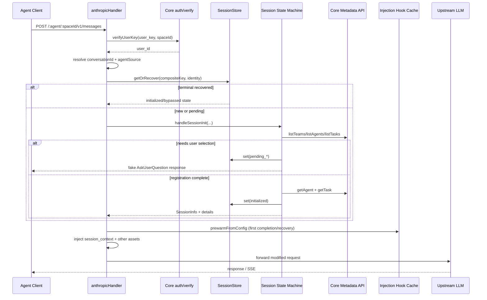
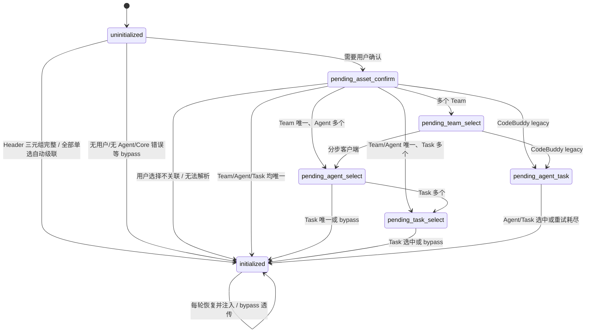
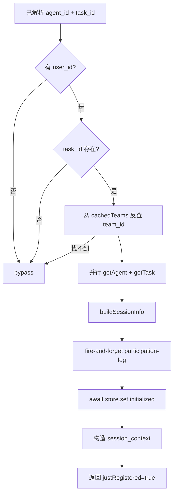
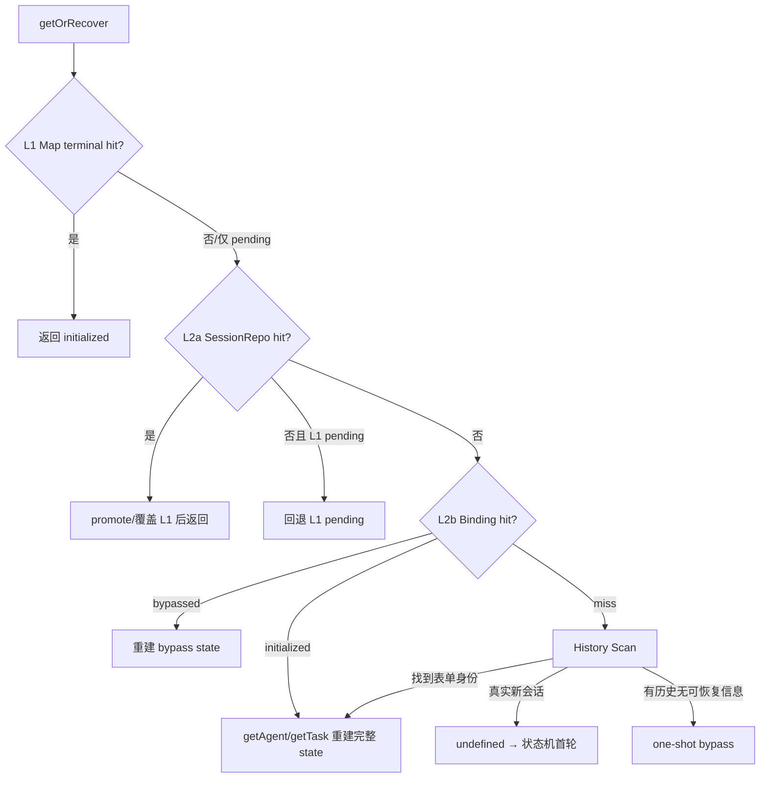

# Session Init 初始化链路与运行机制详解

> 本文分析当前 `MemoryProxy` 中 Session Init 的真实调用链、状态机、持久化恢复、协议适配、注入衔接与异常降级。总体项目流程见 [`PROJECT_EXECUTION_FLOW_AND_MODULES_CN.md`](./PROJECT_EXECUTION_FLOW_AND_MODULES_CN.md)。

## 1. Session Init 解决什么问题

Session Init 在一个新的 Agent 对话开始时，将本次会话绑定到以下身份：

```text
space / memory instance
  + authenticated user
  + team
  + agent
  + task
  + client session id
```

完成后产生 `SessionInfo` 和 Agent/Task 详情，用于：

- 每轮注入 `<session_context>`；
- 以正确租户和用户身份检索 Skill、Knowledge、Memory；
- 预热 Injection Hook Cache；
- 将后续对话回流到正确的 team/agent/user/session；
- 记录 Task Participation Log 与 Session Init 埋点。

它不负责创建 Team、Agent 或 Task，也不把 Session 注册到 Panel；当前实现只在 Proxy 本地构造 `SessionInfo`，并持久化到 Proxy 的 SessionStore/BindingRepo。

## 2. 启用条件和入口门控

Session Init 进入前需要同时满足：

1. `config.sessionInit.enabled === true`；
2. 请求能解析出真实 conversation/session ID；
3. 请求被分类为主对话，而不是 auxiliary/sidequery；
4. 调用方不是 system user；
5. 某些客户端还需具备对应交互工具，例如 DSH 的 `ask_user_question`。

如果没有 conversation ID，Proxy 仍可转发模型请求，但会跳过 Session Init 和通常意义上的会话资产注入。

### 2.1 Session ID 解析

通用解析顺序位于 [`session/session-key.ts`](../MemoryProxy/src/session/session-key.ts)：

```text
x-conversation-id
  → x-session-id
  → x-claude-code-session-id
  → x-deepseek-harness-session-id
  → x-chat-id
  → x-thread-id
```

Codex/WorkBuddy 还会从 Responses 请求头或 body 中使用各自的 session 提取器。

### 2.2 三类关键键

| 名称 | 示例 | 用途 |
| --- | --- | --- |
| `sessionKey` | `0193...` | 客户端会话 ID |
| `compositeKey` | `claude-code:0193...` | Proxy L1 状态 Map 键，隔离客户端族群 |
| `SessionIdentity` | `{spaceId,userId,agentSource,sessionId}` | L2a/L2b 持久化命名空间 |

`spaceId` 来自 URL 路径，例如 `/claude-code/default/v1/messages` 中的 `default`。它最终进入 `x-tdai-service-id`，是 Core 多实例路由的关键维度。

## 3. 顶层调用链

以 Claude Code / Anthropic 主请求为例：



### 3.1 Handler 层职责

各协议 handler 在调用状态机前统一完成：

1. 提前鉴权并得到 `userId`；
2. 解析 body 和模型；
3. 识别 `agentSource`、`spaceId`、`sessionKey`；
4. 创建 `MetadataClient(coreSkill, spaceId, userKey)`；
5. 解析 Header 预选身份；
6. 调 `store.getOrRecover`；
7. 仅当未恢复终态时进入 `handleSessionInit`。

### 3.2 Dispatcher

公共入口位于 [`session/index.ts`](../MemoryProxy/src/session/index.ts)：

- `agentSource === "claude-code"` → Claude Code 独立状态机；
- 其他来源 → CodeBuddy 状态机；
- Codex 以 `agentSource="codex"` 进入 CodeBuddy 状态机的 Codex 分支；
- DSH/部分 WorkBuddy Chat 场景复用 CodeBuddy 状态机后重渲染表单。

## 4. 状态模型

状态定义在 [`session/types.ts`](../MemoryProxy/src/session/types.ts)：

| 状态 | 含义 | 下一步 |
| --- | --- | --- |
| `uninitialized` | 新会话，尚未拉取可见资源 | 拉 Team/Agent/Task，发资产确认 |
| `pending_asset_confirm` | 等用户确认是否关联团队资产 | 否→bypass；是→Team 或自动选择 |
| `pending_team_select` | 等选择 Team | 进入 Agent 阶段 |
| `pending_agent_task` | CodeBuddy legacy：同一表单选 Agent + Task | 完成登记或重试 |
| `pending_agent_select` | Claude Code/Codex/DSH 等分步选择 Agent | 进入 Task 阶段 |
| `pending_task_select` | 等选择 Task | 完成登记 |
| `initialized` | 终态；可能成功，也可能 `bypassed=true` | 稳态注入或稳态透传 |
| `pending_form` | 一期遗留兼容状态 | 按旧 Agent+Task 分支处理 |



注意：`initialized` 同时代表两个不同业务终态：

```text
initialized + bypassed=false → 成功绑定并允许资产注入
initialized + bypassed=true  → 已决定本会话跳过，避免以后重复弹窗
```

## 5. 首轮初始化的详细步骤

### 5.1 恢复优先

Handler 不会直接假设“L1 没状态就是新会话”，而是先调用：

```ts
store.getOrRecover(compositeKey, identity, { metadataClient, messages })
```

只有完整恢复链全部 miss，状态机才将其视为新会话。

### 5.2 安全网：历史对话不重弹

如果状态丢失，但请求已经包含明显的历史 assistant/tool/多个 user 消息，状态机会跳过重新初始化，避免在会话中途突然弹出 Team 选择。

Claude Code 允许最多 5 条属于 Session Init 表单交互的 user 历史；CodeBuddy 的 fresh 判定更严格。Store 的 history scan 还会过滤 DSH 固定注入的伪 `role=user` 元数据。

### 5.3 拉取可见资源

`fetchTeamsAndAgents` 使用 `MetadataClient`：

```text
POST /v3/meta/team/list        user_id
  └─ 对每个 Team 并行：
       POST /v3/meta/agent/list team_id + owner_user_id + active
       POST /v3/meta/task/list  team_id + running
```

Agent 列表按 owner user 过滤，Task 列表是 Team 范围。所有 list API 自动分页聚合，客户端硬上限为 500。

若配置 `defaultTaskId`，Proxy 会在每个 Team 的 tasks 首部插入一个虚拟项“本次不关联任务”。该项不要求 Core 中真实存在；选中后仍满足“Task ID 必须齐全”的登记契约，但不会执行 `getTask`，因而最终只注入 Agent context。

### 5.4 Header 自动预选

默认 Header：

```text
x-team-id
x-agent-id
x-task-id
```

执行逻辑：

1. 只有 Team Header 存在时才进入预选；
2. 所有值必须在当前认证用户可见的 `teams[]` 中验证；
3. 完整 team + agent + task 且无 mismatch 才能直接登记；
4. 只有 Team 命中时跳过资产确认和 Team 表单，直接进入 Agent 阶段；
5. mismatch 按 `onMismatch=form|bypass` 处理。

Header 从不被盲目信任，它只是减少交互轮数的快捷路径。

### 5.5 资产确认

普通新会话在拿到至少一个 Agent 后先写入：

```text
status = pending_asset_confirm
cachedTeams = 完整 Team/Agent/Task 快照
attemptCount = 0
```

然后返回一个伪造的客户端原生工具调用。此时请求被 `intercepted=true` 短路，不会发送给上游 LLM。

用户选择：

- “否/不关联” → 写 `initialized + bypassed`；
- “是” → 根据候选数量继续自动级联或发下一张表单。

## 6. 自动选择与交互轮数

自动选择规则用于减少无意义表单，同时避免 1-option 表单断言：

```text
Team = 1   → 自动选 Team
Agent = 1  → 自动选 Agent
Task = 0   → bypass（除非 defaultTaskId 已注入为虚拟 Task）
Task = 1   → 自动选 Task 并完成登记
候选 >= 2 → 发对应选择表单
```

典型轮数：

| 数据形态 | 用户交互 |
| --- | --- |
| Header 三元组完整 | 0 轮，直接登记 |
| 1 Team + 1 Agent + 1 Task | 只确认“是否关联资产” |
| 多 Team + 单 Agent + 单 Task | 资产确认 + Team |
| 多 Team + 多 Agent + 多 Task | 资产确认 + Team + Agent + Task |
| CodeBuddy legacy | Agent 与 Task 可在同一 follow-up form 中询问 |

## 7. 表单与协议适配

状态机只表达“当前要问什么”，具体 wire response 由不同 form builder 负责。

| 客户端 | 用户交互工具/协议 | 实现特点 |
| --- | --- | --- |
| Claude Code | Anthropic `AskUserQuestion` tool_use | 独立状态机；Agent/Task 分页；最多 4 个选项布局 |
| CodeBuddy | OpenAI/Anthropic 兼容 `ask_followup_question` | legacy 可同时询问 Agent + Task |
| Codex | Responses API `request_user_input` function_call | 复用 CodeBuddy 状态机；body.input 答案转成合成 messages；独立 team/agent/task 页码 |
| DSH | `ask_user_question` | 复用 CodeBuddy 状态机，外层重渲染 DSH 表单；无工具时 headless bypass |
| WorkBuddy 当前 handler | Responses API，按 Codex 路径 | 当前仍使用 `agentSource="codex"` 复用 Codex 状态和表单 |

### 7.1 Claude Code 分页

Claude Code 使用 `agentPageIndex`，Agent 和 Task 由当前 stage 复用该字段。点击“更多”时：

1. 通过同一分页算法计算下一页；
2. 越界回绕首页；
3. 防御性检查 solo 末页，必要时自动选择；
4. 更新 Store 后重发同 stage 表单。

### 7.2 Codex 分页与 Default gate

Codex 使用：

```ts
codexPageIndex = {
  teamPage,
  agentPage,
  taskPage
}
```

Codex 答案位于 `body.input[].function_call_output.output`，`codexFormAnswersAsMessages` 会把它转成最小 user message，供 CodeBuddy extractor 复用；原始 input 仍通过 `reqCtx.codexAnswerInput` 传入，以便精确识别：

- 哪个 question 点击了“更多”；
- 是否出现 Default 模式不支持 `request_user_input` 的 gate 字符串。

首次命中 Default gate 时，状态机将 session 写成 bypass，并让 Codex handler 返回一次“请切换 Plan 模式后新建会话”的提示；后续同 session 直接走 bypass 稳态，不重复提示。

## 8. 用户回答解析

Extractor 不再调用 LLM 猜测答案，只走可验证的工程化路径：

- 解析客户端 tool result JSON/XML；
- 从 option label 中提取 ID；
- 在 `cachedTeams` 中按 ID 或显示文本匹配；
- 识别 skip/bypass marker；
- 识别 more marker；
- 最终用 `resolveAgent` / `resolveTask` 回到缓存候选验证。

这保证选择结果不会越过当前认证用户可见范围。

重试策略存在客户端差异：

- CodeBuddy 状态机多处使用 `attemptCount`，达到 `maxRetries` 后 bypass；
- Claude Code 当前对多个未识别阶段直接 bypass，而不是统一重试到上限；
- 所有终态 bypass 都以“不阻断上游模型”为原则。

## 9. 完成登记

成功选择后进入 `completeRegistration`：



### 9.1 SessionInfo

`buildSessionInfo` 本地构造：

```ts
{
  session_id,
  team_id,
  agent_id,
  user_id,
  task_id,
  user_key,
  space_id,
  created_at
}
```

这里不再调用 TMC/Panel 的 session API。

### 9.2 Detail 获取的容错

`getAgent` 与 `getTask` 使用 `Promise.allSettled`：

- 详情获取失败不会取消登记；
- Agent detail 失败会导致 `<session_context>` 缺少 Agent 文本，但 `SessionInfo` 仍可存在；
- 虚拟 `defaultTaskId` 会跳过 `getTask`；
- Participation Log 为 fire-and-forget，失败不阻断 Session Init。

### 9.3 Session Context

成功后每轮按配置生成：

```xml
<session_context>
[Agent]
ID / Name / Description / Prompt

[Task]
ID / Name / Description / Goal
</session_context>
```

- OpenAI Chat：注入到 messages 中的 system message；
- Anthropic：状态机返回 `systemAppend`，handler 合并到 `body.system`；
- Codex Responses：handler 在 synthetic OpenAI body 中预填该块，运行完整注入管道后再包装回 Responses body。

`injectAgentContext` 和 `injectTaskContext` 可独立关闭；都关闭时不生成整个块。

## 10. Session Store 与恢复链

[`session/store.ts`](../MemoryProxy/src/session/store.ts) 实现三层恢复：



### 10.1 L1：进程内 Map

- 键：`agentSource:sessionId`；
- terminal `initialized` 命中为零 IO 快路径；
- pending 状态默认 30 分钟 TTL；
- pending 命中不能直接作为多节点权威值，仍要探测 L2a。

### 10.2 L2a：完整 SessionRepo

保存完整 `SessionInitState`，包括：

- 当前 pending stage；
- `cachedTeams`；
- 已选 Team/Agent；
- 分页位置；
- `SessionInfo`；
- Agent/Task detail；
- bypass 标志。

`await store.set` 会先写 L1，再 await L2a write-through。该语义保证下一轮即使打到另一 Pod，也能继续同一张表单。

对于 pending 状态，L2a 是多节点权威状态，会覆盖本节点陈旧 L1；如果 L2a 临时 miss，才回退已有 L1 pending。

### 10.3 L2b：最小 BindingRepo

只在 `initialized` 终态写入，保存长期恢复所需的最小信息：

```text
outcome + userId + teamId + agentId + taskId + agentSource + userKey
```

Binding 用于完整 SessionRepo 不存在或过期后的长睡会话唤醒。恢复时重新从 Core 获取 Agent/Task detail，再把完整状态写回 L1/L2a。

### 10.4 History Scan

当 L2a/L2b 都 miss：

- 真正首轮 → 返回 `undefined`，允许弹表单；
- 有历史但无 Session Init marker → one-shot bypass，避免中途重弹；
- 找到 bypass 表单证据 → 重建 bypass state；
- 找到 Agent/Task 线索 → 尝试通过 Core 重建。

Codex/Responses 当前传空 messages，因此 History Scan 无法从 Responses input 恢复表单历史，主要依赖 L2a/L2b。

## 11. 多节点一致性设计

Session Init 对多节点最敏感的地方是多轮表单可能落到不同 Pod：

```text
turn 1 → Pod A 写 pending_asset_confirm
turn 2 → Pod B 推进 pending_agent_select
turn 3 → Pod A 若只读旧 L1，会误把 Agent 答案当资产确认答案
```

当前修复策略：

1. pending 状态每轮都探测 L2a；
2. L2a 命中覆盖陈旧 L1；
3. `store.set` await L2a 持久化完成后才返回表单；
4. terminal L1 可直接返回，因为终态不会再变；
5. 同一 Binding rebuild 使用 in-flight Promise 去重。

生产多节点必须使用共享 Redis 或 COS/共享 ProxyStorage。SQLite、FS、Memory 都是节点本地状态，不能保证跨 Pod 表单连续性。

## 12. Session Init 与注入管道的衔接

Session Init 成功不是请求结束，而是注入的准备阶段。

Handler 拿到 `justRegistered=true` 后：

1. 查询 Asset Capability；
2. 修复/补齐 `sessionInfo.space_id`；
3. `await prewarmFromConfig`；
4. 把 SessionInfo 和 detail 放入 Injection Pipeline metadata；
5. 执行 Skill/Knowledge/Memory hooks；
6. 再转发上游。

预热必须 await。若 fire-and-forget，首个真正业务 turn 可能先于 cache 写入执行，导致整轮注入为空。

恢复出的终态也会设置一个用于 prewarm 的重建信号，但 handler 会区分它和“本轮状态机刚完成”，避免 `mem:*` 首条历史命令被每轮重复执行。

## 13. Bypass 路径

常见 bypass 原因：

| 原因 | 是否持久化为终态 | 结果 |
| --- | --- | --- |
| 用户明确不关联资产 | 是 | 后续不再弹窗，不做注入 |
| 无 userId / auth 无法解析 | 多数实现是 | 继续转发 LLM |
| MetadataClient 缺失/Core 不可达 | 多数主状态机是 | 降级透传 |
| 当前用户无 active Agent | 是 | 降级透传 |
| Team 无 Task 且无 defaultTaskId | 是 | 因三元组不完整而 bypass |
| Header mismatch + onMismatch=bypass | 是 | 不弹表单 |
| 表单无法解析/重试耗尽 | 是 | 防止无限拦截 |
| 会话有历史但状态全丢失 | 通常 one-shot | 不在会话中途重弹 |
| Codex Default 模式 gate | 是 | 首次提示 Plan 模式，后续透传 |
| DSH 无 ask_user_question 工具 | handler 直接跳过 | headless 透传 |

当 `bypassed=true`：

- 不注入 `<session_context>`；
- 跳过全部 Injection Hook；
- mem 命令按“会话未初始化”处理；
- LLM 主请求仍可正常执行。

## 14. 可观测性

状态机顶层 wrapper 在调用前后读取状态，仅当：

```text
prevStatus !== initialized
afterStatus === initialized
```

才写一条 `session_init_logs`。内容包括 session key、space/user/team/agent、agent source、是否 bypass、最终状态。

埋点装饰器和 ClickHouse writer 都遵循“绝不影响业务”原则：同步返回、内部吞异常、批量异步写。

此外还有：

- 关键状态迁移 console log；
- `[cache]` / `[session-recover]` 恢复层日志；
- `[injection-debug]` handler 衔接日志；
- `debugVerboseLogging` 下的 tools schema 和用户答案预览。

## 15. 当前实现中的重要差异与技术债

### 15.1 WorkBuddy 独立实现尚未接入

[`session/workbuddy/init.ts`](../MemoryProxy/src/session/workbuddy/init.ts) 定义了一套明确的“Header-preselect-only”实现：没有交互表单，Header 不完整就 bypass。

但当前 [`workbuddyHandler.ts`](../MemoryProxy/src/workbuddyHandler.ts) 实际没有调用 `handleWorkbuddySessionInit`，而是：

```text
compositeKey = codex:sessionKey
agentSource = codex
handleSessionInit → CodeBuddy 状态机 Codex 分支
buildCodexFormResponse
```

因此当前运行行为以 handler 为准：WorkBuddy 与 Codex 共用状态和表单；独立 WorkBuddy init 目前属于未接线实现。后续若接入独立实现，必须同时迁移 composite key，否则历史 `codex:*` binding 无法自然命中 `workbuddy:*`。

### 15.2 Task“可选”注释与实际契约不一致

部分类型注释仍写着 task optional，但当前：

- `resolvePresetIdentity.canRegister` 要求 team + agent + task；
- Claude Code / CodeBuddy `completeRegistration` 缺 task 会 bypass；
- 无 Task 的 Team 需要配置 `defaultTaskId` 才能完成绑定。

排障时应以代码契约为准。

### 15.3 Claude Code 与 CodeBuddy 的失败策略不完全对称

CodeBuddy 多阶段使用 `maxRetries`；Claude Code 多个未识别分支直接 bypass。修改通用体验时不能只改一个状态机。

### 15.4 表单 artifacts 保留

旧注释和变量名中仍能看到 `stripped`，但当前代码明确不再 strip Session Init 对话。后续 history scan、query extractor 和 Token 预算都需要考虑这些历史消息存在。

## 16. 排障清单

### 16.1 首轮不弹表单

依次检查：

1. `sessionInit.enabled` 是否为 true；
2. URL 是否包含可解析的 `spaceId`；
3. 请求是否有 conversation/session ID；
4. 是否被分类为 auxiliary/sidequery/fork；
5. 是否命中 system user；
6. auth/verify 是否得到 `userId`；
7. `MetadataClient.listTeams/listAgents/listTasks` 是否成功；
8. 用户是否至少拥有一个 active Agent；
9. Store 是否已存在 `initialized+bypassed`；
10. DSH tools 中是否存在 `ask_user_question`；
11. Codex 是否处于 Default 而非 Plan 模式。

### 16.2 第二步表单重复或跳阶段

重点查看：

- `[cache] L2a hit/miss`；
- 是否多 Pod 且使用本地 SQLite/FS；
- `store.set` 是否完成共享后端写入；
- `compositeKey` 的 agentSource 是否前后变化；
- 用户答案是否包含对应 tool call ID；
- Codex/WorkBuddy page index 是否在正确 question 上 bump。

### 16.3 初始化完成但没有资产

区分两类：

1. `<session_context>` 缺失：检查 `agentDetail/taskDetail` 获取、两个 context toggle、协议合并位置；
2. Skill/Knowledge/Memory 缺失：检查 capability、prewarm、Hook Cache、对应 injector 配置、`sessionInfo.space_id` 与 user key。

### 16.4 重启后重新弹表单

检查：

- SessionRepo/BindingRepo 是否启用；
- ProxyStorage 是否降级到节点本地后端；
- Binding key 的 `spaceId + sessionId` 是否一致；
- 当前 userId 是否与存储的 binding 用户一致；
- Agent 是否被删除，导致 binding 被判失效；
- WorkBuddy 是否在 `codex:*` 与 `workbuddy:*` key 之间切换。

## 17. 关键源码索引

| 关注点 | 文件 |
| --- | --- |
| 路由入口 | `MemoryProxy/src/server.ts` |
| OpenAI Chat 主链路 | `MemoryProxy/src/handler.ts` |
| Anthropic 主链路 | `MemoryProxy/src/anthropicHandler.ts` |
| Codex Responses 主链路 | `MemoryProxy/src/codexHandler.ts` |
| WorkBuddy 当前主链路 | `MemoryProxy/src/workbuddyHandler.ts` |
| Session 公共分派 | `MemoryProxy/src/session/index.ts` |
| 状态与数据类型 | `MemoryProxy/src/session/types.ts` |
| L1/L2a/L2b 恢复 | `MemoryProxy/src/session/store.ts` |
| Claude Code 状态机 | `MemoryProxy/src/session/claude-code/init.ts` |
| CodeBuddy/Codex 状态机 | `MemoryProxy/src/session/codebuddy/init.ts` |
| Header 预选 | `MemoryProxy/src/session/preset.ts` |
| SessionInfo 构造 | `MemoryProxy/src/session/registrar.ts` |
| context 注入 | `MemoryProxy/src/session/context-injector.ts` |
| Session Init 埋点 | `MemoryProxy/src/session/init-telemetry.ts` |
| Core 元数据客户端 | `MemoryProxy/src/meta/client.ts` |
| 注入管道与预热 | `MemoryProxy/src/injection/index.ts`、`pipeline.ts`、`prewarm.ts` |

