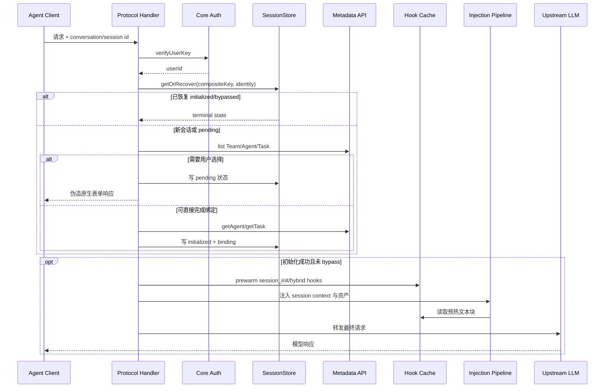
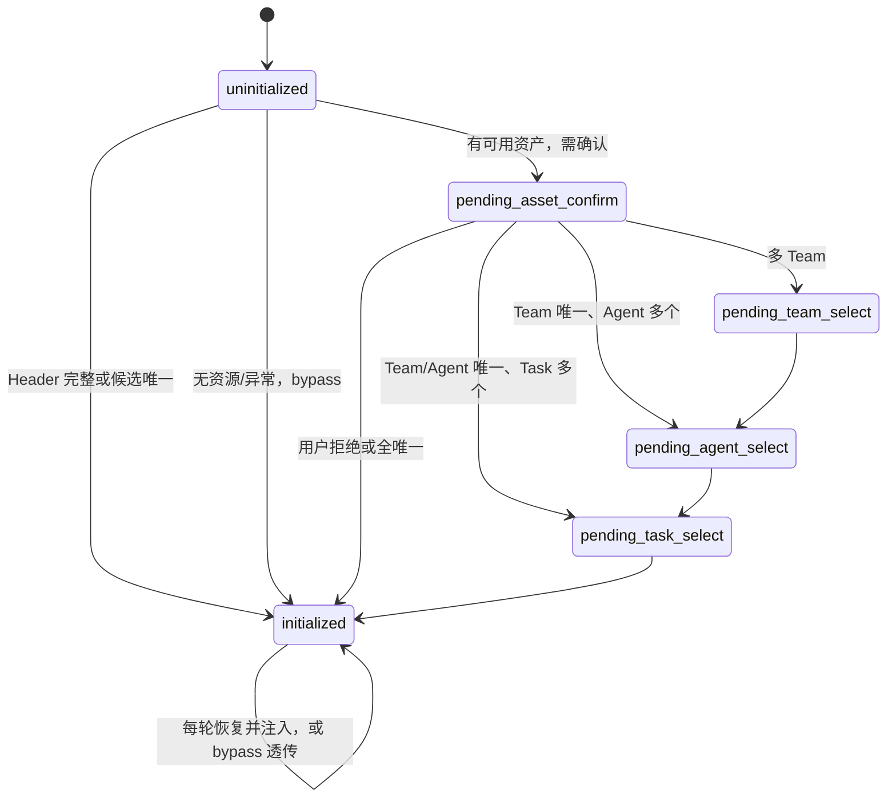

# Session Init、记忆注入与 KV Cache 分析

> 分析对象：当前仓库 `MemoryProxy` 实现。本文重点讨论 Session Init 如何建立会话身份、记忆如何进入模型上下文，以及 Proxy Hook Cache 与上游模型 KV/Prompt Cache 在各阶段的真实关系。状态机细节可同时参考 [`SESSION_INIT_CHAIN_ANALYSIS_CN.md`](./SESSION_INIT_CHAIN_ANALYSIS_CN.md)。

## 1. 核心结论

1. **Session Init 本质上不是一次普通的“模型初始化调用”，而是 Proxy 侧的会话身份绑定状态机。** 它把客户端 session 映射为 `space + user + team + agent + task`，持久化终态，并为后续每轮资产检索、上下文注入和对话回流提供身份。
2. **初始化表单阶段通常不调用上游模型。** Proxy 返回伪造的原生工具调用表单，因此这些轮次没有上游 KV Cache 的读写收益；它们主要读写 SessionStore。
3. **完成绑定后的首个业务请求才真正形成“带记忆的模型前缀”。** 该请求会加入 `<session_context>`，并在 prewarm 后注入 Skill、Knowledge、L2/L3 Memory 和只读工具指南。相对客户端原始 prompt，这通常是一次新的 cache creation/miss；之后只要前缀字节稳定，工具循环和后续主对话才可能持续命中。
4. **Hook Cache 不是 KV Cache。** Hook Cache 保存“要注入的文本块”，减少 Core/COS 查询并帮助生成稳定字节；KV/Prompt Cache 位于上游推理服务，缓存 token 前缀对应的模型中间状态。前者只能为后者创造命中条件，不能保证后者命中。
5. **当前记忆策略总体方向正确：稳定信息直注、动态信息按需查。** L3 Persona、L2 路径索引和工具说明放入 system/developer 上下文；L0/L1 不再每轮自动召回，而通过只读工具按需获取，降低了每轮改写前缀造成的 cache miss 和无关记忆污染。
6. **缓存收益与记忆新鲜度天然冲突。** Session 内固定快照有利于 KV Cache，但会变旧；每轮实时刷新记忆更及时，却会改变前缀、增加 TTFT 和输入计算。需要用显式的 `memory_epoch/asset_version` 管理，而不是让内容在稳态中隐式漂移。
7. **当前实现存在两个需要优先验证的问题：**
   - handler 的稳定恢复分支统一设置 `justRegistered: true`，随后满足条件就 `await prewarmFromConfig(...)`；由于 L1 terminal 每轮都会命中，这在当前代码中可能退化为“每轮 prewarm”，与“session init 时预热一次”的设计意图不一致。
   - Anthropic Adapter 能保留 `cache_control`，但 Injection Pipeline 命中语义 anchor 后会用单个新 text block 替换 system blocks；若原 marker 位于这些 blocks 上，元数据可能被丢弃。该问题是条件性的，但会直接破坏显式 Prompt Cache，需要字节级回归测试确认。

## 2. 三种容易混淆的缓存

| 缓存 | 所在位置 | 缓存内容 | 主要收益 | 不能解决的问题 |
| --- | --- | --- | --- | --- |
| SessionStore L1/L2a/L2b | MemoryProxy | Session Init 状态、绑定、Agent/Task detail | 避免重复弹表单；支持多节点恢复 | 不缓存注入文本，也不减少模型推理 |
| Injection Hook Cache | MemoryProxy 的 SQLite/Redis/COS/ProxyStorage | 各 Hook 产出的 `ContextBlock[]` | 减少 Core/COS 读取；固定注入文本 | 不保存模型 KV；命中不等于上游 cache hit |
| KV/Prompt Cache | 上游模型服务 | 某个 token 前缀的注意力 Key/Value 等推理状态 | 降低重复前缀计算、输入费用和 TTFT | 不减少上下文窗口占用；不保证内容新鲜或正确 |

后文中的“Hook Cache hit”均指 Proxy 应用缓存；“KV Cache hit”或“Prompt Cache hit”才指上游模型缓存。

## 3. 初始化链路

### 3.1 总体链路



### 3.2 入口门控

Session Init 主要受以下条件控制：

- `sessionInit.enabled=true`；
- 能解析出 conversation/session ID；
- 请求是主对话，不是独立 sidequery；
- 调用方不是 system user；
- 客户端具备可用的交互协议，或 Header 已足够完成预选。

会话 ID 的通用优先级为：

```text
x-conversation-id
  → x-session-id
  → x-claude-code-session-id
  → x-deepseek-harness-session-id
  → x-chat-id
  → x-thread-id
```

核心键的作用不同：

| 键 | 作用 |
| --- | --- |
| `sessionKey` | 客户端原始会话 ID |
| `compositeKey = agentSource:sessionId` | Proxy L1 状态键 |
| `SessionIdentity = spaceId + userId + agentSource + sessionId` | L2a 持久化隔离键 |
| Binding key | 长睡会话恢复所需的最小绑定 |
| Hook Cache key | `spaceId + userId + agentSource + sessionId + hookId` |

### 3.3 状态推进



`initialized` 有两种业务含义：

```text
initialized + bypassed=false → 身份绑定完成，允许注入和回流
initialized + bypassed=true  → 终态跳过，后续不再弹窗、不注入资产
```

### 3.4 恢复链

```text
L1 terminal Map
  → L2a 完整 SessionInitState
  → L2b 最小 Binding + Metadata detail rebuild
  → history scan
  → 真新会话进入表单 / 有历史但不可恢复则一次性 bypass
```

- L1 的 terminal 命中为零 IO 快路径。
- pending 状态仍要探测共享 L2a，避免多 Pod 轮转时用到陈旧阶段。
- L2b 用于 L2a 过期或长睡唤醒，恢复时重新读取 Agent/Task detail。
- Anthropic/OpenAI 路径可以扫描历史；Codex Responses 当前给恢复层传空 `messages`，更依赖 L2a/L2b。

### 3.5 初始化完成后的同步读链与异步写链

```text
同步读链：
Auth → Session Recovery/Init → Asset Capability → Hook Prewarm
→ Session Context + Skill/Knowledge/Memory 注入 → 上游 LLM

异步写链：
上游响应 → L0 Conversation / Skill Buffer
→ MemoryCore Pipeline → L1 Atom → L2 Scenario → L3 Persona
→ 后续会话或 refresh 再消费
```

Session Init 自身不创建 Team/Agent/Task，也不通过 Panel 注册 session；Panel 是控制面，当前初始化直接访问 Core Metadata API。

## 4. 记忆注入如何改变上下文

### 4.1 注入内容及优先级

| 内容 | 来源 | 落位 | 更新特征 | 对模型的主要影响 |
| --- | --- | --- | --- | --- |
| `<session_context>` | Agent/Task detail | system/developer | Session 内稳定 | 确定角色、任务描述和目标，是最直接的行为约束 |
| `<available_skills>` | Agent 自有 Skill listing | system 语义锚点 | 设计为 Session 快照 | 改变工具/工作流选择，要求优先加载匹配 Skill |
| `<skill_tools>` | 静态工具指南 | system 语义锚点 | 基本稳定，但包含网关信息 | 告知模型如何发现、读取和维护云端 Skill |
| `<knowledge_tools>` | Agent/Team 绑定知识资源 | system 语义锚点 | 设计为 Session 快照，含 session/tenant headers | 引导模型在合适场景查询 Wiki/CodeGraph |
| `<tdai_profile_memory>` | L3 Persona + L2 Scene Index | system memory 区域 | 设计为 Session 快照 | 直接提供长期偏好、稳定事实和场景导航 |
| `<tdai_memory_tools>` | 只读记忆工具指南 | system memory 区域 | Session 内稳定，包含 session/space | 让模型按需检索 L0/L1/L2 正文 |
| 工具查询结果 | L0/L1/L2/Knowledge 实时结果 | 当前轮 tool result/suffix | 动态 | 只把与当前问题相关的明细带进上下文 |

这些内容大多处于 system/developer 高优先级区域。它们不仅增加 token，还会改变模型的任务理解、工具选择和回答边界；因此“成功注入”不等价于“效果一定更好”，仍要控制相关性、冲突和可信度。

### 4.2 为什么 L0/L1 不再每轮自动注入

当前注册逻辑明确下线了 L1 Recall Injector，改用只读工具：

```text
旧思路：每轮 query → 实时召回 L0/L1 → 写入 user/system prompt
问题：召回结果随 query 和记忆库变化，稳定前缀被持续改写

当前思路：
  system 中固定“如何查询记忆”的工具说明
  + L3 Persona / L2 Index 快照
  + 模型需要时才查询 L0/L1/L2 正文
```

收益：

- 稳定 system/developer 前缀更容易命中 KV Cache；
- 避免无关 L0/L1 抢占上下文和注意力；
- 只有真实需要的明细进入当前轮后缀；
- 召回失败时更容易显式降级，不会悄悄把错误记忆当成固定前提。

代价：

- 模型必须正确判断“何时需要查记忆”；
- 多一次或多次工具调用会增加当前轮延迟；
- 如果工具指南过长，本身仍会长期占用上下文；
- 用户问题与长期 Persona 冲突时，模型可能过度依赖高优先级记忆。

### 4.3 首轮上下文的特殊性

初始化表单交互当前保留在客户端对话历史中，不会在完成绑定时剥离。于是首个业务模型请求可能同时包含：

1. 用户最初的问题；
2. Proxy 伪造的资产确认/Team/Agent/Task 工具调用；
3. 用户对表单的回答；
4. 新增的 `<session_context>`；
5. Skill、Knowledge、L2/L3 与工具指南。

影响包括：

- 首个真实请求的 token 峰值和 TTFT 增大；
- 表单文本会占用上下文窗口，之后可能被缓存，但不会消失；
- 模型可能把初始化工具交互误理解为业务历史；
- compaction 后若客户端重写历史，消息侧 KV 前缀会失效。

更理想的做法是把 Session Init 作为 Proxy 控制面状态，而不是长期业务对话内容：保留必要审计摘要，清理或压缩表单 wire history，并验证不会破坏各客户端工具调用配对约束。

### 4.4 协议差异

| 协议 | Session Context/资产最终位置 | Cache 特点 |
| --- | --- | --- |
| Anthropic Messages | 顶层 `body.system`；原 `cache_control` 尝试保留 | 有显式 breakpoint，需保证 marker 前所有内容和序列化完全稳定 |
| OpenAI Chat | `messages` 中的 system message | 无本仓库显式 marker，依赖上游自动 Prefix Cache 规则 |
| Codex Responses | 在 `input[0]` developer message 末尾追加 `<tdai_injections>` | 合成 OpenAI body 跑 Pipeline 后再包装；developer 前缀稳定时可获益 |
| WorkBuddy | 当前 handler 复用 Codex/CodeBuddy 路径 | 应以最终转发 body 为准，不能仅依据中间合成消息判断 |

## 5. KV Cache 在不同阶段的行为

### 5.1 阶段矩阵

| 阶段 | 是否访问上游 LLM | Hook Cache | 上游 KV/Prompt Cache 行为 | 预期收益/边界 |
| --- | --- | --- | --- | --- |
| 新会话第一次弹表单 | 否 | 通常尚未预热 | 无读写 | 节省了无意义模型调用，但没有 KV 收益 |
| Team/Agent/Task 选择中 | 否 | 无 | 无读写 | 只有 SessionStore 状态推进 |
| 初始化完成后的首个业务请求 | 是 | 先 prewarm，Pipeline 读 cache | 注入使前缀发生结构性变化；通常需要新建缓存 | 首轮付出 prewarm 延迟、注入 token 和 cache write 成本 |
| 同一 turn 的工具循环 | 是 | 命中 Session Hook Cache | 历史通常只追加，稳定前缀可复用 | 往往是最高价值的命中阶段 |
| 后续 main turn | 是 | 设计上命中同一快照 | 注入字节、工具 schema、模型和已有历史不变时可继续命中 | 新 user/assistant 后缀仍需计算 |
| fork/recap/compact | 是 | 允许读 cache；miss 时 fresh execute，但不 self-heal | 尽量借用 main 前缀；fresh 结果若不同仍会 miss | `readOnly` 只禁止写 Hook Cache，不保证 KV 命中 |
| sidequery/title/verify | 是或由客户端独立处理 | 跳过 | 独立短 prompt，不与主会话共享 | 避免污染主会话缓存和记忆回流 |
| `mem:*` 命令 | 否 | `mem:sync` 可清理/重建 Hook Cache | 当前命令零上游 token；下一业务轮可能因新快照 miss | 将刷新成本放到显式边界上是合理方向 |
| 多 Pod 切换 | 是 | 共享 Redis/COS 时可读同一块 | 只有最终字节一致才可能命中 | 本地 FS/SQLite/Memory 不能提供跨 Pod 稳定性 |
| 上下文 compaction | 是 | 不受直接影响 | 消息历史被重写，消息侧 prefix cache 大概率失效 | 稳定 system breakpoint 仍可能复用 |
| 模型/上游/租户变化 | 是 | Proxy cache 仍可能命中 | 上游 KV 通常不可跨模型、端点或隔离域复用 | Hook hit 不能掩盖上游 cache miss |
| 上游缓存 TTL 到期 | 是 | 可能仍命中 | KV/Prompt Cache 重新创建 | 两类缓存 TTL 完全独立 |

### 5.2 初始化首轮为什么通常是 miss/cache write

假设客户端原请求前缀为：

```text
[client system] + [tools] + [history] + [new user]
```

初始化后实际转发前缀变为：

```text
[client system]
+ [session_context]
+ [skill / knowledge / memory snapshot]
+ [memory/skill tool guides]
+ [session-init form history]
+ [new user]
```

即使客户端在初始化前已有某个 prompt cache，新增内容也只能复用到仍然完全相同的旧 breakpoint；新增部分及其后的更长前缀需要重新计算/写入。这个首轮成本是为了建立后续稳定会话前缀。

### 5.3 稳态命中的必要条件

KV/Prompt Cache 通常要求同一缓存隔离域内的前缀 token 完全一致。对本项目而言，需要同时关注：

- model/upstream endpoint 不变；
- system/developer 文本、换行、block 类型与顺序不变；
- tools schema、tool 顺序、thinking 配置不变；
- `cache_control` marker 的位置和内容不变；
- Session Context 与 Hook 输出不变；
- 序列化没有因 Pod、运行时或配置差异产生变化；
- 旧历史保持 append-only，没有被清理、重排或 compaction；
- 上游缓存仍在 TTL 内。

因此，语义相同但空格、排序、URL、session header 或 JSON block 形态不同，仍可能造成 cache miss。

### 5.4 Anthropic 显式 breakpoint 的当前行为

当前实现包含三层保护：

1. `AnthropicAdapter` 在 parse/serialize 往返中保存 content block 和 tool 上的 `cache_control`；
2. `<session_context>` 追加到已有 system array 时不移动旧 marker，也不给新块擅自增加 breakpoint；
3. 可通过 `PROXY_DEBUG_DUMP_OUTBOUND_MD5=1` 记录 system 和 message-prefix MD5，定位字节漂移。

但仍有两个边界：

- `<session_context>` 放在旧 system marker 之后时，该 marker 本身不覆盖新块；是否被后续 message breakpoint 覆盖，要以最终请求的 breakpoint 布局和上游规则为准。
- Injection Pipeline 命中 AgentProfile anchor 时执行 `sysMsg.blocks = [{type:"text", ...}]`，会把原 blocks 合并成一个新 text block。文本可能相同，但原 block metadata（包括 `cache_control`）不会被一并迁移。这是需要优先补测试和修复的条件性风险。

### 5.5 Hook Cache 如何间接帮助 KV Cache

Hook Cache 的核心价值不是“省一次模型推理”，而是：

```text
Session Init 时拉取资产
  → 保存标准 ContextBlock 快照
  → 后续每轮读取同一份文本和顺序
  → 最终 prompt prefix 更容易 byte-identical
  → 上游 KV/Prompt Cache 才有机会命中
```

它同时减少 Skill listing、Knowledge metadata、L2/L3 COS 读取造成的首段延迟和后端压力。

但当前稳定恢复分支的实际代码值得注意：

```text
store.getOrRecover() 每轮 L1 terminal hit
  → handler 手工构造 initResult.justRegistered=true
  → 满足 prewarm 条件
  → await prewarmFromConfig()
```

这意味着“设计上只预热一次”的快照，可能在每个业务请求前都重新从后端生成并覆盖。即使输出内容未变，也会增加延迟与 IO；一旦 Skill/Knowledge/L2/L3 在会话中变化，注入字节会隐式漂移，导致 KV miss 和上下文语义突变。

建议将信号拆成：

```text
justRegistered       = 本轮状态机刚从 pending 进入终态
needsHookPrewarm     = Hook Cache 缺失或 L2b rebuild 后需要重建
manualRefresh        = mem:sync 等显式刷新
```

而不是复用一个 `justRegistered` 同时承担三种语义。

## 6. 收益、边界与权衡

### 6.1 可获得的收益

- **时延**：长 system prompt、tools 和历史前缀命中时，减少重复 prefill，降低 TTFT。
- **成本**：支持 prompt-cache 计价的上游可降低重复输入前缀成本。
- **后端负载**：Hook Cache 减少 Core、Knowledge、COS 的重复读。
- **语义稳定**：Session 内固定 Agent/Task/Memory 快照，降低同一会话中系统指令无意漂移。
- **工具循环收益高**：同一 turn 常常只追加 tool result，前缀复用最充分。

### 6.2 KV Cache 不解决什么

- 缓存 token 通常仍占模型上下文窗口；长记忆仍可能挤掉真正的对话历史。
- 缓存不能提高记忆正确性、相关性或时效性。
- 缓存不能消除后缀计算，新增 user/tool result/assistant 内容仍需推理。
- 不同上游对 TTL、最小缓存长度、隔离域、计费和 eviction 的规则不同。
- Prefix Cache 只复用连续前缀；中间插入、重排或改写会让后续部分失效。
- Hook Cache hit 只证明 Proxy 读到了文本块，不能证明模型侧命中。

### 6.3 跨 Session 复用的边界

当前多个注入块含 session-specific 内容：

- `<session_context>` 中的 Agent/Task ID 与描述；
- `<tdai_memory_tools>` 中的 `x-conversation-id`；
- `<knowledge_tools>` 中的 session/agent/user/space telemetry headers；
- Codex `<tdai_injections>` 直接追加在 developer message 中。

因此，完整注入前缀主要适合**同一 Session 内复用**，跨 Session 的共享范围有限。若希望跨 Session 共享更长前缀，需要分层：

```text
全局静态工具规范
  → Agent/Team 稳定资产
  → Session 身份与短期快照
  → 当前轮动态查询结果
```

最稳定的内容放最前并设置可验证 breakpoint；session ID、版本号和动态结果尽量后置。是否能移除 prompt 中的 session ID，取决于 bridge 能否从服务端连接身份或可信 header 自动恢复会话，不能以牺牲鉴权为代价。

## 7. 后续课题的主要难点

### 7.1 新鲜度与缓存稳定性的冲突

这是最核心的课题。需要明确回答：

- Agent/Task/Skill/Knowledge/Persona 在一个 Session 内是固定快照，还是允许自动更新？
- 更新触发由时间、事件、版本、用户命令还是 cache TTL 决定？
- 更新后是立即破坏前缀，还是在下一个 turn/compaction/session 生效？
- 多种资产部分更新时，如何保证模型看到的是一致版本，而不是新旧拼接？

推荐采用 `asset_epoch`：初始化时把 Agent、Task、Skill、Knowledge、Memory 版本绑定为一个逻辑快照；稳态只读该 epoch；`mem:sync`、资产变更通知或新 Session 显式推进 epoch。

### 7.2 记忆相关性与上下文预算

目前 L3 可按 agent 注入，单份最多截断到 6000 字符，且支持自有与借入；再叠加 Skill、Knowledge、工具指南和 Session Context，system prompt 可能很大。难点是：

- 固定注入多少 Persona 才足以改变行为而不过度占用上下文；
- L2 Index 的条数和 summary 长度如何按任务裁剪；
- imported memory 如何避免不同 Agent 的约束互相冲突；
- 工具指南是否可以协议化为真正的 tool schema，而不是长篇 curl 文本。

需要同时优化“注入 token 数”和“任务成功率”，不能只看 cache hit ratio。

### 7.3 记忆污染与提示注入

L3 Persona、Skill listing、Knowledge summary 都进入高优先级 system/developer 区域。如果其中包含由用户历史、外部文档或错误提炼产生的指令，模型可能把它当成系统规则执行。

需要建立：

- 来源与可信等级：系统配置、人工审核、模型提炼、外部文档分级；
- 数据/指令分离：记忆内容默认作为“可引用事实”，不能覆盖系统安全规则；
- 冲突策略：当前用户明确指令、Task 目标与长期 Persona 冲突时如何裁决；
- 写入治理：L0→L1→L2→L3 提炼的审核、回滚、去重和过期；
- 注入审计：回答使用了哪条记忆、哪个版本、来自哪个 Agent。

### 7.4 多节点与字节确定性

共享存储只解决“能读到同一逻辑数据”，不自动保证最终 prompt 字节一致。仍需统一：

- `injection.externalGatewayUrl`，避免不同 Pod 注入不同本机 IP；
- 资源排序、JSON/XML 属性顺序、换行和编码；
- Hook 注册顺序与 priority 冲突规则；
- 配置版本与 Prompt 模板版本；
- refresh 的并发互斥和旧写覆盖新写问题。

### 7.5 表单历史与业务上下文解耦

直接删除 Session Init 工具历史可能破坏客户端的 tool-call/tool-result 配对；保留全部历史又浪费窗口并影响模型。需要针对 Anthropic、OpenAI Chat、Responses 分别设计：

- wire 层保留必要配对；
- 模型侧只保留一条受控摘要或完全不转发；
- 恢复层不再依赖把表单历史暴露给模型；
- compaction 前后 SessionStore/Binding 仍能独立恢复。

## 8. 关键风险清单

| 优先级 | 风险 | 可能后果 | 建议 |
| --- | --- | --- | --- |
| P0 | 稳态 terminal recovery 每轮触发 prewarm | 每轮增加 Core/COS IO 和最长约 20s 等待；快照隐式漂移、KV miss | 引入独立 `needsHookPrewarm`，仅首次、真实 cache miss、L2b rebuild 或显式 refresh 触发 |
| P0 | anchor 重建 system blocks 时可能丢 `cache_control` | Anthropic 显式 Prompt Cache 失效，输入成本和 TTFT 上升 | 保留 block metadata，或在 rebuild 后按原 breakpoint 恢复；加入最终 body golden test |
| P1 | 记忆/文档中的提示注入进入 system/developer | 越权工具调用、行为劫持、错误长期固化 | 信任分级、指令隔离、引用来源、写入审核与冲突裁决 |
| P1 | 注入内容过长 | 上下文被挤占，即使 cache hit 也影响可用窗口和注意力 | 全局 token budget、分层裁剪、按需工具化、质量评估 |
| P1 | 多 Pod 输出不确定 | Hook Cache 抖动与上游 KV miss | 共享缓存、统一外部 URL、canonical serialization、内容 hash |
| P1 | Session 快照过旧或每轮暗中变更 | 任务依据错误；同一会话行为不一致 | `asset_epoch` + 显式 refresh + 版本审计 |
| P1 | Session Init 表单历史长期保留 | token 浪费、模型误解、compaction 后 cache 重建 | 协议化清理/摘要，不依赖模型历史恢复控制面状态 |
| P2 | fork cache miss 时执行 fresh Hook | 虽不写缓存，仍可能生成与 main 不同的前缀 | fork miss 直接降级为不注入或读取权威快照，避免实时重建 |
| P2 | L1 key 仅 `agentSource:sessionId` | 极端 session ID 冲突时存在身份串用风险 | L1 key 也纳入 `spaceId/userId`，并对 terminal hit 校验 identity |
| P2 | 只有 MD5/usage，缺少注入版本关联 | 难定位一次 miss 是模板、资产、Pod 还是 compaction 导致 | 上报 hook hash、asset epoch、marker index、prefix hash 和 cache token 指标 |

## 9. 方案方向与推进顺序

### 第一阶段：先证明缓存行为

1. 为最终转发 body 计算结构化指纹：
   - `system/developer hash`；
   - tools schema hash；
   - 每个 Hook 的 content hash；
   - `cache_control` marker 位置；
   - message prefix hash；
   - model、upstream、Pod、template version、asset epoch。
2. 将这些指纹与 `cache_read_input_tokens`、`cache_creation_input_tokens`、TTFT、input tokens 关联。
3. 建立同 Session 连续 N 轮、tool loop、跨 Pod、refresh、compaction、模型切换的基准测试。
4. Anthropic 增加 parse→inject→serialize 的 byte/golden tests，专门覆盖 system array、message marker、tool marker 和 anchor hit/miss。

### 第二阶段：修正预热与版本语义

1. 拆分 `justRegistered`、`needsHookPrewarm`、`manualRefresh`。
2. Hook Cache entry 增加：

```text
asset_epoch
template_version
content_hash
created_at
source_versions
```

3. 只有以下事件允许生成新快照：
   - 新 Session 注册完成；
   - L2b rebuild 且 Hook Cache 确认缺失；
   - 用户执行 `mem:sync`；
   - 控制面发出明确的资产版本变更事件。
4. refresh 使用 single-flight/CAS，避免并发请求以旧结果覆盖新 epoch。

### 第三阶段：重排可缓存前缀

建议的逻辑层次：

```text
Layer A：产品/客户端全局静态 system 与工具规范
Layer B：Team/Agent 稳定 Skill/Knowledge 工具说明
Layer C：Session Context + 当前 asset_epoch 的 L2/L3 快照
Layer D：append-only 对话历史
Layer E：当前轮动态 tool result / user query
```

- Layer A/B 尽量跨 Session 复用；
- Layer C 在 Session 内复用；
- Layer D 依赖 append-only；
- Layer E 不追求缓存。

对 Anthropic，应在最终 body 上验证 breakpoint 的覆盖范围；对自动 Prefix Cache 的上游，则重点保证前缀 canonical、足够长且稳定。

### 第四阶段：控制记忆质量和安全

- 给每个注入段设置 token 上限和保底/淘汰顺序；
- Persona 只保留高置信、长期稳定、与当前 Agent 有关的事实；
- L2 只给相关路径与短 summary，正文继续按需读取；
- imported memory 显示来源并降低默认权重；
- 对可疑指令型内容做隔离标记，不允许其覆盖系统规则；
- 回答侧记录 memory citation/provenance，支持追溯与纠错。

## 10. 建议指标

| 维度 | 指标 |
| --- | --- |
| 初始化 | init 成功率、bypass 率、表单轮数、init P50/P95、prewarm P50/P95/timeout |
| Hook Cache | 每 Hook hit/miss/self-heal、内容 hash 漂移率、跨 Pod 一致率 |
| KV/Prompt Cache | cache read/write tokens、read ratio、连续命中长度、TTL 后重建率 |
| 时延 | TTFT、总时延、prewarm 占比、工具查询额外时延 |
| 上下文 | 各注入段 token、总 system token、表单历史 token、compaction 频率 |
| 效果 | 记忆使用率、正确引用率、无关记忆率、工具调用成功率、任务成功率 |
| 新鲜度 | asset epoch 年龄、refresh 成功率、旧版本命中率、版本冲突率 |
| 安全 | 记忆冲突率、提示注入检测、跨用户/跨 Agent 数据泄露告警 |

不能只优化 cache hit ratio。最重要的联合目标应是：

```text
任务成功率 / 正确记忆使用率
  在可接受的 TTFT、输入成本、上下文占用和新鲜度约束下最大化
```

## 11. 推荐代码阅读入口

- Session dispatcher：[`MemoryProxy/src/session/index.ts`](../MemoryProxy/src/session/index.ts)
- Claude Code 状态机：[`MemoryProxy/src/session/claude-code/init.ts`](../MemoryProxy/src/session/claude-code/init.ts)
- CodeBuddy/Codex 状态机：[`MemoryProxy/src/session/codebuddy/init.ts`](../MemoryProxy/src/session/codebuddy/init.ts)
- Session 恢复：[`MemoryProxy/src/session/store.ts`](../MemoryProxy/src/session/store.ts)
- Session Context：[`MemoryProxy/src/session/context-injector.ts`](../MemoryProxy/src/session/context-injector.ts)
- Anthropic 主链：[`MemoryProxy/src/anthropicHandler.ts`](../MemoryProxy/src/anthropicHandler.ts)
- Codex 主链：[`MemoryProxy/src/codexHandler.ts`](../MemoryProxy/src/codexHandler.ts)
- Injection Pipeline：[`MemoryProxy/src/injection/pipeline.ts`](../MemoryProxy/src/injection/pipeline.ts)
- Prewarm：[`MemoryProxy/src/injection/prewarm.ts`](../MemoryProxy/src/injection/prewarm.ts)
- Anthropic Adapter：[`MemoryProxy/src/injection/adapters/anthropic.ts`](../MemoryProxy/src/injection/adapters/anthropic.ts)
- L2/L3 注入：[`MemoryProxy/src/injection/injectors/tdai-profile-memory-injector.ts`](../MemoryProxy/src/injection/injectors/tdai-profile-memory-injector.ts)
- 只读记忆工具：[`MemoryProxy/src/injection/injectors/tdai-tools-injector.ts`](../MemoryProxy/src/injection/injectors/tdai-tools-injector.ts)

---

本文结论以当前源码为准。其中，上游 KV/Prompt Cache 的具体 TTL、最低 token 门槛、计价和隔离域由实际模型供应商决定；本文只对 Proxy 能控制的前缀稳定性、marker 保留、注入版本和请求阶段作确定性分析。
