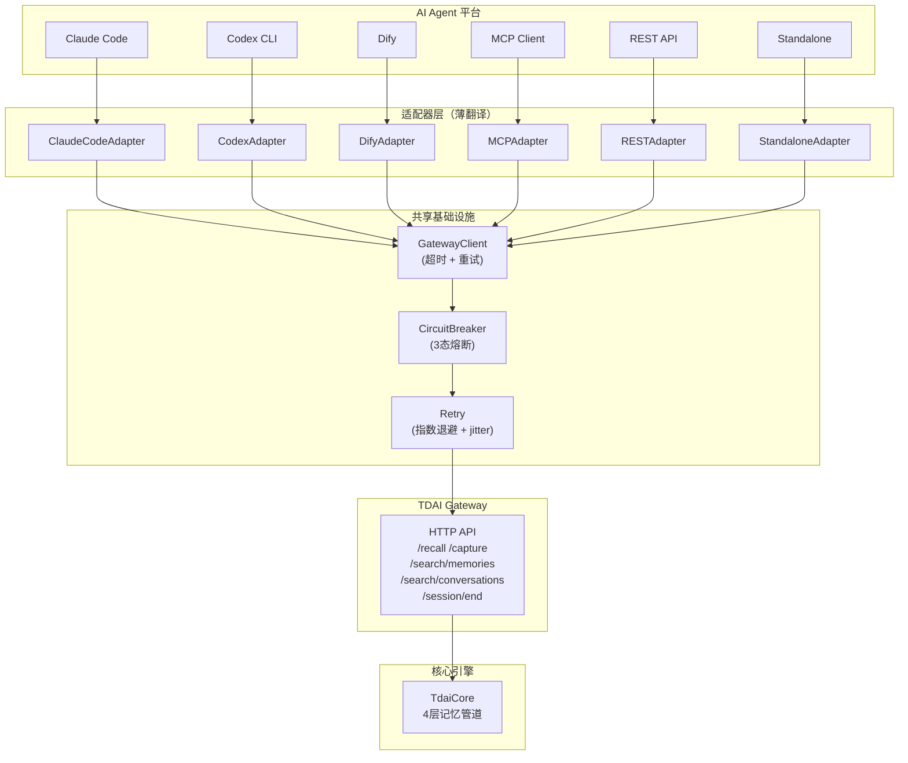
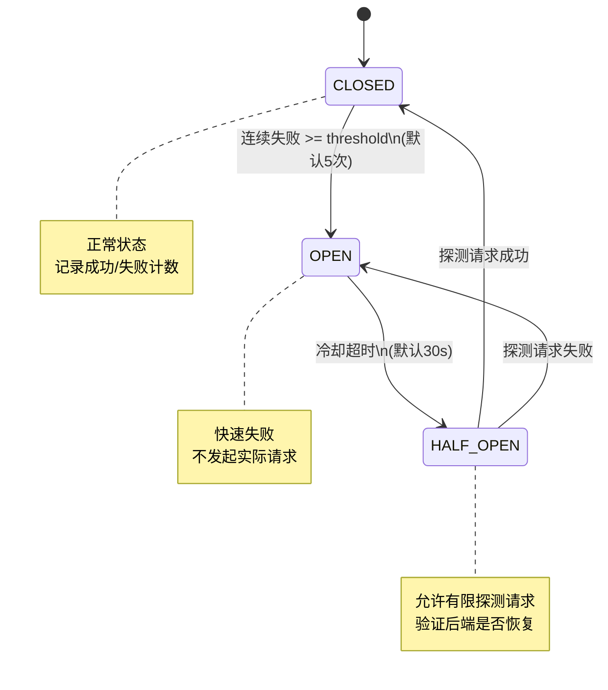
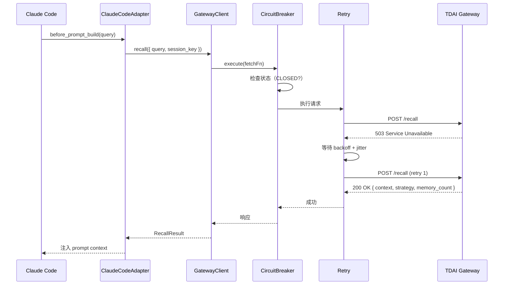
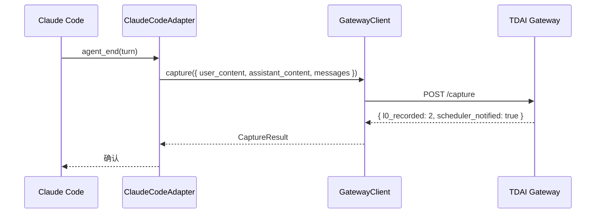

# 跨平台适配器架构 v2

> PR #359 为 TencentDB-Agent-Memory 提供 6 平台适配系统。本文档描述架构设计、核心抽象与数据流。

## 总览架构



## 设计原则

### 1. Gateway 是唯一真相源

所有适配器通过 Gateway HTTP API 与核心引擎通信，不直接依赖 `TdaiCore`。这确保：
- 适配器可独立升级，不受核心引擎变更影响
- 同一 Gateway 可服务多个平台同时接入
- 适配器代码量极小（每个 ~80-150 行）

### 2. 适配器是薄翻译层

适配器只做三件事：
1. **翻译平台事件** 为 Gateway API 调用（`UserPromptSubmit` → `/recall`）
2. **翻译 Gateway 响应** 为平台兼容格式
3. **委托错误处理** 给共享基础设施

```typescript
// 典型适配器结构（以 Claude Code 为例）
export class ClaudeCodeAdapter {
  constructor(
    private client: GatewayClient,       // 共享 HTTP 客户端
    private config: ClaudeCodeConfig     // 平台特定配置
  ) {}

  async beforePromptBuild(query: string): Promise<RecallResult> {
    return this.client.recall({ query, session_key: this.config.sessionKey });
  }

  async afterAgentEnd(turn: TurnData): Promise<CaptureResult> {
    return this.client.capture({ /* ... */ });
  }
}
```

### 3. 共享基础设施全员复用

所有 6 个适配器共享同一套基础设施，不各自实现：

| 模块 | 职责 | 所有适配器均使用 |
|:---|:---|:---:|
| `GatewayClient` | HTTP 通信、Bearer auth、超时控制（AbortController） | ✅ |
| `CircuitBreaker` | 3态熔断（CLOSED→OPEN→HALF_OPEN→CLOSED），防止级联故障 | ✅ |
| `Retry` | 指数退避 + 随机 jitter，防止惊群效应 | ✅ |

## 熔断器状态机



**实际效果**：Gateway 崩溃后，熔断器在检测到 5 次失败后进入 OPEN 状态，后续请求立即返回错误（~1ms），而不浪费时间等待超时（10s）。30s 后自动进入 HALF_OPEN 探测恢复。这在高负载生产环境中将故障影响面从 "全系统响应变慢" 降到 "毫秒级错误返回"。

## Retry 策略

```
retry_backoff = initialDelay × 2^attempt + random(0, jitter)
```

| 参数 | 默认值 | 说明 |
|:---|:---|:---|
| `maxAttempts` | 3 | 含首次请求 |
| `initialDelayMs` | 100ms | 首次重试前等待 |
| `maxDelayMs` | 10000ms | 重试间隔上限 |
| `jitter` | true | 随机抖动防止惊群 |

**可重试状态码**：`408`, `429`, `500`, `502`, `503`, `504`
**不可重试**：`400`, `401`, `403`, `404`, `409`, `422`

## 数据流

### Recall 流程（以 Claude Code 为例）



### Capture 流程



## 安全性设计

### 5层Defense Gates

| 层 | 位置 | 防御 |
|:---|:---|:---|
| G0 | MCP Server | JSON-RPC schema 校验 |
| G1 | MCP Server | Bearer token 认证 |
| G2 | MCP Server | 滑动窗口 rate limiter |
| G3 | CircuitBreaker | 熔断器防级联故障 |
| G4 | GatewayClient | 超时控制（AbortController） |

### 安全测试覆盖

- **认证绕过**：验证无token请求被正确拒绝
- **注入攻击**：SQL/FTS5/malicious JSON payload 测试
- **Rate Limit**：滑动窗口正确限流
- **红队测试**：10+攻击向量枚举

## 6平台适配器对比

| 平台 | 语言 | 接入方式 | 自动Recall | 自动Capture | Session管理 |
|:---|:---|:---|:---:|:---:|:---:|
| Claude Code | TypeScript | hooks + MCP | ✅ before_prompt_build | ✅ agent_end | 内置 |
| Codex CLI | TypeScript | hooks + MCP | ✅ UserPromptSubmit | ✅ Stop | 内置 |
| Dify | TypeScript | OpenAPI plugin | ✅ 工作流节点 | ✅ 工作流节点 | 手动 |
| MCP | TypeScript | stdio JSON-RPC | ✅ tdai_recall | ✅ tdai_capture | 手动 |
| REST | TypeScript | HTTP API | 手动 | 手动 | 手动 |
| Standalone | TypeScript | 进程内 | ✅ 全生命周期 | ✅ 全生命周期 | 内置 |

## 与现有适配器的关系

本 PR 新增的适配器与已有的 OpenClaw 和 Hermes 适配器**互补共存**：

```text
已有（不在本PR范围内）:
  OpenClaw   — 进程内 TdaiCore 直连
  Hermes     — Python Provider → Gateway HTTP → StandaloneHostAdapter

本PR新增:
  6平台适配器 — 全部通过 Gateway HTTP API
```

所有适配器都调用同一个 Gateway，同一个 `TdaiCore`，同样的4层记忆管道——行为一致，只是接入方式不同。
