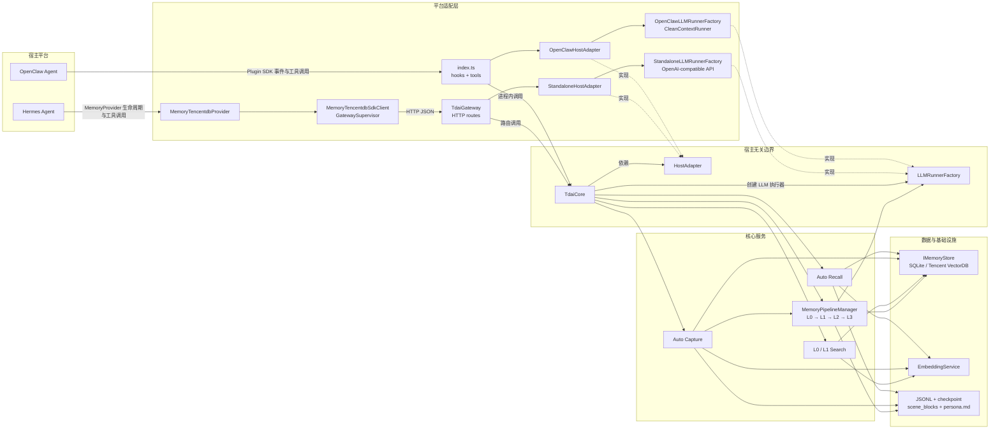
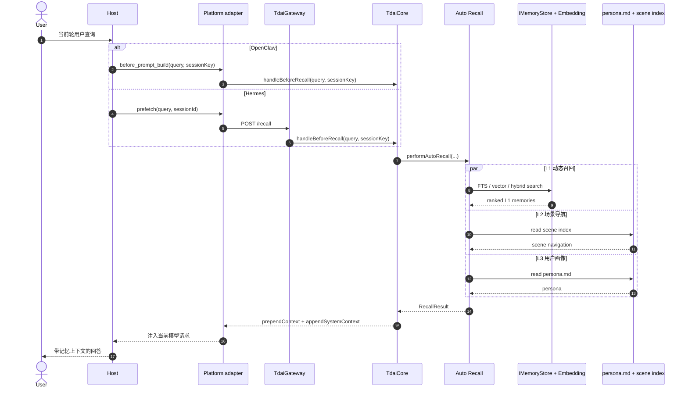
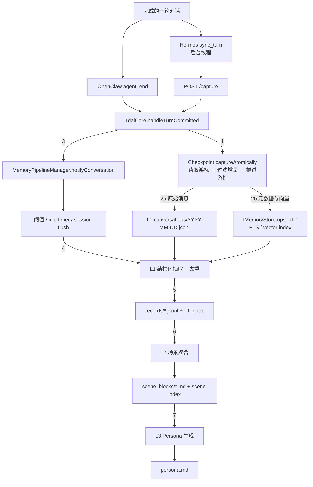

# 核心引擎与平台适配层架构

本文对应 [Issue #235](https://github.com/TencentCloud/TencentDB-Agent-Memory/issues/235) 的基础阶段，基于 `main` 分支提交 `fa830fa` 阅读源码后整理。范围仅包括现有的 OpenClaw 与 Hermes 接入方式、`TdaiCore` 能力边界，以及召回、采集、搜索和会话结束的数据流；不引入新的平台适配代码。

## 1. 边界与核心能力

`TdaiCore` 是宿主无关的门面。它不直接依赖 OpenClaw Plugin SDK 或 Hermes，构造函数通过 [`HostAdapter`](../src/core/types.ts#L154-L166) 接收运行上下文、日志和 LLM 执行工厂。实现中有一个有意保留的配置分支：OpenClaw 开启独立 `cfg.llm` 时，[`wirePipelineRunners()`](../src/core/tdai-core.ts#L404-L455) 会直接创建 `StandaloneLLMRunnerFactory` 覆盖宿主模型执行方式；平台生命周期事件仍全部留在适配层。

| `TdaiCore` 能力 | 输入 | 输出或副作用 | 当前平台入口 |
| :--- | :--- | :--- | :--- |
| [`initialize()`](../src/core/tdai-core.ts#L143-L167) | 配置、数据目录 | 初始化 Store、Embedding 与 Pipeline | OpenClaw 注册插件；Gateway 启动 |
| [`handleBeforeRecall()`](../src/core/tdai-core.ts#L244-L258) | 用户查询、`sessionKey` | 返回动态 L1 与稳定 L2/L3 上下文 | OpenClaw `before_prompt_build`；Hermes `prefetch()` → `POST /recall` |
| [`handleTurnCommitted()`](../src/core/tdai-core.ts#L265-L283) | 完整会话轮次 | 写入 L0，并通知 L1→L2→L3 Pipeline | OpenClaw `agent_end`；Hermes `sync_turn()` → `POST /capture` |
| [`searchMemories()`](../src/core/tdai-core.ts#L290-L307) | 查询、类型、场景、数量 | 搜索并格式化 L1 结构化记忆 | 两个平台的 memory-search 工具 |
| [`searchConversations()`](../src/core/tdai-core.ts#L312-L328) | 查询、会话过滤、数量 | 搜索并格式化 L0 原始对话 | 两个平台的 conversation-search 工具 |
| [`handleSessionEnd()`](../src/core/tdai-core.ts#L359-L367) | `sessionKey` | 仅刷新指定会话的待处理 L1 工作 | Hermes `on_session_end()` → `POST /session/end` |
| [`destroy()`](../src/core/tdai-core.ts#L169-L235) | 无 | 进程级销毁 Pipeline、Store 与 Embedding | OpenClaw `gateway_stop`；Gateway 进程停止 |

宿主边界包含三个接口：

- [`RuntimeContext`](../src/core/types.ts#L41-L58)：统一用户、会话、平台、工作区和数据目录。
- [`HostAdapter`](../src/core/types.ts#L154-L166)：向核心提供上下文、日志和 LLM 工厂。
- [`LLMRunnerFactory` / `LLMRunner`](../src/core/types.ts#L95-L135)：屏蔽 OpenClaw 内嵌 Agent 与 OpenAI-compatible HTTP 模型调用之间的差异。

## 2. 组件架构

实线表示运行时调用或数据访问，虚线表示接口实现关系。

这两条接入路径共享同一个 `TdaiCore` 和同一套 L0→L3 算法，差异集中在适配层：

- **OpenClaw 是进程内适配。** [`index.ts`](../index.ts#L253-L287) 创建 `OpenClawHostAdapter + TdaiCore`，Plugin SDK 的 hook 与 tool 直接调用核心；抽取任务通过 [`OpenClawLLMRunnerFactory`](../src/adapters/openclaw/llm-runner.ts#L75-L100) 使用内嵌 Agent。
- **Hermes 是跨进程适配。** Python [`MemoryTencentdbProvider`](../hermes-plugin/memory/memory_tencentdb/__init__.py#L380-L435) 把 Hermes 生命周期翻译为 HTTP，请求进入 Node.js [`TdaiGateway`](../src/gateway/server.ts#L114-L139)，再由 Gateway 调用同一个核心；抽取任务通过 [`StandaloneLLMRunnerFactory`](../src/adapters/standalone/llm-runner.ts#L283-L325) 访问 OpenAI-compatible API。
- **数据目录由核心进程持有。** OpenClaw 进程直接持有数据；Hermes Provider 不直接读写 L0～L3 文件，数据由 Gateway sidecar 持有。

## 3. 召回与搜索数据流（读路径）

`RecallResult` 中两类数据的含义不同：

- `prependContext`：每轮变化的 L1 相关记忆。
- `appendSystemContext`：变化较慢的 L2 场景导航、L3 persona 和记忆工具说明。

OpenClaw 的 [`before_prompt_build`](../index.ts#L526-L612) 会把完整结果返回给宿主。当前 `main` 上，Gateway 的 [`POST /recall`](../src/gateway/server.ts#L314-L334) 只把 `appendSystemContext` 序列化为响应中的 `context`；这是现状数据映射，而不是 `TdaiCore` 的能力限制，新平台适配时不能假定 HTTP 响应暴露了 `RecallResult` 的全部字段。

主动搜索不经过自动召回格式：OpenClaw 工具直接调用核心，Hermes 工具经 HTTP 调用核心，最终都进入 [`executeMemorySearch`](../src/core/tools/memory-search.ts#L82-L284) 或 [`executeConversationSearch`](../src/core/tools/conversation-search.ts#L83-L273)，由 Store 能力决定使用 FTS、Embedding 或 RRF Hybrid。

## 4. 会话采集与记忆演进（写路径）

关键顺序如下：

1. 平台把完整轮次转换为 [`CompletedTurn`](../src/core/types.ts#L173-L194)。OpenClaw 在 `agent_end` 中等待采集完成；Hermes 的 [`sync_turn()`](../hermes-plugin/memory/memory_tencentdb/__init__.py#L877-L947) 在线程中异步发送 `/capture`。
2. [`performAutoCapture`](../src/core/hooks/auto-capture.ts#L45-L343) 在 checkpoint 文件锁内按时间游标筛出增量消息，同时写 L0 JSONL 和 Store。SQLite 可先写元数据，再后台补 embedding；远端 Store 在 upsert 前同步生成 embedding。
3. Capture 通知 [`MemoryPipelineManager`](../src/utils/pipeline-manager.ts#L1-L73)。Pipeline 按会话串行调度，L1 由会话轮数阈值、空闲定时器或会话 flush 触发。
4. L1 从 Store（失败时回退 JSONL）读取 L0，经 LLM 抽取、冲突检测和去重后写入结构化记忆。
5. L1 完成后调度 L2，将结构化记忆聚合成场景文件；L2 再触发全局串行的 L3 persona 生成。
6. Hermes `on_session_end()` 调用 `/session/end`，核心只执行 [`flushSession(sessionKey)`](../src/core/tdai-core.ts#L359-L367)；OpenClaw `gateway_stop` 和 Gateway 进程退出才执行全局 `destroy()`。

## 5. 平台事件映射

| 语义 | OpenClaw 进程内路径 | Hermes → Gateway 路径 | 核心终点 |
| :--- | :--- | :--- | :--- |
| 初始化 | 插件注册时构造 Adapter/Core | `initialize()` 启动或连接 sidecar | `initialize()` |
| 自动召回 | `before_prompt_build` | `prefetch()` → `POST /recall` | `handleBeforeRecall()` |
| 保存轮次 | `agent_end` | `sync_turn()` → `POST /capture` | `handleTurnCommitted()` |
| L1 搜索 | `tdai_memory_search` | `memory_tencentdb_memory_search` → `POST /search/memories` | `searchMemories()` |
| L0 搜索 | `tdai_conversation_search` | `memory_tencentdb_conversation_search` → `POST /search/conversations` | `searchConversations()` |
| 单会话结束 | 无独立映射 | `on_session_end()` → `POST /session/end` | `handleSessionEnd()` |
| 宿主关闭 | `gateway_stop` | Provider `shutdown()` 关闭自己启动的 sidecar | `destroy()` |

## 6. 适配层差异与新平台约束

| 维度 | OpenClaw | Hermes |
| :--- | :--- | :--- |
| 进程边界 | 与核心同一 Node.js 进程 | Python Provider 与 Node.js Gateway 分进程 |
| 传输 | TypeScript 函数调用 | HTTP JSON，默认本机 `:8420` |
| LLM 执行 | OpenClaw 内嵌 Agent / `CleanContextRunner` | Standalone OpenAI-compatible API |
| 自动召回 | Hook 返回 `RecallResult` 给 prompt builder | 同步 `prefetch()` 返回 Gateway `context` |
| 自动采集 | `agent_end` 内等待 Core | 后台线程调用 `/capture`，避免阻塞 Hermes |
| 故障隔离 | Core 异常按 hook 降级 | Provider 有 health check、watchdog、circuit breaker 与 sidecar 重启 |
| 数据所有者 | OpenClaw 插件进程 | Gateway sidecar；Hermes Provider 不直接访问数据文件 |
| 关闭语义 | `gateway_stop` 是全局销毁 | `on_session_end` 是单会话 flush；只停止由自身拉起的 Gateway |

因此，新平台适配层至少需要明确五个映射：稳定的用户/会话身份、模型调用方式、召回注入点、成功轮次采集点、单会话结束与进程关闭的区别。平台若不与 Node.js 同进程，可以复用 Gateway HTTP 边界；若进程内接入，则应实现 `HostAdapter + LLMRunnerFactory` 并直接调用 `TdaiCore`，避免复制记忆算法。

当前会话身份主要通过各核心方法的 `sessionKey` 参数传递，而不是动态替换 `HostAdapter.getRuntimeContext()`。虽然 [`StandaloneHostAdapter.buildRuntimeContextForRequest()`](../src/adapters/standalone/host-adapter.ts#L74-L88) 已提供按请求构造上下文的能力，Gateway 路由目前没有调用它；`user_id` 存在于 HTTP 请求类型中，但尚未向下游 Core 数据路径传播。新平台若需要多租户隔离，应先明确这一身份边界，不能只把 `user_id` 放进请求体。

## 7. 源码索引

- 核心门面：[`src/core/tdai-core.ts`](../src/core/tdai-core.ts)
- 宿主接口：[`src/core/types.ts`](../src/core/types.ts)
- OpenClaw 入口：[`index.ts`](../index.ts)
- OpenClaw Adapter：[`src/adapters/openclaw/`](../src/adapters/openclaw/)
- Gateway：[`src/gateway/server.ts`](../src/gateway/server.ts)
- Standalone Adapter：[`src/adapters/standalone/`](../src/adapters/standalone/)
- Hermes Provider：[`hermes-plugin/memory/memory_tencentdb/`](../hermes-plugin/memory/memory_tencentdb/)
- 自动召回与采集：[`src/core/hooks/`](../src/core/hooks/)
- L0→L3 调度：[`src/utils/pipeline-manager.ts`](../src/utils/pipeline-manager.ts)
- Store 抽象：[`src/core/store/types.ts`](../src/core/store/types.ts)
