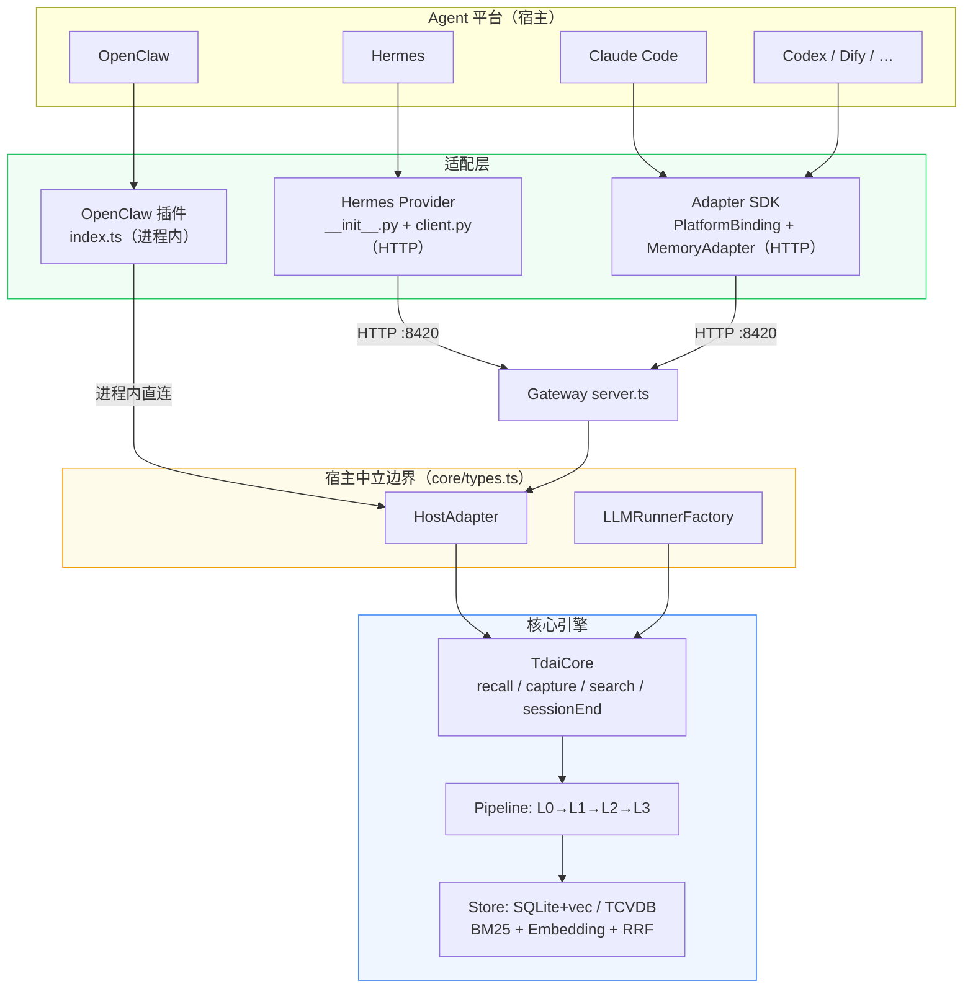
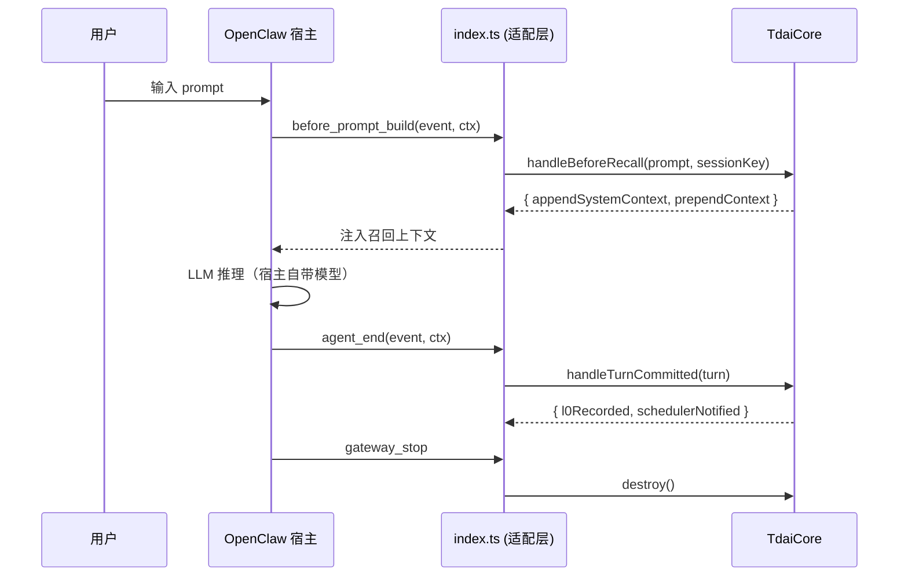
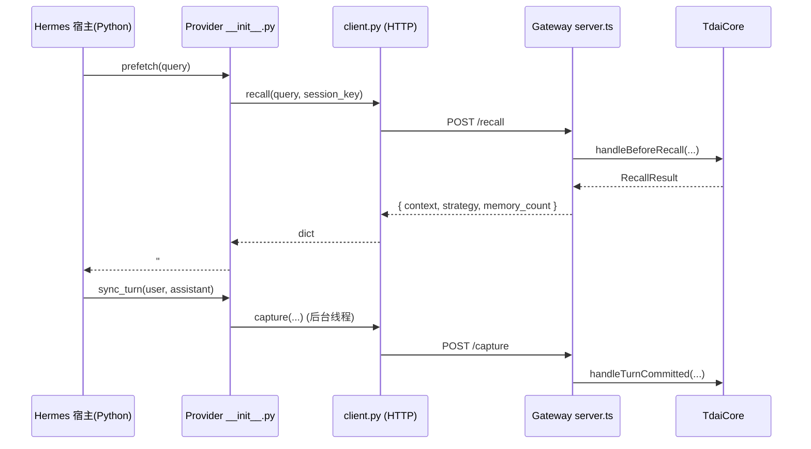
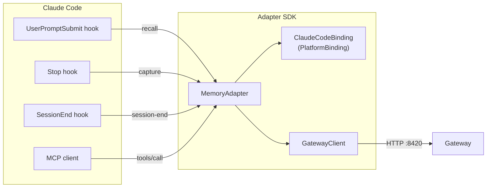

# 适配层架构与数据流（基础）

> 目标：读懂核心引擎与各平台适配层的关系，画出架构图并标注数据流。

## 1. 分层总览

TencentDB Agent Memory 采用 **核心引擎 + 适配层** 的解耦设计。核心记忆算法（L0→L1→L2→L3 四层记忆、混合检索、短期符号压缩）全部收敛在 `TdaiCore`，它**只依赖两个抽象接口**（`HostAdapter`、`LLMRunnerFactory`），从不依赖任何具体宿主。

每接入一个平台，只需提供一个「适配层」把该平台的生命周期事件翻译成 `TdaiCore` 的调用。

## 2. 核心引擎暴露的能力（`src/core/tdai-core.ts`）

`TdaiCore` 是所有平台共享的唯一入口，暴露 5 个宿主中立方法：

| 方法 | 语义 | 对应宿主事件 |
| :-- | :-- | :-- |
| `handleBeforeRecall(userText, sessionKey)` | 召回：turn 前检索相关记忆 | OpenClaw `before_prompt_build` / Hermes `prefetch()` |
| `handleTurnCommitted(turn)` | 捕获：写 L0 + 触发 L1/L2/L3 流水线 | OpenClaw `agent_end` / Hermes `sync_turn()` |
| `searchMemories(params)` | L1 结构化记忆检索（Agent 工具） | `tdai_memory_search` 工具 |
| `searchConversations(params)` | L0 原始对话检索（Agent 工具） | `tdai_conversation_search` 工具 |
| `handleSessionEnd(sessionKey)` | 单会话 flush（不销毁进程） | Hermes `on_session_end` / `POST /session/end` |

它依赖的两个抽象（`src/core/types.ts`）：

- **`HostAdapter`**：回答「当前是谁/哪个会话」(`getRuntimeContext`)、「去哪打日志」(`getLogger`)、「怎么调 LLM」(`getLLMRunnerFactory`)。
- **`LLMRunnerFactory` → `LLMRunner`**：统一的 LLM 执行接口，`enableTools:false` 出纯文本（L1），`enableTools:true` 允许文件工具（L2/L3）。

## 3. 两种既有适配范式

### 3.1 OpenClaw：进程内直连（in-process）

- 适配层 = `index.ts`（薄壳）+ `OpenClawHostAdapter`。
- LLM 复用 OpenClaw 自带 agent runtime（`OpenClawLLMRunnerFactory`）。
- 工具直接用 `api.registerTool` 注册。

### 3.2 Hermes：跨进程 HTTP（sidecar）

- 适配层 = Python `MemoryProvider` + `client.py` + Node `Gateway`（`StandaloneHostAdapter`）。
- LLM 走独立 OpenAI 兼容 HTTP（`StandaloneLLMRunnerFactory`）。
- 工具通过 `get_tool_schemas` + `handle_tool_call` 暴露给 Hermes。
- 附带熔断器、看门狗、后台线程、自动拉起 Gateway 等健壮性设施。

## 4. 新增：Claude Code（本次交付）+ 统一 SDK

新适配层复用 **Hermes 同款 HTTP Gateway**，但把「HTTP 传输 + 归一化 + 工具编排」抽成可复用的 **Adapter SDK**。新平台只需实现一个 `PlatformBinding` 接口（见 `adapter-sdk.md`）。

- **Hooks → 生命周期**：`UserPromptSubmit`→`recall`（注入 `additionalContext`）、`Stop`→`capture`（从 transcript 读最后一轮）、`SessionEnd`→`flush`。
- **MCP server → 工具**：暴露 `memory_search` / `conversation_search`。
- **通信**：全部经 `GatewayClient`（Node 内置 `fetch`，零依赖）打到 `:8420`。

## 5. Gateway REST 契约（跨平台共享的稳定边界）

所有 HTTP 适配层都依赖这份契约（`src/gateway/server.ts` + `src/gateway/types.ts`）：

| Method | Path | 请求关键字段 | 响应关键字段 |
| :-- | :-- | :-- | :-- |
| GET | `/health` | — | `status, stores` |
| POST | `/recall` | `query, session_key, user_id?` | `context, strategy, memory_count` |
| POST | `/capture` | `user_content, assistant_content, session_key, session_id?` | `l0_recorded, scheduler_notified` |
| POST | `/search/memories` | `query, limit?, type?, scene?` | `results, total, strategy` |
| POST | `/search/conversations` | `query, limit?, session_key?` | `results, total` |
| POST | `/session/end` | `session_key, user_id?` | `flushed` |
| POST | `/seed` | `data, …` | 批量导入汇总 |

> 鉴权：设置 `TDAI_GATEWAY_API_KEY` 后，除 `/health` 外均需 `Authorization: Bearer <key>`。

## 6. 关键结论

1. **核心零耦合**：`TdaiCore` 只认 `HostAdapter`/`LLMRunnerFactory`，任何平台都能接。
2. **两条接入路线**：进程内直连（Node 宿主，如 OpenClaw）或 HTTP Gateway（跨语言/跨进程，如 Hermes、Claude Code、Codex、Dify）。
3. **HTTP 路线可统一**：Gateway REST 契约稳定，因此可以抽出一个 SDK，把新平台接入成本降到「实现一个 `PlatformBinding`」。
