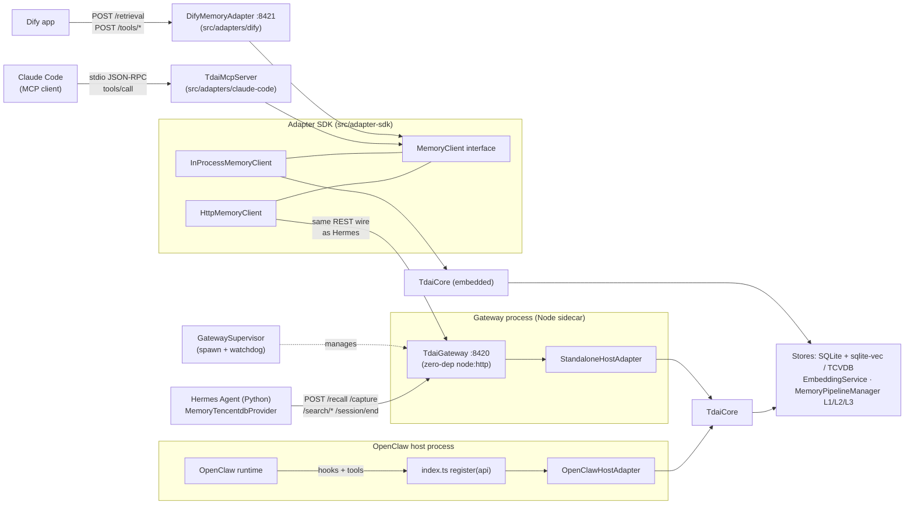
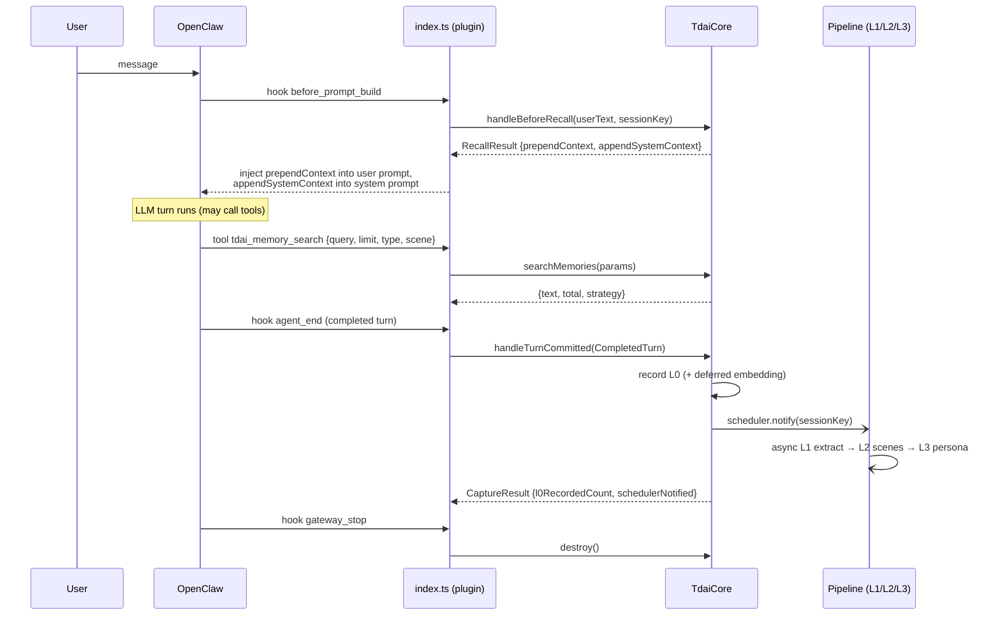
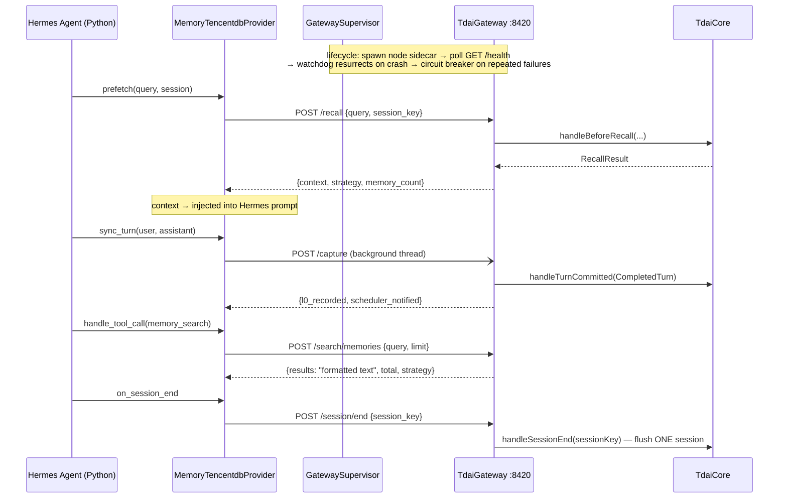
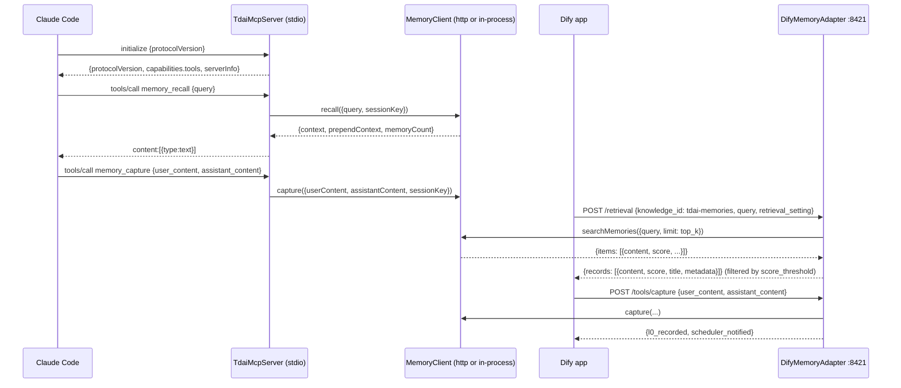
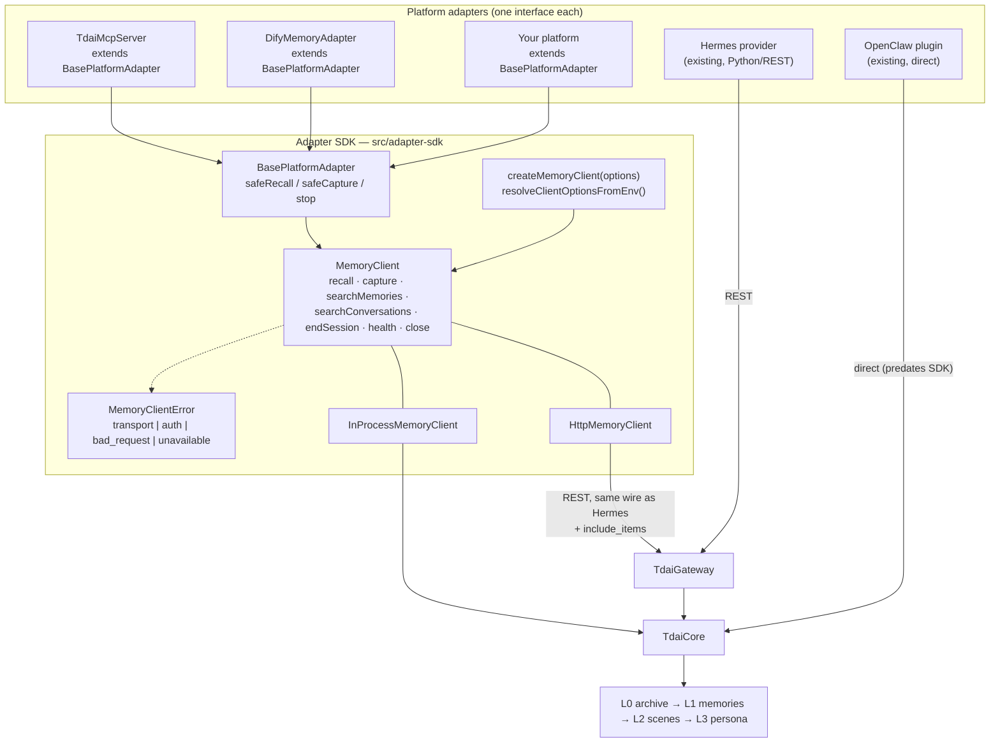

# Memory Engine × Platform Adapters — Architecture

> 中文版本见 [ARCHITECTURE_CN.md](./ARCHITECTURE_CN.md)。
> Companion docs: [Platform Comparison](./PLATFORM-COMPARISON.md) · [New Platform Guide](./NEW-PLATFORM-GUIDE.md) · [Adapter SDK README](../../src/adapter-sdk/README.md)

This document maps the real capability surface of the core memory engine (`TdaiCore`), the two
adapter layers that already ship (OpenClaw plugin, Hermes provider via the HTTP Gateway), and the
unified Adapter SDK that the two new adapters (Claude Code MCP, Dify) are built on — with
annotated data flows for each path.

---

## 1. TdaiCore capability surface

`TdaiCore` (`src/core/tdai-core.ts`) is the host-neutral facade every platform ultimately calls.
Note the **name drift**: design docs (and issue #235) speak of `recall` / `capture` / `search`,
but the shipped symbols are hook-flavored. The mapping:

| Concept | Real symbol | Signature |
| --- | --- | --- |
| recall | `handleBeforeRecall` | `(userText: string, sessionKey: string) => Promise<RecallResult>` |
| capture | `handleTurnCommitted` | `(turn: CompletedTurn) => Promise<CaptureResult>` |
| search (L1 memories) | `searchMemories` | `(p: MemorySearchParams) => Promise<{ text; total; strategy }>` |
| search (L1, structured) | `searchMemoriesStructured` | `(p: MemorySearchParams) => Promise<MemorySearchResult>` — per-record `items` with scores |
| search (L0 conversations) | `searchConversations` | `(p: ConversationSearchParams) => Promise<{ text; total }>` |
| search (L0, structured) | `searchConversationsStructured` | `(p: ConversationSearchParams) => Promise<ConversationSearchResult>` |
| session end | `handleSessionEnd` | `(sessionKey: string) => Promise<void>` — flushes ONE session, never global teardown |
| lifecycle | `initialize()` / `destroy()` | one-shot init / full teardown (stores, scheduler, background tasks) |
| accessors | `getVectorStore()` `getEmbeddingService()` `getScheduler()` `getLLMRunnerFactory()` `isSchedulerStarted()` `setInstanceId()` | for bridges, health checks, metrics |

Memory layers, in one paragraph: **L0** is the raw conversation archive (every captured user /
assistant message, FTS + optionally vector-indexed). **L1** is structured memory records
(persona / episodic / instruction facts) extracted from L0 by a background LLM pipeline. **L2**
aggregates L1 into scene blocks; **L3** distills a stable user persona. `handleBeforeRecall`
reads L1/L3 to build prompt context; `handleTurnCommitted` writes L0 and notifies the pipeline
scheduler which asynchronously advances L1→L2→L3.

The boundary types live in `src/core/types.ts`: a host supplies a `HostAdapter`
(`hostType`, `getRuntimeContext()`, `getLogger()`, `getLLMRunnerFactory()`) and receives results
as `RecallResult { prependContext?, appendSystemContext?, recalledL1Memories?, recallStrategy? }`
and `CaptureResult { l0RecordedCount, schedulerNotified, l0VectorsWritten, filteredMessages }`.

## 2. Global component map (all four platforms)

Edge annotations — what each arrow carries:

| Edge | Payload |
| --- | --- |
| OpenClaw → `index.ts` | `before_prompt_build` (recall), `agent_end` (capture), `gateway_stop` (destroy), tool calls `tdai_memory_search` / `tdai_conversation_search`, CLI `openclaw memory-tdai …` |
| Hermes → Gateway | snake_case JSON: `POST /recall {query, session_key}` · `POST /capture {user_content, assistant_content, session_key, messages?}` · `POST /search/memories` · `POST /search/conversations` · `POST /session/end` · `POST /seed` · `GET /health` |
| Claude Code → MCP server | newline-delimited JSON-RPC 2.0: `initialize`, `tools/list`, `tools/call {memory_recall, memory_capture, memory_search, conversation_search, memory_session_end}` |
| Dify → Dify adapter | `POST /retrieval {knowledge_id, query, retrieval_setting}` (External Knowledge API) · `POST /tools/capture` · `POST /tools/recall` · `GET /openapi.json` |
| SDK http transport → Gateway | identical wire to Hermes, plus opt-in `include_items: true` on the two search routes (returns structured `items` next to the formatted text) |

## 3. Data flow A — OpenClaw plugin (in-process)

Key property: everything is **in-process and hook-driven** — recall/capture are automatic,
invisible to the model except through the injected context. The plugin also registers a CLI and
an optional offload module; the LLM used by the extraction pipeline defaults to the *host's* runner.

## 4. Data flow B — Hermes provider ⇄ HTTP Gateway (out-of-process)

Key properties: the wire is **snake_case JSON**; auth is optional Bearer
(`TDAI_GATEWAY_API_KEY`, constant-time compare); failures on the Python side are absorbed by a
circuit breaker so memory never blocks the agent. The Gateway builds its core with
`StandaloneHostAdapter`, so extraction uses a standalone OpenAI-compatible LLM config instead of
a host runner.

Gateway ⇄ core field mapping (the "translation table" every HTTP-based adapter inherits):

| Wire (snake_case) | Core (camelCase) |
| --- | --- |
| `query`, `session_key` | `handleBeforeRecall(userText, sessionKey)` |
| `context` ← | `RecallResult.appendSystemContext ?? ""` |
| `prepend_context?` ← | `RecallResult.prependContext` (additive; sent only when non-empty — legacy clients ignore it) |
| `memory_count` ← | `RecallResult.recalledL1Memories.length` |
| `user_content` / `assistant_content` / `messages?` | `CompletedTurn.userText / assistantText / messages` (defaulted to the 2-message pair) |
| `l0_recorded` / `scheduler_notified` ← | `CaptureResult.l0RecordedCount / schedulerNotified` |
| `include_items: true` (opt-in) | routes to `search*Structured`, response gains `items[]` |

## 5. Data flow C — the two new adapters on the SDK

Both adapters consume **only** the `MemoryClient` interface — they cannot tell whether it is the
HTTP transport (Gateway sidecar, like Hermes) or the in-process transport (embedded core, like
OpenClaw). That symmetry is the point of the SDK.

## 6. Target architecture — the unified Adapter SDK

Contract summary:

- **New platform = implement ONE interface.** `PlatformAdapter { platformName; start(); stop() }`,
  in practice `class X extends BasePlatformAdapter` + map your platform's lifecycle onto
  `this.client` / `this.safeRecall` / `this.safeCapture`.
- **One client interface, two transports.** `createMemoryClient({transport: "http" | "in-process", ...})`.
  Transport choice is deployment configuration, not adapter code.
- **Uniform failure semantics.** All client methods throw `MemoryClientError` with a stable
  `code`; `safeRecall`/`safeCapture` degrade instead of throwing, encoding the project rule that
  *memory must never break the host conversation*.

## 7. Where to go next

- Per-platform trade-offs and how the four integrations differ: [PLATFORM-COMPARISON.md](./PLATFORM-COMPARISON.md)
- Step-by-step onboarding for a fifth platform: [NEW-PLATFORM-GUIDE.md](./NEW-PLATFORM-GUIDE.md)
- SDK API reference and usage: [src/adapter-sdk/README.md](../../src/adapter-sdk/README.md)
- Adapter setup: [Claude Code](../../src/adapters/claude-code/README.md) · [Dify](../../src/adapters/dify/README.md)
