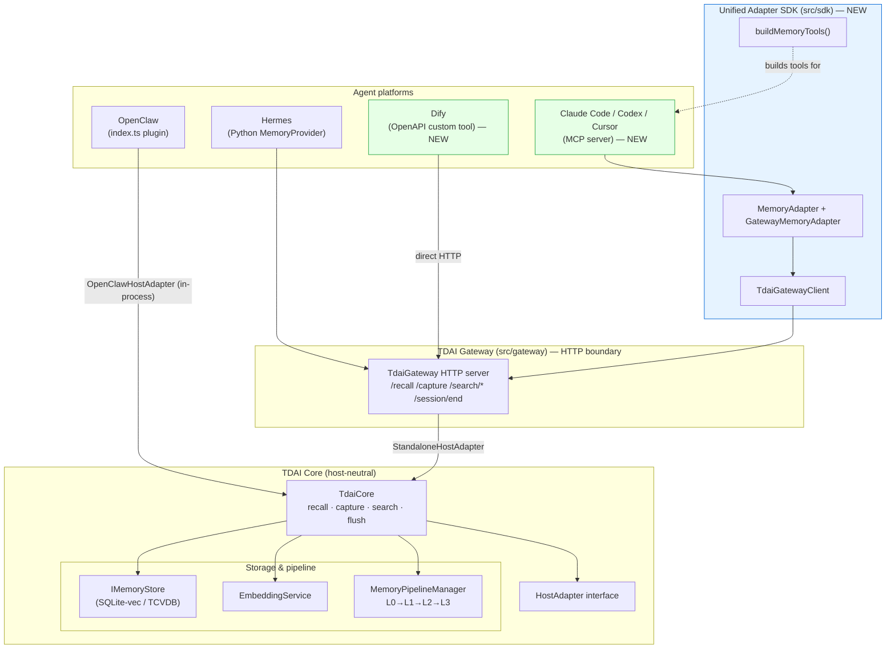
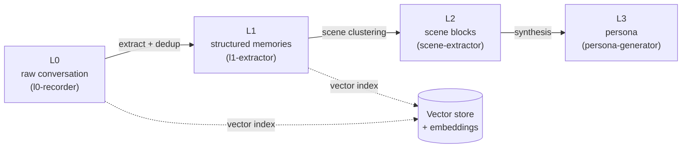
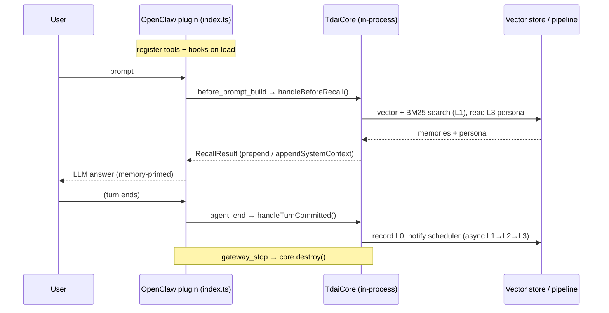
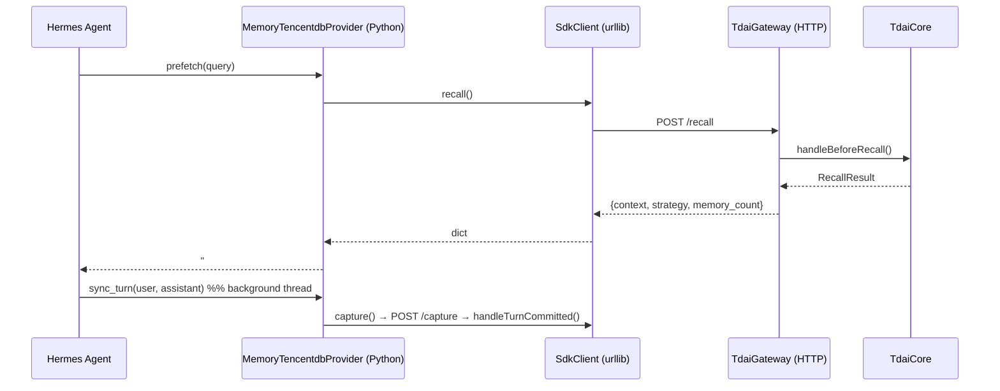
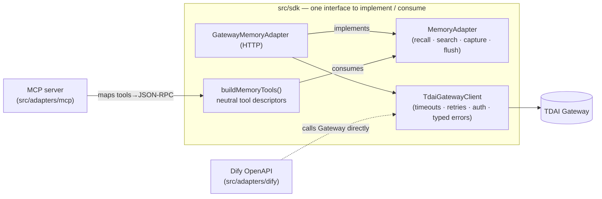

# TDAI Memory — Core Engine & Adapter Architecture

> Deliverable for [issue #235](https://github.com/TencentCloud/TencentDB-Agent-Memory/issues/235).
> This document maps the host-neutral memory core and every platform adapter,
> and annotates the read (recall) and write (capture) data flows.

## 1. The big picture

TDAI separates **memory algorithms** from **the host that consumes them**. One
engine (`TdaiCore`) is reached two ways: **in-process** (OpenClaw) or across an
**HTTP boundary** (the Gateway, used by Hermes and — new in this work — the MCP
and Dify adapters).

Everything above the Gateway is a **thin translator**; everything from the
Gateway down is the shared engine.

## 2. Core engine capabilities (`TdaiCore`)

`src/core/tdai-core.ts` is the single facade both integration styles call. It
depends only on abstract interfaces (`HostAdapter`, `LLMRunner`), never on a
concrete host.

| Method | Kind | Purpose | OpenClaw event | Hermes / Gateway |
| :----- | :--- | :------ | :------------- | :--------------- |
| `handleBeforeRecall(text, sessionKey)` | read | Retrieve memory context for a turn | `before_prompt_build` hook | `prefetch()` → `POST /recall` |
| `handleTurnCommitted(turn)` | write | Persist a turn, trigger the pipeline | `agent_end` hook | `sync_turn()` → `POST /capture` |
| `searchMemories(params)` | read | Search L1 structured memories | `tdai_memory_search` tool | `POST /search/memories` |
| `searchConversations(params)` | read | Search L0 raw dialogue | `tdai_conversation_search` tool | `POST /search/conversations` |
| `handleSessionEnd(sessionKey)` | write | Flush one session's buffered work | (process exit → `destroy`) | `on_session_end` → `POST /session/end` |
| `initialize()` / `destroy()` | lifecycle | Bring up / tear down stores & scheduler | plugin load / `gateway_stop` | Gateway start / stop |

### The host-neutral seam: `HostAdapter`

`TdaiCore` asks the host only three questions (`src/core/types.ts`):

- **Who is the user/session?** → `getRuntimeContext(): RuntimeContext`
- **How do I call an LLM?** → `getLLMRunnerFactory(): LLMRunnerFactory`
- **Where do I log?** → `getLogger(): Logger`

Two implementations exist today: `OpenClawHostAdapter` (wraps the OpenClaw
plugin API, runs the LLM in-process) and `StandaloneHostAdapter` (Gateway;
OpenAI-compatible HTTP LLM calls). **The new adapters do not add a third** —
they sit above the Gateway, which already uses `StandaloneHostAdapter`.

### The four memory layers

`handleTurnCommitted` feeds a background pipeline (`MemoryPipelineManager`):

Reads hit L0/L1 (search) and L1+L3 (recall); writes land in L0 and cascade
upward asynchronously.

## 3. Existing adapter #1 — OpenClaw (in-process)

`index.ts` is the OpenClaw Plugin SDK entry. It constructs an
`OpenClawHostAdapter` + `TdaiCore` **in the same process** and bridges OpenClaw
events to core methods.

- **Coupling:** deep — hooks into `before_prompt_build` / `agent_end`, registers
  `tdai_memory_search` + `tdai_conversation_search` tools, shares the LLM runner.
- **Transport:** none (direct method calls).
- **Language:** TypeScript.

## 4. Existing adapter #2 — Hermes (HTTP provider)

The Gateway (`src/gateway/server.ts`) re-exposes `TdaiCore` over HTTP. Hermes
runs a **Python** `MemoryProvider` that speaks to it via a small HTTP client.

- **Coupling:** medium — implements Hermes's `MemoryProvider` (prefetch,
  sync_turn, handle_tool_call, tool schemas, session end).
- **Transport:** HTTP to a **managed Gateway sidecar** the provider can spawn,
  health-check, and auto-resurrect (circuit breaker + watchdog).
- **Language:** Python (client) + TypeScript (Gateway).

## 5. New adapters (this work) — MCP & Dify via the unified SDK

The Gateway boundary is the natural extension point for any non-OpenClaw host.
This work distills that boundary into a reusable **SDK** (`src/sdk/`) and builds
two adapters on top:

- **MCP adapter** (`src/adapters/mcp/`): a pure JSON-RPC 2.0 stdio server that
  turns `buildMemoryTools()` output into MCP tools. One server → Claude Code,
  Codex, Cursor, Cline, Windsurf.
- **Dify adapter** (`src/adapters/dify/`): a declarative OpenAPI schema Dify
  imports; Dify calls the Gateway directly (the SDK client documents the exact
  contract).

Both reuse the same Gateway and store as OpenClaw and Hermes — one memory,
many platforms. See [`COMPARISON.md`](./COMPARISON.md) for the trade-offs and
[`ADDING-A-PLATFORM.md`](./ADDING-A-PLATFORM.md) for the recipe.
