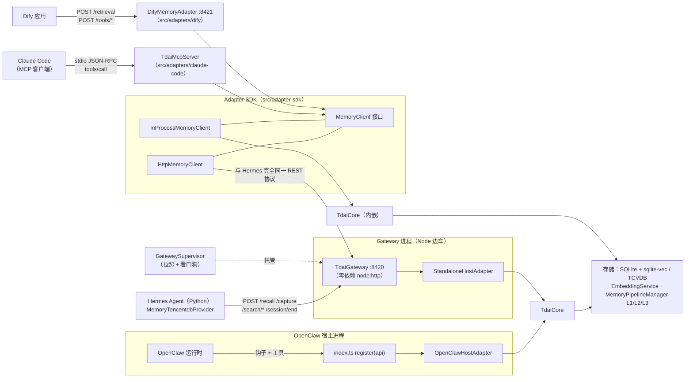
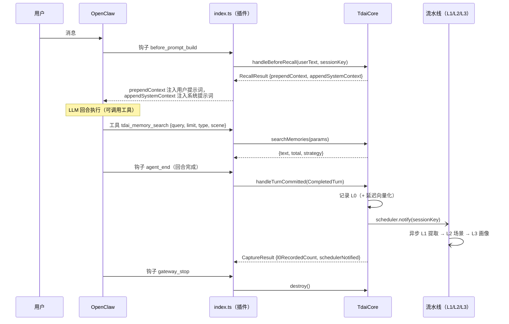
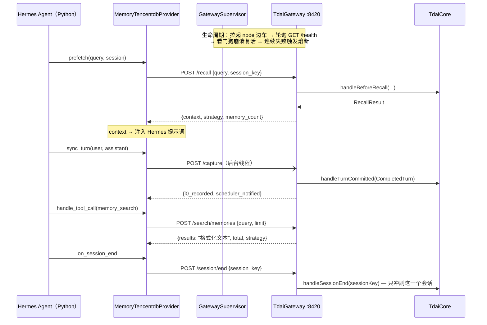
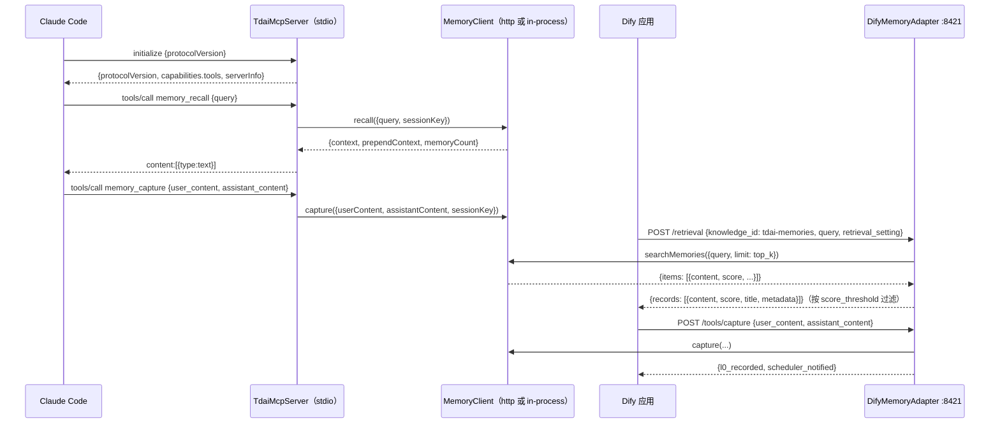
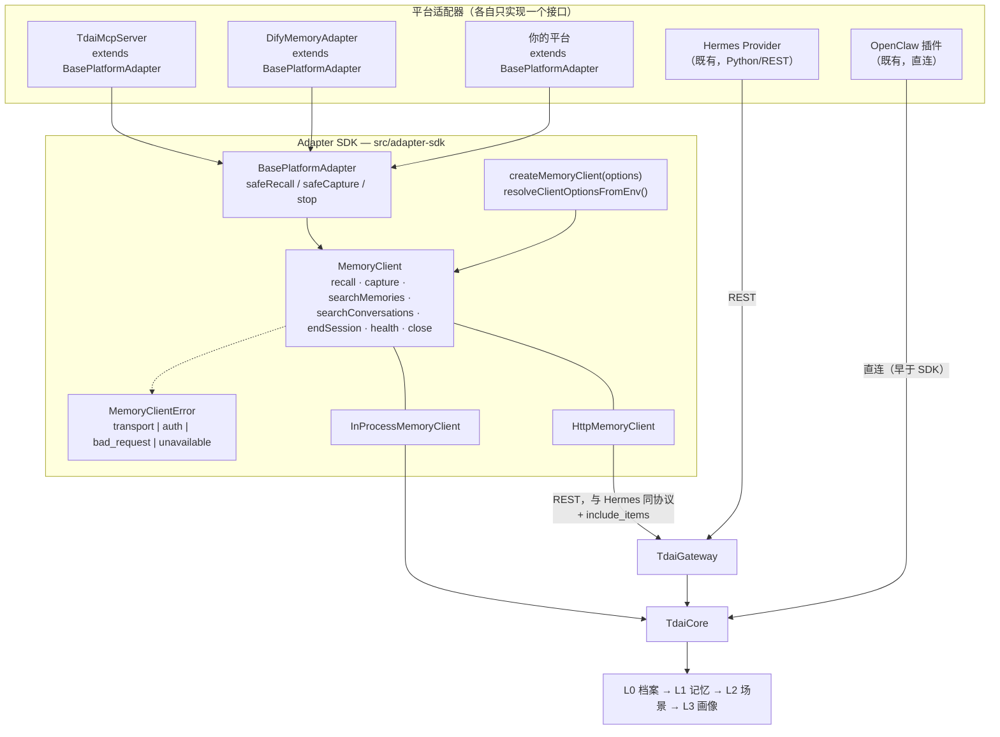

# 记忆引擎 × 平台适配层 — 架构说明

> English version: [ARCHITECTURE.md](./ARCHITECTURE.md)。
> 配套文档：[平台对比](./PLATFORM-COMPARISON_CN.md) · [新平台接入指南](./NEW-PLATFORM-GUIDE_CN.md) · [Adapter SDK 说明](../../src/adapter-sdk/README_CN.md)

本文梳理核心记忆引擎（`TdaiCore`）的真实能力边界、当前已交付的两条适配层（OpenClaw 插件、经
HTTP Gateway 的 Hermes Provider），以及两个新适配器（Claude Code MCP、Dify）所依托的统一
Adapter SDK，并对每条链路标注数据流。

---

## 1. TdaiCore 能力面

`TdaiCore`（`src/core/tdai-core.ts`）是所有平台最终调用的宿主无关门面。注意**命名漂移**：
设计文档（以及 issue #235）里说的是 `recall` / `capture` / `search`，而实际交付的符号带有
钩子风格。对应关系如下：

| 概念 | 真实符号 | 签名 |
| --- | --- | --- |
| recall（召回） | `handleBeforeRecall` | `(userText: string, sessionKey: string) => Promise<RecallResult>` |
| capture（捕获） | `handleTurnCommitted` | `(turn: CompletedTurn) => Promise<CaptureResult>` |
| search（L1 记忆） | `searchMemories` | `(p: MemorySearchParams) => Promise<{ text; total; strategy }>` |
| search（L1 结构化） | `searchMemoriesStructured` | `(p: MemorySearchParams) => Promise<MemorySearchResult>` — 返回带分数的逐条 `items` |
| search（L0 对话） | `searchConversations` | `(p: ConversationSearchParams) => Promise<{ text; total }>` |
| search（L0 结构化） | `searchConversationsStructured` | `(p: ConversationSearchParams) => Promise<ConversationSearchResult>` |
| 会话结束 | `handleSessionEnd` | `(sessionKey: string) => Promise<void>` — 只冲刷单个会话，绝非全局销毁 |
| 生命周期 | `initialize()` / `destroy()` | 一次性初始化 / 全量销毁（存储、调度器、后台任务） |
| 访问器 | `getVectorStore()` `getEmbeddingService()` `getScheduler()` `getLLMRunnerFactory()` `isSchedulerStarted()` `setInstanceId()` | 供桥接、健康检查、指标上报使用 |

一段话讲清记忆分层：**L0** 是原始对话档案（每条被捕获的 user / assistant 消息，FTS 索引 +
可选向量索引）。**L1** 是由后台 LLM 流水线从 L0 提取的结构化记忆（persona / episodic /
instruction 事实）。**L2** 把 L1 聚合成场景块；**L3** 蒸馏出稳定的用户画像。
`handleBeforeRecall` 读取 L1/L3 组装提示词上下文；`handleTurnCommitted` 写入 L0 并通知
流水线调度器，后者异步推进 L1→L2→L3。

边界类型定义在 `src/core/types.ts`：宿主提供 `HostAdapter`（`hostType`、
`getRuntimeContext()`、`getLogger()`、`getLLMRunnerFactory()`），并以
`RecallResult { prependContext?, appendSystemContext?, recalledL1Memories?, recallStrategy? }`、
`CaptureResult { l0RecordedCount, schedulerNotified, l0VectorsWritten, filteredMessages }` 接收结果。

## 2. 全局组件图（四个平台）

边注 — 每条箭头承载的内容：

| 边 | 载荷 |
| --- | --- |
| OpenClaw → `index.ts` | `before_prompt_build`（召回）、`agent_end`（捕获）、`gateway_stop`（销毁）、工具调用 `tdai_memory_search` / `tdai_conversation_search`、CLI `openclaw memory-tdai …` |
| Hermes → Gateway | snake_case JSON：`POST /recall {query, session_key}` · `POST /capture {user_content, assistant_content, session_key, messages?}` · `POST /search/memories` · `POST /search/conversations` · `POST /session/end` · `POST /seed` · `GET /health` |
| Claude Code → MCP 服务器 | 换行分隔的 JSON-RPC 2.0：`initialize`、`tools/list`、`tools/call {memory_recall, memory_capture, memory_search, conversation_search, memory_session_end}` |
| Dify → Dify 适配器 | `POST /retrieval {knowledge_id, query, retrieval_setting}`（外部知识库 API）· `POST /tools/capture` · `POST /tools/recall` · `GET /openapi.json` |
| SDK http 传输 → Gateway | 与 Hermes 同一协议，另在两个搜索路由上可选发送 `include_items: true`（响应在格式化文本之外附带结构化 `items`） |

## 3. 数据流 A — OpenClaw 插件（进程内）

关键性质：一切都是**进程内、钩子驱动** — 召回/捕获全自动，模型只能通过注入的上下文感知。
插件还注册了 CLI 与可选的 offload 模块；提取流水线的 LLM 默认使用*宿主*的运行器。

## 4. 数据流 B — Hermes Provider ⇄ HTTP Gateway（跨进程）

关键性质：协议为 **snake_case JSON**；鉴权为可选 Bearer（`TDAI_GATEWAY_API_KEY`，常量时间
比较）；Python 侧的失败由熔断器吸收，记忆永远不会阻塞 Agent。Gateway 用
`StandaloneHostAdapter` 构建内核，因此提取用的是独立配置的 OpenAI 兼容 LLM，而非宿主运行器。

Gateway ⇄ 内核字段映射（所有基于 HTTP 的适配器共享的「翻译表」）：

| 协议字段（snake_case） | 内核（camelCase） |
| --- | --- |
| `query`、`session_key` | `handleBeforeRecall(userText, sessionKey)` |
| `context` ← | `RecallResult.appendSystemContext ?? ""` |
| `prepend_context?` ← | `RecallResult.prependContext`（增量字段，非空才下发；旧客户端可忽略） |
| `memory_count` ← | `RecallResult.recalledL1Memories.length` |
| `user_content` / `assistant_content` / `messages?` | `CompletedTurn.userText / assistantText / messages`（缺省合成双消息对） |
| `l0_recorded` / `scheduler_notified` ← | `CaptureResult.l0RecordedCount / schedulerNotified` |
| `include_items: true`（可选） | 路由到 `search*Structured`，响应新增 `items[]` |

## 5. 数据流 C — 构建在 SDK 上的两个新适配器

两个适配器**只**消费 `MemoryClient` 接口 — 它们无从分辨背后是 HTTP 传输（Gateway 边车，
同 Hermes 部署形态）还是进程内传输（内嵌内核，同 OpenClaw 形态）。这种对称性正是 SDK 的意义。

## 6. 目标架构 — 统一 Adapter SDK

契约小结：

- **新平台 = 实现一个接口。** `PlatformAdapter { platformName; start(); stop() }`，实践中即
  `class X extends BasePlatformAdapter`，把平台生命周期映射到 `this.client` /
  `this.safeRecall` / `this.safeCapture`。
- **一个客户端接口，两种传输。** `createMemoryClient({transport: "http" | "in-process", ...})`。
  传输选择是部署配置，不是适配器代码。
- **统一失败语义。** 客户端方法统一抛 `MemoryClientError`（稳定 `code`）；
  `safeRecall`/`safeCapture` 以降级替代抛错，落实项目铁律：*记忆永远不能弄坏宿主对话*。

## 7. 延伸阅读

- 四个平台的接入差异与取舍：[PLATFORM-COMPARISON_CN.md](./PLATFORM-COMPARISON_CN.md)
- 第五个平台的分步接入指南：[NEW-PLATFORM-GUIDE_CN.md](./NEW-PLATFORM-GUIDE_CN.md)
- SDK API 参考与用法：[src/adapter-sdk/README_CN.md](../../src/adapter-sdk/README_CN.md)
- 适配器部署：[Claude Code](../../src/adapters/claude-code/README_CN.md) · [Dify](../../src/adapters/dify/README_CN.md)
