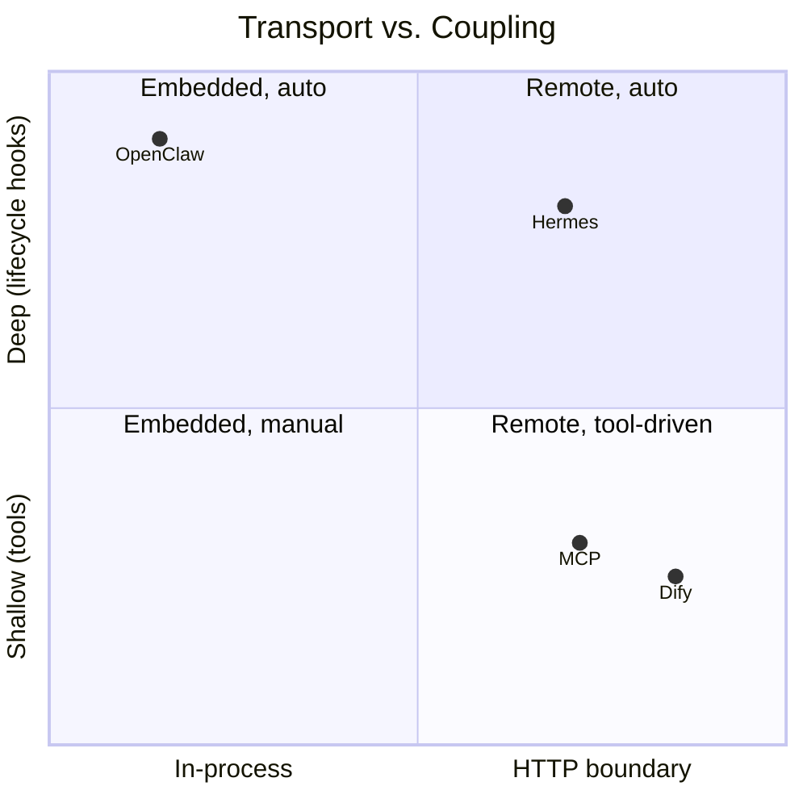
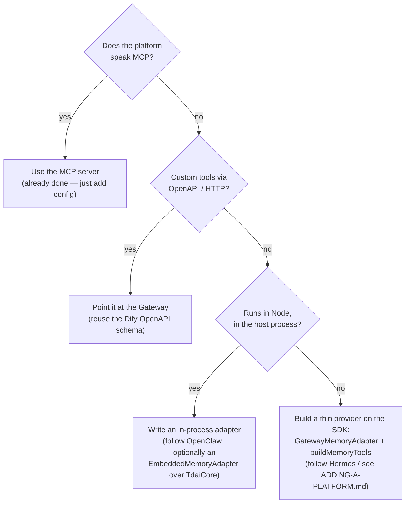

# Adapter Comparison — Four Ways to Give a Platform TDAI Memory

> Deliverable for [issue #235](https://github.com/TencentCloud/TencentDB-Agent-Memory/issues/235).
> Compares the two pre-existing adapters (OpenClaw, Hermes) with the two added
> in this work (MCP, Dify), and gives a decision guide for the next platform.

## At a glance

| Dimension | **OpenClaw** | **Hermes** | **MCP** (new) | **Dify** (new) |
| :-------- | :----------- | :--------- | :------------ | :------------- |
| Integration style | In-process plugin | HTTP provider | HTTP via stdio bridge | Declarative HTTP |
| Reaches core via | `TdaiCore` directly | Gateway | Gateway (SDK) | Gateway (direct) |
| Transport | none (calls) | HTTP + urllib | JSON-RPC 2.0 / stdio | HTTP (OpenAPI) |
| Language | TypeScript | Python | TypeScript | YAML (no code) |
| Process model | shared with host | managed sidecar | child of host | remote call |
| Coupling to host | **deep** (hooks) | medium (provider) | **shallow** (tools) | **shallow** (tools) |
| Auto memory capture | ✅ `agent_end` hook | ✅ `sync_turn` | ⚠️ tool-call `tdai_capture` | ⚠️ workflow node |
| Auto recall injection | ✅ `before_prompt_build` | ✅ `prefetch` | ⚠️ `tdai_recall` tool | ⚠️ workflow node |
| Hosts unlocked per adapter | 1 | 1 | **many** (any MCP host) | 1 (Dify) |
| New code to maintain | whole plugin | whole provider | ~1 server on the SDK | **none** (schema) |
| Lives in | `index.ts` | `hermes-plugin/` | `src/adapters/mcp/` | `src/adapters/dify/` |

Legend: ✅ automatic/implicit · ⚠️ available but model/workflow-driven.

## The two axes

Every integration is a point on two independent axes:

1. **Transport** — how bytes reach the engine: *in-process* (OpenClaw) vs.
   *HTTP* (everyone else, through the Gateway).
2. **Coupling** — how tightly the adapter hooks into the host's turn lifecycle:
   *deep* (lifecycle hooks that auto-recall/auto-capture) vs. *shallow* (the
   memory surface is just tools the model or a workflow invokes).

**Why this matters:** deep coupling buys *implicit* memory (every turn is
recalled and captured with no model effort) at the cost of host-specific hook
code. Shallow coupling (MCP/Dify) is trivial to add and portable, but recall and
capture happen only when the agent *decides* to call the tool — or when a
workflow wires them in explicitly.

## Trade-offs in prose

### OpenClaw — deepest, richest, least portable
Runs inside the host, so it can hook `before_prompt_build`/`agent_end` and make
memory invisible and automatic, sharing the host's own LLM. That power is also
its cost: it is bound to OpenClaw's plugin API and reusable nowhere else.

### Hermes — the template for going remote
First proof that the Gateway boundary works: a Python provider translating
Hermes lifecycle calls into HTTP. It still auto-recalls/auto-captures (via
`prefetch`/`sync_turn`), and it invests heavily in **operational resilience** —
spawning, health-checking, and resurrecting the Gateway sidecar (circuit
breaker + watchdog). Great for one platform; that machinery is re-implemented
per platform.

### MCP — one adapter, many hosts
The highest-leverage addition. MCP is a shared standard, so a single stdio
server exposes TDAI to Claude Code, Codex, Cursor, Cline, and Windsurf at once.
Coupling is shallow (memory shows up as four tools), which keeps the adapter
tiny — it is ~2 files of protocol glue over the SDK, with **zero** bespoke
transport code. Trade-off: no lifecycle hooks, so recall/capture are tools the
model chooses to call rather than automatic steps.

### Dify — zero-code, declarative
The lightest of all: an OpenAPI schema Dify imports. No process to run, no code
to maintain — Dify calls the Gateway directly. Ideal for teams already building
on Dify. Trade-off: bound to Dify, and (like MCP) tool/workflow-driven rather
than hook-driven.

## Which should the next platform use?

**Rule of thumb:** prefer the Gateway boundary and the unified SDK unless you
specifically need implicit, hook-driven memory — in which case pay for deep
coupling like OpenClaw. Most modern agent platforms already speak MCP, so for
them "adding TDAI memory" is now **configuration, not code**.
