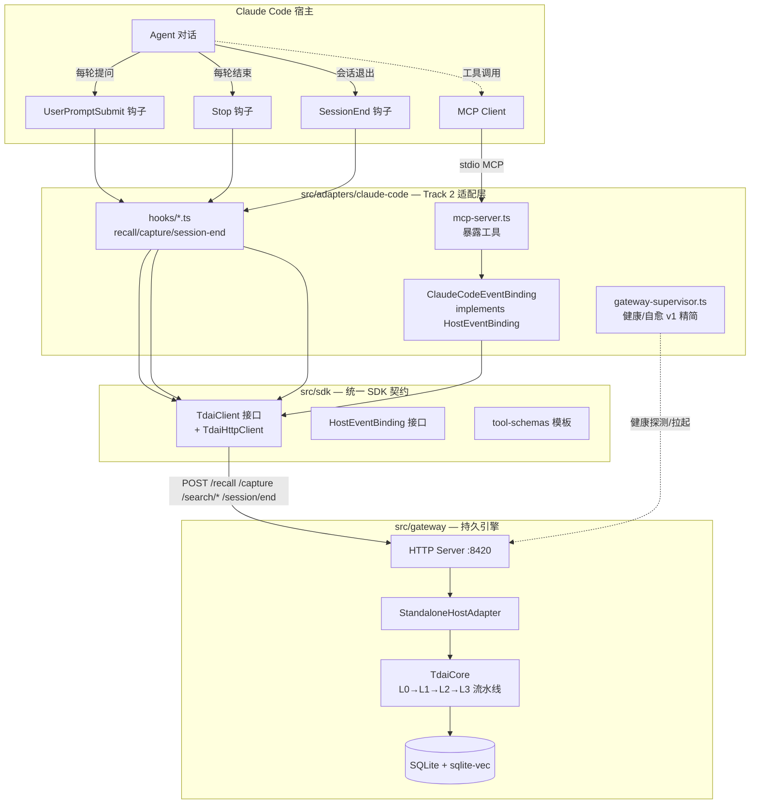

# 适配器架构总览

TencentDB-Agent-Memory 的核心记忆引擎 [`TdaiCore`](../../src/core/tdai-core.ts) 是宿主中立的：它只认 [`HostAdapter`](../../src/core/types.ts) 接口（`hostType` / `getRuntimeContext()` / `getLogger()` / `getLLMRunnerFactory()`），不关心宿主是谁。每接入一个 Agent 平台，就要写一层「适配器」把该平台的事件、工具、生命周期翻译成 `TdaiCore` 能理解的形式。

目前有三种接入路径，所有路径最终都落到同一个 `TdaiCore`，记忆互通：

| 路径 | 引擎位置 | 宿主侧载体 | 适用平台 |
|---|---|---|---|
| **Pattern A** 进程内 | 宿主进程内 | 实现 `HostAdapter` + 注册钩子/工具 | OpenClaw |
| **Pattern B-Python** 进程外 | HTTP Gateway | Python `MemoryProvider`（HTTP 客户端） | Hermes |
| **Pattern B-MCP** 进程外 | HTTP Gateway | TS MCP server + hooks（HTTP 客户端） | Claude Code、Codex |

> 进阶说明：Pattern B 的两条路（Python / MCP）在拓展阶段会统一到 [`HostEventBinding`](../../src/sdk/event-binding.ts) + [`TdaiClient`](../../src/sdk/client.ts) 两个 SDK 接口上——新平台接入只需实现 `HostEventBinding` 的 4 个方法 + 选语言对应的 `TdaiClient` 实现。

---

## 架构图

上图是 Claude Code（Pattern B-MCP）的视角。OpenClaw（Pattern A）的对应关系：`ADP` 层换成 `index.ts` + `OpenClawHostAdapter`，直接调 `TdaiCore` 方法而非 HTTP；`GW` 层消失（引擎在宿主进程内）。Hermes（Pattern B-Python）的对应关系：`ADP` 层换成 `hermes-plugin/.../MemoryTencentdbProvider`（Python），`SDK` 层换成 `hermes-plugin/.../client.py`，`SUP` 换成 `GatewaySupervisor`（带 Popen 拉起 + 熔断 + 看门狗）。

---

## 数据流

四条主路径，跨三种接入模式语义一致：

- **Recall（自动）**：用户提问 → 宿主「提问前」事件 → `TdaiClient.recall()` → `POST /recall` → 返回记忆注入到提示（Pattern A 直接调 `TdaiCore.handleBeforeRecall`）。
- **Capture（自动）**：对话轮结束 → 宿主「轮结束」事件 → `TdaiClient.capture()` → `POST /capture` → L0 入库 + L1/L2/L3 流水线异步调度。
- **Tool（显式）**：Agent 显式调用记忆工具 → MCP server（或 OpenClaw 工具注册）→ `TdaiClient.searchMemories()` / `searchConversations()` → `POST /search/*`。
- **SessionEnd**：会话退出 → 宿主「会话结束」事件 → `TdaiClient.endSession()` → `POST /session/end` → flush 当前会话状态。

各路径事件名对照：

| 路径 | Recall 事件 | Capture 事件 | SessionEnd 事件 |
|---|---|---|---|
| Pattern A (OpenClaw) | `before_prompt_build` | `agent_end` | `gateway_stop` |
| Pattern B-Python (Hermes) | `prefetch`（记忆前置） | `sync_turn` | `on_session_end` |
| Pattern B-MCP (Claude Code) | `UserPromptSubmit` 钩子 | `Stop` 钩子 | `SessionEnd` 钩子 |

---

## 三平台对照

| 维度 | Pattern A (OpenClaw) | Pattern B (Hermes) | Pattern B-MCP (Claude Code) |
|---|---|---|---|
| 引擎位置 | 宿主进程内 | 进程外 Gateway | 进程外 Gateway |
| 实现 `HostAdapter`? | 是（`OpenClawHostAdapter`） | 否（宿主侧仅 HTTP 客户端） | 否（宿主侧仅 HTTP 客户端） |
| 宿主侧载体 | `index.ts` + Plugin SDK 钩子 | Python `MemoryProvider` | TS MCP server + hooks |
| 宿主侧事件绑定 | `api.on(before_prompt_build/agent_end)` | `prefetch/sync_turn/on_session_end` | `UserPromptSubmit/Stop/SessionEnd` 钩子 |
| 传输 | 进程内直接调用 | HTTP（`client.py`） | HTTP（`TdaiHttpClient`） |
| 鉴权 | 无（同进程信任） | Bearer（`MEMORY_TENCENTDB_GATEWAY_API_KEY`→`TDAI_GATEWAY_API_KEY`） | Bearer（`TDAI_MCP_API_KEY`→`TDAI_GATEWAY_API_KEY`） |
| 生命周期管理 | 跟随宿主 | `GatewaySupervisor` + 熔断 + 看门狗 | v1 精简 supervisor（熔断留待拓展析出） |
| 工具暴露 | Plugin SDK 工具注册 | Hermes 工具 schema | MCP stdio server |
| 优点 | 零网络开销、配置最简 | 跨语言、进程隔离、可独立重启 | 跨语言、按 MCP 标准接入多个宿主 |
| 缺点 | 仅限 OpenClaw 宿主 | 需 Python 运行时 | 需宿主支持 MCP + hooks |

选型建议：宿主是 OpenClaw 选 Pattern A；宿主是 Python 生态选 Pattern B-Python（参考 `hermes-plugin/`）；宿主支持 MCP 且非 Python（Claude Code、Codex 等）选 Pattern B-MCP。

---

## 文档索引

- [`claude-code-adapter-design.md`](./claude-code-adapter-design.md) — Claude Code 适配器设计 spec（架构、接口契约、错误处理、测试策略）
- [`claude-code-adapter-plan.md`](./claude-code-adapter-plan.md) — 实现计划（4 阶段 20 步，每步带验收点）
- [`platform-comparison.md`](./platform-comparison.md) — 三平台深度对比文档（Pattern A vs B-Python vs B-MCP）
- [`../../src/sdk/README.md`](../../src/sdk/README.md) — 统一适配器 SDK 接入指南（Track 1 vs Track 2 + 最小 EventBinding 骨架）

宿主侧使用文档：

- OpenClaw：根目录 [`README_CN.md`](../../README_CN.md)
- Hermes：[`hermes-plugin/memory/memory_tencentdb/`](../../hermes-plugin/memory/memory_tencentdb/)
- Claude Code：[`src/adapters/claude-code/README.md`](../../src/adapters/claude-code/README.md)
- Dify：[`dify-plugin/README.md`](../../dify-plugin/README.md)（demo 级 EventBinding）

---

## 当前状态

| 阶段 | 状态 | 交付物 |
|---|---|---|
| 基础 | ✅ 完成 | 本 README（架构图 + 数据流 + 对照表） |
| 进阶核心 | ✅ 完成 | `src/sdk/` + `src/adapters/claude-code/` MCP 工具实现记忆读写 |
| 深入 | ✅ 完成 | Claude Code hooks（recall/capture/session-end）+ Codex 配置验证 + [`platform-comparison.md`](./platform-comparison.md) |
| 拓展 | ✅ 完成 | `GatewayLifecycleManager` 析出（[`src/sdk/lifecycle.ts`](../../src/sdk/lifecycle.ts)）+ Dify EventBinding（[`dify-plugin/`](../../dify-plugin/)）+ [`src/sdk/README.md`](../../src/sdk/README.md) |
