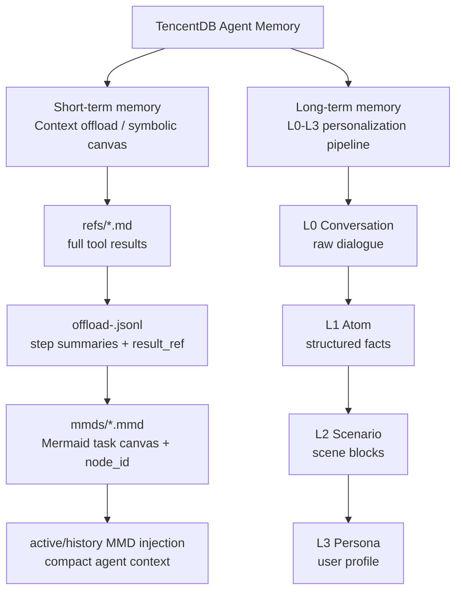
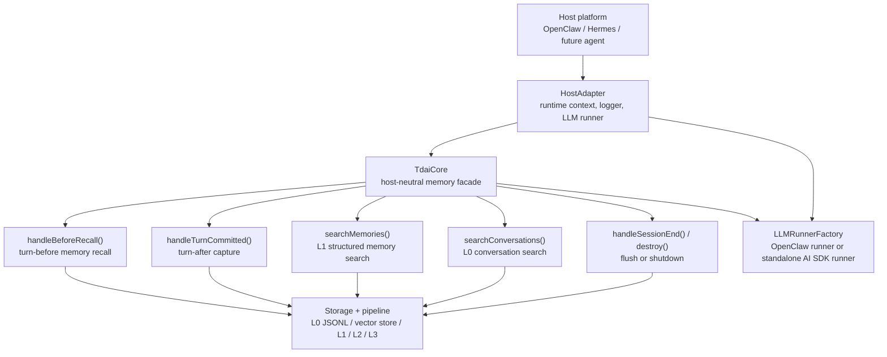
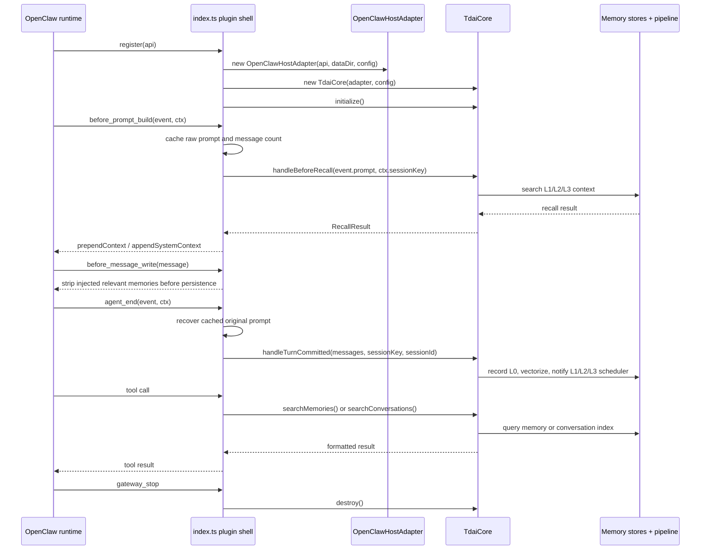
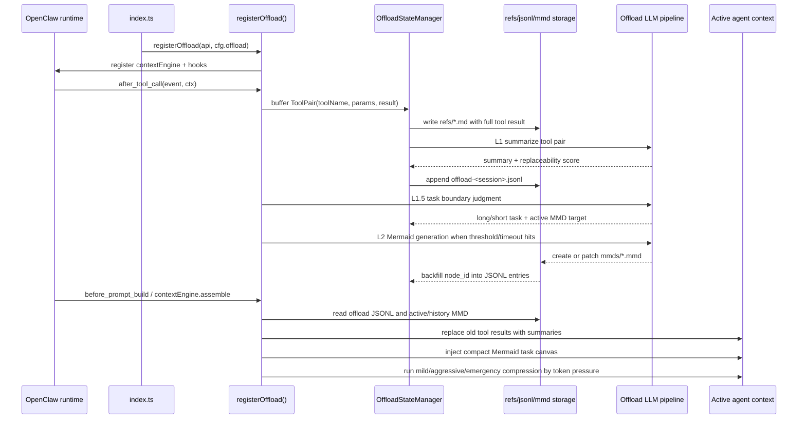
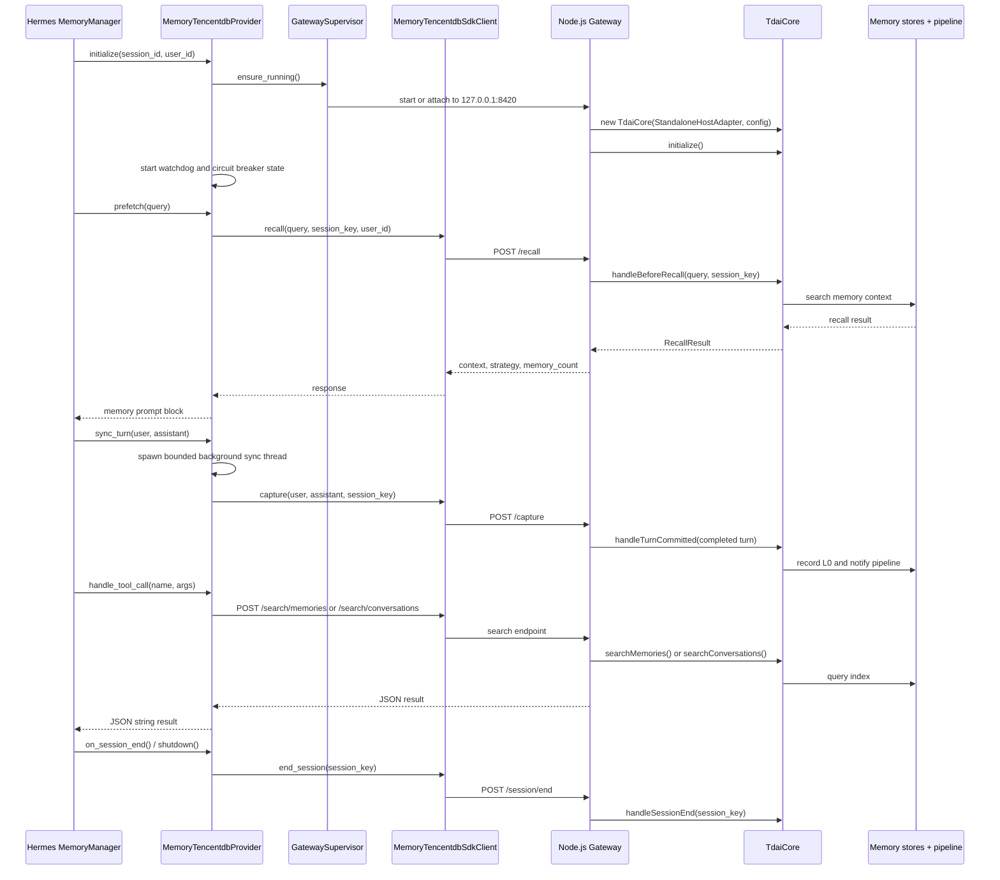
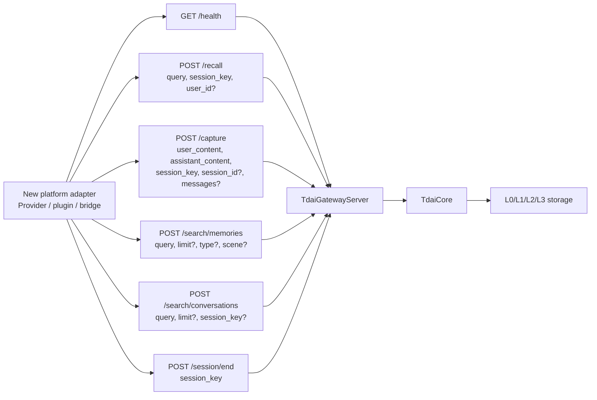

# Adapter Architecture: TdaiCore, OpenClaw, and Hermes

This document completes the foundation-stage adapter analysis for TencentDB-Agent-Memory. It explains the two memory subsystems, the host-neutral long-term core boundary, the current OpenClaw and Hermes adapter paths, and the data flow that a new platform adapter should preserve.

## Scope

The current project contains two parallel memory subsystems:

- Short-term memory: context offload for long-running tasks. It externalizes bulky tool results, summarizes them into JSONL entries, aggregates them into Mermaid task canvases, and injects compact symbolic context back into the active prompt.
- Long-term memory: the L0-L3 user-understanding pipeline. It records conversations, extracts atoms, builds scenarios, synthesizes persona, and recalls relevant user context across sessions.

The long-term subsystem exposes one memory engine through two host integrations:

- OpenClaw: an in-process TypeScript plugin registered from `index.ts`.
- Hermes: a Python `MemoryProvider` that talks to a local Node.js Gateway over HTTP.

Both long-term integrations ultimately call the same host-neutral core facade, `TdaiCore`. A new platform adapter should therefore start from the host lifecycle events and map them into the same long-term core capabilities, either directly in process or through the Gateway API.

The short-term subsystem is different: it currently lives in `src/offload/` and is registered only from the OpenClaw plugin path through `registerOffload()`. It is not part of `TdaiCore` and is not currently exposed through the Hermes Gateway API.

## Two-System Overview

The shared design rule is progressive disclosure. Lower layers preserve evidence; upper layers preserve structure. The two systems differ in time scale and host surface:

- Short-term memory manages the current long task and token pressure.
- Long-term memory manages cross-session recall and user understanding.
- Short-term currently requires deep OpenClaw hooks over messages, tool calls, and context compaction.
- Long-term can run either in process through OpenClaw or out of process through the Gateway.

## Long-Term Core Boundary

`TdaiCore` is the stable boundary between platform adapters and the long-term memory engine. It depends on a `HostAdapter`, configuration, and optional session filtering. Platform-specific code should stay outside the core and provide only runtime context, logging, and LLM execution.

Key source files:

- `src/core/types.ts`: `RuntimeContext`, `LLMRunner`, `LLMRunnerFactory`, `HostAdapter`, turn and search types.
- `src/core/tdai-core.ts`: core facade for recall, capture, search, session flush, and resource teardown.
- `src/adapters/openclaw/host-adapter.ts`: OpenClaw implementation of `HostAdapter`.
- `src/adapters/standalone/host-adapter.ts`: Gateway/Hermes implementation of `HostAdapter`.

## Core Capabilities

| Capability | Core method | Input shape | Output / effect | Current host mapping |
|---|---|---|---|---|
| Turn-before recall | `handleBeforeRecall(userText, sessionKey)` | Current user text and stable session key | `RecallResult` with prompt/system context and recall metadata | OpenClaw `before_prompt_build`; Hermes `prefetch()` through `POST /recall` |
| Turn-after capture | `handleTurnCommitted(turn)` | `CompletedTurn` with user/assistant text, messages, session identifiers | Records L0 messages, writes embeddings when available, notifies extraction pipeline | OpenClaw `agent_end`; Hermes `sync_turn()` through `POST /capture` |
| L1 memory search | `searchMemories(params)` | Query, limit, optional type and scene | Formatted search text, total count, strategy | OpenClaw `tdai_memory_search`; Hermes `memory_tencentdb_memory_search` through `POST /search/memories` |
| L0 conversation search | `searchConversations(params)` | Query, limit, optional session key | Formatted raw conversation matches | OpenClaw `tdai_conversation_search`; Hermes `memory_tencentdb_conversation_search` through `POST /search/conversations` |
| Session flush | `handleSessionEnd(sessionKey)` | One session key | Flushes buffered pipeline work for that session only | Hermes `on_session_end` / `shutdown()` through `POST /session/end` |
| Process teardown | `destroy()` | None | Drains background tasks, stops scheduler, closes stores and embedding service | OpenClaw `gateway_stop`; Gateway process shutdown |

## OpenClaw Adapter

OpenClaw uses a deep, in-process plugin integration. The root `index.ts` registers tools and lifecycle hooks directly with the OpenClaw Plugin SDK, creates `OpenClawHostAdapter`, then creates one `TdaiCore` instance for the plugin process.

OpenClaw-specific responsibilities:

- Parse plugin config and resolve the OpenClaw state/data directory.
- Register OpenClaw tools: `tdai_memory_search` and `tdai_conversation_search`.
- Register lifecycle hooks: `before_prompt_build`, `before_message_write`, `agent_end`, and `gateway_stop`.
- Cache the original user prompt before recall injection so captured history is not polluted by injected memory text.
- Use `OpenClawLLMRunnerFactory`, which wraps OpenClaw's embedded agent runtime through `CleanContextRunner`.
- Optionally register the short-term context offload module through `registerOffload()`.

OpenClaw's main strength is fidelity. It can access prompt-build timing, full message arrays, session context, tool registration, and message persistence hooks in the same process.

## Short-Term Context Offload

Short-term memory is implemented as the context offload module under `src/offload/`. It is registered from `index.ts` only when `cfg.offload.enabled` is true. Unlike long-term memory, it does not go through `TdaiCore`; it hooks directly into OpenClaw's prompt, tool-call, and context-engine surfaces.

Short-term storage layers:

| Layer | Artifact | Purpose | Traceability key |
|---|---|---|---|
| Raw evidence | `refs/*.md` | Full tool outputs and bulky logs, kept outside the model context | `result_ref` |
| Step summaries | `offload-<session>.jsonl` | LLM-generated summary, tool call metadata, replaceability score, and later `node_id` | `tool_call_id`, `result_ref`, `node_id` |
| Task canvas | `mmds/*.mmd` | Mermaid representation of long-task state and progress | `node_id` |
| Runtime context | injected current/history MMD messages | Compact symbolic memory seen by the agent | MMD filename and node IDs |

Important adapter implications:

- A platform must expose post-tool-call events with tool name, call ID, parameters, result, duration, and preferably current messages.
- A platform must allow mutation or replacement of messages before prompt build; otherwise L3 compression cannot reliably remove bulky history.
- A platform should provide a context-engine-like compaction owner if it has one. In OpenClaw this is registered as `openclaw-context-offload` with `ownsCompaction: true`.
- The OpenClaw patch script for after-tool-call messages matters because L3 compression depends on `event.messages` being populated.
- Hermes currently has no equivalent short-term adapter path in this repository. Its Provider/Gateway integration covers long-term recall/capture/search, not symbolic context offload.
## Hermes Adapter

Hermes uses a lighter, cross-process adapter. The Python provider implements Hermes' `MemoryProvider` interface, supervises a local Node.js Gateway sidecar, and calls Gateway endpoints through `MemoryTencentdbSdkClient`. The Gateway owns `TdaiCore`.

Hermes-specific responsibilities:

- Register `MemoryTencentdbProvider` through `ctx.register_memory_provider(...)`.
- Advertise Hermes tool schemas: `memory_tencentdb_memory_search` and `memory_tencentdb_conversation_search`.
- Convert Hermes lifecycle calls to Gateway HTTP calls.
- Start or attach to the Gateway, including auto-discovery of `src/gateway/server.ts`.
- Keep Gateway operation resilient through health checks, a circuit breaker, a watchdog, recovery throttling, and bounded background capture threads.
- Mirror legacy Hermes LLM environment names into Gateway-native `TDAI_LLM_*` names when spawning the Gateway.

Hermes' main strength is portability. A host only needs a way to run a provider-like shim and call HTTP endpoints. The cost is lower integration fidelity: the provider normally sees `user_content` and `assistant_content`, not necessarily the same full prompt-build and message-write surface that OpenClaw exposes.

## Gateway API Data Flow

The Gateway is the reusable adapter target for platforms that cannot import `TdaiCore` directly.

Endpoint behavior:

- `GET /health` is always open and used by supervisors, liveness checks, and operators.
- `POST /recall` requires `query` and `session_key`; it calls `handleBeforeRecall()` and returns a compact `context` string plus metadata.
- `POST /capture` requires `user_content`, `assistant_content`, and `session_key`; it can optionally accept `messages`, which is useful for platforms that can provide richer turn structure.
- `POST /search/memories` and `POST /search/conversations` expose the agent-callable search surface.
- `POST /session/end` flushes one session. It must not be confused with process shutdown.
- Non-health routes pass through optional Bearer auth when `TDAI_GATEWAY_API_KEY` or Gateway config `server.apiKey` is set.

## OpenClaw vs Hermes Differences

| Dimension | OpenClaw | Hermes |
|---|---|---|
| Integration style | In-process plugin | Python provider plus Node.js HTTP sidecar |
| Core ownership | `index.ts` owns `TdaiCore` directly | Gateway owns `TdaiCore`; provider is a client |
| Adapter implementation | `OpenClawHostAdapter` | `StandaloneHostAdapter` inside Gateway |
| LLM runner | `OpenClawLLMRunnerFactory` via `CleanContextRunner` and embedded agent runtime | `StandaloneLLMRunnerFactory` via Vercel AI SDK and OpenAI-compatible HTTP |
| Turn-before hook | `before_prompt_build` | `prefetch(query)` |
| Turn-after hook | `agent_end` | `sync_turn(user, assistant)` |
| Message persistence control | Has `before_message_write` to strip injected long-term recall context and offload hooks that rewrite prompt messages | No equivalent in provider layer |
| Tool names | `tdai_memory_search`, `tdai_conversation_search` | `memory_tencentdb_memory_search`, `memory_tencentdb_conversation_search` |
| Capture payload fidelity | Can pass full `event.messages` and cached original prompt metadata | Currently sends user/assistant text; Gateway supports optional `messages` for richer adapters |
| Failure isolation | Plugin errors are handled inside OpenClaw hook paths | Provider has circuit breaker, watchdog, sidecar recovery, and bounded background threads |
| Short-term context offload | Supported through `registerOffload()`, contextEngine, after-tool-call, before-prompt-build, and L3 compression hooks | Not currently exposed through Hermes Provider or Gateway |
| Deployment concern | OpenClaw plugin install and gateway restart | Provider install plus Gateway process/runtime/env management |

## New Adapter Guidance

For the next platform, split the adapter decision into two tracks. For long-term memory, prefer the Gateway pattern unless the platform provides OpenClaw-level plugin hooks and can safely import the TypeScript core in process. For short-term memory, only claim parity when the platform can observe tool calls and rewrite prompt messages before the next model call.

The minimum adapter surface should provide:

- A stable `session_key` for every conversation.
- Long-term: a turn-before recall point that can call `/recall` and inject returned context into the model input.
- Long-term: a turn-after capture point that can call `/capture`.
- Long-term: a tool surface for L1 and L0 search, or at least a documented manual search path.
- Long-term: a session-end or shutdown event that can call `/session/end`.

The ideal adapter surface additionally provides:

- Long-term: full message arrays, including tool-call messages, passed through `/capture.messages`.
- Long-term: a way to strip injected recall context before the host persists user messages.
- Long-term: a clear user identity field mapped to `user_id`.
- Long-term: Gateway auth configuration when the adapter is not loopback-only.
- Long-term: back-pressure and recovery behavior similar to the Hermes provider if capture is asynchronous.
- Short-term: post-tool-call access to tool results and call IDs.
- Short-term: before-prompt-build access to mutable message arrays.
- Short-term: storage for refs, offload JSONL, MMD files, and state per agent/session.
- Short-term: a compaction policy that can replace or delete old tool-result messages without breaking tool-use/tool-result pairing.

## Foundation Stage Status

This document satisfies the foundation-stage issue criteria:

- Read the source around `TdaiCore`, `HostAdapter`, OpenClaw, Hermes, Gateway, and `src/offload`.
- Identified the long-term core capabilities and the separate short-term context-offload capability surface.
- Mapped OpenClaw and Hermes host events to long-term core methods, and mapped OpenClaw offload hooks to the short-term symbolic canvas pipeline.
- Documented the data flow for long-term recall, capture, search, session flush, shutdown, and short-term context offload.
- Compared the two existing adapter strategies and recorded guidance for choosing the next platform.

