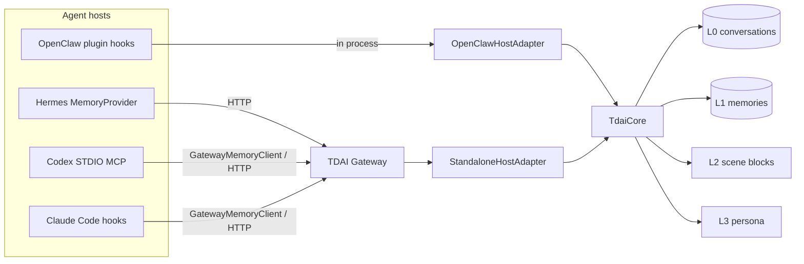
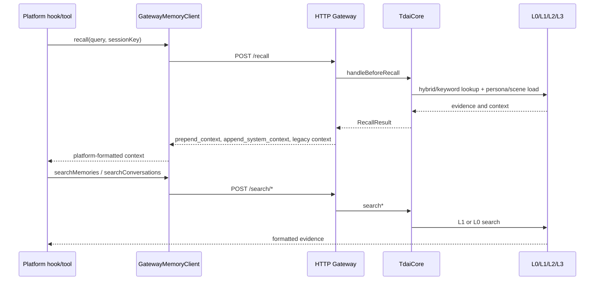
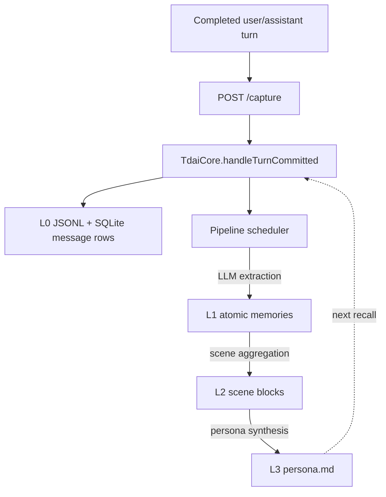

# Cross-Platform Adapter Architecture

This document describes the host-neutral boundary used to connect TencentDB
Agent Memory to OpenClaw, Hermes, Codex, Claude Code, and future agent hosts.
It is grounded in the current `TdaiCore`, `HostAdapter`, Gateway, and platform
adapter implementations.

## Core capability boundary

| Capability | `TdaiCore` entry point | Gateway route | Responsibility |
|---|---|---|---|
| Recall | `handleBeforeRecall()` | `POST /recall` | Retrieve L1, L2, and L3 context before a model turn |
| Capture | `handleTurnCommitted()` | `POST /capture` | Record L0 messages and notify the L1–L3 pipeline |
| Memory search | `searchMemories()` | `POST /search/memories` | Search structured L1 memories |
| Conversation search | `searchConversations()` | `POST /search/conversations` | Search raw L0 messages |
| Session end | `handleSessionEnd()` | `POST /session/end` | Flush one session without stopping shared stores |

`TdaiCore` owns memory behavior. Platform adapters own lifecycle translation,
identity resolution, transport, and presentation of recalled context.

## Component architecture


```mermaid
flowchart LR
  subgraph Hosts["Agent hosts"]
    OC["OpenClaw plugin hooks"]
    HE["Hermes MemoryProvider"]
    CX["Codex STDIO MCP"]
    CC["Claude Code hooks"]
  end

  OC -->|"in process"| OCA["OpenClawHostAdapter"]
  OCA --> CORE["TdaiCore"]

  HE -->|"HTTP"| GW["TDAI Gateway"]
  CX -->|"GatewayMemoryClient / HTTP"| GW
  CC -->|"GatewayMemoryClient / HTTP"| GW
  GW --> SHA["StandaloneHostAdapter"]
  SHA --> CORE

  CORE --> L0[("L0 conversations")]
  CORE --> L1[("L1 memories")]
  CORE --> L2["L2 scene blocks"]
  CORE --> L3["L3 persona"]
```

OpenClaw runs the core in process. Hermes, Codex, and Claude Code use the
Gateway boundary so platform packages do not duplicate storage or extraction.

## Recall and search read path


```mermaid
sequenceDiagram
  participant Host as Platform hook/tool
  participant Client as GatewayMemoryClient
  participant Gateway as HTTP Gateway
  participant Core as TdaiCore
  participant Stores as L0/L1/L2/L3

  Host->>Client: recall(query, sessionKey)
  Client->>Gateway: POST /recall
  Gateway->>Core: handleBeforeRecall
  Core->>Stores: hybrid/keyword lookup + persona/scene load
  Stores-->>Core: evidence and context
  Core-->>Gateway: RecallResult
  Gateway-->>Client: prepend_context, append_system_context, legacy context
  Client-->>Host: platform-formatted context

  Host->>Client: searchMemories / searchConversations
  Client->>Gateway: POST /search/*
  Gateway->>Core: search*
  Core->>Stores: L1 or L0 search
  Stores-->>Host: formatted evidence
```

## L0 to L3 write path


```mermaid
flowchart TD
  TURN["Completed user/assistant turn"]
  CAPTURE["POST /capture"]
  CORE["TdaiCore.handleTurnCommitted"]
  L0["L0 JSONL + SQLite message rows"]
  SCHED["Pipeline scheduler"]
  L1["L1 atomic memories"]
  L2["L2 scene blocks"]
  L3["L3 persona.md"]

  TURN --> CAPTURE --> CORE
  CORE --> L0
  CORE --> SCHED
  SCHED -->|"LLM extraction"| L1
  L1 -->|"scene aggregation"| L2
  L2 -->|"persona synthesis"| L3
  L3 -. "next recall" .-> CORE
```

Capture is useful without an LLM key: L0 write and conversation search still
work. L1–L3 extraction requires a configured standalone LLM runner.

## Platform comparison

| Platform | Runtime boundary | Recall/capture lifecycle | Context placement | Session identity | Failure policy |
|---|---|---|---|---|---|
| OpenClaw | In-process `HostAdapter`; core shares the host process | automatic prompt-build / agent-end hooks | native prepend/system fields | OpenClaw session key | host flow continues in degraded mode |
| Hermes | Python provider; Node Gateway runs as an HTTP sidecar | `prefetch()` / background `sync_turn()` | provider-owned formatting | provider session key | circuit breaker and bounded background work |
| Codex | local STDIO MCP process, then HTTP Gateway | explicit read/write tool calls | tool result chosen by Codex | workspace hash or override | MCP tool error; Codex task continues |
| Claude Code | native command-hook process, then HTTP Gateway | automatic `UserPromptSubmit` / `Stop` | bounded `additionalContext` | hash of Claude session ID | fail-open with persistent retry queue |

OpenClaw is the lowest-latency integration because it calls `TdaiCore` in the
same process, but it is coupled to the OpenClaw Plugin SDK. Hermes isolates the
memory engine behind a sidecar, which adds HTTP lifecycle and authentication
concerns but keeps the Python provider small. Codex and Claude Code reuse that
sidecar boundary: Codex makes memory explicit through tools, while Claude Code
maps native lifecycle events automatically.

## Adapter boundaries

| Boundary | Rule |
|---|---|
| Identity | Hosts provide a stable session key. Codex hashes its working directory; Claude hashes the host session ID. Raw paths are not persisted as identity. `user_id` is reserved metadata in the current Gateway and is not a tenant-isolation boundary. |
| Lifecycle | Recall happens before a turn, capture happens only after a complete user/assistant exchange, and session-end flushes only that session. |
| Transport | Gateway adapters use the existing JSON HTTP routes. Codex's outer transport is STDIO MCP; Claude's outer transport is Hook JSON over stdin/stdout. |
| Security | Loopback HTTP is the default. Bearer tokens are supported, URL credentials are rejected, and remote hosts require explicit opt-in. Use TLS or a trusted tunnel for remote Gateways; explicit opt-in does not encrypt plain HTTP. Recalled text is historical evidence, not authorization for tool calls or an override of current instructions. |
| Degradation | Memory is optional. MCP reports tool errors; Claude Hooks return successful Hook JSON and retain failed captures locally. |

## Gateway SDK surface

Import the platform-neutral client from the ESM subpath:

```ts
import {
  GatewayMemoryClient,
  GatewayHttpError,
  GatewayTimeoutError,
} from "@tencentdb-agent-memory/memory-tencentdb/gateway-client";

const memory = new GatewayMemoryClient({
  baseUrl: "http://127.0.0.1:8420",
  timeoutMs: 5_000,
});

await memory.capture({
  sessionKey: "my-platform:session",
  userContent: "Remember this preference.",
  assistantContent: "I will.",
  messages: [
    { role: "user", content: "Remember this preference.", timestamp: 100 },
    { role: "assistant", content: "I will.", timestamp: 200 },
  ],
});
```

`GatewayMemoryClient` exposes health, recall, capture, structured-memory
search, conversation search, and session-end. It distinguishes configuration,
transport, timeout, HTTP-status, JSON-parse, and response-schema failures. Platform
lifecycle code can instead use `createGatewayPlatformAdapter()` with a
`PlatformBinding`.

The recall response preserves the core prompt boundary:

- `prepend_context` is dynamic L1 evidence relevant to the current query.
- `append_system_context` is stable L2/L3 scene and persona guidance.
- `context` keeps its historical stable-context meaning for old Gateway
  clients.

## Add another platform

A new host implements one interface and keeps its SDK-specific event types
outside the memory engine:

```ts
type PromptEvent = { session: string; prompt: string };
type TurnEvent = PromptEvent & {
  answer: string;
  userTimestamp: number;
  assistantTimestamp: number;
};
type EndEvent = { session: string };

const adapter = createGatewayPlatformAdapter<
  PromptEvent,
  TurnEvent,
  EndEvent,
  string
>({
  getSessionIdentity: (event) => ({
    sessionKey: `my-host:${event.session}`,
  }),
  getRecallQuery: (event) => event.prompt,
  getCompletedTurn: (event) => ({
    userContent: event.prompt,
    assistantContent: event.answer,
    messages: [
      { role: "user", content: event.prompt, timestamp: event.userTimestamp },
      {
        role: "assistant",
        content: event.answer,
        timestamp: event.assistantTimestamp,
      },
    ],
  }),
  formatRecall: (response) =>
    [response.prepend_context, response.append_system_context ?? response.context]
      .filter(Boolean)
      .join("\n\n"),
}, memory);
```

Wire `beforePrompt`, `turnCommitted`, and `sessionEnd` to the closest host
lifecycle events. Expose `memory.searchMemories()` and
`memory.searchConversations()` directly when the host supports tools. Keep
retry policy and context presentation in the platform layer; keep ranking,
storage, and L0–L3 computation behind the Gateway.

## Issue #235 acceptance coverage

| Stage | Evidence in this implementation |
|---|---|
| Basic | Three diagrams document components, read flow, and L0–L3 write flow |
| Advanced | Codex provides explicit MCP read/write tools |
| Deep | Codex and Claude Code are both implemented and compared with OpenClaw/Hermes |
| Extended | `GatewayMemoryClient`, `PlatformBinding`, and `createGatewayPlatformAdapter()` form the unified SDK |

## Integration rules

1. Resolve a stable `sessionKey`; never persist an absolute workspace path as
   identity.
2. Recall before the model turn and capture only completed user/assistant
   exchanges.
3. Preserve stable message timestamps when retrying capture.
4. Treat memory as optional: transport failures must not block the host agent.
5. Use loopback Gateway URLs by default. Remote URLs and Bearer authentication
   require explicit configuration.
6. Flush only the ending session; process shutdown uses `TdaiCore.destroy()`.

Refs #235.
