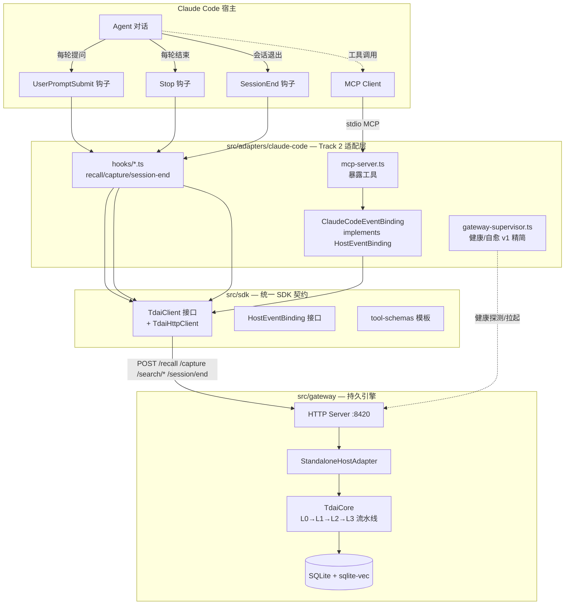

# Claude Code 记忆适配器设计（MCP + Hooks）

- 日期：2026-07-01
- 作者：犀牛鸟开源人才培养活动参与者
- 关联 Issue：TencentDB-Agent-Memory 多平台接入（2026 犀牛鸟专属 issue）
- 目标阶段：渐进式交付（基础 → 进阶 → 深入 → 拓展冲刺）
- 架构方案：方案 1 — MCP 薄客户端 + HTTP Gateway（Hermes Pattern B 的 TS/MCP 翻版）
- SDK 节奏：Z 务实折中（先立 `HostEventBinding` + `TdaiClient` 接口，生命周期件待第二平台再析出）

---

## 1. 背景与目标

TencentDB-Agent-Memory 的核心记忆引擎 `TdaiCore` 已通过两种方式接入宿主：

- **Pattern A（OpenClaw，进程内）**：`OpenClawHostAdapter` 实现 `HostAdapter` 接口，`index.ts` 把 OpenClaw 钩子/工具事件翻译成 `TdaiCore` 调用，引擎与宿主同进程。
- **Pattern B（Hermes，进程外）**：宿主侧 `MemoryTencentdbProvider`（Python）是 HTTP Gateway 的客户端；Gateway 内部用 `StandaloneHostAdapter` + `TdaiCore` 承载引擎，`GatewaySupervisor` 管理生命周期与自愈。

本设计为 **Claude Code**（及同走 MCP 的 Codex）接入记忆能力。Claude Code 不能像 OpenClaw 那样进程内加载引擎，但对外暴露两套口子：**MCP server（工具）** 与 **hooks（事件）**。因此 Claude Code 天然属 Pattern B —— 一个 Gateway 的 TS 客户端，把 Hermes 的 Python Provider 换成 TS MCP server + 钩子脚本。

### 验收阶段映射

| 阶段 | 交付物 | 难度 |
|---|---|---|
| 基础 | 第 2 节架构图 + 数据流（本文档 + 适配器 README） | 容易 |
| 进阶（核心） | `src/sdk/{client,event-binding,tool-schemas}.ts` + `src/adapters/claude-code/`（MCP server 含 search/capture 工具 + `TdaiHttpClient` + `ClaudeCodeEventBinding`）+ 安装使用文档 | 中等 |
| 深入 | Claude Code hooks（auto-recall/capture/session-end）+ 验证 Codex 共用同一 MCP server + 对比文档（A 进程内 vs B-Python vs B-MCP） | 较难 |
| 拓展（冲刺） | 析出 `GatewayLifecycleManager` + 接入第二平台（Dify）`EventBinding` + SDK README 示范「实现一个接口」 | 挑战 |

---

## 2. 架构总览



### 数据流

- **Recall（自动）**：`UserPromptSubmit` → `hooks/recall.ts` → `TdaiClient.recall()` → `POST /recall` → 返回 `additionalContext` 注入提示。
- **Capture（自动）**：`Stop` → `hooks/capture.ts` → `TdaiClient.capture()` → `POST /capture` → L0 入库 + 流水线调度（L1/L2/L3 异步提取）。
- **Tool（显式）**：Agent 调 `tdai_memory_search` / `tdai_conversation_search` → MCP server → `TdaiClient.searchMemories()` / `searchConversations()` → `POST /search/*`。
- **SessionEnd**：`SessionEnd` → `hooks/session-end.ts` → `TdaiClient.endSession()` → `POST /session/end` → flush。

### 与已有两种适配模式的关系

| 维度 | Pattern A (OpenClaw) | Pattern B (Hermes) | Pattern B-MCP (Claude Code，本设计) |
|---|---|---|---|
| 引擎位置 | 宿主进程内 | 进程外 Gateway | 进程外 Gateway |
| 实现 `HostAdapter`? | 是（`OpenClawHostAdapter`） | 否（宿主侧仅 HTTP 客户端） | 否（宿主侧仅 HTTP 客户端） |
| 宿主侧载体 | `index.ts` + Plugin SDK 钩子 | Python `MemoryProvider` | TS MCP server + hooks |
| 宿主侧事件绑定 | `api.on(before_prompt_build/agent_end)` | `prefetch/sync_turn/on_session_end` | `UserPromptSubmit/Stop/SessionEnd` 钩子 |
| 生命周期管理 | 跟随宿主 | `GatewaySupervisor` + 熔断 + 看门狗 | v1 精简 supervisor（熔断留待拓展） |

---

## 3. 组件与文件布局

```
src/sdk/                          # 拓展统一 SDK 契约（Track 2）
├── client.ts                     # TdaiClient 接口 + TdaiHttpClient（fetch + Bearer + 超时/重试）
├── event-binding.ts              # HostEventBinding 接口（onUserPrompt/onTurnEnd/onSessionEnd/getToolSchemas）
└── tool-schemas.ts               # memory_search/conversation_search/capture 的 MCP schema 模板

src/adapters/claude-code/         # Claude Code 适配器
├── mcp-server.ts                 # MCP server 入口：注册工具，派发到 TdaiClient
├── claude-code-binding.ts        # ClaudeCodeEventBinding implements HostEventBinding
├── gateway-supervisor.ts         # v1 仅健康探测（health probe）；v2 加 Popen 拉起；熔断待拓展析出
├── config.ts                     # 适配器配置（gateway URL/apiKey/sessionKey 策略/userId）
├── config/                       # 用户侧配置模板（与适配器同仓）
│   ├── mcp.json.example          # .mcp.json 注册 MCP server
│   └── settings.json.example     # hooks 注册（UserPromptSubmit/Stop/SessionEnd）
├── hooks/
│   ├── recall.ts                 # UserPromptSubmit 处理
│   ├── capture.ts                # Stop 处理
│   └── session-end.ts            # SessionEnd 处理
├── index.ts                      # barrel
└── README.md                     # 安装/配置/使用

src/adapters/index.ts             # 追加导出 claude-code adapter
```

### Gateway 复用

不新建引擎。直接复用 `src/gateway/server.ts`（已带 `StandaloneHostAdapter` + `TdaiCore` + 鉴权 + 流水线）。Claude Code 适配器只是其 TS 客户端层，与 `hermes-plugin/.../client.py` 同契约。

---

## 4. 接口契约（「拓展」核心承诺）

### 4.1 `src/sdk/event-binding.ts` —— Track 2 的「一个接口」

```typescript
export interface HostEventContext {
  sessionKey: string;
  sessionId?: string;
  userId: string;
  workspaceDir?: string;
}

export interface RecallInjection {
  additionalContext?: string;   // 注入到用户提示
  systemContext?: string;       // 追加到系统提示
}

export interface CaptureAck {
  l0Recorded: number;
  schedulerNotified: boolean;
}

export interface ToolSchema {
  name: string;
  description: string;
  parameters: Record<string, unknown>;
}

/** SDK 自包含的最小 Turn 描述（不依赖 core/types.ts，避免 SDK 耦合核心层）。 */
export interface HostCompletedTurn {
  userText: string;
  assistantText: string;
  sessionKey: string;
  sessionId?: string;
  messages?: unknown[];
}

/** Track 2 宿主侧绑定契约。新平台接入 = 实现这 4 个方法 + 选语言对应的 TdaiClient。 */
export interface HostEventBinding {
  readonly hostType: string;
  onUserPrompt(prompt: string, ctx: HostEventContext): Promise<RecallInjection | null>;
  onTurnEnd(turn: HostCompletedTurn, ctx: HostEventContext): Promise<CaptureAck | null>;
  onSessionEnd(ctx: HostEventContext): Promise<void>;
  getToolSchemas(): ToolSchema[];
}
```

### 4.2 `src/sdk/client.ts`

```typescript
export interface TdaiClient {
  recall(query: string, sessionKey: string, userId?: string): Promise<RecallResponse>;
  capture(user: string, assistant: string, sessionKey: string, opts?: CaptureOpts): Promise<CaptureResponse>;
  searchMemories(params: MemorySearchParams): Promise<SearchResponse>;
  searchConversations(params: ConversationSearchParams): Promise<SearchResponse>;
  endSession(sessionKey: string, userId?: string): Promise<void>;
  health(): Promise<HealthResponse>;
}

export class TdaiHttpClient implements TdaiClient {
  // fetch 实现；Bearer 鉴权；超时；可选重试；错误映射到结构化异常
}
```

MCP server 与 hooks 均依赖 `TdaiClient` **接口**而非具体实现 → 满足「新平台只需实现一个接口」。第二平台（Dify）将复用 Python 侧 `client.py`（同契约）并实现 `HostEventBinding`。

---

## 5. 关键设计点

### 5.1 sessionKey 策略

Claude Code 钩子载荷含 `session_id`，直接用作 `sessionKey`（L0 分组用）。`recall`/`searchMemories` 全局搜索，不受 sessionKey 限制。无 `session_id` 时回退 `cwd + 当日日期`（与 OpenClaw 的 sessionKey 语义一致：单会话分组、跨会话召回）。

### 5.2 userId

v1 用 `"default_user"`（同 OpenClaw）。多用户场景读 `TDAI_USER_ID` 环境变量。

### 5.3 记忆注入格式

复用 OpenClaw 的 `<relevant-memories>...</relevant-memories>` 包裹，与 `before_message_write` 钩子的清洗逻辑对齐，避免污染历史 transcript。

### 5.4 鉴权

客户端读 `TDAI_MCP_API_KEY`，回退 `TDAI_GATEWAY_API_KEY`（同 Hermes 双名约定）。Gateway 端自管密钥（`server.apiKey` / `TDAI_GATEWAY_API_KEY`），两端须一致。未设置时不发 Authorization 头（匹配开放模式旧行为）。

---

## 6. 错误处理（对齐 Hermes + OpenClaw 原则）

- **记忆永不阻塞对话**：recall/capture 失败 → 钩子返回空、退出码 0；MCP 工具失败 → 返回错误文本但不抛异常。
- **Gateway 宕机**：MCP server（会话内长驻，由 Claude Code 按会话 spawn）内置熔断（5 次失败→60s 冷却）+ 健康探测自愈（移植 `supervisor.py` 思路）；hooks（短命进程）仅超时跳过 + 日志，不共享熔断状态。
- **超时**：recall 5s（对齐 `recall.timeoutMs=5000`）、capture 10s、search 5s。
- **钩子容错**：所有错误 try/catch；日志写 stderr；stdout 只输出合法 JSON；退出码恒为 0（避免 Claude Code 把记忆故障当致命错误）。
- **Gateway 自启动**：v1 `gateway-supervisor.ts` 仅做健康探测（`health()`），不拉起进程——要求用户预启动 Gateway；v2 增加可选 Popen 拉起（移植 Hermes 的 `MEMORY_TENCENTDB_GATEWAY_CMD` 发现逻辑）。

---

## 7. 测试策略

- **单元（vitest）**：
  - `TdaiHttpClient`：mock fetch，覆盖 Bearer 鉴权、超时、重试、HTTP 错误码→异常映射。
  - `ClaudeCodeEventBinding`：事件→Gateway 调用映射逻辑、sessionKey 回退、注入格式。
  - 钩子载荷解析：样例 stdin JSON → 正确字段提取。
- **集成**：起 Gateway（SQLite 后端）于测试端口，MCP server 走真实 HTTP，验证 recall→capture→search 闭环。复用现有 `vitest.config.ts`。
- **钩子契约测试**：喂入 Claude Code 样例 stdin 载荷，断言 Gateway 调用正确 + 输出 JSON 合法 + 退出码 0。
- **E2E 手动**：真实 Claude Code 会话跨会话验证记忆持久化，写入 README 作为手动验收清单。

---

## 8. 交付物清单

1. `src/sdk/client.ts`、`src/sdk/event-binding.ts`、`src/sdk/tool-schemas.ts`
2. `src/adapters/claude-code/` 全套（mcp-server / binding / supervisor / config / hooks / index / README）
3. `src/adapters/claude-code/config/mcp.json.example`、`src/adapters/claude-code/config/settings.json.example`
4. `src/adapters/index.ts` 追加导出
5. 单元 + 集成测试
6. 对比文档（深入阶段）：`docs/adapters/platform-comparison.md`
7. SDK README（拓展阶段）：`src/sdk/README.md`

---

## 9. 范围与非目标

**本期范围（进阶核心）**：
- Claude Code 通过 MCP 工具实现记忆 search/capture 读写。
- `TdaiClient` + `HostEventBinding` 接口落地，Claude Code 对接口实现。

**非目标（留待深入/拓展）**：
- 自动 recall/capture 钩子（深入阶段）。
- Codex 验证 + 对比文档（深入阶段）。
- `GatewayLifecycleManager` 析出 + Dify 接入（拓展阶段）。
- 修改核心引擎 `TdaiCore` 或 Gateway（本期不改）。

---

## 10. 风险与对策

| 风险 | 对策 |
|---|---|
| Claude Code 钩子载荷字段不稳定 | 钩子解析做防御式容错，缺失字段回退默认值；在 README 记录已验证版本 |
| MCP server 生命周期由 Claude Code 控制，无法跑后台流水线 | 引擎与流水线全在持久 Gateway，MCP server 仅无状态转发，被杀不影响已存记忆 |
| 钩子进程间无法共享熔断状态 | hooks 仅超时跳过；熔断只放长驻 MCP server，可接受 |
| Gateway 需用户手动启动影响体验 | v1 文档强调；v2 提供 supervisor 自动拉起 |
