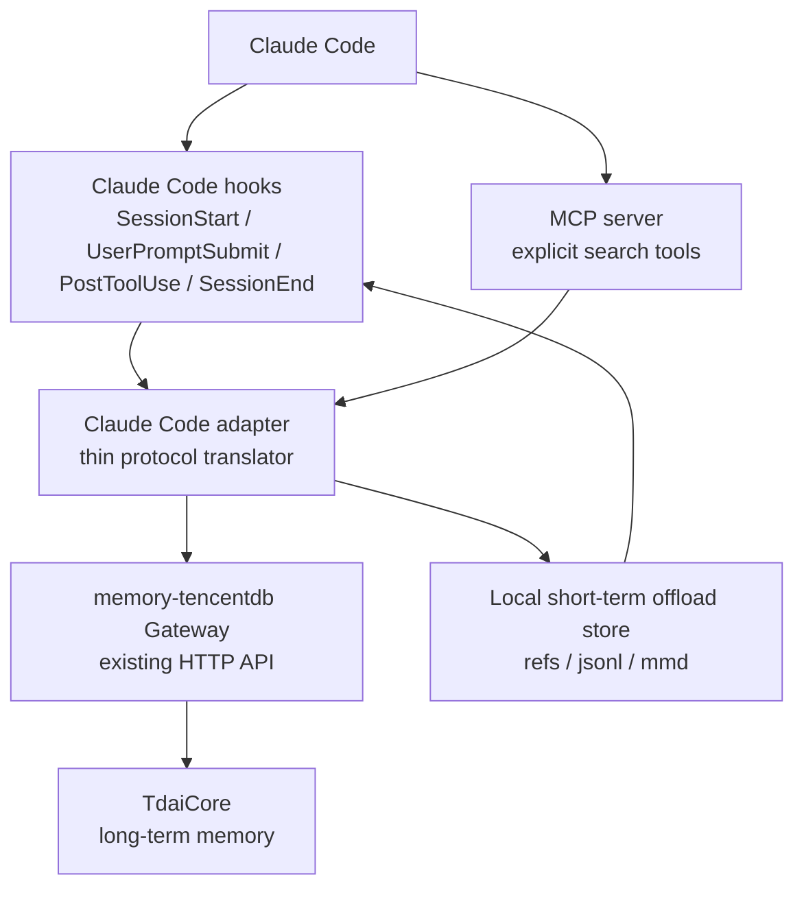
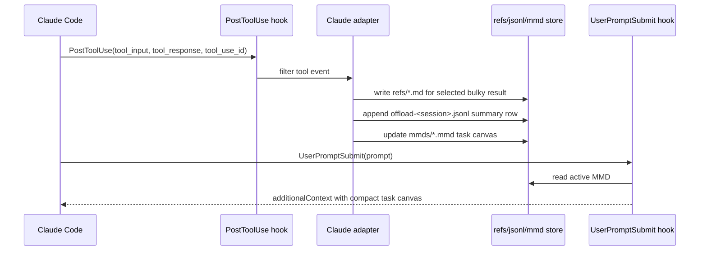

# Claude Code Adapter Design Review

This document reviews the proposed Claude Code adapter design against the current TencentDB-Agent-Memory source tree and the Claude Code hook/MCP surface.

For the implementation-ready v1 plan, see [Claude Code Adapter v1 Technical Design](./claude-code-v1-technical-design.md).

## Verdict

Claude Code is a reasonable next platform for the advanced stage, but the proposal must be split into two tracks:

- Long-term memory can be adapted first through the existing Gateway API.
- Short-term symbolic context offload can only be partially adapted through Claude Code hooks unless Claude Code exposes a deeper message-compaction surface than ordinary hooks.

The proposal's main architectural instinct is sound: keep `TdaiCore` unchanged and make the new adapter a protocol translator. The biggest correction is that the Gateway API assumed by the proposal does not exist.

## What The Proposal Gets Right

- It treats the adapter as a thin translation layer rather than a new memory engine.
- It keeps `TdaiCore` unchanged.
- It identifies session boundaries, tool filtering, and MCP-vs-hooks overlap as real design risks.
- It separates explicit search tools from automatic memory capture/injection.
- It correctly treats unfiltered tool capture as a pollution risk.

## Main Corrections

### Gateway API

The proposal assumes APIs such as `recallMemory`, `captureConversation`, `captureEpisode`, `updateScene`, `updateContext`, `restoreContext`, and `offloadContext`. The current Gateway does not expose these routes.

Current Gateway endpoints:

| Endpoint | Purpose | Backing method |
|---|---|---|
| `GET /health` | Liveness and health | Gateway-only |
| `POST /recall` | Long-term recall | `TdaiCore.handleBeforeRecall()` |
| `POST /capture` | Long-term turn capture | `TdaiCore.handleTurnCommitted()` |
| `POST /search/memories` | L1 memory search | `TdaiCore.searchMemories()` |
| `POST /search/conversations` | L0 conversation search | `TdaiCore.searchConversations()` |
| `POST /session/end` | Session-scoped flush | `TdaiCore.handleSessionEnd()` |
| `POST /seed` | Batch historical import | seed runtime |

So the adapter cannot be designed against a broad generic Gateway object. It should either:

- use the existing HTTP endpoints exactly, or
- explicitly add new Gateway endpoints as a separate upstream design decision.

For the advanced issue, the safer path is to avoid Gateway changes and implement only against the existing endpoints.

### Hook Names And Hook Semantics

The proposal uses generic names like `AfterToolUse`. Claude Code's current documented hook event is `PostToolUse`, with related events such as `PreToolUse`, `PostToolUseFailure`, `SessionStart`, `SessionEnd`, `UserPromptSubmit`, `PreCompact`, and `PostCompact`.

Claude Code hooks can inject `additionalContext` into Claude's context. That is enough for long-term recall injection and lightweight short-term canvas reminders. It is not the same as OpenClaw's ability to rewrite full mutable message arrays during prompt build.

### Short-Term Offload Parity

OpenClaw short-term memory depends on:

- post-tool-call access to tool name, tool call ID, parameters, result, duration, and current messages;
- before-prompt-build access to mutable messages;
- contextEngine ownership of compaction;
- local storage layers: `refs/*.md`, `offload-*.jsonl`, `mmds/*.mmd`, and state.

Claude Code `PostToolUse` can provide tool input, tool response, tool use ID, duration, cwd, session ID, and transcript path. That is enough to collect tool events and build a symbolic canvas. It does not appear sufficient for true OpenClaw-style L3 compression, because hooks do not expose a normal "replace arbitrary old tool-result messages before model call" capability.

Therefore short-term support should be described as partial in the first adapter:

- capture tool results;
- summarize and store refs/jsonl/MMD;
- inject compact current-task MMD via hook `additionalContext`;
- do not claim full transcript compaction or old-message replacement unless a deeper Claude Code API is available.

## Corrected Architecture

## Long-Term Memory MVP

The first implementation should target long-term memory only, because it maps cleanly to the existing Gateway.

| Claude Code surface | Adapter action | Gateway endpoint |
|---|---|---|
| `UserPromptSubmit` or `SessionStart` | Build recall query from prompt/workspace context, inject returned context through `additionalContext` | `POST /recall` |
| `SessionEnd` | Read transcript or extracted turn summary, capture conversation/turn data | `POST /capture` or `POST /seed` |
| MCP `memory_search` | Search L1 memories | `POST /search/memories` |
| MCP `conversation_search` | Search L0 conversations | `POST /search/conversations` |
| `SessionEnd` after capture | Flush session pipeline work | `POST /session/end` |

Key decisions:

- Use Claude Code `session_id` as the first candidate for `session_key`.
- Include `cwd` or workspace root in adapter metadata and search queries, but do not invent new Gateway fields unless the Gateway accepts them.
- Prefer `UserPromptSubmit` for recall injection because it is closer to the actual user query than `SessionStart`.
- Keep MCP tools explicit and named differently from hook-side automatic recall to avoid duplicate context.

## Short-Term Memory MVP

Short-term MVP should not depend on `TdaiCore` or the current Gateway.

Recommended first scope:

- Capture only high-signal tools at first: write/edit operations, shell commands, failed tools, and very large outputs.
- Keep read/search tool events out by default unless they are huge or error-producing.
- Store raw evidence and summaries with `tool_use_id`, `result_ref`, and later `node_id`.
- Inject active MMD context only when it is small enough and relevant to the current prompt.
- Treat `PreCompact`/`PostCompact` as possible future hooks for preserving symbolic state around Claude Code compaction.

## MCP vs Hooks

Hooks and MCP should not compete.

- Hooks should perform automatic, low-noise operations: recall injection, capture, flush, and short-term canvas maintenance.
- MCP should expose explicit tools: memory search, conversation search, and possibly current task canvas retrieval.

This avoids feeding Claude both automatically recalled memory and a large search result unless Claude explicitly asks for more.

## Implementation Plan

1. Add a Claude Code adapter design doc and config examples.
2. Implement a small Gateway client for the existing HTTP endpoints.
3. Implement MCP search tools over `/search/memories` and `/search/conversations`.
4. Implement hook scripts for long-term recall/capture using Claude Code hook JSON input.
5. Add optional short-term tool capture as a separate module with a clear "partial parity" label.
6. Add tests for endpoint mapping, tool filtering, and formatter output.

## Open Questions

- Should the first implementation live inside this repo as `src/adapters/claude-code/`, or should it be packaged as a Claude Code plugin/hook bundle?
- Should `SessionEnd` capture use `/capture` turn-by-turn or `/seed` for transcript import?
- What exact transcript JSONL schema should the adapter support?
- How aggressive should `UserPromptSubmit` recall be before it becomes context pollution?
- Do we want short-term offload in v1, or do we ship long-term first and document short-term as a follow-up?

## Recommendation

Proceed with Claude Code as the new platform, but narrow the advanced-stage implementation target:

- Phase 1: long-term memory via Gateway plus MCP search tools.
- Phase 2: lightweight short-term symbolic canvas through `PostToolUse` capture and `additionalContext` injection.
- Phase 3: revisit full short-term compaction only if Claude Code exposes a deeper mutable-message or compaction-owner interface.

