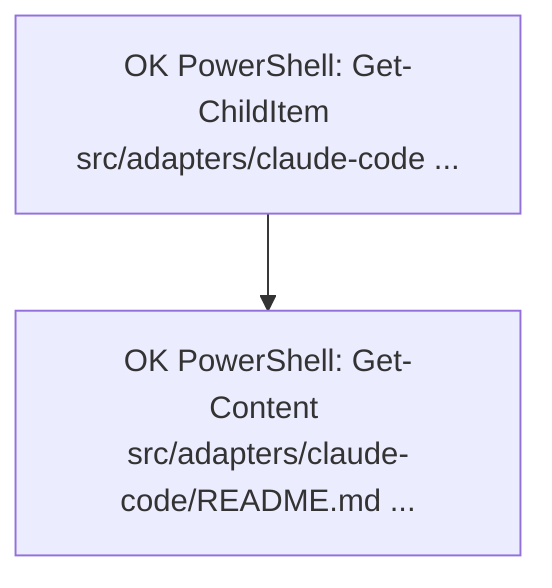

# Claude Code Adapter E2E Experiment Report

Date: 2026-07-22

This report validates the Claude Code adapter with real Claude Code runtime hooks inside the project workspace.

## Scope

The experiment focuses on the short-term memory path:

```text
Claude Code PowerShell tool use
  -> PostToolUse hook
  -> short-term JSONL/ref/Mermaid store
  -> UserPromptSubmit hook
  -> injected short-term task canvas
  -> Claude response without tools
```

Long-term Gateway recall/capture was intentionally disabled for this experiment so the result isolates the Claude Code hook and short-term canvas behavior.

## Workspace Boundary

All experiment artifacts were constrained to the repository:

```text
.claude-tdai-experiments/
  settings.json
  logs/
  storage/
  tmp/
```

`.claude-tdai-experiments/` is gitignored. The only PR-worthy artifact is this report.

## Environment

- Repository: `D:\Users\zzh\Desktop\腾讯开源计划\TencentDB-Agent-Memory-main`
- Claude Code: `2.1.126`
- Model: `claude-sonnet-4-6`
- Settings file: `.claude-tdai-experiments/settings.json`
- Storage root: `.claude-tdai-experiments/storage`
- Long-term recall: disabled with `MEMORY_TENCENTDB_AUTO_RECALL=false`
- Short-term canvas: enabled with `MEMORY_TENCENTDB_SHORT_TERM=true`

## Experiment Matrix

| ID | Purpose | Claude Code mode | Tool constraints | Acceptance criteria | Result |
|---|---|---|---|---|---|
| E1 | Minimal runtime smoke | `claude -p`, Sonnet | `PowerShell(echo *)` only | `PostToolUse` hook fires, exits 0, writes JSONL/MMD under project | PASS |
| E2 | Real project read-only task | `claude -p`, Sonnet | `PowerShell(Get-ChildItem *)`, `PowerShell(Get-Content *)` | multiple real tool calls captured as JSONL rows and Mermaid nodes | PASS |
| E3 | Canvas reinjection across turns | `claude -p --resume`, Sonnet | tools disabled | `UserPromptSubmit` injects canvas; Claude answers from canvas without tools | PASS |

## Results

### E1: Minimal Runtime Smoke

Prompt asked Claude Code to run exactly:

```powershell
echo tdai-project-e2e-smoke
```

Observed:

- `UserPromptSubmit` hook fired.
- `PostToolUse:PowerShell` hook fired.
- Hook response: `exit_code=0`, `outcome=success`.
- JSONL and MMD were written under `.claude-tdai-experiments/storage`.

Cost reported by Claude Code: `$0.19912575`.

### E2: Real Project Read-Only Task

Prompt asked Claude Code to run exactly:

```powershell
Get-ChildItem src/adapters/claude-code -Recurse -Filter *.ts
Get-Content src/adapters/claude-code/README.md -TotalCount 40
```

Observed:

- Both PowerShell calls completed successfully.
- Both `PostToolUse` hooks fired and returned success.
- `offload-22222222-2222-4222-8222-222222222222.jsonl` contains two records.
- `mmds/22222222-2222-4222-8222-222222222222.mmd` contains two nodes and one edge.
- Claude's final answer correctly summarized recall, capture, and short-term canvas implementation files.

Generated canvas:



Cost reported by Claude Code: `$0.12297825`.

### E3: Canvas Reinjection Across Turns

The experiment resumed the E2 session and disabled tools. The prompt asked Claude to answer `CANVAS_OK` only if the injected short-term task canvas mentioned both previous commands.

Observed:

- `UserPromptSubmit` hook returned `additionalContext` containing `TencentDB-Agent-Memory Short-term Task Canvas`.
- The injected Mermaid canvas contained both captured steps from E2.
- Claude answered exactly `CANVAS_OK` without tools.

Cost reported by Claude Code: `$0.0047337`.

## Evidence Files

Raw logs are intentionally gitignored but available locally:

```text
.claude-tdai-experiments/logs/exp1-smoke.jsonl
.claude-tdai-experiments/logs/exp2-project-read.jsonl
.claude-tdai-experiments/logs/exp3-canvas-injection.jsonl
```

Short-term artifacts are also local-only:

```text
.claude-tdai-experiments/storage/ddec694c69/offload-11111111-1111-4111-8111-111111111111.jsonl
.claude-tdai-experiments/storage/ddec694c69/offload-22222222-2222-4222-8222-222222222222.jsonl
.claude-tdai-experiments/storage/ddec694c69/mmds/22222222-2222-4222-8222-222222222222.mmd
.claude-tdai-experiments/storage/ddec694c69/refs/*.md
```

## Findings

The experiment validates the core adapter premise:

1. Claude Code can invoke the adapter through real hook events.
2. `PostToolUse` can capture real project tool activity into short-term storage.
3. The generated Mermaid canvas can be injected through `UserPromptSubmit` on a later turn.
4. Claude can use the injected canvas without any tool access.

This is stronger than a unit test or isolated hook payload: it verifies the actual Claude Code runtime path over a small real repository task.

## Limitations

- The experiment validates short-term memory only. Long-term Gateway recall/capture still needs a separate E2E with a running Gateway.
- Claude Code explicit `--session-id` could report the session as already in use immediately after a previous run. `--resume <session-id>` worked for the reinjection test.
- Raw PowerShell output can be noisy for Mermaid labels. Long directory listings are currently truncated, and Windows console encoding can render Chinese path segments inconsistently in local log viewing.
- Current short-term summarization is deterministic, not LLM-based. It is stable and cheap, but less semantic than OpenClaw's deeper short-term pipeline.

## Recommendation

The Claude Code adapter design is reasonable enough to include as an advanced-stage implementation:

- Ship current v1 as partial short-term parity with OpenClaw.
- Document that Claude Code lacks OpenClaw-style mutable prompt/context-engine control, so the adapter uses hook-based `additionalContext` injection.
- Add a follow-up issue for long-term Gateway E2E and for improving short-term summaries on noisy Windows PowerShell output.
