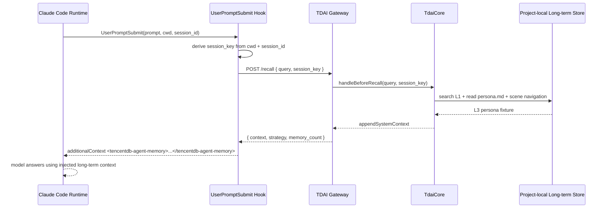

# Claude Code Adapter Long-term Memory E2E Experiment Report

Date: 2026-07-22

This report validates the Claude Code adapter's long-term memory path against a real project-local TencentDB-Agent-Memory Gateway and one real Claude Code runtime invocation.

## Scope

The experiment focuses on adapter and Gateway/Core data flow, not L1 extraction quality.

Long-term memory in this project has multiple layers:

- L0 Conversation: raw user/assistant messages persisted by capture/seed.
- L1 Atom: structured facts extracted from conversations by the memory pipeline.
- L2 Scenario: scene-level organization.
- L3 Persona: stable profile/context injected during recall.

Because L1/L2/L3 generation normally requires an LLM runner, this experiment disables extraction and uses a controlled L3 `persona.md` fixture to validate the recall injection path without spending extraction tokens or depending on external model credentials.

## Isolated environment

All artifacts were created under the repository-local directory:

```text
.claude-tdai-experiments/long-term/
  tdai-gateway.yaml
  settings.json
  data/
  gateway/
  logs/
  tmp/
```

Gateway config summary:

- host: `127.0.0.1`
- port: `18420`
- data dir: `.claude-tdai-experiments/long-term/data`
- store backend: SQLite
- embedding: disabled (`provider: none`)
- extraction: disabled
- recall strategy: `keyword`

Claude Code settings used only a `UserPromptSubmit` hook:

```powershell
$env:MEMORY_TENCENTDB_GATEWAY_URL = 'http://127.0.0.1:18420'; $env:MEMORY_TENCENTDB_AUTO_RECALL = 'true'; $env:MEMORY_TENCENTDB_SHORT_TERM = 'false'; $env:MEMORY_TENCENTDB_RECALL_MAX_CHARS = '8000'; npx tsx src/adapters/claude-code/hooks/user-prompt-submit.ts
```

## Data flow under test



## Experiment matrix

| ID | Goal | Method | Expected result | Actual result |
| --- | --- | --- | --- | --- |
| LT-01 | Start isolated Gateway | `npx tsx src/gateway/server.ts` with project-local config | `/health` returns OK | PASS: `stores.vectorStore=true`, `stores.embeddingService=false` |
| LT-02 | Check `/seed` behavior | `POST /seed` with one conversation containing `cobalt-penguin` | Seed persists L0 records | PASS for seed itself: `l0_recorded=2`; observed that output goes to timestamped `data/seed-*` subdir |
| LT-03 | Runtime L0 capture/search | `POST /capture` new messages containing `amber-otter`, then `POST /search/conversations` | L0 search returns captured messages | PASS: `l0_recorded=2`, search returned 2 matching messages |
| LT-04 | Long-term recall HTTP path | Create project-local `data/persona.md`, then `POST /recall` | Recall context contains persona fixture | PASS: context contains `cobalt-penguin` and memory tools guide |
| LT-05 | Adapter hook path | Run `src/adapters/claude-code/hooks/user-prompt-submit.ts` with hook JSON | Hook emits `additionalContext` | PASS: emitted `<tencentdb-agent-memory>` with long-term recall context |
| LT-06 | Real Claude Code runtime path | `claude -p ... --settings long-term/settings.json --model sonnet --tools "" --max-budget-usd 0.20` | Claude sees injected long-term context and answers `LONGTERM_OK` | PASS: result `LONGTERM_OK`, cost `$0.02966775` |

## Evidence files

```text
.claude-tdai-experiments/long-term/logs/gateway.stdout.log
.claude-tdai-experiments/long-term/logs/gateway.stderr.log
.claude-tdai-experiments/long-term/logs/exp-longterm-01-seed.json
.claude-tdai-experiments/long-term/logs/exp-longterm-02-search-conversations.json
.claude-tdai-experiments/long-term/logs/exp-longterm-03-recall-persona.json
.claude-tdai-experiments/long-term/logs/exp-longterm-06-capture-new-message.json
.claude-tdai-experiments/long-term/logs/exp-longterm-07-search-conversations-after-new-capture.json
.claude-tdai-experiments/long-term/logs/exp-longterm-08-user-prompt-hook.json
.claude-tdai-experiments/long-term/logs/exp-longterm-09-claude-runtime-recall.json
.claude-tdai-experiments/long-term/logs/exp-longterm-09-claude-runtime-debug.log
```

## Observations

1. The Claude Code adapter's long-term recall injection path is functional with a real Claude Code runtime.
2. `/capture` is the right endpoint for validating live L0 writes into the active Gateway Core data directory.
3. `/seed` succeeded but wrote to a timestamped `data/seed-*` subdirectory. That is useful for offline imports, but the active Gateway search did not immediately see those records because the running Core was bound to the root data directory.
4. The first `/capture` attempt with old timestamps recorded `0` messages. This matches the cold-start duplicate-protection behavior: the runtime capture path filters messages older than the startup/cursor floor.
5. With embedding disabled, L0 conversation search still works through SQLite FTS. L1 memory recall was not validated in this run because extraction was intentionally disabled to avoid external LLM calls.
6. The real Claude Code invocation proved the platform-facing contract: `UserPromptSubmit` can inject Gateway recall output into Claude Code and influence the model answer.

## Follow-up experiments

Recommended next experiments, after configuring a real low-cost extraction model in a project-local Gateway config:

1. L1 extraction E2E: `/capture` or `/seed` -> pipeline L1 -> `/search/memories`.
2. L1 auto-recall E2E: query matching an extracted atom -> `/recall` returns `memory_count > 0` and L1 snippets.
3. SessionEnd import E2E: real Claude transcript -> adapter `SessionEnd` hook -> `/seed` import -> subsequent L0/L1 search.
4. MCP long-term search E2E: real Claude Code MCP tool call -> Gateway `/search/conversations` and `/search/memories`.
