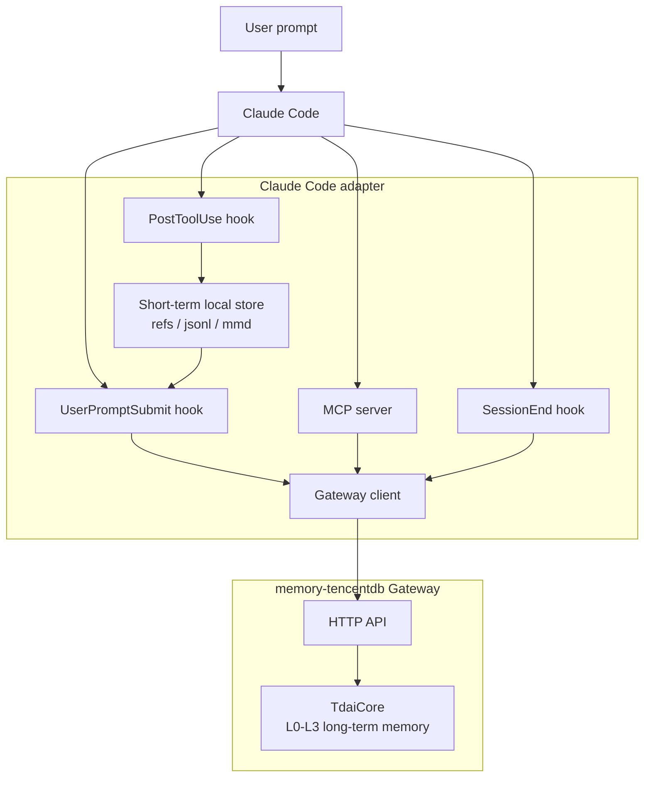
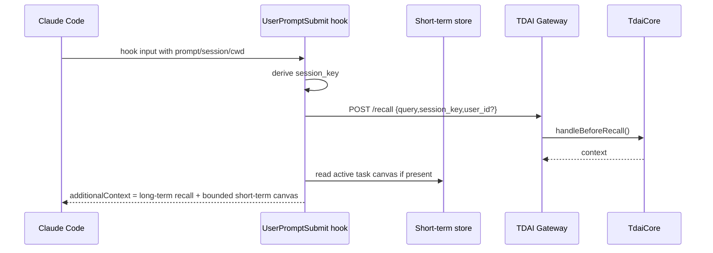
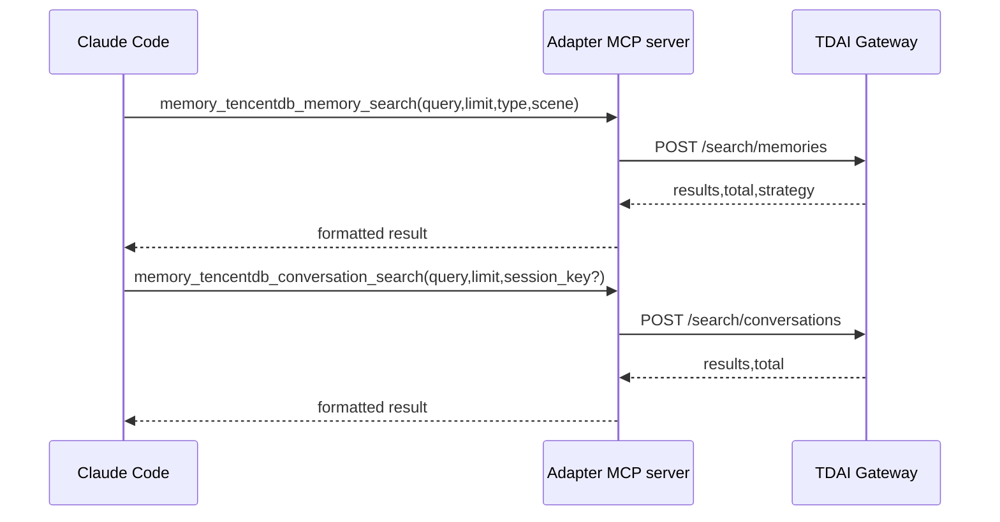
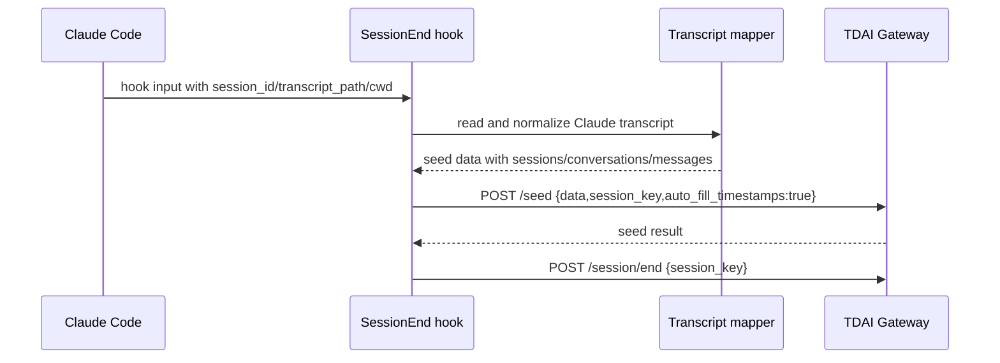
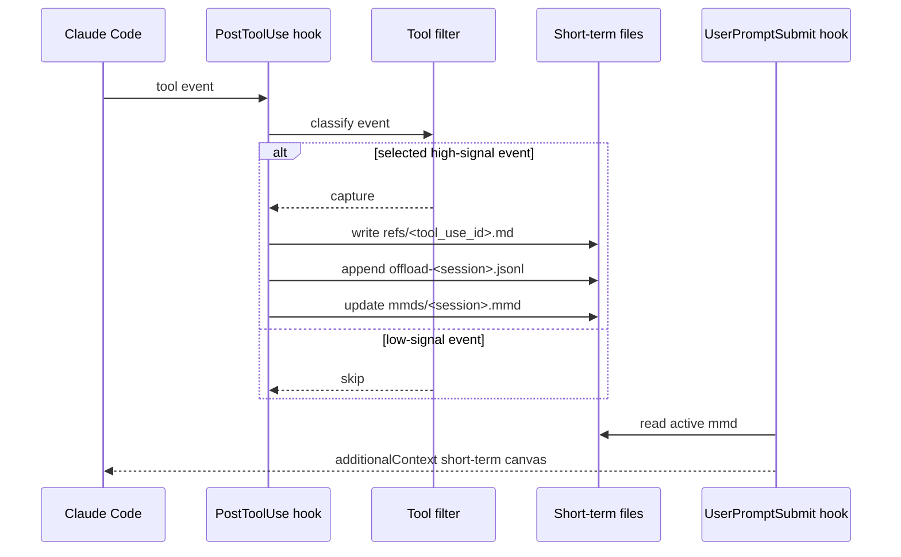

# Claude Code Adapter v1 Technical Design

This document turns the Claude Code adapter review into an implementation-ready v1 plan.

The core decision is to keep TencentDB-Agent-Memory's long-term memory engine unchanged and build a Claude Code adapter as a thin protocol layer around the existing Gateway, plus a local short-term canvas store that is intentionally scoped as partial OpenClaw parity.

## Goals

Claude Code v1 should provide:

- automatic long-term recall before a user prompt is submitted;
- conversation import at session end;
- explicit memory search tools through MCP;
- lightweight short-term symbolic canvas injection based on high-signal tool events;
- no changes to `TdaiCore` and no new Gateway endpoints.

The adapter must make the two memory systems visible and separate:

| System | v1 status | Source of truth | Injection path |
|---|---:|---|---|
| Long-term memory | Required | Gateway + `TdaiCore` | `UserPromptSubmit` `additionalContext` |
| Short-term memory | Partial | Claude Code adapter local files | `UserPromptSubmit` `additionalContext` |

## Non-Goals

v1 does not attempt to:

- replace or mutate arbitrary old Claude Code transcript messages;
- claim full OpenClaw short-term context-engine parity;
- add `updateContext`, `restoreContext`, `captureEpisode`, `updateScene`, or other new Gateway APIs;
- supervise the Gateway process like Hermes does;
- change core L0/L1/L2/L3 pipeline behavior.

## Current Gateway Contract

The adapter must use only the current Gateway API:

| Endpoint | Request fields used by Claude Code v1 | Adapter use |
|---|---|---|
| `GET /health` | none | startup/config check |
| `POST /recall` | `query`, `session_key`, `user_id?` | automatic long-term recall |
| `POST /seed` | `data`, `session_key?`, `strict_round_role?`, `auto_fill_timestamps?`, `config_override?` | session-end transcript import |
| `POST /capture` | `user_content`, `assistant_content`, `session_key`, `session_id?`, `user_id?`, `messages?` | optional latest-turn fallback |
| `POST /search/memories` | `query`, `limit?`, `type?`, `scene?` | MCP memory search |
| `POST /search/conversations` | `query`, `limit?`, `session_key?` | MCP conversation search |
| `POST /session/end` | `session_key`, `user_id?` | flush after import/capture |

`/seed` is the preferred v1 capture path because Claude Code's session transcript is easier to import as a batch than to reliably reconstruct every turn in hook state.

## Architecture



## Data Flow

### 1. Automatic recall before prompt



Rules:

- use `UserPromptSubmit`, not `SessionStart`, as the primary recall point because it has the concrete user query;
- cap automatic recall text to a small budget, initially 2-4 KB;
- include short-term canvas only when it exists and is under budget;
- label both sections clearly so Claude can distinguish durable memory from current-task scratch state.

### 2. Explicit memory search



Rules:

- MCP tools are explicit, user/model-invoked search paths;
- hooks should not call search endpoints except `/recall`;
- tool output should include endpoint strategy/total metadata but avoid injecting huge result sets by default.

### 3. Session-end capture



Fallback:

- if transcript parsing fails but the hook input has enough latest-turn data, call `/capture`;
- if neither path is possible, still call `/session/end` and log a warning.

### 4. Lightweight short-term canvas



This is partial parity with OpenClaw. It preserves a symbolic current-task map, but it does not own Claude Code's compaction pipeline.

## Session Key

Use one canonical derivation everywhere:

```text
agent:claude-code-<workspace_hash>:<session_id>
```

Where:

- `workspace_hash` is a stable short hash of normalized `cwd` or workspace root;
- `session_id` comes from Claude Code hook input;
- if `session_id` is unavailable, use a date-scoped fallback such as `manual-YYYYMMDD-<short-random>`.

Do not put absolute paths, user names, tokens, or secrets directly into the session key.

## Local Storage

Claude Code short-term files should not reuse OpenClaw's storage directory.

Recommended layout:

```text
~/.memory-tencentdb/claude-code-offload/
  <workspace_hash>/
    refs/
      <tool_use_id>.md
    mmds/
      <session_id>.mmd
    offload-<session_id>.jsonl
    state.json
```

Each JSONL row should contain:

- `session_key`
- `session_id`
- `cwd_hash`
- `tool_use_id`
- `tool_name`
- `started_at`
- `ended_at`
- `status`
- `input_summary`
- `result_summary`
- `result_ref`
- `node_id?`

## Tool Filtering

Default v1 policy:

| Tool event | Default action | Reason |
|---|---|---|
| failed tool calls | capture | failures explain task state |
| shell commands | capture summary; ref if large | often state-changing or diagnostic |
| write/edit operations | capture | source of durable task changes |
| very large outputs | capture ref + summary | avoid context bloat |
| read/list/search tools | skip unless large/error | usually low-signal and noisy |
| secret-bearing outputs | redact or skip | safety |

The filter must be configurable with allow/deny lists.

## Config

Initial config can be environment-based:

| Env var | Default | Meaning |
|---|---|---|
| `MEMORY_TENCENTDB_GATEWAY_URL` | `http://127.0.0.1:8420` | Gateway base URL |
| `MEMORY_TENCENTDB_GATEWAY_API_KEY` | unset | Bearer token for Gateway |
| `TDAI_GATEWAY_API_KEY` | unset | fallback API key name |
| `MEMORY_TENCENTDB_CLAUDE_STORAGE_DIR` | `~/.memory-tencentdb/claude-code-offload` | short-term store root |
| `MEMORY_TENCENTDB_AUTO_RECALL` | `true` | enable `UserPromptSubmit` recall |
| `MEMORY_TENCENTDB_SHORT_TERM` | `true` | enable lightweight short-term canvas |
| `MEMORY_TENCENTDB_RECALL_MAX_CHARS` | `4000` | auto recall budget |
| `MEMORY_TENCENTDB_CANVAS_MAX_CHARS` | `3000` | short-term canvas budget |

If the Gateway is configured with an API key, the adapter must send:

```text
Authorization: Bearer <key>
```

## Proposed File Layout

```text
src/adapters/claude-code/
  README.md
  config.ts
  types.ts
  gateway-client.ts
  session-key.ts
  context-format.ts
  hooks/
    user-prompt-submit.ts
    post-tool-use.ts
    session-end.ts
  mappers/
    transcript.ts
    tool-event.ts
  short-term/
    store.ts
    filter.ts
    canvas.ts
  mcp/
    server.ts
    tools.ts
```

This layout keeps host-specific logic out of `src/core`.

## Implementation Order

1. Add `gateway-client.ts` with typed methods for the real Gateway endpoints.
2. Add `session-key.ts` and `config.ts`.
3. Add MCP tools for memory and conversation search.
4. Add `UserPromptSubmit` recall hook and bounded context formatter.
5. Add `SessionEnd` transcript parser and `/seed` import path.
6. Add `PostToolUse` capture, filter, local refs/jsonl/mmd store.
7. Add README setup instructions for Claude Code hook and MCP configuration.

After step 4, long-term recall is usable. After step 5, long-term capture is usable. Step 6 adds the short-term current-task canvas.

## Test Plan

Unit tests:

- session key derivation is stable and does not leak absolute paths;
- Gateway client sends exact request bodies;
- recall formatter respects max-character budgets;
- MCP tools map to `/search/memories` and `/search/conversations`;
- transcript parser converts Claude Code transcript records into seed format;
- tool filter captures/skips expected tool event categories.

Integration tests:

- mock Gateway server receives `/recall`, `/seed`, `/session/end`;
- hook scripts accept representative Claude Code hook JSON through stdin;
- short-term store creates `refs`, JSONL rows, and an MMD file for selected tool events.

Manual smoke test:

1. start Gateway on `127.0.0.1:8420`;
2. run the MCP search server and verify both search tools;
3. run `UserPromptSubmit` hook with sample JSON and confirm `additionalContext`;
4. run `SessionEnd` hook with a small transcript and confirm `/seed` import;
5. run `PostToolUse` hook with a large shell output and confirm ref/jsonl/mmd files.

## Risks And Mitigations

| Risk | Mitigation |
|---|---|
| Claude Code hook JSON fields differ by version | isolate parsing in mappers and keep fixtures close to docs |
| automatic recall pollutes context | strict max chars, clear section labels, opt-out env var |
| duplicate automatic recall and MCP search | reserve hooks for recall, MCP for explicit search |
| transcript import duplicates previous import | keep `state.json` with last imported transcript offset/hash |
| tool results expose secrets | default redaction and configurable deny list |
| Gateway is not running | health check with clear warning; v1 does not auto-start |

## Ready-To-Implement Decision

Yes: after this design, implementation can start without changing core memory architecture.

The first implementation slice should be:

```text
Gateway client + session key + MCP search tools + UserPromptSubmit recall
```

That slice proves Claude Code can read from TencentDB-Agent-Memory through the existing Gateway. Capture and short-term canvas can then be added incrementally without reopening the API design.
## Implementation Status

Implemented in `src/adapters/claude-code/`:

- Gateway client for `/recall`, `/search/memories`, `/search/conversations`, `/seed`, and `/session/end`.
- Stable Claude Code session key derivation.
- `UserPromptSubmit` recall hook with bounded `additionalContext` formatting.
- `SessionEnd` transcript import hook that conservatively maps user/assistant text pairs into seed input.
- `PostToolUse` short-term refs/jsonl/mmd symbolic canvas capture and `UserPromptSubmit` canvas injection.
- MCP search tool handlers and a minimal stdio server.

Still pending:

- `PostToolUse` short-term refs/jsonl/mmd symbolic canvas.
- Long-term Gateway E2E with a running Gateway.
- Packaging/setup instructions beyond development `tsx` invocation.

## E2E Experiment

A real Claude Code runtime E2E for the short-term memory path passed on Windows with Claude Code 2.1.126 and `claude-sonnet-4-6`. See [Claude Code Adapter E2E Experiment Report](./claude-code-e2e-experiment-report.md).

