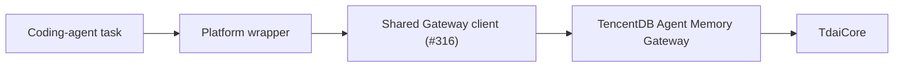

# Codex and Claude Code Integration Guide

This guide describes the platform-specific decisions needed to connect a
Codex- or Claude Code-style coding agent to TencentDB Agent Memory. It does
not define another Gateway client or adapter SDK. Reusable HTTP and lifecycle
behaviour belongs to the shared Gateway-client boundary introduced by
[PR #316](https://github.com/TencentCloud/TencentDB-Agent-Memory/pull/316).

## What a Coding-Agent Integration Must Decide

The shared Gateway boundary covers memory operations. A coding-agent wrapper
still needs to decide the host-specific details below:

1. How to identify a stable coding task session.
2. Where recalled memory enters the next model prompt.
3. Which completed turns are safe and useful to capture.
4. When the task session has ended.



## Stable Session Identity

Memory must not be shared accidentally across unrelated repositories or task
threads. The wrapper should derive a stable `sessionKey` from values that
survive process restarts:

```text
<platform>:<normalized-workspace-root>:<conversation-or-task-id>
```

Examples:

```text
codex:E:/work/payment-service:thread-42
claude-code:/home/alice/api:session-8f1d
```

- Use the repository or workspace root, not the current process directory.
- Use the platform conversation or task id when it is available.
- Do not use a random process id as the only identifier.
- Include an authenticated user id when the host can provide one and multiple
  users may share a Gateway.

## Lifecycle Mapping

The integration follows the same memory lifecycle as existing hosts, but the
wrapper decides where those events occur in a coding-agent runtime.

| Coding-agent event | Shared Gateway operation | Wrapper responsibility |
| --- | --- | --- |
| Before building the model prompt | `prefetch(query)` / recall | Resolve the session, obtain recalled context, and inject it in a clearly delimited context block. |
| After a final assistant response | `captureTurn(turn)` / capture | Persist the user request and committed assistant response for the same session. |
| User requests memory history | memory or conversation search | Forward the user query and keep the session filter when searching conversations. |
| Task, thread, or workspace run ends | `endSession()` | Flush session-scoped work once; do not call it after every tool invocation. |

## Prompt Injection

Recall should happen before the next prompt is assembled. Keep recalled content
separate from the current user instruction so a model can distinguish memory
from the task at hand.

```text
[Relevant project memory]
<recalled context>
[/Relevant project memory]

<current user request>
```

The wrapper should keep the current request authoritative. Recalled memory is
supporting context, not an instruction that overrides the user or platform
policy.

## Capture Boundary

Capture only a completed user/assistant turn. In particular, a coding-agent
wrapper should avoid sending secrets, credentials, private keys, or raw tool
output that the user did not intend to retain. A wrapper may redact or skip a
turn before calling capture when its host environment can classify sensitive
content.

## Minimal Wrapper Pseudocode

The following intentionally uses the shared adapter boundary rather than a
new HTTP client implementation:

```ts
const memory = createGatewayPlatformAdapter({
  client: sharedGatewayClient,
  platform: "codex",
  resolveContext: () => ({
    sessionKey: buildSessionKey(workspaceRoot, conversationId),
    userId,
  }),
});

const recalled = await memory.prefetch(userPrompt);
const prompt = addMemoryBlock(recalled.context, userPrompt);

const answer = await runCodingAgent(prompt);
await memory.captureTurn({ userText: userPrompt, assistantText: answer });

await memory.endSession();
```

`createGatewayPlatformAdapter` and the shared Gateway client are provided by
the #316 boundary. This guide only specifies how a coding-agent host should
provide the workspace, conversation identity, prompt hook, and session-end
event.

## Host Checklist

- [ ] `sessionKey` includes a stable workspace and task/thread identity.
- [ ] Recall occurs before model prompt construction.
- [ ] Recalled memory is visibly delimited from the new user request.
- [ ] Capture happens only after a committed assistant response.
- [ ] Sensitive values are redacted or skipped before capture.
- [ ] Session end is triggered once when the coding task closes.
