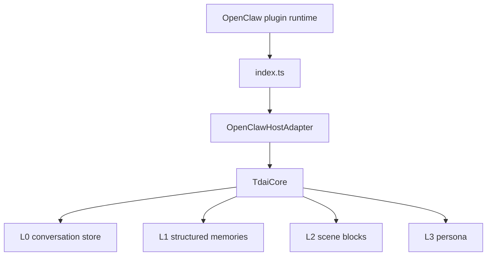
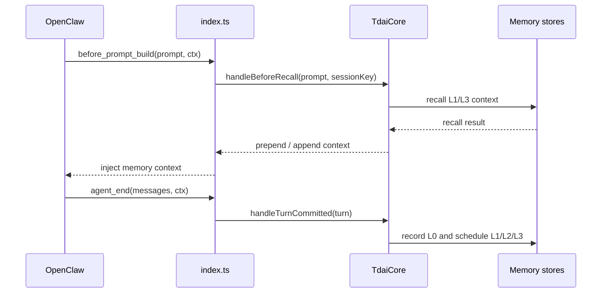
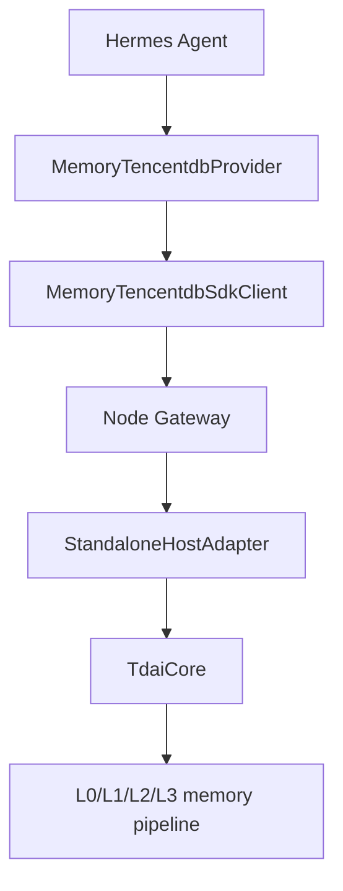
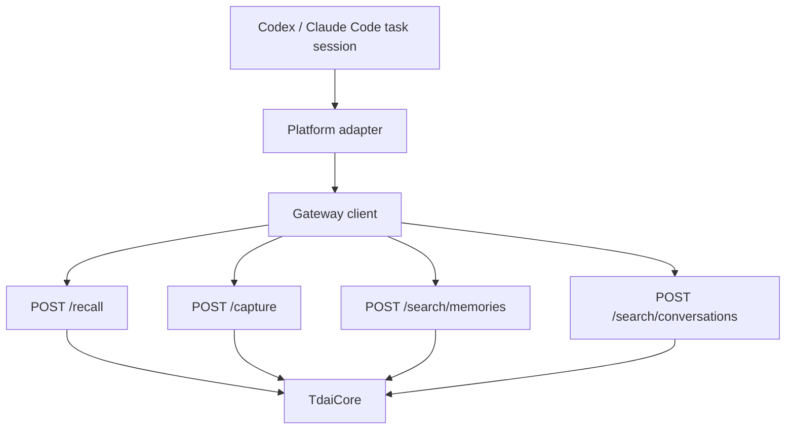

# Codex and Claude Code Adapter Architecture

This document contributes to issue #235 by mapping the existing
TencentDB-Agent-Memory adapter layers and outlining a path for Codex and
Claude Code style coding-agent integrations.

## Scope

This document covers the foundation stage and the first minimal Gateway-client
step:

- Identify the host-neutral memory capabilities exposed by `TdaiCore`.
- Compare the existing OpenClaw and Hermes integration paths.
- Propose a minimal Codex / Claude Code adapter path without duplicating the
  existing Dify adapter work.
- Provide a small Gateway-backed client that future Codex / Claude Code
  wrappers can reuse.

It does not implement a full adapter SDK yet. That should come after one
concrete coding-agent integration is validated.

## Core Memory Boundary

`src/core/tdai-core.ts` is the host-neutral facade. It depends on
`HostAdapter` and `LLMRunnerFactory` abstractions from `src/core/types.ts`
instead of depending directly on OpenClaw, Hermes, Codex, or Claude Code.

The main capabilities are:

| Capability | `TdaiCore` method | Existing host mapping |
| --- | --- | --- |
| Recall memory before a model turn | `handleBeforeRecall(userText, sessionKey)` | OpenClaw `before_prompt_build`; Hermes `prefetch()` via Gateway `/recall` |
| Capture a completed turn | `handleTurnCommitted(turn)` | OpenClaw `agent_end`; Hermes `sync_turn()` via Gateway `/capture` |
| Search structured memories | `searchMemories(params)` | OpenClaw `tdai_memory_search`; Hermes `memory_tencentdb_memory_search` via Gateway `/search/memories` |
| Search raw conversations | `searchConversations(params)` | OpenClaw `tdai_conversation_search`; Hermes `memory_tencentdb_conversation_search` via Gateway `/search/conversations` |
| Flush one session | `handleSessionEnd(sessionKey)` | Hermes `on_session_end` via Gateway `/session/end` |

The adapter goal for any new platform is to translate platform lifecycle
events and tool calls into these five operations.

## Existing OpenClaw Path

OpenClaw runs the plugin in-process. The root `index.ts` file acts as a thin
host shell:

1. Parse plugin config.
2. Create `OpenClawHostAdapter`.
3. Create `TdaiCore`.
4. Register OpenClaw tools and lifecycle hooks.
5. Delegate memory work to `TdaiCore`.



OpenClaw hook flow:



OpenClaw search tools:

- `tdai_memory_search` delegates to `core.searchMemories()`.
- `tdai_conversation_search` delegates to `core.searchConversations()`.

## Existing Hermes Path

Hermes uses an out-of-process Gateway. The Python provider in
`hermes-plugin/memory/memory_tencentdb/` supervises or connects to the Node.js
Gateway and calls it over HTTP.



Gateway endpoints map to core capabilities:

| Gateway endpoint | Client method | Core method |
| --- | --- | --- |
| `GET /health` | `health()` | Store readiness check |
| `POST /recall` | `recall()` | `handleBeforeRecall()` |
| `POST /capture` | `capture()` | `handleTurnCommitted()` |
| `POST /search/memories` | `search_memories()` | `searchMemories()` |
| `POST /search/conversations` | `search_conversations()` | `searchConversations()` |
| `POST /session/end` | `end_session()` | `handleSessionEnd()` |

Hermes lifecycle mapping:

- `prefetch(query)` calls Gateway `/recall`.
- `sync_turn(user, assistant)` calls Gateway `/capture` in a bounded
  background thread.
- `get_tool_schemas()` exposes search tools to the LLM.
- `handle_tool_call()` routes search tool calls to Gateway search endpoints.
- `on_session_end()` calls Gateway `/session/end`.

## Codex / Claude Code Integration Direction

Codex and Claude Code style coding agents are closer to Hermes than to
OpenClaw when there is no stable in-process plugin API. A practical first
integration should therefore use the existing Gateway path and add a thin
platform adapter around it.

Recommended first version:



The platform adapter should provide four minimal responsibilities:

1. Session identity: derive a stable `session_key` from the coding task,
   workspace, or conversation thread.
2. Recall injection: call `/recall` before sending a prompt to the model and
   inject returned memory context into the prompt or system context.
3. Turn capture: call `/capture` after a completed user / assistant turn.
4. Search tools: expose `search_memories` and `search_conversations` as tool
   calls when the host platform supports tools.

## Minimal Gateway Client

`src/adapters/coding-agent/gateway-client.ts` provides a small reusable
Gateway client for coding-agent wrappers. It maps host-neutral method names to
the existing HTTP API:

| Client method | Gateway endpoint |
| --- | --- |
| `health()` | `GET /health` |
| `recall(query, session)` | `POST /recall` |
| `capture(input)` | `POST /capture` |
| `searchMemories(input)` | `POST /search/memories` |
| `searchConversations(input)` | `POST /search/conversations` |
| `endSession(session)` | `POST /session/end` |

The client intentionally stays below the platform-specific layer. A Codex,
Claude Code, or CLI-wrapper integration can reuse it while deciding its own
session-key strategy and prompt-injection mechanics.

## Adapter Interface Sketch

A future SDK can start with a small interface instead of platform-specific
copy-paste:

```ts
export interface MemoryAdapterSession {
  sessionKey: string;
  userId?: string;
  platform: "codex" | "claude-code" | "openclaw" | "hermes" | string;
}

export interface MemoryAdapter {
  recall(query: string, session: MemoryAdapterSession): Promise<string>;
  capture(input: {
    userContent: string;
    assistantContent: string;
    session: MemoryAdapterSession;
  }): Promise<void>;
  searchMemories(query: string, session: MemoryAdapterSession, limit?: number): Promise<string>;
  searchConversations(query: string, session: MemoryAdapterSession, limit?: number): Promise<string>;
  endSession?(session: MemoryAdapterSession): Promise<void>;
}
```

The SDK should wrap Gateway concerns that every platform would otherwise
reimplement:

- Base URL and optional Bearer token.
- Request timeout and retry policy.
- Consistent request / response types.
- Error degradation policy when the Gateway is unavailable.
- Optional privacy filters before capture.

## Open Questions

- Codex and Claude Code plugin surfaces differ. If a platform does not expose
  lifecycle hooks, the first integration may need to be a CLI wrapper or MCP
  bridge rather than an in-process plugin.
- The adapter must avoid capturing secrets, API keys, private repository
  content, or tool outputs that should not become long-term memory.
- If multiple coding agents share one Gateway, the `session_key` and `user_id`
  strategy must prevent memory cross-contamination.
- A future SDK should be introduced only after at least one concrete
  Codex/Claude Code path is validated against the Gateway.

## Suggested Next Step

Use this architecture as the basis for one minimal coding-agent adapter:

1. Start the existing Gateway.
2. Implement a small Gateway client for Codex or Claude Code.
3. Validate `capture -> search_conversations -> recall` on one local task
   session.
4. Extract common request logic into an adapter SDK only after the concrete
   path works.
