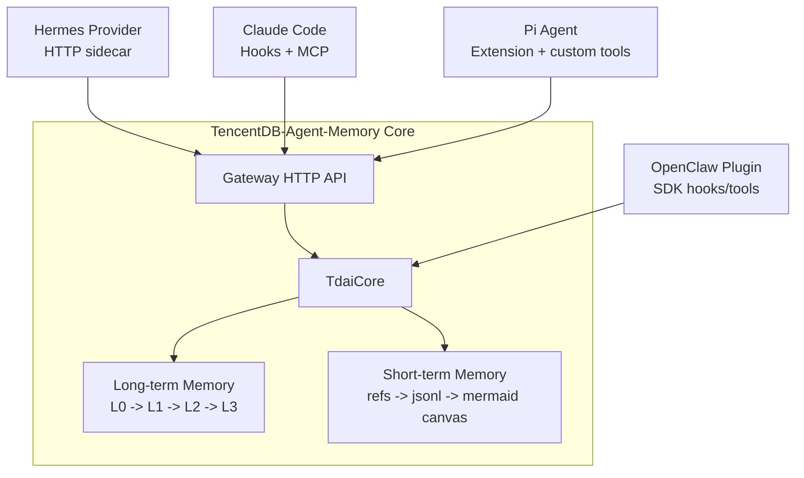

# Cross-Platform Adapter Comparison

This document summarizes the adapter differences discovered while implementing issue #235. It complements `architecture.md` by focusing on how each host platform maps its own runtime model to TencentDB-Agent-Memory.

## Scope

Covered platforms:

- OpenClaw plugin integration
- Hermes / Gateway provider integration
- Claude Code adapter
- Pi Agent adapter

Memory systems considered:

- Long-term memory: L0 Conversation -> L1 Atom -> L2 Scenario -> L3 Persona
- Short-term memory: tool output refs -> JSONL summaries -> Mermaid symbolic canvas

## High-level comparison

| Platform | Integration shape | Memory entry point | Search surface | Capture surface | Short-term memory | Key isolation |
| --- | --- | --- | --- | --- | --- | --- |
| OpenClaw | In-process plugin SDK | `before_prompt_build` recall through host hooks | OpenClaw tools: `tdai_memory_search`, `tdai_conversation_search` | `agent_end` hook commits turns to TdaiCore | Optional offload via host `contextEngine` and after-tool-call patch | Host session key |
| Hermes | HTTP Gateway + Python provider | Provider calls Gateway/Core over HTTP | Gateway/provider tools over HTTP | Gateway endpoints such as `/seed` and `/session/end` | Not host-native; mainly long-term memory sidecar | Gateway session key |
| Claude Code | Hook scripts + MCP server | `UserPromptSubmit` hook calls Gateway `/recall` and injects context | MCP tools for memory/conversation search | `SessionEnd` transcript import through `/seed` + `/session/end` | Implemented with `PostToolUse` refs/jsonl/mmd symbolic canvas | `claude-code:` derived key |
| Pi Agent | Pi Extension lifecycle + custom tools | `before_agent_start` returns a custom memory message from Gateway `/recall` | Pi custom tools: `memory_search`, `conversation_search`, `context_get` | `session_shutdown` maps session history to `/seed` + `/session/end` | Reserved for Pi-native follow-up; not copied from Claude Code | `pi-agent:` derived key |

## Data-flow comparison

The important design point is that OpenClaw can call TdaiCore in-process, while Hermes, Claude Code, and Pi Agent use Gateway as the stable cross-process boundary. This lets new platforms integrate without importing OpenClaw-specific internals.

## Platform-specific observations

### OpenClaw

OpenClaw is the most native integration. It owns the original plugin entrypoint and can directly register tools and lifecycle hooks with the host runtime. Because it runs in-process, it can delegate directly to TdaiCore and can use host features such as `contextEngine` for short-term offload.

Best fit:

- deep host integration;
- automatic capture and recall;
- full access to OpenClaw session state;
- short-term offload using OpenClaw runtime primitives.

Trade-off:

- this integration style is not portable to external agents, because it relies on OpenClaw plugin APIs.

### Hermes / Gateway

Hermes demonstrates the sidecar pattern. The Python provider does not need to embed TdaiCore. Instead, it talks to the HTTP Gateway, which becomes the platform-neutral boundary around recall, search, seed, and session-end behavior.

Best fit:

- external runtimes;
- language-agnostic integration;
- decoupling memory engine lifecycle from the host agent process.

Trade-off:

- the adapter must serialize host events into Gateway requests;
- host-native short-term memory is limited unless the host exposes additional lifecycle/tool hooks.

### Claude Code

Claude Code requires a split adapter because different capabilities live in different surfaces:

- hooks are best for lifecycle events such as prompt recall and session-end transcript import;
- MCP is best for agent-callable search tools;
- `PostToolUse` is the natural insertion point for short-term context capture.

Best fit:

- real coding-agent workflow validation;
- active memory search through MCP;
- short-term memory capture from tool results;
- project-local experiments that do not modify global Claude Code configuration.

Trade-off:

- the adapter is necessarily multi-surface: hooks + MCP + local short-term artifacts;
- the short-term canvas design is Claude Code specific and should not be blindly reused by other platforms.

### Pi Agent

Pi Agent validates that the adapter architecture can support another coding-agent runtime without copying the Claude Code design. Pi has its own Extension lifecycle and custom tool registration model:

- `before_agent_start` is used for pre-turn recall;
- `session_shutdown` is used for end-of-session capture;
- `registerTool({ ... })` exposes memory search as Pi-native tools.

Best fit:

- Pi-native extension integration;
- long-term memory recall/capture through Gateway;
- active memory search during reasoning;
- clean separation from Claude Code hooks/MCP assumptions.

Trade-off:

- v1 validates extension loading and adapter registration with Pi CLI, but a full Gateway-backed Pi conversation E2E should be added next;
- Pi-specific short-term memory should be designed separately instead of reusing Claude Code's symbolic canvas files directly.

## Key differences

| Dimension | OpenClaw | Hermes | Claude Code | Pi Agent |
| --- | --- | --- | --- | --- |
| Primary boundary | Plugin SDK | HTTP provider/Gateway | Hooks + MCP | Extension lifecycle |
| Core access | Direct TdaiCore | Gateway | Gateway | Gateway |
| Recall timing | Before prompt build | Provider/Gateway request | `UserPromptSubmit` | `before_agent_start` |
| Capture timing | Agent end | Gateway endpoint | `SessionEnd` | `session_shutdown` |
| Tool model | Host tools | Provider tools | MCP tools | Pi custom tools |
| Short-term strategy | Host context engine/offload | Not first-class | Implemented via `PostToolUse` canvas | Reserved for Pi-native design |
| Adapter risk | Host API coupling | Network/process boundary | Multi-surface complexity | Runtime API compatibility |

## Adapter design lessons

1. Keep TdaiCore host-neutral.

   Platform adapters should translate lifecycle events and tool calls into memory operations. They should not duplicate L0-L3 extraction, recall, search, or persona logic.

2. Treat Gateway as the cross-platform contract.

   For external runtimes, Gateway is the most stable boundary. It prevents each adapter from importing internal OpenClaw-specific code.

3. Separate long-term and short-term memory decisions.

   Long-term memory maps cleanly across platforms through recall/search/seed/session-end. Short-term memory depends heavily on each runtime's tool event model and should be designed per platform.

4. Use explicit session-key namespaces.

   Prefixes such as `claude-code:` and `pi-agent:` keep memory records debuggable and prevent cross-platform session collisions.

5. Prefer native host affordances.

   Claude Code should use hooks/MCP because those are its native extension points. Pi Agent should use Extension lifecycle events and custom tools. This makes each adapter smaller and more maintainable.

## Current acceptance mapping

| Issue stage | Evidence in this PR |
| --- | --- |
| Basic | `docs/adapters/architecture.md` explains the core engine, OpenClaw, Hermes/Gateway, memory layers, and data flow |
| Intermediate | `src/adapters/claude-code/` implements a working Claude Code adapter with tests and E2E experiment reports |
| Advanced | `src/adapters/pi-agent/` adds a second new platform adapter; this document compares OpenClaw, Hermes, Claude Code, and Pi Agent |
| Challenge | Not included yet; the natural follow-up is a unified Adapter SDK |

## Recommended next step

The next architectural step is to extract a small adapter SDK around common operations:

- derive stable session key;
- normalize host messages into L0 seed conversations;
- call recall/search/seed/session-end through Gateway;
- expose host-native tools;
- optionally plug in platform-specific short-term memory capture.

That would make future platforms implement one small interface instead of recreating the full adapter pattern.