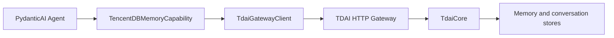
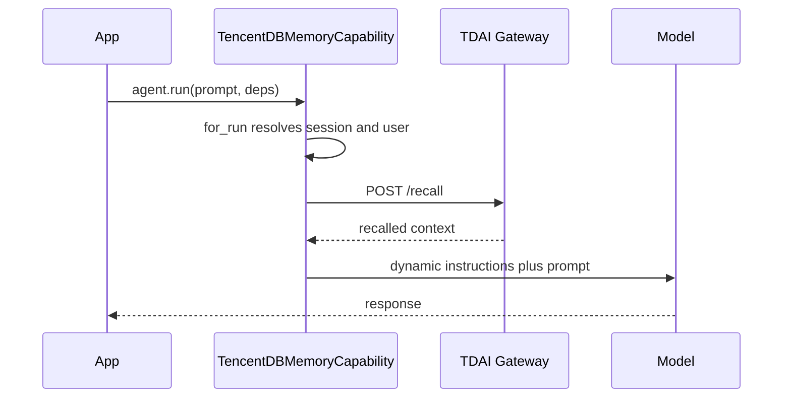
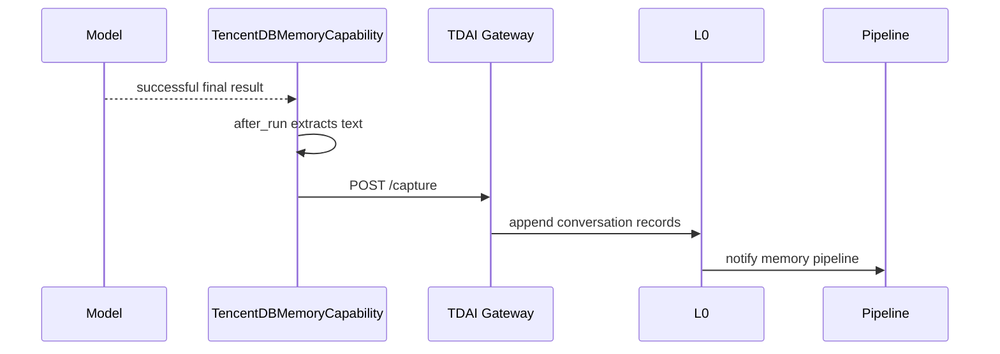

# PydanticAI Adapter

The PydanticAI adapter connects a PydanticAI 2.x agent to TencentDB Agent
Memory through the existing TDAI HTTP Gateway. It automatically recalls memory
before model requests, captures successful runs, and exposes memory search
tools to the model.

## Requirements

- Python 3.10 or newer
- PydanticAI 2.x
- A running TDAI Gateway

Install the adapter from this repository:

```bash
pip install -e ./pydantic-ai-adapter
```

## Architecture



The adapter is an independent Python package. It reuses the Gateway wire
contract and does not introduce a second in-process core SDK.

## Quick start

```python
import os
from dataclasses import dataclass

from pydantic_ai import Agent
from tdai_pydantic_ai import TencentDBMemoryCapability


@dataclass
class Deps:
    session_key: str
    user_id: str


memory = TencentDBMemoryCapability(
    session_key=lambda ctx: ctx.deps.session_key,
    user_id=lambda ctx: ctx.deps.user_id,
    base_url=os.getenv("TDAI_GATEWAY_URL", "http://127.0.0.1:8420"),
    api_key=os.getenv("TDAI_GATEWAY_API_KEY"),
)

agent = Agent(
    "openai:gpt-5.2",
    deps_type=Deps,
    capabilities=[memory],
)

result = await agent.run(
    "Which editor do I prefer?",
    deps=Deps(session_key="chat-42", user_id="alice"),
)
print(result.output)

# Explicitly flush/finalize the logical conversation when it ends.
await memory.end_session("chat-42", "alice")
```

`session_key` is required and must resolve to a non-empty string. Both
`session_key` and `user_id` accept either a static string or a synchronous or
asynchronous callable receiving the PydanticAI `RunContext`.

## Recall flow



Recall is cached within each run, so a tool-using or multi-step run does not
repeat the Gateway request. `for_run()` creates isolated run state, allowing
one Agent and capability instance to be shared safely by concurrent runs.

## Capture flow



Capture happens only after a successful run with textual user content and a
non-empty output. Pydantic model outputs are encoded as compact,
key-sorted JSON. Binary-only prompts are not recalled or captured.

For streaming runs, consume and finalize the stream normally so PydanticAI can
produce the completed run result and invoke `after_run()`.

## Search tools

The capability contributes two `FunctionToolset` tools:

| Tool | Arguments | Scope |
| --- | --- | --- |
| `tdai_memory_search` | `query`, `limit=5`, `type=""`, `scene=""` | Searches structured memory records |
| `tdai_conversation_search` | `query`, `limit=5` | Searches raw conversations in the current resolved session |

`limit` must be between 1 and 100. PydanticAI validates it before the Gateway
is called. Search failures return a short unavailable message to the model
instead of aborting the run.

## Management API

The capability also exposes explicit application-facing calls:

```python
status = await memory.health()
result = await memory.end_session("chat-42", "alice")
```

Unlike automatic recall, capture, and model-facing search, these management
calls propagate `TdaiGatewayError`. This lets startup checks and conversation
shutdown code detect and handle operational failures directly.

## Authentication and timeouts

Pass the Gateway URL, timeout, and Bearer token to the capability:

```python
memory = TencentDBMemoryCapability(
    session_key="chat-42",
    base_url="https://memory-gateway.example.com",
    timeout=5.0,
    api_key=os.environ["TDAI_GATEWAY_API_KEY"],
)
```

The adapter strips surrounding whitespace from the token and sends it as
`Authorization: Bearer <token>`. An empty or omitted key sends no
`Authorization` header. Configure the same value on the Gateway. The timeout
must be greater than zero.

Gateway failures are raised as `TdaiGatewayError` with a route and optional
HTTP status. Exception messages do not include the URL or Bearer token.
Automatic lifecycle operations log the safe error and fail open; explicit
management calls propagate it.

## Lifecycle comparison

| Concern | OpenClaw | Hermes | PydanticAI |
| --- | --- | --- | --- |
| Recall | `before_prompt_build` | `prefetch()` | Dynamic instructions |
| Capture | `agent_end` | `sync_turn()` | `after_run()` |
| Search | Registered tools | Provider tools | `FunctionToolset` |
| Session end | Gateway shutdown/session hooks | `on_session_end()` | Explicit `end_session()` |
| Core transport | In-process | HTTP Gateway | HTTP Gateway |

## Troubleshooting

- `Connection refused`: start the Gateway and check `base_url`; the default is
  `http://127.0.0.1:8420`.
- HTTP 401: configure the same `TDAI_GATEWAY_API_KEY` value on the Gateway and
  pass it as `api_key`.
- Empty session key: ensure the resolver returns a stable, non-empty key for
  every run.
- No captured turn: confirm the run completed successfully and contained
  textual prompt content and a non-empty result.
- Search tool validation retry: keep `limit` in the inclusive range 1–100.

