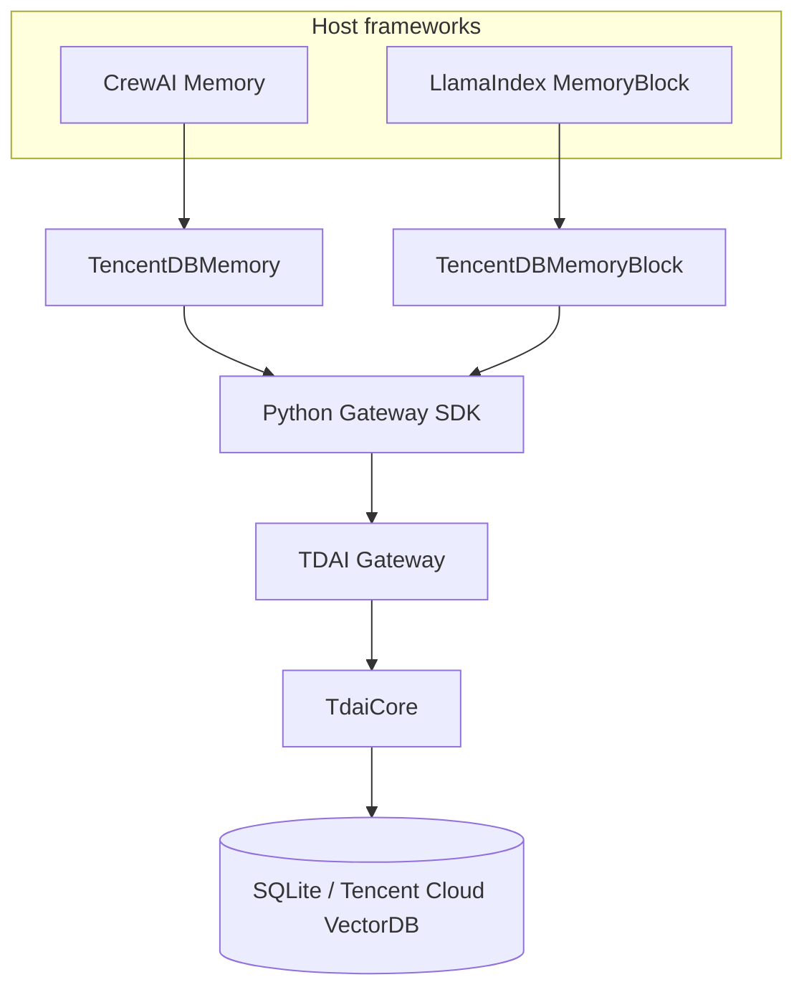

# Python Framework Adapter Comparison

Issue #235 asks for cross-platform adapters without moving storage or memory
semantics into each host framework. The two adapters in this change use the
same public Gateway protocol but bind it to each framework's native lifecycle.



## Lifecycle and semantic mapping

| Dimension | CrewAI | LlamaIndex |
| --- | --- | --- |
| Native extension point | `Memory` subclass | `BaseMemoryBlock[str]` subclass |
| Recall trigger | Crew recalls before agent work | Memory renders blocks into model input |
| Write trigger | Crew persists extracted durable insights | Memory waterfalls messages out of its short-term queue |
| Gateway recall | `/recall` + `/search/memories` | `/recall` + `/search/memories` |
| Gateway write | One `/capture` per extracted batch | One `/capture` per waterfall batch |
| Session source | Explicit stable `session_key` | Explicit key or `llamaindex:<session_id>` |
| Async behavior | Native sync API plus thread-backed async wrappers | Native async block API; sync client calls run off-loop |
| Outage policy | Fail open by default; strict opt-in | Fail open by default; strict opt-in |
| Remote deletion | Deliberately unsupported by `reset()` | Deliberately not coupled to local `reset()` |

## Why one adapter cannot be copied verbatim

CrewAI's unified memory API works with durable `MemoryRecord` and
`MemoryMatch` objects. LlamaIndex's current memory design combines a short-term
message queue with typed long-term blocks. The CrewAI adapter therefore maps
Gateway responses into native record matches and batches CrewAI-extracted
insights. The LlamaIndex adapter instead returns a formatted memory block and
captures only the messages LlamaIndex chooses to waterfall.

Both retain the same safety rules: credentials stay in the authorization
header, remote identity is explicit, unavailable memory does not break an
agent by default, and framework reset calls never silently delete remote data.

## Reproducible verification

```bash
python -m venv .venv-adapters
. .venv-adapters/bin/activate
pip install -e ./python-gateway-sdk -e ./crewai-plugin -e ./llamaindex-plugin
python -m unittest discover -s crewai-plugin/tests -t crewai-plugin -v
python -m unittest discover -s llamaindex-plugin/tests -t llamaindex-plugin -v
```

The test suites use the real public framework types and local fake Gateway
implementations. They cover framework type acceptance, request mapping,
identity propagation, fail-open/strict behavior, and session flushing without
requiring an LLM API key.
