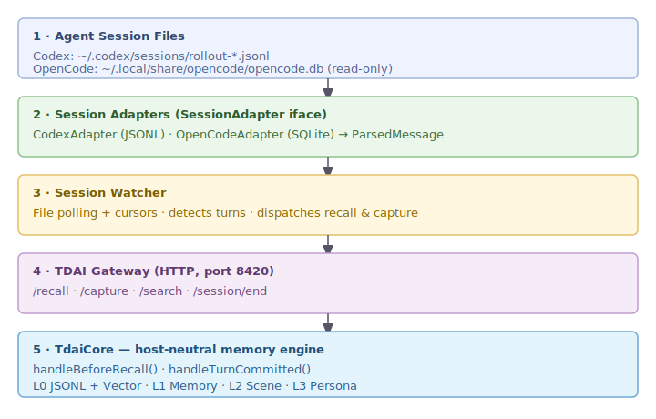
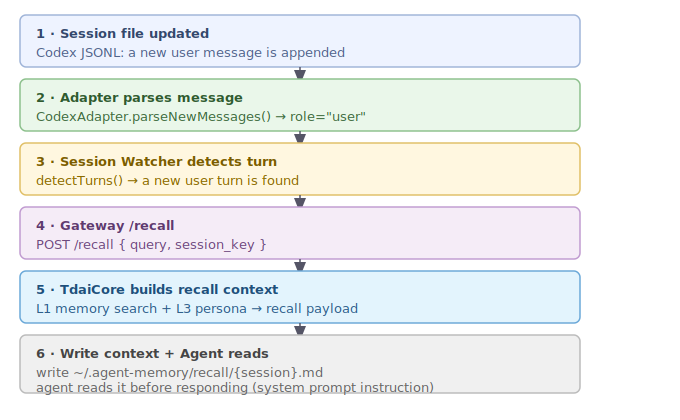
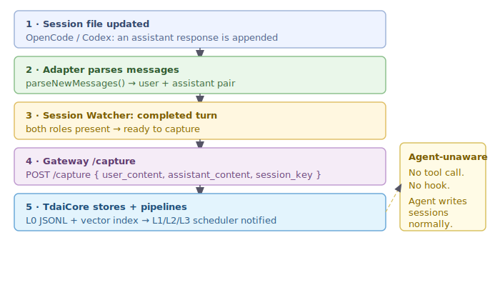

# Session Watcher — Passive Auto-Capture Adapter for Codex / OpenCode

> 被动会话监听适配器 — Agent 无需配合，自动从会话文件中采集对话记忆。

## Overview | 概述

The Session Watcher is a **passive, file-polling adapter** that automatically captures
conversation turns from agent session files and pushes them to the TDAI Gateway for
memory storage — without requiring any agent cooperation, tool calls, or platform
modifications.

Unlike the OpenClaw plugin (which hooks into `before_prompt_build`/`agent_end` events),
the Session Watcher operates entirely outside the agent process. It reads the session
files that the agent already writes as part of normal operation.

### Supported Platforms | 支持的平台

| Platform | Session Format | Adapter |
|----------|---------------|---------|
| **Codex** | `~/.codex/sessions/rollout-*.jsonl` | `CodexAdapter` — parses JSONL events |
| **OpenCode** | `~/.local/share/opencode/opencode.db` (SQLite) | `OpenCodeAdapter` — reads SQLite in read-only mode |
| (extensible) | Any session format | Implement `SessionAdapter` interface (30 lines) |

## Architecture | 架构



The Session Watcher sits between the agent's native session files and the TDAI Gateway:

- **Adapters** translate platform-specific session formats into normalized `ParsedMessage` objects
- **Session Watcher** polls adapters for new messages, detects conversation turns, and dispatches recall/capture
- **Gateway** processes the HTTP requests and routes to `TdaiCore`

## Data Flows | 数据流

### Recall Flow | 召回流程



1. Agent writes a new user message to its session file (normal operation)
2. Adapter parses the new message on next poll cycle
3. Session Watcher detects a new user turn
4. Gateway `/recall` is called with the user's query text
5. Recall context is written to `~/.agent-memory/recall/{sessionKey}.md`
6. Agent reads this file (via system prompt instruction) before responding

### Capture Flow | 采集流程



1. Agent writes an assistant response to its session file
2. Adapter parses the completed user+assistant pair
3. Session Watcher detects a completed turn
4. Gateway `/capture` is called with `{ user_content, assistant_content, session_key }`
5. `TdaiCore` records L0 conversation + notifies L1/L2/L3 pipeline scheduler

**Key advantage**: The agent is completely unaware of capture happening — it just writes
session files as usual.

## Comparison with Other Approaches | 与其他方案对比


## Adapter Interface | 适配器接口

Adding support for a new agent platform requires implementing the `SessionAdapter`
interface (~30 lines):

```typescript
interface SessionAdapter {
  readonly name: string;
  sessionDir(): string;                              // root directory for sessions
  discoverSessions(): Promise<SessionInfo[]>;         // find active sessions
  parseNewMessages(sessionKey, sinceTimestamp): Promise<ParsedMessage[]>;  // incremental read
  detectTurns(messages: ParsedMessage[]): ParsedTurn[];  // group into user/assistant turns
}
```

See `src/adapters/session-watcher/adapters/codex.ts` (100 lines, JSONL) and `src/adapters/session-watcher/adapters/opencode.ts` (170 lines, SQLite) for reference implementations.

## Usage | 使用

### Prerequisites

- TDAI Gateway running (or auto-managed by Gateway Supervisor)
- Agent session files accessible on disk

### Configuration | 配置

```bash
# Required
export TDAI_GATEWAY_PORT=8420
export TDAI_WATCHER_ADAPTERS=opencode,codex

# Optional
export TDAI_GATEWAY_API_KEY=your-key
export TDAI_WATCHER_POLL_MS=5000       # polling interval (default: 5000ms)
export TDAI_MCP_DATA_DIR=~/.agent-memory
```

### Start | 启动

The Session Watcher is part of the AgentMemory project. Run it alongside the Gateway:

```bash
# Start the Gateway (or let GatewaySupervisor auto-manage it)
npx tsx src/gateway/server.ts

# In another terminal, start the Session Watcher
npx tsx src/adapters/session-watcher/watcher.ts
```

Or use the Gateway Supervisor to auto-spawn the Gateway:

```typescript
import { GatewaySupervisor } from "./src/adapters/session-watcher/supervisor.js";
import { SessionWatcher } from "./src/adapters/session-watcher/watcher.js";

const supervisor = new GatewaySupervisor(config);
await supervisor.ensureRunning();
const watcher = new SessionWatcher(config, client);
await watcher.start();
```

### Agent System Prompt | Agent 的 System Prompt 配置

For optimal recall, add this to your agent's system prompt:

```markdown
## Memory System

Before responding to each user message, read the auto-generated recall context
at ~/.agent-memory/recall/<session_key>.md. This file contains relevant memories
and user context from past conversations. If the file is empty or missing,
proceed without memory context.
```

## Known Limitations | 已知局限

| Limitation | Severity | Mitigation |
|-----------|----------|------------|
| Recall not auto-injected into prompt | Medium | File-bridge + system prompt instruction |
| Capture loses tool_call metadata | Low | Platform format limitation; text content preserved |
| Polling delay (1-5s) | Low | Configurable; acceptable for offline capture |
| OpenCode SQLite concurrent access | Low | WAL mode handles reads during writes |

## Related PRs | 相关 PR

- [#316](https://github.com/TencentCloud/TencentDB-Agent-Memory/pull/316) — Canonical `GatewayMemoryClient` + `createGatewayPlatformAdapter` (API compatible)
- [#235](https://github.com/TencentCloud/TencentDB-Agent-Memory/issues/235) — Cross-Platform Adapters issue
