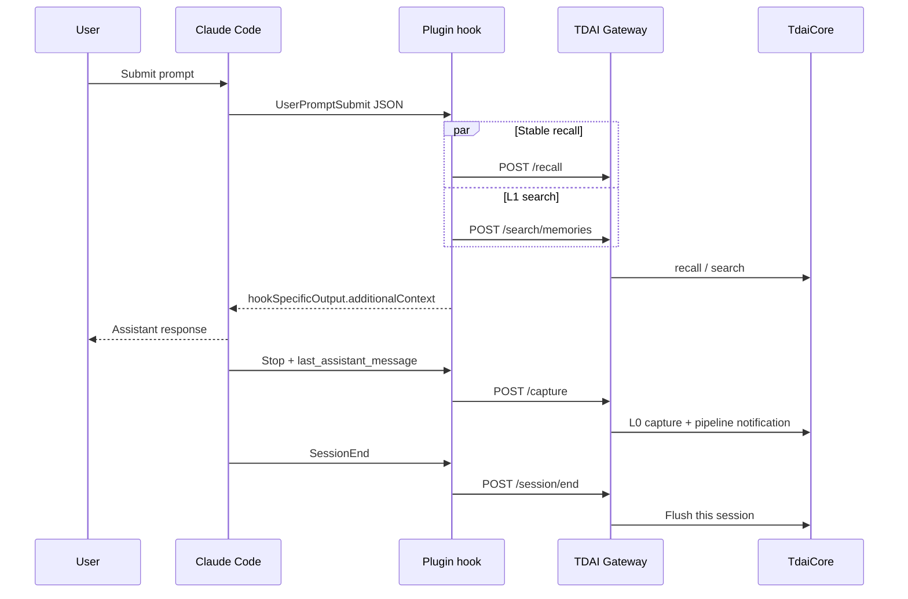

# Claude Code adapter

The Claude Code adapter is a thin plugin over the existing TDAI HTTP Gateway.
It does not introduce another memory engine, generic adapter SDK, or MCP
server. It provides automatic memory read/write at Claude Code's native turn
lifecycle.

The event payloads and output shapes follow the official
[Claude Code hooks reference](https://code.claude.com/docs/en/hooks), and the
bundle stays within the plugin root as required by the official
[plugin caching rules](https://code.claude.com/docs/en/plugins-reference#plugin-caching-and-file-resolution).



## Prerequisites

- Node.js 22.16 or later
- Claude Code with plugin hooks support
- A running TencentDB Agent Memory Gateway on localhost (default port `8420`)

## Run from a source checkout

Install dependencies and build the hook executable:

```bash
npm install
npm run build:plugin
```

Configure and start the existing Gateway in another terminal:

```bash
export TDAI_LLM_API_KEY="your-api-key"
export TDAI_LLM_BASE_URL="https://api.openai.com/v1"
export TDAI_LLM_MODEL="gpt-4o"
npx tsx src/gateway/server.ts
```

PowerShell uses the same variable names:

```powershell
$env:TDAI_LLM_API_KEY="your-api-key"
$env:TDAI_LLM_BASE_URL="https://api.openai.com/v1"
$env:TDAI_LLM_MODEL="gpt-4o"
npx tsx src/gateway/server.ts
```

Verify the Gateway and load the plugin from the repository root:

```bash
curl http://127.0.0.1:8420/health
claude plugin validate ./claude-code-plugin --strict
claude --plugin-dir ./claude-code-plugin
```

Run `/hooks` inside Claude Code to confirm that `UserPromptSubmit`, `Stop`, and
`SessionEnd` are registered.

## Install from the npm package

The published package includes a self-contained compiled hook inside
`claude-code-plugin/scripts/`, so it also remains valid when Claude Code copies
the plugin into its marketplace cache. For example, after a global install:

```bash
npm install -g @tencentdb-agent-memory/memory-tencentdb
PACKAGE_DIR="$(npm root -g)/@tencentdb-agent-memory/memory-tencentdb"
claude --plugin-dir "$PACKAGE_DIR/claude-code-plugin"
```

PowerShell equivalent:

```powershell
npm install -g @tencentdb-agent-memory/memory-tencentdb
$packageDir = Join-Path (npm root -g) "@tencentdb-agent-memory/memory-tencentdb"
claude --plugin-dir (Join-Path $packageDir "claude-code-plugin")
```

## Lifecycle mapping

| Claude Code event | Memory operation | Behavior |
| :--- | :--- | :--- |
| `UserPromptSubmit` | `/recall` + `/search/memories` | Combines stable persona/scene context and dynamic L1 results, caps output below 10,000 characters, and returns `additionalContext`. |
| `Stop` | `/capture` | Uses the hook's `last_assistant_message`; no transcript parsing is required. Stable message timestamps make a retried capture idempotent at the Gateway checkpoint. |
| `SessionEnd` | `/session/end` | Flushes only this Claude Code session within the event's short time budget. |

Each prompt is written to a per-session queue before recall. A completed turn
is removed only after `/capture` succeeds. If the Gateway is temporarily down,
the completed turn remains in `${CLAUDE_PLUGIN_DATA}` and is retried before the
next prompt in that session. State file names are SHA-256 hashes of session ids,
and writes use an atomic rename.

All hook errors are fail-open: Claude Code continues even if the memory sidecar
is unavailable. Set `TDAI_CLAUDE_CODE_DEBUG=1` to print diagnostics to stderr;
stdout remains reserved for the hook JSON response.

## Configuration

| Environment variable | Default | Purpose |
| :--- | :--- | :--- |
| `TDAI_CLAUDE_CODE_GATEWAY_URL` | `http://127.0.0.1:8420` | Gateway base URL. |
| `TDAI_GATEWAY_API_KEY` | unset | Adds `Authorization: Bearer ...` to Gateway requests. |
| `TDAI_CLAUDE_CODE_TIMEOUT_MS` | `4000` (`1000` for `SessionEnd`) | Per-request timeout. |
| `TDAI_CLAUDE_CODE_MAX_CONTEXT_CHARS` | `8000` | Maximum recalled context returned to Claude Code; hard-capped at `9999`. |
| `TDAI_CLAUDE_CODE_STATE_DIR` | `${CLAUDE_PLUGIN_DATA}` | Optional persistent queue override. |
| `TDAI_CLAUDE_CODE_DEBUG` | unset | Set to `1` for stderr diagnostics. |
| `TDAI_CLAUDE_CODE_ALLOW_REMOTE_GATEWAY` | unset | Explicit opt-in for a non-loopback Gateway URL. |

Gateway URLs are limited to `localhost`, `127.0.0.1`, or `::1` by default. If
remote access is explicitly enabled, use HTTPS and configure the same
`TDAI_GATEWAY_API_KEY` on both the Gateway and Claude Code processes.

## Verify memory read/write

1. Start a Claude Code session with the plugin and submit a distinctive
   preference, such as “Remember that my test database is SQLite.”
2. Let Claude finish normally so `Stop` captures the turn.
3. Ask a follow-up question in a later turn. `UserPromptSubmit` recalls the
   saved context before the model request.
4. For diagnostics, inspect the Gateway logs or query the existing search
   endpoint:

```bash
curl -H "Content-Type: application/json" \
  -H "Authorization: Bearer $TDAI_GATEWAY_API_KEY" \
  -d '{"query":"test database","limit":5}' \
  http://127.0.0.1:8420/search/memories
```

Omit the `Authorization` header when Gateway authentication is not enabled.
