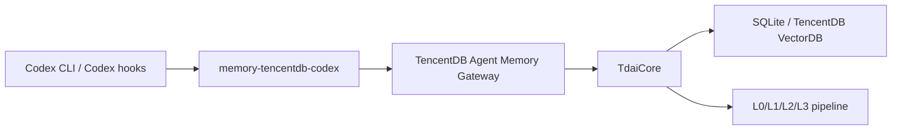

# Codex 适配器

本包可以通过与宿主无关的 HTTP Gateway 在 Codex 中使用。该适配器是一个轻量级 CLI 包装器，Codex hooks、本地脚本或人工操作者都可以调用它，而不需要把 Codex 内部实现耦合到记忆引擎中。

## 架构



Codex 侧保持在核心进程之外。这样可以让集成在 Codex 版本升级时更稳定，同时复用 Hermes 已经使用的现有 Gateway 路径。

## 构建

```bash
npm run build:codex-adapter
```

打包或构建完成后，可以通过以下二进制命令使用：

```bash
memory-tencentdb-codex --help
```

如果是在仓库根目录进行本地开发，可以运行：

```bash
node bin/memory-tencentdb-codex.mjs --help
```

## Gateway

调用适配器之前，请先启动 Gateway：

```bash
npx tsx src/gateway/server.ts
```

默认情况下，适配器会请求 `http://127.0.0.1:8420`。可以通过下面的环境变量覆盖默认地址：

```bash
export TDAI_GATEWAY_URL="http://127.0.0.1:8420"
```

也可以在每次执行命令时传入 `--gateway-url`。

如果 Gateway 开启了鉴权，请设置：

```bash
export TDAI_GATEWAY_API_KEY="<gateway-api-key>"
```

## 命令

### 在 Codex 轮次开始前召回上下文

```bash
memory-tencentdb-codex recall \
  --session-key "codex:my-project" \
  --query "What does this repository prefer for release notes?"
```

默认情况下，该命令只输出召回到的上下文，因此适合在 hook 管线中用于前置注入或展示记忆上下文。

如需输出元数据，可以使用 `--json`：

```bash
memory-tencentdb-codex recall --query "release notes" --json
```

### 捕获一个已完成的 Codex 轮次

```bash
memory-tencentdb-codex capture \
  --session-key "codex:my-project" \
  --user "Add a Codex adapter" \
  --assistant "Implemented a Gateway-backed adapter CLI and docs."
```

### 搜索结构化记忆

```bash
memory-tencentdb-codex search \
  --query "coding style preferences" \
  --limit 5
```

### 搜索原始对话

```bash
memory-tencentdb-codex conversation-search \
  --session-key "codex:my-project" \
  --query "adapter design" \
  --limit 5
```

## Codex hook 策略

Codex 安装可以通过自身的 hook 机制调用该适配器，也可以在 Codex 会话外层的包装脚本中调用它：

1. 为仓库或线程生成并提供一个稳定的 `--session-key`。
2. 在模型轮次开始前，使用用户请求调用 `recall`，并注入或展示返回的上下文。
3. 在一次成功轮次结束后，使用原始用户请求和最终助手摘要调用 `capture`。
4. 当需要更深入的记忆诊断时，手动使用 `search` 或 `conversation-search`。

适配器还会检查 `CODEX_SESSION_ID`、`CODEX_THREAD_ID` 和 `TDAI_SESSION_KEY`。如果这些变量都没有设置，它会在 `~/.memory-tencentdb/codex-adapter-session.json` 下创建一个工作区范围的 key。

## 为什么使用 Gateway，而不是进程内适配器？

Codex 主要是一个本地编码代理界面，而本项目已经为非 OpenClaw 宿主暴露了稳定、与宿主无关的 Gateway。使用 Gateway 可以让集成保持小而清晰，并避免依赖 Codex 内部 API。若 Codex 以后提供稳定的插件 SDK，并支持 before/after turn hooks，这个 CLI 仍然可以作为传输层保留下来，而原生适配器只需要把这些 hooks 映射到同一组命令即可。


## Relationship To The Shared Gateway Client

This Codex adapter does not introduce another generic SDK or a parallel Gateway client. It reuses the shared `src/adapters/gateway-client` boundary and keeps Codex-specific logic limited to CLI argument parsing, session-key resolution, stdin/file IO, and output formatting.

For other platforms, prefer the shared Gateway client and map the platform lifecycle to `prefetch`, `captureTurn`, `searchMemories`, and `searchConversations`.
