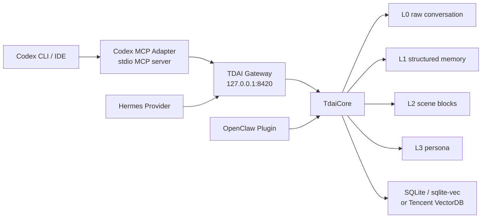

# Codex MCP Adapter

The Codex MCP adapter connects Codex CLI / IDE to TencentDB Agent Memory through the existing TDAI Gateway.

This adapter is intentionally thin:

- Codex talks to a local stdio MCP server.
- The MCP server forwards tool calls to the TDAI Gateway.
- The Gateway owns memory recall, capture, search, session flush, storage, and extraction.
- `TdaiCore` is unchanged.

## Architecture



## Capability Boundary

Codex MCP exposes tools. It does not provide OpenClaw-style lifecycle hooks.

Supported:

- explicit recall before a task
- explicit capture after a meaningful turn
- structured memory search
- raw conversation search
- explicit session flush

Not supported in this minimal adapter:

- automatic prompt interception
- automatic context injection into every Codex turn
- automatic capture of every Codex response

## Tools

| Tool | Gateway endpoint | Purpose |
| --- | --- | --- |
| `tdai_recall` | `POST /recall` | Recall memory context for a query and session |
| `tdai_capture` | `POST /capture` | Capture a completed user/assistant turn |
| `tdai_memory_search` | `POST /search/memories` | Search L1 structured memory |
| `tdai_conversation_search` | `POST /search/conversations` | Search L0 raw conversation history |
| `tdai_session_end` | `POST /session/end` | Flush pending work for one session |

## Start the Gateway

Run the existing Gateway in one terminal:

```powershell
cd "E:/00Project/Tencent_summer/TencentDB-Agent-Memory"
node --import tsx src/gateway/server.ts
```

Default Gateway URL:

```text
http://127.0.0.1:8420
```

If Gateway auth is enabled, set the same token for the MCP adapter:

```powershell
$env:TDAI_GATEWAY_API_KEY = "your-local-token"
```

Do not commit API keys or `.env` files.

## Register With Codex

From the repository root:

```powershell
codex mcp add memory-tencentdb --env TDAI_GATEWAY_URL=http://127.0.0.1:8420 -- npm run codex:mcp
```

With Gateway auth:

```powershell
codex mcp add memory-tencentdb --env TDAI_GATEWAY_URL=http://127.0.0.1:8420 --env TDAI_GATEWAY_API_KEY=your-local-token -- npm run codex:mcp
```

Verify:

```powershell
codex mcp list
```

Inside the Codex TUI, run:

```text
/mcp
```

You should see `memory-tencentdb` and its tools.

## Example Usage

Ask Codex:

```text
Use tdai_recall with query "repository conventions for this project" and session_key "my-codex-session", then summarize any useful context before editing.
```

After a useful completed task, ask Codex:

```text
Use tdai_capture to store this turn with session_key "my-codex-session": user_content is my original request, assistant_content is the final implementation summary.
```

Flush at the end:

```text
Use tdai_session_end with session_key "my-codex-session".
```
