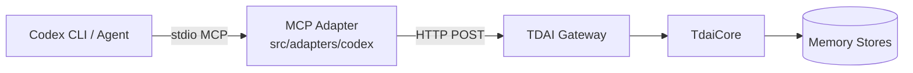

# Codex MCP Adapter

The Codex MCP adapter exposes TencentDB Agent Memory (TDAI) capabilities to
OpenAI Codex through the Model Context Protocol (MCP). It is a stdio-based MCP
server that forwards tool calls to the TDAI Gateway over HTTP, keeping Codex as
a thin orchestration client.

## Architecture



Codex invokes memory tools (`tdai_recall`, `tdai_capture`, etc.) over stdio.
The MCP adapter translates each tool call into an HTTP request against the
running TDAI Gateway, which in turn routes to `TdaiCore` and the underlying
memory stores.

## Capability boundary

**Supported (explicit MCP tools)**

- `tdai_recall` — retrieve relevant memory context for a session
- `tdai_capture` — explicitly capture a completed user/assistant turn
- `tdai_memory_search` — search structured L1 long-term memories
- `tdai_conversation_search` — search raw L0 conversation history
- `tdai_session_end` — flush pending pipeline work for a session key

**Not supported**

- Automatic capture of every Codex turn. Codex only writes memory when it
  explicitly calls `tdai_capture`.
- Automatic recall before every prompt. The model must decide when prior
  context is useful and call the appropriate tool.

## Tool-to-endpoint mapping

| MCP tool                | Gateway endpoint     | Purpose                                           |
| ----------------------- | -------------------- | ------------------------------------------------- |
| `tdai_recall`           | `POST /recall`       | Recall memory context for the current session     |
| `tdai_capture`          | `POST /capture`      | Persist a completed user/assistant turn           |
| `tdai_memory_search`    | `POST /search/memories`       | Search structured L1 memories by query and filters |
| `tdai_conversation_search` | `POST /search/conversations` | Search raw L0 conversation history                |
| `tdai_session_end`      | `POST /session/end`  | Flush pending work for a session key              |

## Gateway startup

The adapter requires an already-running TDAI Gateway. Start it from the project
root (the default port is `8420`):

```bash
npm run gateway
```

or with a custom base URL and API key:

```bash
TDAI_GATEWAY_PORT=3000 TDAI_GATEWAY_API_KEY=super-secret npm run gateway
```

The adapter reads the following environment variables:

| Variable                  | Default                        | Description                        |
| ------------------------- | ------------------------------ | ---------------------------------- |
| `TDAI_GATEWAY_URL`        | `http://127.0.0.1:8420`        | Base URL of the TDAI Gateway       |
| `TDAI_GATEWAY_API_KEY`    | unset                          | Optional Bearer token              |
| `TDAI_GATEWAY_TIMEOUT_MS` | `10000`                        | Request timeout in milliseconds    |

## Registering with Codex

Use the `codex mcp add` command to register the adapter as an MCP server.

### Without API key

```bash
codex mcp add memory-tencentdb \
  node ./dist/adapters/codex/mcp-server.js \
  --env TDAI_GATEWAY_URL=http://127.0.0.1:8420
```

### With API key

```bash
codex mcp add memory-tencentdb \
  node ./dist/adapters/codex/mcp-server.js \
  --env TDAI_GATEWAY_URL=http://127.0.0.1:8420 \
  --env TDAI_GATEWAY_API_KEY=your-api-key
```

> The `codex mcp add` CLI syntax may vary by version; refer to `codex mcp --help`
> for the exact flags on your installation.

## Example prompts

After registration, Codex can invoke the memory tools automatically or on request.

### Recall

```text
Before we start, recall what we know about this repo and my preferences.
```

This should lead Codex to call `tdai_recall` with the current `session_key`.

### Capture

```text
Capture this: I prefer Jest over Vitest and I want all new tests to use the
Arrange-Act-Assert pattern.
```

Codex should call `tdai_capture` with the user content, its own response, and
the current `session_key`.

### Session end

```text
We're done for now. End the TDAI session for this task.
```

Codex should call `tdai_session_end` to flush any pending memory pipeline work.

## Programmatic usage

You can also embed the adapter in your own MCP host without the stdio entrypoint:

```ts
import {
  CodexGatewayClient,
  createCodexMcpServer,
  registerCodexMemoryTools,
} from "@tdai/adapters/codex";

const client = new CodexGatewayClient({
  baseUrl: "http://127.0.0.1:8420",
  apiKey: process.env.TDAI_GATEWAY_API_KEY,
});

const server = createCodexMcpServer(client);
// or register tools onto an existing MCP-compatible target:
// registerCodexMemoryTools(target, client);
```
