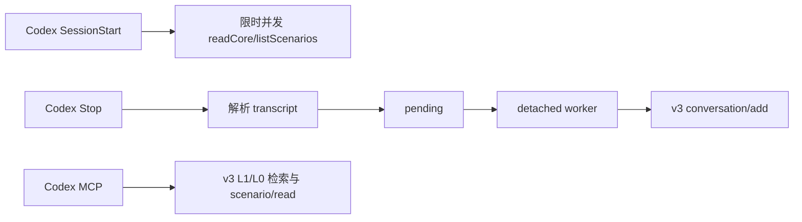

# 【云脑方案文档】阶段 2：Codex CLI 接入 feat/server_team

> 范围：阶段 1 只做 Cursor；本阶段独立排期和验收。

# 需求分析

Cursor 阶段完成后，为 Codex CLI 增加独立本地 Adapter。它通过官方 Hooks 与 MCP 接入 MemoryCore v3 L0–L3，不经过 MemoryProxy，也不反向扩大阶段 1。

## 功能需求

1. 使用 Codex `SessionStart`、`Stop` 接入主要会话生命周期，`SessionEnd` 仅作尽力唤醒（best-effort）。
2. 每轮结束后将 user/assistant 对话写入 v3 L0。
3. 提供 L1、L0 和 L2 正文三个只读 MCP 工具。
4. 会话开始时限时直读 L2/L3，注入成功结果和检索指引。
5. 所有 v3 调用携带 service/team/agent/user，task 可选。

## 非功能需求

- Hook fail-open，不因记忆服务失败阻断 Codex。
- transcript 格式以真实 spike 为准，不复制 Cursor 假设。
- 安装器只修改自己拥有的 `.codex` 配置。
- 未经真实 E2E 不声明接入完成。

## 现状分析

Codex 已提供 Hooks、MCP 和 transcript 路径，但官方明确 transcript 格式可能变化。`feat/server_team` 已有 MemoryCore v3 SDK；当前仓没有 Codex Adapter。

MemoryProxy 当前不是本阶段方案：Codex 自定义 Provider 使用 Responses API，而目标分支 MemoryProxy 当前只声明 OpenAI Chat Completions 与 Anthropic Messages。

复用判断以前一阶段完成后的真实代码为依据。阶段 1 不提前抽取公共框架。

## 收益及风险

### 收益

- Codex 与 Cursor 使用同一 v3 隔离数据面。
- 不改变模型上游地址，不把记忆故障扩大为模型请求故障。
- 两个宿主分别测试和发布。

### 风险

| 风险 | 处理 |
|---|---|
| transcript 非稳定接口 | 实现前真实 spike；失败则修订方案 |
| subagent 混入主会话 | 用事件证据建立分类门禁 |
| `.codex` 配置覆盖 | 所有权标识、安全合并、幂等卸载 |
| 为复用而破坏 Cursor | 阶段 2 必跑 Cursor 回归 |

# 业务流程

## 核心业务流程图



## 降级容错方案

- transcript 不明确：跳过写入并记录 bounded 摘要。
- MemoryCore 不可用：保留 pending。
- `SessionEnd` 可能延迟且只覆盖主线程，不作为 pending 必达保证。
- `SessionStart` 查询失败或超时：只使用成功结果；全部失败时保留 MCP 主动检索。
- Hook 失败：退出 0，不阻断当前任务。

# 概要设计

## 总体架构

生产代码目标目录：

```text
MemoryCore/src/adapters/codex/
```

阶段 2 开始时审计 Cursor 阶段的真实代码，只复用已有直接消费者且不会破坏 Cursor 的部分。不在本 PRD 预设第三个公共目录。

## 数据结构

| 键或字段 | TTL | 用途 |
|---|---:|---|
| session marker | 会话结束清理 | 顶层会话分类，最终形式由 spike 决定 |
| pending | 不完整记录有限保留 | L0 可重试投递 |
| `codex:<session_id>` | 会话期 | v3 session |

上述本地格式为设计方向；字段和封口键须在 Codex spike 后写实，不能直接照搬 Cursor transcript 字段。阶段 2 不预设本地 L2/L3 缓存。

## 交互接口

| 状态 | 接口 | 用途 | 出处 |
|---|---|---|---|
| 已落地 | `/v3/conversation/add` | L0 回流 | `feat/server_team:sdk/memory-core/typescript/src/v3/client.ts` |
| 已落地 | `/v3/atomic/search` | L1 检索 | 同上 |
| 已落地 | `/v3/conversation/search` | L0 检索 | 同上 |
| 已落地 | `/v3/scenario/ls` | L2 导航 | 同上 |
| 已落地 | `/v3/scenario/read` | L2 正文 | 同上 |
| 已落地 | `/v3/core/read` | L3 | 同上 |
| 设计新增 | Codex Hook/Transcript 映射 | 宿主适配 | `docs/codex-cli-server-team/spec.md`，待 spike 确认 |
| 设计新增 | `tdai_read_cos` | L2 场景相对 path → `readScenario()` | 沿用阶段 1/OpenClaw 命名；不访问 COS/STS |

worker 沿用阶段 1 规则：正常返回才 ACK；允许删除 pending 的错误码仅有 `400`、`413`；其他错误全部保留。

# 实现前门禁

编码前须通过 `spec.md` 的全部真实 Codex CLI spike 门禁。门禁结果必须回写 `spec.md`，之后才能制定实现计划。

# 验收标准

1. Codex Adapter 单元与契约测试通过。
2. 真实 Codex CLI 完成“本轮写入、新会话召回”。
3. v3 isolation 可在服务端核对。
4. MemoryCore 故障不阻断 Codex。
5. Cursor 阶段 1 回归测试保持通过。
6. 阶段 2 不修改阶段 1 的已确认产品范围。
