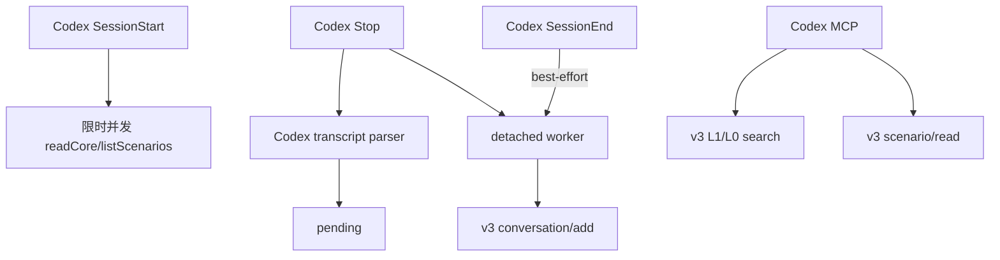

# 阶段 2：Codex CLI 接入 feat/server_team

> 范围：仅定义独立边界；阶段 1 不实施本规格。

## 结论

Codex CLI 采用宿主 Adapter，不经过 MemoryProxy。阶段 1 Cursor 完成并验收后，再以 Codex 官方 Hooks、MCP 和 transcript 能力接入 MemoryCore v3 L0–L3。

```text
Codex CLI Hooks / MCP
        │
        ▼
Codex Adapter
        │
        ▼
MemoryCore v3 SDK
```

生产代码目标目录：

```text
MemoryCore/src/adapters/codex/
```

## 阶段关系

| 阶段 1 | 阶段 2 |
|---|---|
| 只交付 Cursor | 只交付 Codex CLI |
| 不预建 Codex 抽象 | 启动时重新审计可复用代码 |
| Cursor E2E 独立验收 | Codex E2E 独立验收 |
| 不承诺 Codex 接口 | 不反向改变 Cursor 已验收语义 |

**阶段 2 独立排期，不反向扩大阶段 1。**

### 复用原则

阶段 2 可以复用阶段 1 中已证明通用的 v3 调用、pending 或错误处理。复用结论必须基于阶段 1 完成时的真实代码；当前文档不预先指定公共目录或强制重构。

## 已验证事实

- Codex 支持 stdio MCP。
- Codex Hooks 包含 `SessionStart`、`Stop`、`SessionEnd`。
- Hook 输入提供 `session_id`、`cwd`、`transcript_path` 等字段。
- Codex 官方说明 `transcript_path` 所指格式不是稳定 Hook 接口，可能变化。
- Codex 自定义模型 Provider 只支持 Responses API；本阶段不通过仅支持 Chat Completions/Anthropic Messages 的现有 MemoryProxy。
- `feat/server_team` 已提供 MemoryCore v3 TypeScript SDK。

官方依据：

- [Codex Hooks](https://developers.openai.com/codex/hooks/)
- [Codex MCP](https://developers.openai.com/codex/mcp/)
- [Codex 自定义模型 Provider](https://developers.openai.com/codex/config-advanced/#custom-model-providers)

## 阶段 2 范围

| 包含 | 不包含 |
|---|---|
| Codex CLI 本地交互会话 | Codex App、IDE、Cloud |
| Hooks 生命周期映射 | MemoryProxy Responses API |
| L0 回流、L1/L0/L2 MCP | Skill、Knowledge |
| `SessionStart` 限时直读 L2/L3 | Cursor 代码重写 |
| 用户级或项目级安全安装 | Team/Agent/Task 交互选择 |
| 真实 Codex transcript spike | 从文档推断 transcript 格式 |

## 实现门禁

阶段 2 编码前必须先做真实 Codex CLI spike：

1. 核对 `SessionStart`、`Stop`、`SessionEnd` 的实际顺序和字段。
2. 核对顶层会话与 subagent 的事件边界。
3. 核对 `transcript_path` 是否能稳定提取本轮 user 与最终 assistant。
4. 核对 Hook detached 进程能否在 Codex 退出后完成本地追加。
5. 核对 `SessionStart` 限时直读 L2/L3 的延迟、降级和首轮可见性。
6. 核对 CLI、版本、OS 和 trust 设置。

任一关键门禁不满足时，先修订本规格，不直接复制 Cursor parser。

## 设计数据流



## 模块输入与输出

| 模块 | 输入 | 输出 |
|---|---|---|
| Codex Hooks | 官方 Hook JSON | context、pending、worker 唤醒 |
| Codex parser | `transcript_path` | 经 spike 证明的一轮消息 |
| worker | pending、v3 isolation | L0 ACK |
| MCP | 查询参数或场景 path | L1/L0 结果、L2 正文 |
| installer | `.codex` 现有配置 | 仅修改 Adapter 所有项 |

## 交互接口

MemoryCore 接口与阶段 1 相同：

| 状态 | 接口 | 用途 | 出处 |
|---|---|---|---|
| 已落地 | `/v3/conversation/add` | L0 回流 | `feat/server_team:sdk/memory-core/typescript/src/v3/client.ts` |
| 已落地 | `/v3/atomic/search` | L1 检索 | 同上 |
| 已落地 | `/v3/conversation/search` | L0 检索 | 同上 |
| 已落地 | `/v3/scenario/ls` | L2 导航 | 同上 |
| 已落地 | `/v3/scenario/read` | L2 正文 | 同上 |
| 已落地 | `/v3/core/read` | L3 | 同上 |
| 设计新增 | Codex Hook/Transcript 映射 | 宿主生命周期适配 | 本规格，须经 spike 确认 |
| 设计新增 | `tdai_read_cos` MCP 工具 | L2 场景相对 path → `readScenario()` | 沿用阶段 1/OpenClaw 命名；不访问 COS/STS |

## 失败语义

- Hook 始终 fail-open。
- transcript 不能无歧义解析时不写 L0。
- 服务端不可用时保留 pending。
- `SessionEnd` 只作尽力唤醒（best-effort），不保证及时触发，也不承担 pending 必达；主要推进点仍是 `Stop` 和后续事件。
- `SessionStart` L2/L3 查询失败或超时只降低注入，不阻断 Codex；MCP 可实时检索。
- worker 沿用阶段 1 规则：正常返回才 ACK；允许删除 pending 的错误码仅有 `400`、`413`；其他错误全部保留。
- 安装器不得覆盖用户已有 Hook、MCP 或其它 `.codex` 配置。
- 未完成 spike 和 E2E 前，不宣称 Codex CLI 已接入。

## 阶段 2 验收

1. spike 明确宿主事件与 transcript 契约。
2. 单元测试覆盖 Hook、parser、pending、重试和安全安装。
3. 真实 Codex CLI 完成“本轮写入、新会话召回”。
4. v3 数据落在正确 Team/Agent/User/Session。
5. 服务端失败不阻断 Codex 主任务。
6. Cursor 阶段 1 回归测试保持通过。
