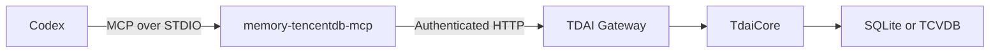

# Codex MCP adapter

The `memory-tencentdb-mcp` command exposes the existing TDAI Gateway as a
STDIO Model Context Protocol server. The memory engine remains in the Gateway;
the adapter owns protocol validation, tool schemas, authentication, and error
translation.



## Prerequisites

1. Start the TDAI Gateway and set its API key when it is reachable beyond
   localhost.
2. Build or install this package so `memory-tencentdb-mcp` is on `PATH`.
3. Use a stable `session_key`; it is the memory scope used by recall/capture.

## Codex configuration

Codex supports STDIO MCP servers through `config.toml`. Add the following to
`~/.codex/config.toml`, or to `.codex/config.toml` in a trusted project:

```toml
[mcp_servers.tencentdb_memory]
command = "memory-tencentdb-mcp"
env = { TDAI_GATEWAY_URL = "http://127.0.0.1:8787", TDAI_GATEWAY_API_KEY = "replace-me" }
startup_timeout_sec = 10
tool_timeout_sec = 30
```

The command also accepts `TDAI_GATEWAY_TIMEOUT_MS`; its default is 10000.
STDOUT is reserved for MCP JSON-RPC frames, while fatal startup errors are
written to STDERR.

## Tools

| Tool | Purpose | Mutates memory |
|---|---|---:|
| `tdai_recall` | Return dynamic L1 and stable persona/scene context separately | No |
| `tdai_memory_search` | Search structured L1 memory | No |
| `tdai_conversation_search` | Search raw L0 conversation history | No |
| `tdai_capture` | Persist a completed user/assistant turn | Yes |
| `tdai_session_end` | Flush pending work for a session | Yes |

`tdai_recall` preserves the core context boundary: `prepend_context` is
per-turn L1 data, while `append_system_context` is stable persona, scene, and
tool guidance. A host should not flatten those fields into the same prompt
position.
