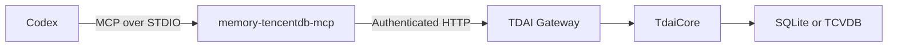

# Codex MCP adapter

The `memory-tencentdb-mcp` command exposes the existing TDAI Gateway as a
STDIO Model Context Protocol server. The memory engine remains in the Gateway;
the adapter owns protocol validation, tool schemas, authentication, and error
translation.



## Prerequisites

1. Start the TDAI Gateway and set its API key when it is reachable beyond
   localhost.
2. Build or install this package so `memory-tencentdb-mcp` is on `PATH`.
3. Use a stable `session_key`; it is the memory scope used by recall/capture.

## Codex configuration

Codex supports STDIO MCP servers through `config.toml`. Add the following to
`~/.codex/config.toml`, or to `.codex/config.toml` in a trusted project:

```toml
[mcp_servers.tencentdb_memory]
command = "memory-tencentdb-mcp"
env = { TDAI_GATEWAY_URL = "http://127.0.0.1:8420", TDAI_GATEWAY_API_KEY = "replace-me" }
startup_timeout_sec = 10
tool_timeout_sec = 30
```

These fields follow the official Codex
[`mcp_servers.<id>` configuration reference](https://developers.openai.com/codex/config-reference#configtoml):
`command` launches a STDIO server, `env` forwards its environment, and the two
timeout fields bound startup and tool execution.

The command also accepts `TDAI_GATEWAY_TIMEOUT_MS`; its default is 10000.
STDOUT is reserved for MCP JSON-RPC frames, while fatal startup errors are
written to STDERR.

The server implements the current published MCP revision (`2025-11-25`) and
negotiates the older `2025-06-18`, `2025-03-26`, and `2024-11-05` revisions.
It enforces the MCP initialization handshake before exposing tools and rejects
invalid/null JSON-RPC request IDs. This keeps the adapter compatible with
current Codex clients while preserving older MCP clients through negotiation.

## Tools

| Tool | Purpose | Mutates memory |
|---|---|---:|
| `tdai_recall` | Return dynamic L1 and stable persona/scene context separately | No |
| `tdai_memory_search` | Search structured L1 memory | No |
| `tdai_conversation_search` | Search raw L0 conversation history | No |
| `tdai_capture` | Persist a completed user/assistant turn | Yes |
| `tdai_session_end` | Flush pending work for a session | Yes |

`tdai_recall` preserves the core context boundary: `prepend_context` is
per-turn L1 data, while `append_system_context` is stable persona, scene, and
tool guidance. A host should not flatten those fields into the same prompt
position.

## Adapter boundary

The MCP process is intentionally a thin transport adapter rather than a second
memory implementation:

| Concern | OpenClaw plugin | Hermes integration | Codex MCP adapter |
|---|---|---|---|
| Host protocol | Plugin hooks | Hermes lifecycle | MCP over STDIO |
| Memory API | `TdaiCore` in process | Gateway/client integration | Authenticated Gateway HTTP |
| Storage and ranking | Shared TDAI implementation | Shared TDAI implementation | Shared TDAI implementation |
| Session isolation | OpenClaw session key | Hermes session key | Explicit `session_key` argument |

This boundary keeps ranking, capture semantics, and storage migrations in one
place. The adapter validates MCP inputs, preserves dynamic versus stable recall
contexts, and converts Gateway failures into tool errors; it does not fork
memory behavior for Codex.

For production use, bind the Gateway to localhost unless remote access is
required, configure `TDAI_GATEWAY_API_KEY`, and pass secrets through the MCP
environment rather than command-line arguments. STDOUT must remain reserved for
JSON-RPC frames. Gateway URLs containing inline credentials, query strings, or
fragments are rejected so configuration cannot silently change request routing
or expose credentials in URL diagnostics.
