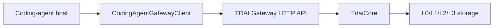

# Coding Agent Adapter Quickstart

This guide shows the smallest useful adapter shape for coding-agent hosts such
as Codex, Claude Code, Cursor, Continue, or other tools that can call a local
HTTP sidecar.

The adapter talks to the existing TDAI Gateway. It does not embed `TdaiCore`
inside the host process, so each platform only needs to map its own session and
message events into Gateway requests.

## Architecture



## Minimal usage

```ts
import { CodingAgentGatewayClient } from "@tencentdb-agent-memory/memory-tencentdb";

const memory = new CodingAgentGatewayClient({
  baseUrl: process.env.TDAI_GATEWAY_URL ?? "http://127.0.0.1:8420",
  apiKey: process.env.TDAI_GATEWAY_API_KEY,
});

const sessionKey = `${workspacePath}:${threadId}`;

const recall = await memory.recall({
  query: userPrompt,
  sessionKey,
  userId,
});

const promptWithMemory = recall.context
  ? `${recall.context}\n\n${userPrompt}`
  : userPrompt;

await memory.capture({
  userContent: userPrompt,
  assistantContent: assistantReply,
  sessionKey,
  sessionId: threadId,
  userId,
});
```

## Event mapping

| Host event | Gateway call | Required fields |
| --- | --- | --- |
| Before prompt/model call | `recall()` | `query`, `sessionKey` |
| After assistant response | `capture()` | `userContent`, `assistantContent`, `sessionKey` |
| User searches memory | `searchMemories()` | `query` |
| User searches raw turns | `searchConversations()` | `query` |
| Thread/workspace closes | `endSession()` | `sessionKey` |

## Session key guidance

Use a stable key that isolates unrelated work while still allowing continuity
inside one project. Good candidates:

- `workspace:<absolute path>`
- `repo:<remote url>#<branch>`
- `thread:<host thread id>`
- `workspace:<path>:thread:<id>` when the host supports multiple concurrent
  conversations per workspace

## Validation checklist

- `health()` returns `status: "ok"` or `status: "degraded"`.
- A `capture()` call records at least one L0 turn.
- A later `recall()` call with the same `sessionKey` returns non-empty context
  after the pipeline has processed the turn.
- If `TDAI_GATEWAY_API_KEY` is enabled on the Gateway, the adapter passes the
  same key as a Bearer token.

