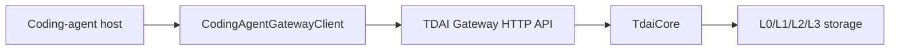

# Coding Agent Adapter Quickstart

This guide shows the smallest useful adapter shape for coding-agent hosts such
as Codex, Claude Code, Cursor, Continue, or other tools that can call a local
HTTP sidecar.

The adapter talks to the existing TDAI Gateway. It does not embed `TdaiCore`
inside the host process, so each platform only needs to map its own session and
message events into Gateway requests.

For the full layered architecture and annotated recall/capture data-flow
diagrams, see [`platform-adapter-architecture.md`](./platform-adapter-architecture.md).

## Onboard a new platform: implement one interface

The unified SDK lets a new coding-agent platform integrate by implementing a
single `CodingAgentPlatformAdapter` interface. Transport, timeouts, Bearer auth,
recall-context flattening, and fail-open handling are all provided by
`runCodingAgentAdapter` — you never re-write them per platform.

```ts
import {
  runCodingAgentAdapter,
  type CodingAgentPlatformAdapter,
} from "@tencentdb-agent-memory/memory-tencentdb";

// 1. Map your platform's native payload → neutral lifecycle event,
//    and recalled memory → your platform's native response shape.
const myAdapter: CodingAgentPlatformAdapter<MyHostPayload> = {
  platform: "my-agent",
  toEvent(input) {
    switch (input.stage) {
      case "before-prompt":
        return { kind: "recall", recall: { query: input.prompt, sessionKey: input.threadId } };
      case "after-reply":
        return {
          kind: "capture",
          turn: { userContent: input.prompt, assistantContent: input.reply, sessionKey: input.threadId },
        };
      case "close":
        return { kind: "session-end", sessionKey: input.threadId };
      default:
        return { kind: "noop" };
    }
  },
  renderRecall(context) {
    // Return whatever shape your host expects to inject context.
    return { systemPrompt: context };
  },
};

// 2. Drive it — the SDK handles the Gateway call, timeout, auth, and fail-open.
const result = await runCodingAgentAdapter(myAdapter, hostPayload, {
  gateway: { baseUrl: process.env.TDAI_GATEWAY_URL, apiKey: process.env.TDAI_GATEWAY_API_KEY },
});
```

The Claude Code adapter (`src/adapters/claude-code/`) is the reference
implementation of exactly this interface.

## Low-level client (optional)

If you need direct control instead of the lifecycle runner, the same transport
is available as `CodingAgentGatewayClient`.

## Architecture


```mermaid
flowchart LR
  Host["Coding-agent host"] --> Adapter["CodingAgentGatewayClient"]
  Adapter --> Gateway["TDAI Gateway HTTP API"]
  Gateway --> Core["TdaiCore"]
  Core --> Store["L0/L1/L2/L3 storage"]
```

## Minimal usage

```ts
import { CodingAgentGatewayClient } from "@tencentdb-agent-memory/memory-tencentdb";

const memory = new CodingAgentGatewayClient({
  baseUrl: process.env.TDAI_GATEWAY_URL ?? "http://127.0.0.1:8420",
  apiKey: process.env.TDAI_GATEWAY_API_KEY,
});

const sessionKey = `${workspacePath}:${threadId}`;

const recall = await memory.recall({
  query: userPrompt,
  sessionKey,
  userId,
});

const recalledContext = [
  recall.prepend_context,
  recall.append_system_context ?? recall.context,
].filter(Boolean).join("\n\n");

const promptWithMemory = recalledContext
  ? `${recalledContext}\n\n${userPrompt}`
  : userPrompt;

await memory.capture({
  userContent: userPrompt,
  assistantContent: assistantReply,
  sessionKey,
  sessionId: threadId,
  userId,
  // Preserve host timestamps when available so retries are checkpoint-idempotent.
  messages: hostMessages,
  startedAt: turnStartedAt,
});
```

## Event mapping

| Host event | Gateway call | Required fields |
| --- | --- | --- |
| Before prompt/model call | `recall()` | `query`, `sessionKey` |
| After assistant response | `capture()` | `userContent`, `assistantContent`, `sessionKey` |
| User searches memory | `searchMemories()` | `query` |
| User searches raw turns | `searchConversations()` | `query` |
| Thread/workspace closes | `endSession()` | `sessionKey` |

## Session key guidance

Use a stable key that isolates unrelated work while still allowing continuity
inside one project. Good candidates:

- `workspace:<absolute path>`
- `repo:<remote url>#<branch>`
- `thread:<host thread id>`
- `workspace:<path>:thread:<id>` when the host supports multiple concurrent
  conversations per workspace

## Validation checklist

- `health()` returns `status: "ok"` or `status: "degraded"`.
- A `capture()` call records at least one L0 turn.
- A later `recall()` call returns dynamic L1 content in `prepend_context` and
  stable persona/scene content in `append_system_context` after the pipeline
  has processed the turn. `context` remains the legacy stable-context field.
- If `TDAI_GATEWAY_API_KEY` is enabled on the Gateway, the adapter passes the
  same key as a Bearer token.
