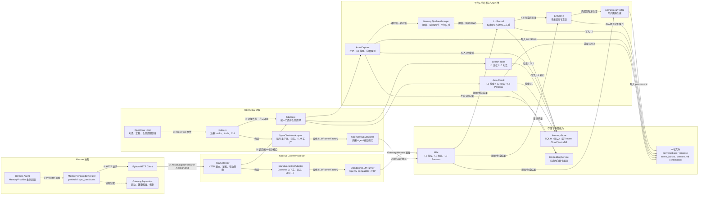
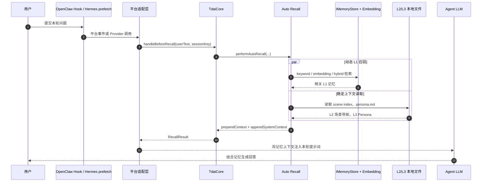
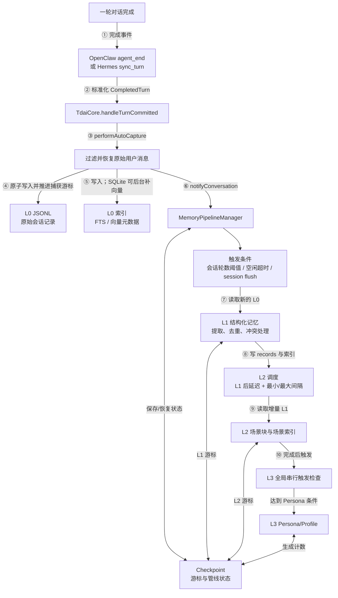
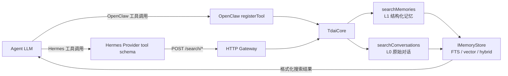

# 核心记忆引擎与平台适配层架构

本文对应 [Issue #235](https://github.com/TencentCloud/TencentDB-Agent-Memory/issues/235) 的“基础”阶段：说明核心记忆引擎、OpenClaw 插件和 Hermes Provider 的职责边界，并标出召回、捕获、搜索和分层加工的数据流。

## 分析范围以仓库基线为准

本文基于提交 `7245bc681a37e622f8997526bf1b51b3372b6f7f`（2026-07-13）中的源码整理，不包含工作区内尚未提交或未跟踪的修改。

分析范围包括：

- OpenClaw 插件入口与适配层：[`index.ts`](../index.ts)、[`src/adapters/openclaw`](../src/adapters/openclaw)
- Hermes Provider：[`hermes-plugin/memory/memory_tencentdb`](../hermes-plugin/memory/memory_tencentdb)
- Hermes 使用的 HTTP Gateway 与独立运行适配层：[`src/gateway`](../src/gateway)、[`src/adapters/standalone`](../src/adapters/standalone)
- 平台无关的核心引擎：[`src/core`](../src/core)
- L0→L1→L2→L3 调度：[`src/utils/pipeline-manager.ts`](../src/utils/pipeline-manager.ts)、[`src/utils/pipeline-factory.ts`](../src/utils/pipeline-factory.ts)

`src/offload` 是独立的短期上下文压缩子系统，其会话状态和存储不属于本文讨论的 L0→L3 长期记忆管线。

## 总体架构

架构的关键点是：两个平台最终调用同一个 `TdaiCore`，差别集中在平台事件如何转换、LLM 如何调用，以及是否跨越 HTTP 边界。核心层不直接依赖 OpenClaw 或 Hermes。

## 核心引擎提供统一能力

[`TdaiCore`](../src/core/tdai-core.ts) 是平台无关的统一门面。平台适配层主要调用以下方法：

公开的生命周期 Adapter SDK 位于 Gateway client 之上，与 Core 使用的 `HostAdapter` 不同。`PlatformAdapter` 将原生 Hook 映射为 recall、capture 和 session-end；`HostAdapter` 则在进程内运行 `TdaiCore` 时提供宿主能力。公共契约请查看 [Adapter SDK 指南](adapter-sdk_CN.md)。

| 核心方法 | 作用 | OpenClaw 映射 | Hermes/Gateway 映射 |
| --- | --- | --- | --- |
| `initialize()` | 初始化目录、存储和 L0→L3 调度器 | 插件注册时调用 | Gateway 启动时调用 |
| `handleBeforeRecall(userText, sessionKey)` | 搜索 L1，并读取 L2 场景导航和 L3 Persona | `before_prompt_build` | `prefetch()` → `POST /recall` |
| `handleTurnCommitted(turn)` | 捕获已完成的一轮对话并通知管线 | `agent_end` | `sync_turn()` → `POST /capture` |
| `searchMemories(params)` | 主动搜索 L1 结构化记忆 | `tdai_memory_search` | `memory_tencentdb_memory_search` → `POST /search/memories` |
| `searchConversations(params)` | 主动搜索 L0 原始对话 | `tdai_conversation_search` | `memory_tencentdb_conversation_search` → `POST /search/conversations` |
| `handleSessionEnd(sessionKey)` | 只刷新指定会话的缓冲任务 | OpenClaw 没有对应的逐会话调用 | `on_session_end` → `POST /session/end` |
| `destroy()` | 按顺序停止调度器、等待后台向量写入并关闭存储 | `gateway_stop` | Gateway 进程停止时调用 |

核心通过 [`HostAdapter`](../src/core/types.ts) 获取三类宿主能力：统一运行上下文、日志接口和 `LLMRunnerFactory`。因此，记忆算法只面向接口编程，平台 SDK 类型被限制在适配层内。

## 召回数据流

召回结果被有意拆成两部分：

- `prependContext` 是随查询变化的 L1 相关记忆，放在用户提示词前部。
- `appendSystemContext` 是变化较慢的 L2 场景导航、L3 Persona 和记忆工具说明，放在系统提示词尾部以利于提示缓存。

OpenClaw 的 `before_prompt_build` 会把两部分原样交回宿主。当前基线中的 Gateway `/recall` 响应只把 `appendSystemContext` 放进 `context` 字段，没有转发 `prependContext`；因此 Hermes 的自动 `prefetch()` 路径不会直接得到本轮 L1 召回片段。Hermes 仍可通过显式的 L1 搜索工具获取结构化记忆。这是当前实现的数据流差异，不是核心接口本身的限制。

## 捕获与 L0→L3 加工数据流

各层含义如下：

| 层级 | 输入 | 主要处理 | 输出/存储 |
| --- | --- | --- | --- |
| L0 Conversation | 原始 user/assistant/tool 消息 | 清洗、去重捕获、按会话记录、建立全文或向量索引 | `conversations/`、存储后端中的 L0 记录 |
| L1 Record | 新增 L0 消息 | LLM 提取 persona/episodic/instruction 等结构化记忆，并执行去重和冲突处理 | `records/`、存储后端中的 L1 记录 |
| L2 Scene | 增量 L1 记录 | 聚合成场景块，维护场景索引 | `scene_blocks/` 和场景索引 |
| L3 Persona/Profile | 多个场景及累计处理状态 | 达到触发条件后生成或更新用户长期画像 | `persona.md`，支持时同步到远端 Profile 存储 |

调度器为 L1、L2、L3 分别使用串行队列。L1 可由会话轮数阈值、空闲超时或会话刷新触发；L2 在 L1 完成后按延迟和最小/最大间隔调度；L3 在 L2 完成后进行全局去重的触发检查。

## 主动搜索数据流

主动搜索与自动召回共用核心检索能力，但由 Agent 自己决定何时调用：

L1 搜索适合查找偏好、历史事件和用户规则；L0 搜索适合查找原始措辞、具体消息和对话上下文。

## 两个平台的适配方式不同

| 对比项 | OpenClaw | Hermes |
| --- | --- | --- |
| 部署边界 | 与核心引擎同一 Node.js 进程 | Python Provider 与 Node.js Gateway 两个进程 |
| 入口 | `index.ts` | `MemoryTencentdbProvider` |
| 核心调用 | 直接调用 `TdaiCore` | Python HTTP Client 调用 Gateway，再调用 `TdaiCore` |
| HostAdapter | `OpenClawHostAdapter` | Gateway 内的 `StandaloneHostAdapter` |
| LLM 调用 | `OpenClawLLMRunner` 包装宿主内嵌 Agent | `StandaloneLLMRunner` 调 OpenAI-compatible API |
| 自动召回 | `before_prompt_build`，可返回动态和稳定两类上下文 | `prefetch()` → `/recall`；当前响应只转发稳定上下文 |
| 自动捕获 | `agent_end`，在 hook 内等待核心捕获完成 | `sync_turn()` 启动受控后台线程，异步调用 `/capture` |
| 主动搜索 | OpenClaw 原生工具注册 | Hermes Provider 暴露工具 schema，并转发到 `/search/*` |
| 会话结束 | 进程关闭时执行全局 `destroy()` | `on_session_end` 只刷新当前 session，Gateway 可继续服务其他 session |
| 容错 | 核心存储失败时降级到文件或关键词路径 | Provider 额外提供健康检查、熔断、看门狗和 Gateway 自动恢复 |

## 关键职责边界

- `index.ts` 只负责 OpenClaw 注册、事件转换、配置和生命周期所有权，不承载记忆算法。
- Hermes Python Provider 是薄客户端和 sidecar 监管器，不重复实现 L0→L3 算法。
- Gateway 只负责 HTTP、可选 Bearer 鉴权、CORS、参数校验和响应映射。
- `TdaiCore` 负责统一能力和资源生命周期，必须先 `initialize()`，关闭时必须等待 `destroy()`。
- `HostAdapter` 与 `LLMRunnerFactory` 隔离平台差异；新增平台时应优先复用这些边界。
- `IMemoryStore` 隔离 SQLite 与 Tencent Cloud VectorDB。存储或 Embedding 不可用时，核心尽可能降级，不让记忆故障阻断主对话。
- 单会话结束与进程退出语义不同：`handleSessionEnd(sessionKey)` 只刷新一个会话，`destroy()` 才关闭共享调度器和存储。

## 源码导航

- 核心门面与统一接口：[`src/core/tdai-core.ts`](../src/core/tdai-core.ts)、[`src/core/types.ts`](../src/core/types.ts)
- 自动召回与捕获：[`src/core/hooks/auto-recall.ts`](../src/core/hooks/auto-recall.ts)、[`src/core/hooks/auto-capture.ts`](../src/core/hooks/auto-capture.ts)
- 四层管线：[`src/utils/pipeline-manager.ts`](../src/utils/pipeline-manager.ts)、[`src/utils/pipeline-factory.ts`](../src/utils/pipeline-factory.ts)
- 存储抽象与后端工厂：[`src/core/store/types.ts`](../src/core/store/types.ts)、[`src/core/store/factory.ts`](../src/core/store/factory.ts)
- OpenClaw 适配：[`index.ts`](../index.ts)、[`src/adapters/openclaw/host-adapter.ts`](../src/adapters/openclaw/host-adapter.ts)、[`src/adapters/openclaw/llm-runner.ts`](../src/adapters/openclaw/llm-runner.ts)
- Gateway/Hermes 适配：[`src/gateway/server.ts`](../src/gateway/server.ts)、[`src/adapters/standalone/host-adapter.ts`](../src/adapters/standalone/host-adapter.ts)、[`hermes-plugin/memory/memory_tencentdb/__init__.py`](../hermes-plugin/memory/memory_tencentdb/__init__.py)、[`hermes-plugin/memory/memory_tencentdb/client.py`](../hermes-plugin/memory/memory_tencentdb/client.py)、[`hermes-plugin/memory/memory_tencentdb/supervisor.py`](../hermes-plugin/memory/memory_tencentdb/supervisor.py)
